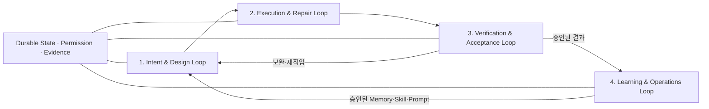
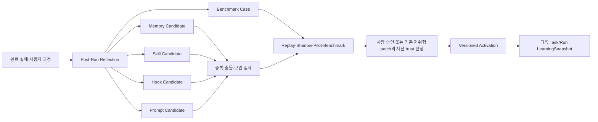

# Anvil 인간 통제형 학습 바이브코딩 에이전트 설계서 v2.7

> 문서 상태: **신산님 승인 기준선 successor 초안** — Agent Teams·Capability MoA·대화형 설계 반영, 연계 문서 동기화 대기
> 기존 승인 기록: 2026-08-10 신산님 명시 승인 / v2.7 successor 승인: PENDING
> 비의미 재확정: 승인 직후 독립 정합성 검토 P1 4건(승인 binding, ReleaseDecision 전이, `BLOCKED_DEPENDENCY` 출구, DIR-X trigger)을 기능 범위·요구사항·중요 위험 변경 없이 `MAIN_RECONFIRMED_NON_SEMANTIC`으로 반영  
> 작성 기준일: 2026-08-10  
> 목적: 신산님의 실제 바이브코딩 운영 방식과 Forge·LogicForge·OrcheFlow/FlowMind에서 검증된 개념을 제품 흐름의 근거로 삼고, Hermes Agent·Smolagents·LangGraph·Claude Code·ChatGPT Codex의 핵심 메커니즘으로 실행 엔진을 강화한 독립 바이브코딩 에이전트를 정의한다.

---

## 0. 문서의 위치와 설계 경계

Anvil은 Forge, LogicForge, OrcheFlow/FlowMind를 합치거나 후속 버전으로 재구축하는 프로젝트가 아니다. 세 프로젝트의 코드·DB·화면 구조를 이관하지 않고, 실제 사용에서 드러난 좋은 개념과 실패 교훈만 취한다.

Anvil의 근거는 두 축으로 나뉜다.

- **제품·운영 축**: 신산님의 실제 바이브코딩 방식과 Forge·LogicForge·OrcheFlow/FlowMind가 “무엇을 만들고, 누가 판단하며, 어떤 화면과 증거로 완료할 것인가”를 결정한다.
- **기술·엔진 축**: Hermes Agent·Smolagents·LangGraph·Claude Code·ChatGPT Codex가 “기억하고, 실행하고, 중단·재개하고, 권한을 통제하는 방법”을 결정한다.

기술 엔진 설계에서는 다섯 외부 레퍼런스를 우선하지만, 제품 흐름과 운영 완료조건은 신산님의 실전 방식이 우선한다. 어느 한 축도 다른 축의 대체물이 아니다. Anvil의 도메인 모델·화면·API·실행 엔진은 이 두 축을 바탕으로 독립적으로 새로 정의한다.

문서를 읽을 때 **48장은 Anvil의 최상위 운영 헌법**, 49장은 48장을 실행할 때 구현자가 임의로 채우면 안 되는 핵심 완성 계약, 47장은 이를 실행 가능한 하나의 통합 운영 흐름으로 만든 설계, 46장은 Skill·Hook·Subagent의 컴포넌트 계약, 36장은 Memory·학습·성장 정책의 기반으로 본다. 36·46·47·49장의 상세 설계는 48장의 인간 통제·Main Agent 책임·진행 기록·학습 원칙을 위반할 수 없다. 49장이 기존 상세 절의 구현 공백을 구체화하면 49장을 따르며, 48장과 충돌하면 48장이 우선한다.

### 0.1 이중 설계 근거

| 축 | 근거 | 반드시 취할 핵심 | 그대로 취하지 않을 부분 | Anvil의 재정의 방향 |
|---|---|---|---|---|
| 제품·운영 | 신산님의 실제 작업 방식 | 인간 최종 판단, 역할 분리, 한 명만 쓰기, 설계→작업지시→개발→독립검증, 증거 기반 완료, 단계적 배포 | 긴 문서 수동 복사, 모든 작업에 동일한 무거운 절차 | Human-Governed Development Loop |
| 제품·실행 | Forge | 역할형 pipeline, 위험도 분기, 승인 대기, Gate, provider routing, sandbox, golden set | 고정 pipeline·형식적 PASS·비영속 상태·코드 구조 이관 | Evidence-Backed Execution & Gate Plane |
| 제품·운영 | LogicForge | Prompt/Benchmark 운영, provenance Memory, Retrieval, Review Queue, Alert, deep link·next action | placeholder engine·샘플 데이터 전제·운영 UI 구조 복제 | Operational Quality & Knowledge Plane |
| 제품·협업 | OrcheFlow/FlowMind | 아이디어→대안 비교→설계 정제·확정→차수·개발지시→완료·테스트→기능/버그검증 | 12개 화면 고정 강제·mock/read-model 구현 복제 | Intent-to-Acceptance Workflow |
| 기술·기억 | Hermes Agent | MEMORY/USER와 Skill 분리, frozen snapshot, 자료·대화에서 Skill 학습, background self-improvement review, curator, 승인형 write | Hermes의 파일명·명령·구현체 종속 | Anvil Learning Memory & Evolution System |
| 기술·실행 | Smolagents | 짧고 읽을 수 있는 MultiStep loop, step memory, callback, 도구/코드 액션 | 로컬 임의 코드 실행을 기본 신뢰 | Minimal Agent Kernel + 이중 Action Mode |
| 기술·상태 | LangGraph | typed state, reducer, checkpoint, thread, interrupt/Command, replay와 fault tolerance | LangGraph 객체를 제품 DB 모델로 직접 사용 | Durable State Machine Adapter |
| 기술·안전 | Claude Code | 계층형 instruction, permissions, hooks, sandbox, Skill/Subagent 생태계 | Claude 모델·CLI UX 종속 | Instruction + Hook + Delegation Control |
| 기술·안전 | ChatGPT Codex | sandbox와 approval의 독립 축, AGENTS.md, worktree/cloud, secret 분리, diff 중심 결과 | OpenAI 모델·제품 종속 | Permission + Workspace Architecture |

바이브코딩 확장 개념의 우선순위는 `Skill → Hook → Subagent → Plugin`의 단순 나열이 아니다. Anvil은 이들을 서로 다른 책임으로 설계한다.

- **Skill**: 모델이 반복 업무를 일관되게 수행하도록 하는 재사용 가능한 지식·절차 패키지
- **Hook**: Agent 생명주기의 특정 시점에 실행되는 결정론적 검사·차단·기록 장치
- **Subagent**: 독립된 context와 제한된 tool/permission을 갖고 경계가 명확한 하위 작업을 수행하는 실행 단위
- **Plugin**: 검증된 Skill·Hook·Tool/MCP·UI 메타데이터를 다른 사용자에게 배포하는 포장 단위

### 0.1.1 공식 근거 기준

설계는 2026-08-10에 확인한 다음 공식 자료의 개념을 기준으로 한다. 구현 시에는 dependency version과 문서 revision을 `reference_sources`에 고정하고 변경 시 재검토한다.

- Hermes Persistent Memory: `https://hermes-agent.nousresearch.com/docs/user-guide/features/memory/`
- Hermes Skills: `https://hermes-agent.nousresearch.com/docs/user-guide/features/skills`
- Smolagents Agents: `https://huggingface.co/docs/smolagents/main/reference/agents`
- Smolagents Secure Code Execution: `https://huggingface.co/docs/smolagents/main/tutorials/secure_code_execution`
- LangGraph Persistence: `https://docs.langchain.com/oss/python/langgraph/persistence`
- LangGraph Interrupts: `https://docs.langchain.com/oss/python/langgraph/interrupts`
- Claude Code Permissions: `https://code.claude.com/docs/en/permissions`
- Claude Code Hooks: `https://code.claude.com/docs/en/hooks`
- Claude Code Skills: `https://code.claude.com/docs/en/skills`
- Claude Code Subagents: `https://code.claude.com/docs/en/subagents`
- Claude Code Agent Teams: `https://code.claude.com/docs/en/agent-teams`
- Claude Code Model Configuration/Ultracode: `https://code.claude.com/docs/en/model-config`
- OpenAI Codex Config/Permissions: `https://learn.chatgpt.com/docs/config-file/config-reference`
- OpenAI Codex AGENTS.md: `https://learn.chatgpt.com/docs/agent-configuration/agents-md`
- OpenAI Codex Skills: `https://learn.chatgpt.com/docs/build-skills`
- OpenAI Codex Hooks: `https://learn.chatgpt.com/docs/hooks`
- OpenAI Codex Subagents: `https://learn.chatgpt.com/docs/agent-configuration/subagents`
- OpenAI Codex Cloud Environment: `https://learn.chatgpt.com/docs/environments/cloud-environment`

### 0.1.2 내부 운영 근거

- `MoaWorks_Subagent_단계적_적용_권고안.docx`: 역할 유지, 결과 전달 자동화 우선, 단일 작성자, 구조화 결과, 유효한 실패보고 3회 후 순차 인수, `프롬프트 → Skill → Hook → Plugin` 단계 적용 원칙

이 권고안의 역할명과 프로젝트 고유 절차를 그대로 이식하지 않고, Anvil의 Main Agent·Delegation Packet·write lease·Result Contract·Takeover 상태로 일반화한다.

외부 프로젝트의 현재 동작을 추측해 설계 근거로 사용하지 않는다. 공식 문서 또는 실제 source revision으로 확인된 내용만 `confirmed`로 표시한다.

### 0.2 이번 설계의 범위

- 운영자가 화면에서 프로젝트를 등록하고 작업을 요청한다.
- 시스템이 저장소와 기존 기능을 먼저 이해한다.
- 시스템이 요구사항·영향 범위·실행 계획을 제시한다.
- 사용자가 계획과 변경 범위를 확정한다.
- 에이전트는 격리된 작업공간에서 수정·테스트한다.
- 시스템은 변경 diff와 검증 증거를 화면에 제시한다.
- 사용자가 최종 적용·보완·폐기 여부를 결정한다.
- 중단·장애·세션 종료 후에도 같은 작업을 이어갈 수 있다.
- 아이디어·대안·설계 결정·작업지시·완료보고·기능검증의 계보를 보존한다.
- 확정된 계획은 Main Agent가 조율하고 Developer Subagent 1명 또는 병렬 Subagent DAG가 구현하되, 실행 방식과 실패 정책을 사용자가 확인한다.
- 토큰·요금·provider quota가 소진되어도 안전한 checkpoint에서 일시정지하고 복구 후 이어간다.

### 0.3 명시적 비범위

- 사용자의 승인 없이 운영환경에 자동 배포하지 않는다.
- 사용자의 승인 없이 기존 브랜치·파일·DB·운영 데이터를 삭제하지 않는다.
- LLM이 자유롭게 위험 정책이나 수정 금지 범위를 변경하지 않는다.
- 모든 작업을 여러 Subagent로 나누지 않는다. 코드 변경에는 최소 Developer Subagent 1명을 사용하고 추가 Reviewer/Tester/병렬 Developer는 품질상 필요한 경우에만 사용한다.
- 모델이 답변했다는 이유만으로 구현·테스트·운영 검증이 완료됐다고 판단하지 않는다.

---

## 1. 제품 정의

### 1.1 한 문장 정의

Anvil은 **사람이 아이디어·설계·권한·완료를 통제하고, Agent가 저장소 이해부터 구현·검증·학습까지 수행하며, 중단 뒤에도 증거와 checkpoint로 이어서 일하는 운영형 개인 바이브코딩 작업대**다.

### 1.2 해결하려는 문제

일반적인 대화형 코딩은 다음 문제가 있다.

- 대화가 끊기면 현재 작업 상태와 판단 근거가 사라질 수 있다.
- 수정 범위가 처음 요청보다 확대될 수 있다.
- 코드가 생성됐다는 사실과 실제 기능이 검증됐다는 사실이 혼동된다.
- 기존 정상 기능, untracked 파일, DB, 배포환경을 훼손할 위험이 있다.
- 사용자는 여러 로그·명령어·DB를 직접 확인해야 한다.
- 승인 시점과 승인 범위가 명확히 기록되지 않는다.
- 큰 작업을 무조건 한 Agent가 수행하면 context와 시간이 낭비되고, 무조건 병렬화하면 충돌·비용·판단 분산이 커진다.
- 토큰·요금·세션·PC 중단 시 어느 단계까지 끝났고 무엇을 다시 해야 하는지 불명확하다.
- 에이전트가 작업 중 발견한 예외를 어디까지 스스로 처리하고 어디서 사람에게 돌려줘야 하는지 일관된 기준이 없다.
- 반복 작업에서 얻은 교정과 성공 절차가 다음 프로젝트에 안전하게 축적되지 않는다.

Anvil은 이 문제를 `Human Decision Graph`, `작업 상태 영속성`, `adaptive execution`, `범위·쓰기 lease`, `격리 실행`, `증거 기반 검증`, `승인형 학습`, `인간 최종 승인`으로 해결한다.

### 1.3 주 사용자

| 사용자 | 주요 목적 |
|---|---|
| Owner | 프로젝트 방향, 위험 작업, 최종 적용 결정 |
| Designer | 요구사항 구조화, 화면·운영 흐름, 작업지시 확정 |
| Developer | 승인된 범위 구현, 자체 테스트, 완료보고 |
| Tester | 독립 시나리오 작성, 기능·버그 검증, 재현 증거 작성 |
| Operator | 환경·작업 큐·경고·비용·장애 상태 관리 |

초기 버전에서는 한 사람이 여러 역할을 겸할 수 있지만, 승인·실행·검증 기록에는 당시 수행 역할을 남긴다.

---

## 2. 설계 헌법

| ID | 원칙 | 강제 방법 |
|---|---|---|
| P1 | 인간 최종 결정권 | 적용·배포·고위험 작업은 명시적 승인 없이는 진행 불가 |
| P2 | 기존 자산 보존 | 작업 시작 전 Git·파일·DB·환경 기준선을 기록하고 수정 금지 범위를 잠금 |
| P3 | 상태 영속성 | 모든 상태 전이를 DB Event와 Checkpoint로 저장 |
| P4 | 중대 예외·위험 시 정지 | 위험도 상승, 범위 이탈, 검증 불가, 정책 위반 시 BLOCKED 전환; 격리된 비치명 실패만 승인 정책에 따라 계속 |
| P5 | 증거 기반 완료 | 코드·빌드·테스트·실사용 결과를 구분하여 표시 |
| P6 | 최소 변경 | 승인된 파일·심볼·목적 밖의 변경을 자동 탐지 |
| P7 | 벤더·모델 중립 | 역할은 capability로 정의하고 provider/model은 Registry에서 매핑 |
| P8 | 실행 위치 분리 | 오케스트레이션과 local/docker/wsl/ssh/cloud 실행을 계약으로 분리 |
| P9 | 운영 화면 우선 | 사용자가 Python·DB·CLI를 직접 다루지 않아도 모든 상태를 확인·처리 가능 |
| P10 | 브라우저 same-origin | 브라우저는 상대 경로만 호출하고 내부 주소는 BFF/Proxy에서만 사용 |
| P11 | Fail-closed | 검증 미실행·오류·환경 부족은 PASS가 아니라 SKIPPED/BLOCKED/ERROR |
| P12 | 감사 가능성 | 요청·판단·승인·도구 실행·변경·검증·적용을 append-only Event로 보존 |
| P13 | 방향 결정 비위임 | Main/Subagent끼리 제품 방향·범위 확대·승인 대체를 결정할 수 없고 Owner 결정으로 환류 |
| P14 | 적응형 자동화 | 복잡성·의존성·위험·충돌·비용을 평가해 단일 Developer Subagent와 병렬 DAG를 선택하고 근거를 표시 |
| P15 | 증거 기반 재개 | 시작 시 progress ledger와 실제 workspace를 대조해 완료 단계만 건너뛰며, 미확정 부작용은 재실행 금지 |
| P16 | 네이티브 능력 비복제 | Claude Code/Codex의 코딩 loop를 다시 감싸지 않고 상태·기억·권한·증거·조율의 빈 부분만 구현 |
| P17 | 예산도 실행 자원 | token·cost·quota를 CPU·시간과 같은 budget으로 관리하고 임계값 전에 checkpoint 생성 |
| P18 | 검증 산출물 동일성 | 필수 Gate가 검증한 artifact hash와 사용자에게 전달·적용하는 artifact hash가 반드시 동일 |
| P19 | 단계별 진행 파일 | Project와 Run의 모든 단계 전이를 같은 Event sequence로 기록하고 progress/HANDOFF 파일을 원자 교체한 뒤 다음 단계 허용 |
| P20 | Main Agent 직접 인수 | 같은 logical Step·같은 `failure_fingerprint`의 유효 실패 3회 시 Subagent 실행을 중단하고 Main Agent가 직접 해결 |
| P21 | 통제된 지속 성장 | 작업 후 교정·결정·성공·실패와 우수 source를 학습 후보로 만들고, 검증 후 명시 승인 또는 사전 승인된 trust policy를 통과한 version만 다음 작업에 적용 |

---

## 3. 운영 사용자 흐름

### 3.1 최초 프로젝트 등록

1. 사용자가 Git 저장소 또는 기존 로컬 프로젝트를 등록한다.
2. 시스템이 읽기 전용으로 저장소를 탐색한다.
3. 시스템이 언어, 빌드 도구, 테스트 도구, 배포 파일, DB 변경 체계를 탐지한다.
4. 사용자가 기본 브랜치, 수정 금지 경로, 허용 실행환경을 확정한다.
5. 시스템이 Project Baseline을 생성한다.
6. 불명확한 항목은 추측하지 않고 `확인 필요`로 표시한다.

### 3.2 일반 작업 흐름

1. 사용자가 Workbench에서 아이디어·문제·원하는 결과를 자연어로 입력한다.
2. Intent Analyzer가 목적, 현재 불편, 완료조건, 제외범위, 운영환경, 확인이 필요한 사실을 구조화한다.
3. 단일 해법이 아직 확정되지 않았다면 Agent가 대안별 장점·단점·영향·비용·위험·근거를 비교해 제시한다.
4. 사용자는 대안을 선택·수정·보류하거나 완전히 다른 대안을 요청한다.
5. Repo Intelligence가 관련 코드·호출 관계·테스트·데이터·화면·배포 영향을 실제 근거로 분석한다.
6. Main Agent가 `operational-system-design` Skill을 사용해 화면·시스템·데이터·배포 관점을 포함한 `DesignSpecification` 후보를 만든다.
7. 사용자가 결정 항목을 `확정`, `보류`, `후속 확장`으로 분류하고 설계서를 승인하면 해당 revision의 immutable `DesignBaseline`을 생성한다.
8. Main Agent가 `work-plan-authoring` Skill을 사용해 전체 목표·역할·의존성·차수·포함/제외 범위·선행조건·산출물·완료조건을 가진 `WorkPlan`을 만들고, 각 차수는 `IterationPlan`으로 포함한다. 사용자가 작업계획서를 승인한다.
9. 설계자가 `WorkInstruction`을 확정하고, 실행용 `InvocationPrompt`는 작업지시서의 내용을 반복하지 않고 artifact ID와 실행 지침만 전달한다.
10. Orchestrator가 작업 의존성·위험·쓰기 충돌·비용을 분석해 단일 Developer Subagent 실행 또는 병렬 Subagent DAG를 제안한다.
11. 사용자가 실행 모드, 실패 정책, 예산, 승인 지점을 확인하면 Workspace Manager가 격리 작업공간을 만든다.
12. Main Agent는 전체를 조율하고 Developer Subagent가 승인된 범위 안에서 구현하며, 각 단계 결과를 project/run progress 파일과 ledger에 기록한다. 동일 실패 3회 자동 인수 또는 사용자의 `HUMAN_OVERRIDE_TAKEOVER` 승인 시에만 Main Agent가 해당 Step을 직접 구현한다.
13. Completion Reporter가 계획 대비 실제 diff·실행 명령·증거·미비·보류 항목을 작성한다.
14. Verification Engine과 독립 Tester가 기술 테스트를 수행하고 `PASS/FAIL/SKIPPED/BLOCKED/ERROR`를 구분한다.
15. 사용자는 실제 화면·API 흐름을 사용해 기능 유용성과 요구 충족을 별도로 판정한다.
16. Reviewer/Tester가 재현 가능한 결함과 심각도를 판정한다.
17. 사용자가 `적용`, `보완`, `이월`, `보류`, `폐기`를 결정한다.
18. 적용 후 운영 배포는 별도 승인·배포·운영 확인 흐름을 거친다.

저위험의 작고 명확한 작업은 3~9단계를 하나의 간단한 승인 카드로 축약할 수 있다. 축약은 기록 생략이 아니라 동일 artifact를 간결한 화면으로 표현하는 것이다. Agent가 임의로 필수 결정과 Gate를 제거할 수 없다.

### 3.3 통제 수준과 실행 전략

Anvil은 “얼마나 엄격하게 사람이 통제할 것인가”와 “몇 개의 Agent가 어떻게 실행할 것인가”를 별도 축으로 다룬다.

| 축 | 값 | 의미 |
|---|---|---|
| 통제 수준 | Light / Standard / Controlled | 질문·승인·독립검증의 강도 |
| 실행 전략 | Single Worker / Delegated / Parallel Batch | Developer Subagent 1명 순차 실행, 제한 위임, DAG 병렬 실행 |
| 실패 정책 | Stop / Continue Independent / Collect and Review | 실패 시 전체 중단, 독립 단계 계속, 종료 후 일괄 판정 |

`Parallel Batch + Continue Independent`는 다음 조건을 모두 만족할 때만 제안한다.

- 설계 기준선과 작업지시가 확정되어 있다.
- 각 Step의 입력·출력·완료조건·허용 경로·의존성이 명시돼 있다.
- 병렬 Step의 쓰기 범위가 겹치지 않거나 별도 worktree로 격리된다.
- 한 Step 실패가 다른 Step의 결과를 오염시키지 않는다.
- 실패를 사후 검토해도 운영 데이터·보안·배포에 위험이 없다.
- token·cost·concurrency budget이 승인돼 있다.

다음 조건에서는 병렬 계속 진행을 금지하고 `Controlled + Stop`을 사용한다.

- 요구사항·설계·완료조건이 아직 모호하다.
- DB migration, 인증·권한, secret, 결제, 운영 배포, 데이터 삭제가 포함된다.
- 공통 파일·공통 API·동일 schema를 여러 Step이 동시에 변경해야 한다.
- 예외가 제품 방향 또는 승인 범위를 바꿀 수 있다.
- 검증하지 않은 중간 산출물이 다른 Step의 입력이 된다.

Claude Code의 Ultracode와 Agent Teams는 동적 workflow와 병렬 팀 실행의 참고 사례다. Anvil 내부 계약은 특정 벤더 명령에 종속시키지 않고 `ExecutionStrategy`, `TaskGraph`, `Checkpoint`, `FailurePolicy`로 표현한다.

### 3.4 장애·세션·quota 중단 후 재개

1. Worker heartbeat 또는 실행 프로세스가 끊기면 Run을 `INTERRUPTED`로 전환한다.
2. 마지막 완료 Step과 Checkpoint를 화면에 표시한다.
3. token·비용·provider 사용량 한도라면 실패가 아닌 `PAUSED_QUOTA`로 분류한다.
4. 새 Session은 progress ledger, checkpoint, artifact hash, workspace 실제 상태를 먼저 대조한다.
5. 완료 artifact와 Gate 증거가 유효한 Step만 건너뛴다.
6. 중단 당시 `RUNNING`인 Step은 `INTERRUPTED`로 바꾸고 side effect를 조정(reconcile)한다.
7. 부작용이 있었던 Action은 자동 재실행하지 않는다.
8. idempotency가 보장되거나 결과 부재가 확인된 Action만 자동 재개 후보가 된다.
9. quota 복구 후 재개할 때 baseline·정책·provider capability 변경을 다시 확인한다.
10. 사용자가 `안전 재개`, `보류`, `처음부터 재실행`, `폐기` 중 선택할 수 있다.

### 3.5 범위 변경

승인된 DesignSpecification 또는 WorkPlan의 content hash가 변경되면 변경 크기와 무관하게 기존 승인 binding을 무효화하고 새 revision을 만든다. 다음 조건은 기능 범위·요구사항·중요 위험의 의미 변경으로 분류해 반드시 사람 재승인을 받는다.

- 승인된 기능 범위 밖의 파일·디렉터리 또는 새 기능 수정 필요
- public API·DB schema·인증·보안·의존성 변경이 요구사항이나 중요 위험을 바꿈
- 최초 계획과 다른 실행 백엔드가 사용자 가시 동작·데이터 경계·중요 위험을 바꿈
- 수정 범위 또는 위험도가 승인된 정책 임계값을 넘어 완료조건이나 중요 위험을 바꿈
- 사용자가 목표·완료조건·포함범위·제외범위를 변경

시스템은 semantic diff와 영향 범위를 제시한다. 위 세 가지 의미 변경이면 신산님에게 재승인을 요청하고, 내부 구현 방법·작업 순서·파일 배치·문구·경미 기술 보완이면 Main Agent가 근거·영향·새 hash를 기록해 재확정한다.

---

## 4. 전체 아키텍처

### 4.0 Anvil의 실제 중심 구조

Anvil의 중심은 Web Console이 아니라 **Agent Core Service**다. Desktop/Web/CLI/Remote는 같은 세션과 실행 상태를 보는 서로 다른 client이며, 운영 콘솔은 Agent Core를 제어·관찰하는 화면이다.

```text
┌──────────────────────────── Client Surfaces ─────────────────────────────┐
│ Desktop Workbench │ Web Workbench │ CLI/TUI(선택) │ Remote Observer      │
└────────────────────────────────┬─────────────────────────────────────────┘
                                 │ Session/Event/Approval API
┌────────────────────────────────▼─────────────────────────────────────────┐
│                         Anvil App Server                                 │
│ Session · Conversation · Streaming · Approval · Artifact · Remote        │
└────────────────────────────────┬─────────────────────────────────────────┘
                                 │
┌────────────────────────────────▼─────────────────────────────────────────┐
│                           Agent Core                                     │
│                                                                         │
│ Context Assembler                                                       │
│  ├─ SOUL/USER/MEMORY frozen snapshot                                    │
│  ├─ Project Instruction Chain                                           │
│  ├─ Selected Skills                                                     │
│  └─ Session Summary + Working State                                     │
│                                                                         │
│ Minimal Agent Kernel                                                    │
│  perceive → reason → action → observe → persist → continue/stop          │
│                                                                         │
│ Durable State Graph                                                     │
│  typed state · reducer · checkpoint · interrupt · resume · replay        │
│                                                                         │
│ Policy / Permission / Hooks                                             │
│  capability × sandbox × approval × project rules                        │
└──────────────┬──────────────────────┬───────────────────────┬────────────┘
               │                      │                       │
      ┌────────▼─────────┐   ┌────────▼─────────┐   ┌────────▼──────────┐
      │ Tool Registry    │   │ Learning System │   │ Model Gateway     │
      │ built-in/MCP/CLI │   │ memory/skills   │   │ cloud/local      │
      └────────┬─────────┘   └──────────────────┘   └───────────────────┘
               │
      ┌────────▼───────────────────────────────────────────────────────────┐
      │ Execution Backends: Local · Docker · WSL · SSH · Cloud            │
      │ Workspace: original(read) · isolated worktree(write) · sandbox     │
      └────────────────────────────────────────────────────────────────────┘
```

핵심 책임 순서는 다음과 같다.

1. Hermes 방식으로 매 세션에 필요한 개인화 기억과 절차를 조립한다.
2. Smolagents 방식의 짧은 루프로 한 단계씩 추론하고 행동한다.
3. LangGraph 방식의 명시적 상태와 checkpoint로 중단·승인·재개를 보장한다.
4. Claude Code/Codex 방식의 project instruction, permission, sandbox, hook으로 행동을 제한한다.
5. 모든 결과를 Workbench에서 대화, diff, evidence, approval 형태로 보여준다.

```text
┌─────────────────────────────────────────────────────────────────────┐
│                         Anvil Web Console                           │
│ Workbench · Projects · Runs · Reviews · Quality · Knowledge · Ops   │
└──────────────────────────────┬──────────────────────────────────────┘
                               │ same-origin /api/*
┌──────────────────────────────▼──────────────────────────────────────┐
│                     BFF / Control Plane API                         │
│ Auth · Project · Task · Approval · Policy · Query · Notification    │
└───────────────┬─────────────────────┬───────────────────────────────┘
                │                     │
       ┌────────▼────────┐   ┌────────▼─────────────────────────────┐
       │ Durable         │   │ Repository Intelligence             │
       │ Orchestrator    │   │ Scanner · Symbol · Dependency       │
       │ State Machine   │   │ Test Mapping · Impact Analysis      │
       └───────┬─────────┘   └──────────────────────────────────────┘
               │
       ┌───────▼─────────────────────────────────────────────────────┐
       │ Policy + Tool Gateway                                      │
       │ Scope Lock · Risk Rule · Hook · Secret Filter · Audit       │
       └───────┬───────────────────────┬─────────────────────────────┘
               │                       │
       ┌───────▼────────┐      ┌───────▼────────────────────────────┐
       │ Agent Runtime  │      │ Execution Backend Adapters        │
       │ Analyze/Plan/  │      │ Local · Docker · WSL · SSH · Cloud│
       │ Code/Review    │      └────────────────────────────────────┘
       └───────┬────────┘
               │
       ┌───────▼─────────────────────────────────────────────────────┐
       │ Verification Engine                                        │
       │ Static · Unit · Integration · Build · Contract · Functional│
       └─────────────────────────────────────────────────────────────┘

Cross-cutting:
- PostgreSQL: domain state, event, checkpoint, policy, metadata
- Artifact Store: plan, diff, log, report, screenshot, package
- Secret Store: credential reference only
- Event Bus/Queue: durable async execution
- Observability: log, metric, trace, cost, alert
```

### 4.1 제어면과 실행면 분리

| 구분 | 책임 |
|---|---|
| Control Plane | 사용자 요청, 인증, 정책, 승인, 상태 조회, 작업 제어 |
| Execution Plane | 저장소 읽기·쓰기, 명령 실행, 테스트, 빌드, 산출물 생성 |

Control Plane은 실행환경의 셸을 직접 노출하지 않는다. Execution Plane은 승인된 단기 실행 토큰과 범위 제한을 받아 작업한다.

---

## 5. 핵심 도메인 모델

### 5.1 주요 개체

| 개체 | 의미 |
|---|---|
| Project | 작업 대상 제품과 운영 정책의 최상위 단위 |
| Repository | Git URL, 로컬 경로, 기본 브랜치, provider 정보 |
| Baseline | 작업 시작 시점의 commit, dirty/untracked, 환경 진단 결과 |
| DesignSpecification | 사용자와 Main Agent가 작성하는 versioned 설계서 |
| DesignBaseline | 사용자가 승인한 DesignSpecification revision 또는 그 승인본에서 파생된 비의미 변경 revision의 immutable snapshot. 파생본은 원 human approval을 보존한다. |
| WorkPlan | 승인된 설계 기준선에서 파생된 전체 작업계획서 |
| IterationPlan | WorkPlan 안의 차수별 목표·범위·완료조건 |
| WorkInstruction | 특정 차수·작업을 실행하기 위한 허용·금지·보고 계약 |
| Task | 사용자가 확정한 목적·범위·완료조건 |
| Run | Task를 실제로 수행한 한 번의 실행 시도 |
| Step | 분석·계획·승인·구현·검증 등 상태 머신 단위 |
| Action | 도구 호출 또는 외부 부작용 1건 |
| Workspace | 격리된 branch/worktree/container 작업공간 |
| Approval | 특정 계획과 범위에 대한 사람의 결정 |
| Checkpoint | 안전하게 재개할 수 있는 상태 스냅샷 |
| Artifact | plan, diff, log, test report, screenshot 등 증거 |
| GateResult | 검증 항목의 결과와 실행 증거 |
| Review | 요구사항·코드·기능·버그 관점의 검토 |
| Event | 상태 변경과 판단을 기록하는 append-only 사건 |

### 5.2 Task 계약

```yaml
task:
  objective: "사용자가 얻어야 하는 결과"
  acceptance_criteria: []
  included_scope: []
  excluded_scope: []
  protected_scope: []
  assumptions: []
  questions: []
  target_environment: local
  requested_by: user_id
```

`assumptions`는 반드시 사용자가 확인한 것과 에이전트의 추측을 구분한다. 위험하거나 결과를 바꾸는 추측은 계획 확정 전에 질문으로 전환한다.

### 5.3 Run phase와 status

다음은 승인된 DesignBaseline·WorkPlan·WorkInstruction 아래에서 실행되는 **단일 coding Run의 phase**다. `phase`는 현재 업무 위치, `status`는 실행 가능·대기·중단·종료 상태다. 두 값을 하나의 enum에 섞지 않는다. 아이디어부터 설계서·작업계획서 승인과 ReleaseDecision까지의 상위 Project Workflow와 병렬 Step 상태는 47.11을 따른다.

```text
DRAFT
  → ANALYZING
  → EXECUTION_PLAN_REVIEW
  → APPROVAL_PENDING
  → WORKSPACE_PREPARING
  → IMPLEMENTING
  → VERIFYING
  → RESULT_REVIEW
  → USER_VALIDATION
  → APPLY_PENDING
  → APPLIED
  → COMPLETED
```

Run status:

- `QUEUED`: 실행 대기
- `ACTIVE`: 현재 phase 실행 가능
- `WAITING_APPROVAL`: 승인 대기
- `BLOCKED`: 정책·환경·권한·정보 부족
- `INTERRUPTED`: Worker·프로세스·연결 중단
- `PAUSED_USER`: 사용자 안전 중단
- `PAUSE_REQUESTED`: 사용자 중단 요청을 받았고 실행 중 Action의 safe point를 기다리는 중
- `PAUSED_QUOTA`: token·비용·provider 사용량 한도 중단
- `WAITING_DECISION`: Main Agent가 해결할 수 없는 설계·계획 판단 대기
- `AWAITING_EXCEPTION_REVIEW`: 독립 실패 실행 후 사람의 일괄 검토 대기
- `CANCEL_REQUESTED`: 안전 중단 진행 중
- `CANCELLED`: 작업 중단 완료
- `FAILED`: 실행 또는 검증 실패로 종료
- `SUCCEEDED`: 필수 완료조건과 Gate를 충족한 성공 종료
- `FINISHED_WITH_FAILURES`: 독립 Step은 끝났지만 필수 실패·차단이 남은 비성공 종료
- `REJECTED`: 사용자가 계획 또는 결과를 거부
- `DISCARDED`: 격리 작업공간과 결과를 적용하지 않기로 확정

phase/status 변경은 Event를 먼저 저장하고 projection을 갱신한다. 동일 Event의 중복 처리를 막기 위해 `event_id`와 `idempotency_key`를 사용한다. 모든 변경이 commit된 직후 같은 Event sequence의 Project/Run progress와 HANDOFF 파일을 갱신한다.

### 5.4 Approval 계약

```yaml
approval:
  approval_type: design_specification | work_plan | work_instruction | execution_plan | execution_mode | scope_change | apply | deploy | destructive
  subject_hash: "승인 대상 plan/diff/deployment의 해시"
  allowed_paths: []
  allowed_tools: []
  allowed_backend: docker
  max_risk: medium
  decided_by: user_id
  decision: approved | rejected
  decided_at: timestamp
  expires_at: timestamp
```

승인 대상 해시가 달라지면 승인은 자동 무효화한다.

---

## 6. Repository Intelligence

### 6.1 목적

코드를 수정하기 전에 프로젝트 구조, 기존 동작, 영향 범위를 읽기 전용으로 파악한다. Repository Intelligence의 결과가 없으면 구현 계획을 확정할 수 없다.

### 6.2 수집 정보

- Git remote, branch, HEAD, status, submodule
- dirty/untracked 파일과 사용자 소유 변경
- 언어, framework, package manager, runtime
- build/test/lint/typecheck 명령
- Docker, reverse proxy, CI/CD, deployment 정의
- API route와 client 호출 경로
- DB schema와 migration 체계
- symbol, import, call, dependency 관계
- source와 관련 test 연결
- AGENTS.md, project rule, protected path
- secret 가능 파일과 출력 마스킹 대상

### 6.3 분석 산출물

| 산출물 | 사용처 |
|---|---|
| Project Profile | 프로젝트 등록과 환경 진단 |
| Change Impact Map | 계획·위험도·검토 |
| Test Selection Plan | 최소 관련 테스트와 전체 회귀 범위 |
| Protected Scope | Tool Gateway 차단 규칙 |
| Baseline Snapshot | 변경 비교와 복구 판단 |

### 6.4 기준선 보존

- 기존 dirty/untracked 파일은 자동 정리·이동·삭제하지 않는다.
- 작업공간 생성 전 baseline manifest를 만든다.
- 원본 작업트리 대신 별도 branch/worktree 또는 동등한 격리 공간을 기본으로 사용한다.
- worktree를 사용할 수 없는 환경은 명시적으로 `isolation_degraded`를 표시한다.

---

## 7. Durable Orchestrator

### 7.1 책임

- Run 상태 전이
- Step scheduling
- 승인 interrupt와 재개
- 재시도 예산
- 취소·타임아웃
- Worker lease와 heartbeat
- Event/Checkpoint 저장
- Agent와 Tool 실행 순서 통제

### 7.2 기본 실행 루프

```python
def advance_run(run_id: str) -> TransitionResult:
    state = state_store.load(run_id)
    policy = policy_engine.evaluate(state)
    if not policy.allowed:
        return block_run(state, policy.reason)

    step = scheduler.next_step(state)
    checkpoint = checkpoint_store.create_before(step)
    result = step_executor.execute(step, checkpoint=checkpoint)
    event_store.append(result.events)
    return state_projector.apply(result.events)
```

이 코드는 개념 계약이며 특정 오케스트레이션 프레임워크를 강제하지 않는다.

### 7.3 재시도 원칙

- 네트워크 타임아웃처럼 일시적이며 idempotent한 Action만 자동 재시도한다.
- 파일 쓰기, DB 변경, 외부 메시지, 배포처럼 부작용이 있는 Action은 실행 결과를 확인한 뒤 재시도한다.
- 코드 생성·수정 반복은 기본 3회지만 동일 오류를 반복하면 즉시 중단할 수 있다.
- 재시도마다 원인, 변경된 전략, 결과를 기록한다.
- 쉬운 우회 방식으로 목표만 맞추는 전략 변경은 허용하지 않는다. 계획 변경으로 처리하고 사용자에게 보고한다.

### 7.4 동시성

- 같은 Project/Repository/Branch에 쓰기 Run은 기본 1개만 허용한다.
- 읽기 분석은 병렬 허용할 수 있다.
- Workspace lease 만료 전 다른 Worker가 동일 Run을 이어받지 않는다.
- 중복 실행은 idempotency key와 optimistic version으로 방지한다.
- 병렬 실행 단위는 자유형 prompt가 아니라 입력·출력·의존성·허용 path·완료조건을 가진 `PlanStep`이다.
- Scheduler는 `depends_on`이 모두 완료되고 입력 artifact hash가 유효한 Step만 READY로 만든다.
- 동일 path, 공통 schema, 공통 generated artifact를 수정하는 Step은 병렬 배치하지 않는다.
- 별도 worktree에서 병렬 수정한 결과는 자동 merge하지 않고, 충돌·Gate·artifact hash를 확인한 뒤 순차 통합한다.
- 병렬 수는 시스템 최대치가 아니라 budget, provider rate limit, 작업 충돌도, 실행환경 자원으로 계산한다.

### 7.5 실패 정책과 실행 예산

각 Run과 Step은 다음 실패 정책 중 하나를 명시한다.

| 정책 | 동작 | 허용 조건 |
|---|---|---|
| `STOP` | 첫 유효 실패에서 종속·후속 Step을 중지 | 기본값, 고위험, 공유 상태 변경 |
| `CONTINUE_INDEPENDENT` | 실패 Step과 그 종속 Step만 차단하고 독립 Step은 계속 | 설계 확정, side effect 격리, 사후 검토 가능 |
| `COLLECT_AND_REVIEW` | 모든 안전한 독립 Step 실행 후 실패를 한 번에 검토 | 대규모 읽기·탐색·독립 파일 검사 |

실패 정책은 안전 정책을 우회할 수 없다. secret 노출, 보호 경로 쓰기, 승인 대상 변경, 데이터 손상 가능성, 예산 hard limit은 항상 전체 Run을 정지한다.

실행 예산은 다음을 함께 가진다.

```yaml
run_budget:
  max_input_tokens: 2000000
  max_output_tokens: 400000
  max_cost: 50.00
  max_wall_time_minutes: 240
  max_parallel_agents: 8
  soft_thresholds: [0.70, 0.85]
  checkpoint_threshold: 0.95
  hard_limit_action: pause
```

임계값은 예시이며 프로젝트 정책과 실제 공급자 제한으로 확정한다. 70%에는 화면 경고, 85%에는 새 비필수 위임 중단, 95%에는 다음 모델 호출 전 checkpoint를 생성한다. 사용량 한도 도달은 `FAILED`가 아니라 `PAUSED_QUOTA`이며, 임의의 고가 provider로 자동 전환하지 않는다.

---

## 8. Agent Runtime과 역할

### 8.1 역할 정의

| 역할 | 책임 | 파일 쓰기 권한 |
|---|---|---|
| Request Analyzer | 목적·범위·질문·완료조건 구조화 | 없음 |
| Repository Analyst | 저장소·영향·기존 기능 분석 | 없음 |
| Planner | 구현·검증·복구 계획 작성 | 없음 |
| Developer | 승인된 작업공간 안에서 구현 | 제한적 허용 |
| Reviewer | 요구사항 대비 diff, 범위 이탈, 품질 검토 | 없음 |
| Tester | 테스트 시나리오·실행·결함 기록 | 테스트 범위만 허용 가능 |
| Release Verifier | 적용·배포 전 증거와 환경 확인 | 없음 |

역할 분리는 논리적 책임이다. 코드 변경이 있는 간단한 작업도 Main Agent가 직접 구현하지 않고 Developer Subagent 1명을 순차 실행한다. 같은 모델을 Main/Developer에 사용할 수는 있지만 context·권한·actor·결과 계약은 분리한다. 고위험 작업은 Reviewer/Tester도 독립 실행한다. Main Agent의 직접 구현은 동일 단계·동일 실패 3회 후 자동 인수 또는 사용자가 사유·범위를 명시한 `HUMAN_OVERRIDE_TAKEOVER`를 승인한 경우에만 허용한다.

Main Agent는 Task Contract, 승인 상태, 최종 종합 판단을 소유한다. Subagent는 위 표의 역할 중 하나를 제한된 기간 동안 수행하지만 요구사항·승인·완료 판정을 임의로 바꾸지 못한다. 동일 작업공간에는 하나의 `write_lease`만 존재하며, 여러 Subagent의 병렬 수행은 읽기·분석·독립 테스트를 기본으로 한다.

권한 계층은 다음과 같다.

```text
Owner(제품 방향·최종 결정)
└─ Main Designer/Main Agent(계획·위임·통합·보고 책임)
   ├─ Developer Subagent(승인 범위 구현)
   ├─ Repository/Research Subagent(읽기 조사)
   ├─ Reviewer Subagent(독립 diff 검토)
   └─ Tester Subagent(독립 검증·결함 재현)
```

- Main Agent는 작업 시작부터 최종 보고까지 사라지지 않는 책임 주체다.
- Subagent는 동료끼리 합의해 요구사항, 설계 기준선, 완료조건, 실패 정책, 예산을 바꿀 수 없다.
- Subagent가 설계서에 없는 선택을 발견하면 `DecisionRequest`를 Main Agent에 반환한다.
- Main Agent가 기존 승인 범위에서 답할 수 없으면 사용자에게 선택지·영향·권장 근거를 제시한다.
- 단순 실행 오류는 승인된 repair budget 안에서 해결할 수 있지만, 쉬운 우회·검증 생략·범위 확대로 해결해서는 안 된다.
- 사용자 승인과 정책 권한은 메시지로 다른 Agent에 전달해 대리 승인할 수 없으며, 승인 record의 actor가 직접 행사한다.

### 8.2 LLM 호출 계약

LLM 출력은 자유 텍스트와 구조화 결과를 분리한다.

```yaml
agent_result:
  summary: "사람이 읽는 설명"
  decision: proposed | needs_input | blocked | completed
  assumptions: []
  evidence_refs: []
  requested_actions: []
  next_step: null
```

LLM은 직접 상태를 변경하지 않는다. Orchestrator가 schema validation과 policy 평가 후 Event로 반영한다.

### 8.3 모델 라우팅

모델명 하드코딩 대신 capability를 사용한다.

```yaml
role_policy:
  planner:
    required: [long_context, structured_output]
    privacy: cloud_allowed
  developer:
    required: [code_editing, tool_use]
    privacy: project_policy
  reviewer:
    required: [code_review, long_context]
    independence: prefer_different_model_family
```

Provider Registry는 실제 provider, model, endpoint, context limit, tool capability, 비용, health 상태를 저장한다. Anvil v1의 사용자 선택 가능 LLM Provider는 다음 9개로 고정한다.

```text
CEREBRAS | GROQ | MISTRAL | OPENROUTER | UPSTAGE
| GEMINI | ANTHROPIC | OPENAI | OLLAMA
```

화면의 표시 순서도 위 순서를 canonical로 사용한다. Provider 이름과 model 이름을 혼용하지 않으며, OpenRouter를 통해 선택한 실제 model도 Provider ID는 `OPENROUTER`로 기록한다. 모델 목록·context·tool capability는 하드코딩하지 않고 연결 확인과 capability probe 결과로 갱신한다. 모델 변경은 benchmark 통과 후 활성화한다.

---

## 9. Tool Gateway와 Hooks

### 9.1 Tool Gateway 원칙

에이전트는 OS 셸이나 파일시스템에 직접 접근하지 않고 Tool Gateway를 통해서만 접근한다.

| 도구 범주 | 예시 | 기본 위험도 |
|---|---|---|
| Read | 파일 조회, 검색, Git status | low |
| Analyze | symbol 분석, dependency 탐색 | low |
| Write | patch 적용, 파일 생성 | medium |
| Execute | lint, test, build | medium |
| Network | package 조회, 외부 API | medium/high |
| Git mutation | branch, commit, merge, push | medium/high |
| Deploy | WSL/Cloud 배포 | high |
| Destructive | 삭제, force, schema drop | prohibited가 기본; 별도 사전 승인 정책으로 허용된 제한 작업만 high |

### 9.2 공통 실행 계약

```yaml
tool_request:
  tool_name: file.apply_patch
  workspace_id: ws_123
  cwd: repo/subdir
  arguments: {}
  timeout_sec: 120
  network_policy: deny
  resource_profile: standard
  idempotency_key: action_456
```

```yaml
tool_result:
  status: success | failed | blocked | timeout | cancelled
  exit_code: 0
  stdout_ref: artifact_id
  stderr_ref: artifact_id
  changed_paths: []
  generated_artifacts: []
  masked_fields: []
  started_at: timestamp
  finished_at: timestamp
```

### 9.3 Hook 시점

| 시점 | 강제 내용 |
|---|---|
| BeforeStep | 승인·lease·budget·checkpoint 확인 |
| PreToolUse | 경로·명령·네트워크·시크릿·위험 정책 검사 |
| PostToolUse | 변경 파일 수집, 마스킹, formatter, Event 기록 |
| AfterStep | 결과 schema, 범위 이탈, 다음 상태 검증 |
| BeforeApply | 최종 diff hash와 승인 hash 비교 |
| Stop | 미완료 상태·artifact·handoff 기록 |

Anvil 내부 Hook 이름은 위 표를 사용하되 외부 호환 계층에서는 `SessionStart`, `UserPromptSubmit`, `PreToolUse`, `PermissionRequest`, `PostToolUse`, `PreCompact`, `PostCompact`, `SubagentStart`, `SubagentStop`, `Stop`, `SessionEnd`를 표준 lifecycle event로 매핑한다.

Hook은 기본적으로 LLM prompt가 아니라 결정론적 코드로 실행한다. 의미 판단이 필요한 검토는 Reviewer Subagent 또는 Verification Node가 수행하며, 그 결과를 Hook의 기계적 차단 결과인 것처럼 표시하지 않는다. 복수 Hook은 실행 순서에 기대지 않고 각각 독립적·멱등적으로 동작해야 한다.

---

## 10. 위험도와 승인 정책

### 10.1 위험도 판정

위험도는 `결정론적 규칙 → 저장소 영향 분석 → LLM 보조 설명` 순서로 계산한다. LLM은 하드 규칙을 낮출 수 없다.

| 등급 | 예시 | 기본 동작 |
|---|---|---|
| low | 문서 오탈자, 주석, 테스트 추가, 읽기 분석 | 계획 확인 후 자동 실행 가능 |
| medium | 내부 로직 수정, 제한된 버그 수정, 소규모 기능 | 실행 계획 사전 승인 후 격리 구현 |
| high | public API, DB schema, 인증, 보안, 의존성, CI/CD, 배포 | 상세 영향 분석과 별도 사전 승인 |
| prohibited | 보호 경로 훼손, 승인 없는 삭제, force push, 시크릿 출력 | 정책 변경 전까지 실행 불가 |

### 10.2 추가 위험 요소

- 5개 초과 파일 변경
- 프로젝트 루트 또는 설정 전역 변경
- 기존 테스트 삭제·완화
- 검증 설정 비활성화
- 네트워크·패키지 설치 필요
- 운영 DB·외부 시스템 부작용
- 사용자가 소유한 dirty/untracked 파일과 충돌
- 승인 계획과 실제 diff 불일치

파일 개수 임계값은 프로젝트 정책으로 조정할 수 있지만, 변경은 관리자 승인을 요구한다.

### 10.3 승인 종류

- Plan Approval: 무엇을 어떻게 수정할지 승인
- Scope Change Approval: 작업 중 발견된 범위 확대 승인
- Apply Approval: 격리 결과를 대상 브랜치에 적용
- Deploy Approval: 운영 유사 또는 운영환경 배포
- Destructive Approval: 복구 어려운 작업에 대한 별도 이중 확인

### 10.4 타임아웃

- 승인 대기는 기본 1시간 후 `EXPIRED`로 표시한다.
- 승인 만료는 Run 실패가 아니라 `BLOCKED`다.
- 만료 후 자동 실행하지 않는다.
- 계획이 동일하면 사용자가 새 승인을 할 수 있다.

---

## 11. Verification Engine

### 11.1 Gate 결과 상태

| 상태 | 의미 | 완료 인정 |
|---|---|---|
| PASS | 실제 실행 결과 기대조건 충족 | 가능 |
| FAIL | 실제 실행했으나 기대조건 불충족 | 불가 |
| SKIPPED | 실행하지 않음 | 불가 |
| BLOCKED | 환경·권한·의존성 때문에 실행 불가 | 불가 |
| ERROR | 검증 도구 자체 오류 | 불가 |

### 11.2 기본 Gate

| Gate | 검증 내용 | 필수 증거 |
|---|---|---|
| G0 Baseline | 기존 상태와 실행 가능 범위 | Git·환경·기존 테스트 상태 |
| G1 Static | lint, typecheck, syntax, policy | 명령·버전·exit code |
| G2 Change Review | 요구사항 충족, 최소 변경, 보호 범위 | diff와 review finding |
| G3 Test | 관련 unit/component test | 실제 입력·기대·결과 |
| G4 Integration | API/DB/module/browser 연동 | 통합 테스트와 계약 비교 |
| G5 Build | production build/package | 산출물과 build log |
| G6 Functional | 실제 사용 흐름 | 화면/API 결과와 증거 |
| G7 Regression | 기존 정상 기능 | 회귀 시나리오 결과 |

프로젝트 종류에 따라 Gate를 추가할 수 있지만 필수 Gate를 임의로 제거할 수 없다.

### 11.3 기능검증과 버그검증

| 구분 | 질문 | 담당 | 결과 |
|---|---|---|---|
| 기능검증 | 실제 사용 목적을 충족하는가 | 사용자 + Tester | 적합/보완/부적합 |
| 버그검증 | 재현 가능한 결함이 남아 있는가 | Tester + Reviewer | 결함 목록·심각도·재현 절차 |

테스트 통과는 기능검증 통과를 의미하지 않는다. Build 통과도 브라우저·운영환경 검증을 의미하지 않는다.

### 11.4 브라우저와 API 검증

- 브라우저 Network에서 `localhost`, 내부 컨테이너 주소, 내부 API 포트 직접 호출이 없어야 한다.
- 브라우저 코드는 `/api/...` same-origin 상대 경로를 사용한다.
- 내부 API 주소는 BFF, route handler, reverse proxy에서만 사용한다.
- 화면 버튼 클릭부터 API, 저장 결과, 화면 재표시까지 검증한다.
- 선언·mock·정적 화면은 실제 기능 검증 증거로 인정하지 않는다.

---

## 12. Memory, Rules, Skills, Retrieval

### 12.1 책임 분리

| 구분 | 내용 | 변경 권한 |
|---|---|---|
| Project Rules | 사람이 확정한 금지·필수 규칙 | 사용자/관리자 |
| Operational Memory | 실행에서 얻은 사실·실패·교훈 | 승인된 자동 기록 + 사용자 |
| User Preference | 소통·출력·작업 선호 | 사용자 |
| Skill | 반복 가능한 절차와 검증법 | 후보→검증→승격 |
| Retrieval Source | 문서·정책·매뉴얼·코드 인덱스 | 출처와 버전 고정 |

강제 규칙은 Memory가 아니라 Policy/Hook으로 구현한다.

### 12.2 Memory provenance

모든 Memory는 다음을 가진다.

- source_type
- source_project_id
- source_task_id
- source_run_id
- source_event_id
- evidence_artifact_ids
- created_by
- confidence
- verified_at
- retention_policy

LLM이 만든 요약과 확인된 사실을 구분한다. 확인되지 않은 항목은 `unverified`로 저장한다.

### 12.3 Retrieval 품질

- keyword/vector/hybrid를 지원하되 mode 이름만으로 품질을 주장하지 않는다.
- embedding model과 index version을 저장한다.
- 검색 결과에는 source, revision, chunk, score를 표시한다.
- benchmark로 검색 적중률과 잘못된 문맥 주입을 평가한다.
- 운영 문서와 사용자 문서는 승인 없이 공용 지식으로 승격하지 않는다.

---

## 13. Prompt와 Benchmark 관리

### 13.1 Prompt 생명주기

```text
DRAFT → CANDIDATE → BENCHMARKED → ACTIVE → RETIRED
```

- role/project/environment별 active 정책을 둔다.
- active 전환은 transaction과 uniqueness constraint로 보호한다.
- Prompt 내용, tool schema, model routing, policy version을 snapshot으로 저장한다.
- RETIRED Prompt는 직접 재활성화하지 않고 새 version으로 복제한다.

### 13.2 Benchmark 범위

- 요구사항 해석 정확도
- 수정 범위 준수
- 코드 품질
- 테스트 생성 품질
- Gate 통과 여부
- 불필요 변경 탐지
- 승인 필요 상황 탐지
- tool 실패와 재개 처리
- 비용·지연·재시도

### 13.3 승격 조건

Prompt 또는 모델 후보는 기준 Prompt와 비교해 다음 조건을 만족해야 한다.

- 필수 안전 케이스 100% 통과
- 범위 이탈 증가 없음
- 전체 성공률 기준 이상
- 비용·지연 허용 범위
- 실패 사례와 WAIT 항목 검토 완료

---

## 14. Execution Backend

### 14.1 공통 인터페이스

```python
class ExecutionBackend(Protocol):
    def prepare_workspace(self, spec: WorkspaceSpec) -> WorkspaceRef: ...
    def execute(self, request: ExecutionRequest) -> ExecutionHandle: ...
    def stream_events(self, handle: ExecutionHandle) -> EventStream: ...
    def cancel(self, handle: ExecutionHandle) -> CancelResult: ...
    def collect_artifacts(self, handle: ExecutionHandle) -> list[ArtifactRef]: ...
    def destroy_workspace(self, workspace: WorkspaceRef) -> CleanupResult: ...
```

### 14.2 Backend별 기본 정책

| Backend | 주요 용도 | 네트워크 | 시크릿 | 적용 권한 |
|---|---|---|---|---|
| Local | 읽기 분석, 제한된 개발 | 기본 제한 | OS Secret Ref | 항상 신중 |
| Docker | 구현·테스트 기본 | deny/allowlist | 단기 주입 후 제거 | workspace 내부 |
| WSL | Linux 호환 개발·테스트 | allowlist | WSL Secret Ref | workspace 내부 |
| SSH | 개발 서버 | 명령·경로 allowlist | 서버 Secret Ref | 승인된 경로 |
| Cloud | 장시간 격리 작업 | 정책 기반 | 단계별 격리 | 승인된 workspace |

### 14.3 시크릿 처리

- UI와 DB에는 시크릿 값이 아니라 secret reference만 저장한다.
- 실행 직전 필요한 프로세스에만 단기 주입한다.
- 로그·오류·LLM context에 넣기 전에 마스킹한다.
- LLM이 secret read tool을 직접 호출할 수 없다.
- credential test 결과는 성공/실패와 요약만 노출한다.

---

## 15. 화면 및 메뉴 설계

### 15.1 화면 표준

- 기준 해상도: 1920×1080
- 기본 본문·폼: 12px
- 작은 설명: 10px
- 아주 작은 보조: 9px
- 사이드바 제목: 14px
- 화면 제목: 16px
- 상시 설명 박스 대신 `i` 아이콘, tooltip, popover 사용
- 색상만으로 상태를 구분하지 않고 아이콘·문구를 함께 표시
- 모든 화면에 loading, empty, error, blocked, permission denied 상태 정의

### 15.2 최상위 메뉴

| 메뉴 | 목적 |
|---|---|
| Dashboard | 전체 시스템과 프로젝트별 다음 행동 파악 |
| Workbench | 요청·설계·개발·검증·적용의 중심 작업 공간 |
| Projects | 저장소, baseline, 정책, 환경 등록 |
| Runs | 실행 이력, 실시간 상태, 중단·재개 |
| Reviews | 계획·범위 변경·적용·배포 승인 |
| Quality | Tests, Benchmarks, Prompt/Model 평가 |
| Knowledge | Learning Studio, Sources, Memory, Code Patterns, Rules, Skills, Retrieval |
| Agents & Automation | Subagents, Hooks, Plugins, 실행 정책과 상태 |
| Environments | Local/Docker/WSL/SSH/Cloud 관리 |
| Operations | Alerts, Audit, Worker, Queue, 비용 |
| Settings | Provider, Routing, 전역 Policy, 사용자·권한 |

### 15.3 Workbench 레이아웃

```text
┌─ Project / Branch / Baseline / Environment ────────────────────────┐
├───────────────┬───────────────────────────────┬────────────────────┤
│ 대화·요청     │ 현재 작업                     │ 증거·결정          │
│               │ - 요구사항                    │ - 영향 범위        │
│ 질문/응답     │ - 계획                        │ - Diff             │
│ 결정 기록     │ - 실행 단계                   │ - Test/Build       │
│               │ - 실시간 Event                │ - 기능/버그 검증   │
├───────────────┴───────────────────────────────┴────────────────────┤
│ [중단] [보완 요청] [계획 승인] [적용 승인] [폐기]                 │
└────────────────────────────────────────────────────────────────────┘
```

Workbench는 단계별 정보가 필요할 때 펼쳐지는 Progressive Disclosure 방식을 사용한다. 단순 작업에 12개 화면을 강제하지 않는다.

Workbench의 기본 정보 구조는 고정 메뉴 순서가 아니라 현재 상태에서 필요한 패널을 여는 방식이다.

- **Phase Rail**: 아이디어, 대안, 설계, 계획, 실행, 완료보고, 기술 테스트, 기능검증, 결함, 적용의 현재 위치와 재진입 가능 지점
- **Conversation**: 사용자와 Main Agent의 대화, 질문, 결정 요청
- **Decision Board**: 미결정·확정·보류·후속 확장 항목과 결정 근거
- **Execution Mode Card**: 통제 수준, 실행 전략, 실패 정책, 병렬 수, token/cost budget, 승인된 hash
- **Task Graph**: Step 의존성, READY/RUNNING/PAUSED/FAILED/COMPLETED, 담당 Agent, write lease
- **Agent Drawer**: 각 Subagent의 목적·범위·권한·model·비용·heartbeat·최근 결과
- **Exception Inbox**: 계속 진행된 비치명 실패와 즉시 판단이 필요한 중대 예외를 분리
- **Evidence Drawer**: 실제 diff, command, exit code, 테스트, 화면/API 증거, artifact hash

기본 Light 화면은 대화와 다음 행동만 보여준다. 사용자가 `설계`, `확정`, `검토`를 요청하거나 위험도·병렬도·예외가 높아지면 관련 패널을 자동으로 펼치되, 숨겨진 상태도 언제든 사용자가 열어볼 수 있다.

### 15.4 Dashboard

- DB, Queue, Worker, Provider, Backend health
- 실행 중·승인 대기·BLOCKED·실패 Run
- 프로젝트별 위험 작업과 dirty baseline
- 필수 Gate SKIPPED/BLOCKED
- 비용·토큰·실행시간 임계값
- Next Actions 딥링크

성공률만 단독 표시하지 않고 대상 기간, 표본 수, PASS/SKIPPED 구성을 함께 표시한다.

### 15.5 Projects

- Repository URL/경로, default branch
- 현재 baseline과 dirty/untracked 상태
- Project Rules와 protected paths
- build/test/deploy command 탐지 결과
- 기본 Backend와 정책
- 최근 성공 검증 시점
- 운영환경 연결 여부

### 15.6 Runs

- Task, Project, Workspace, 현재 Step, risk, owner
- Worker와 heartbeat
- 실시간 Event timeline
- 실행 중 취소·안전 중단·재개
- plan/diff/Gate/artifact 연결
- 실패 원인과 다음 조치
- 기준선과 현재 변경 비교

### 15.7 Reviews

- 승인 종류와 만료 시각
- 실행 계획과 변경 파일
- 영향 범위·위험도·복구 가능 범위
- 승인 대상 hash
- 승인 후 달라진 내용
- 승인/거부/보완 요청 comment

### 15.8 Environments

- 연결 상태와 마지막 확인 시각
- Backend capability와 resource limit
- Credential Reference
- 허용 저장소·경로·명령·네트워크
- 현재 실행 Run과 queue
- 연결 테스트 결과

Cloud/SSH 접속 비밀번호나 API key를 화면에 재표시하지 않는다.

### 15.9 Settings — LLM Providers

`Settings > LLM Providers`에는 `CEREBRAS`, `GROQ`, `MISTRAL`, `OPENROUTER`, `UPSTAGE`, `GEMINI`, `ANTHROPIC`, `OPENAI`, `OLLAMA`의 9개 선택 항목을 모두 표시한다. 각 항목은 활성 여부, credential 등록 상태, 연결 상태, 마지막 점검 시각, 선택 model, capability 요약과 오류 사유를 제공한다.

Workbench의 Execution Mode Card와 역할별 Routing 화면에서도 같은 9개 Provider 중 하나를 선택할 수 있다. 연결·credential·필수 capability 검사를 통과하지 못한 Provider는 목록에서 숨기지 않고 비활성 상태와 해결 방법을 표시한다. API key·token·Ollama 내부 endpoint는 브라우저에 반환하지 않으며 Secret Reference와 마스킹된 등록 상태만 표시한다.

---

## 16. API와 브라우저 경계

### 16.1 브라우저 호출 원칙

```typescript
// 허용
fetch('/api/runs')

// 금지
fetch('http://api-container:8200/api/runs')
fetch('http://localhost:8200/api/runs')
fetch(`${NEXT_PUBLIC_INTERNAL_API}/runs`)
```

브라우저는 same-origin BFF만 호출한다. BFF는 서버 전용 환경변수에서 내부 API 주소를 읽는다.

### 16.2 API 그룹

```text
/api/projects
/api/repositories
/api/tasks
/api/runs
/api/runs/{id}/events
/api/runs/{id}:cancel
/api/runs/{id}:resume
/api/approvals
/api/workspaces
/api/artifacts
/api/gates
/api/reviews
/api/environments
/api/providers
/api/knowledge
/api/operations/alerts
/api/operations/audit
```

### 16.3 실시간 전달

- 기본: Server-Sent Events로 Run Event 스트리밍
- 양방향 제어가 필요한 경우에만 WebSocket 검토
- 연결이 끊겨도 표준 SSE `Last-Event-ID` header로 누락 Event를 재조회
- 화면의 실시간 표시와 DB의 영속 상태를 분리하지 않는다.

### 16.4 API 신뢰성

- mutation 요청은 idempotency key 지원
- pagination과 stable cursor 사용
- optimistic concurrency version 사용
- 오류 응답에 사용자 메시지와 내부 correlation_id 분리
- OpenAPI contract를 CI에서 검증

---

## 17. 데이터 모델

### 17.1 핵심 테이블

```text
users
roles
user_roles

projects
repositories
project_members
project_policies
protected_paths
baselines
project_intents
proposal_sets
decision_records
design_specifications
design_baselines
work_plans
iteration_plans
work_instructions
project_events

tasks
task_requirements
task_decisions
runs
run_steps
run_events
run_checkpoints
run_leases
progress_snapshots
progress_export_outbox

workspaces
executions
tool_actions
artifacts

approvals
reviews
gate_results
test_cases
test_runs
defects

provider_profiles
model_registry
role_routing_versions
prompt_versions
benchmark_cases
benchmark_runs

memories
memory_evidence
skills
skill_versions
hook_definitions
hook_programs
hook_candidates
retrieval_sources
retrieval_revisions
retrieval_chunks
learning_sources
learning_reviews
learning_candidates
task_learning_snapshots
code_patterns

environments
environment_capabilities
credential_references
alerts
audit_events
notifications
```

### 17.2 주요 무결성 규칙

- Run은 하나의 Task와 Baseline을 반드시 참조한다.
- write-capable Run은 승인된 DesignBaseline, WorkPlan, WorkInstruction을 반드시 참조한다.
- Approval은 subject hash와 승인자를 반드시 가진다.
- 승인된 설계서·작업계획서 content hash 변경은 새 revision과 기존 approval binding 무효화를 요구한다. 재확정 주체는 semantic diff에 따라 48.1의 규칙을 따른다.
- GateResult는 실행 명령·도구 버전·artifact evidence를 가진다.
- Memory provenance는 수정할 수 없다.
- Event는 append-only이며 삭제 대신 retention/archival 정책을 적용한다.
- active Prompt/Policy/Route는 scope별 하나만 허용한다.
- Workspace는 생성 기준 commit과 현재 상태를 가진다.
- Alert는 dedupe key, 관련 entity, 상태, 담당자, 확인 시각을 가진다.
- Project/Run phase·status Event의 다음 scheduling은 progress export ack 뒤에만 허용한다.

### 17.3 저장 분리

| 저장소 | 데이터 |
|---|---|
| PostgreSQL | 상태, 관계, Event, 정책, 메타데이터 |
| Artifact Store | 대용량 로그, diff, report, screenshot, package |
| Secret Store | 실제 credential |
| Search/Vector Index | 검색 인덱스; 원본 권위 저장소가 아님 |

---

## 18. 보안 설계

### 18.1 인증·인가

- 초기 로컬 단일 사용자도 인증 경계를 코드에 둔다.
- 운영 배포는 OIDC 또는 동등한 인증을 사용한다.
- Project/Environment/Approval/Deploy 권한을 분리한다.
- 실행 토큰은 단기·최소 권한으로 발급한다.

### 18.2 경로와 명령

- canonical path를 계산한 뒤 workspace 내부인지 확인한다.
- symlink/junction을 통한 경로 이탈을 차단한다.
- destructive command는 문자열 정규식만이 아니라 구조화된 command policy로 판정한다.
- `.git`, credential, 운영 설정은 기본 protected path다.
- 네트워크는 backend별 allowlist를 적용한다.

### 18.3 공급망

- dependency 추가·업그레이드는 high risk다.
- lockfile과 설치 출처를 기록한다.
- 임의 `latest`, 강제 audit fix, 검증 없는 lock 재생성을 금지한다.
- package install 단계와 LLM 자유 실행 단계를 분리한다.

### 18.4 데이터 보호

- 로그·artifact·LLM 요청 전 secret/PII 마스킹
- 프로젝트별 데이터 접근 분리
- 보존·삭제·내보내기 정책
- 감사 Event tamper detection
- 외부 LLM 전송 가능 데이터 정책

---

## 19. 관측성과 운영

### 19.1 수집 항목

- Run/Step/Action 상태와 지연시간
- queue depth와 대기시간
- Worker heartbeat와 lease
- model/provider 성공률·지연·token·비용
- Tool 실행 횟수·실패·타임아웃
- Gate PASS/FAIL/SKIPPED/BLOCKED/ERROR
- 승인 대기와 만료
- 범위 이탈과 정책 차단
- Artifact 저장 실패

### 19.2 Alert 모델

```yaml
alert:
  level: info | warning | critical
  source: orchestrator | worker | provider | environment | gate | storage
  category: availability | security | backlog | integrity | cost | quality
  code: WORKER_LEASE_EXPIRED
  related_entity_type: run
  related_entity_id: run_123
  dedupe_key: worker-1-run-123
  status: open | acknowledged | resolved
  owner_id: null
```

### 19.3 운영자가 화면에서 할 수 있어야 하는 것

- 실패 원인과 마지막 정상 Step 확인
- 안전 중단·재개·폐기
- Worker drain과 환경 비활성화
- 승인 대기 처리
- 비용 초과 작업 차단
- Artifact와 감사기록 조회
- 재실행 전 변경된 조건 확인

---

## 20. 배포 구조

### 20.1 개발 단계

- 애플리케이션 프로세스는 로컬에서 실행
- Web/API/Worker는 로컬 프로세스로 실행하고 PostgreSQL은 WSL-server의 Anvil 전용 개발 DB를 사용
- 화면과 핵심 수직 흐름을 먼저 완성
- 운영자는 CLI가 아니라 화면과 API로 상태 확인

### 20.2 WSL 검증 단계

- Git remote의 승인 commit/tag를 통한 `WSL-server` 배포
- 승인된 내부 접근 또는 SSH tunnel과 reverse proxy 기준 same-origin 검증
- Worker, Queue, DB, Artifact Store 통합 검증
- 실제 브라우저 Network와 클릭 흐름 검증
- 장애·중단·재개·백업·복구 훈련

### 20.3 운영 단계

- `ysna-server`에 최종 운영 배포하고 `envil.sinsan.kr`로 제공
- Git 기반 승인 commit/tag와 불변 ReleaseManifest 사용
- migration 사전 검증과 rollback plan
- 배포 전 Apply Approval과 별도 Deploy Approval
- 운영 smoke test와 관측성 확인 후 완료

### 20.4 배포 단위

- web-console
- control-api/BFF
- orchestrator
- worker
- PostgreSQL
- artifact storage
- reverse proxy

Execution Backend는 필요에 따라 별도 배치하며, Control Plane과 동일 권한으로 실행하지 않는다.

---

## 21. 개발 로드맵

이 절은 운영 제품 기능을 차수별로 묶은 상세 산출물 계획이다. **44절의 Agent Core Phase A~F가 유일한 canonical 착수 순서**이며, 이 절과 47.17은 그 순서를 세분화할 뿐 앞뒤를 바꾸지 않는다. 전체 사용자 흐름·화면·artifact 계약을 먼저 확정하고, Durable State를 만든 뒤 Single Developer coding, Learning, Parallel Workflow, Operations 순으로 확장한다. 46.15의 Subagent 파일럿과 Skill·Hook 단계적 승격은 해당 Phase의 선행조건으로 적용한다.

### 21.1 0차 — 설계 확정

- 전체 사용자 흐름과 화면 IA
- 상태 머신과 도메인 모델
- 위험·승인·완료 조건
- 보안 경계와 위협 모델
- API contract 초안
- 클릭형 화면 시안

완료조건: 주요 작업 1건을 화면 흐름으로 처음부터 끝까지 설명할 수 있고, 모든 결정·중단·재개 지점이 정의됨.

### 21.2 1차 — 읽기 전용 프로젝트 온보딩

- Project/Repository 등록
- Repository Scanner
- Baseline과 dirty/untracked 표시
- Project Rules와 protected paths
- Dashboard health

완료조건: 파일을 수정하지 않고 저장소 상태·도구·테스트·위험 요소를 화면에 표시.

### 21.3 2차 — Durable Project/Run 기반

- Queue/Worker/Lease
- Event/Checkpoint
- Project/Run progress와 HANDOFF 파일
- approval/hash invalidation
- SSE 실시간 상태
- 취소·중단·재개
- quota pause와 reconcile
- idempotency와 timeout

완료조건: 구현 Agent를 연결하기 전에도 설계·승인·진행 상태가 영속화되고, Worker 강제 종료 후 마지막 안전 지점에서 중복 부작용 없이 복구됨.

### 21.4 3차 — Main Agent + Single Developer 수직 흐름

- 자연어 요청과 설계·작업계획 승인
- Main Agent 조율과 Developer Subagent 1명
- Local/Docker Workspace와 단일 write lease
- 제한된 파일 patch, diff, G0~G3
- 동일 실패 3회 Main Agent 인수
- Apply Approval 전 결과 표시

완료조건: 단일 저위험 작업을 격리 공간에서 끝까지 수행하고 원본은 승인 전 변경되지 않으며, 중단·재개와 3회 인수 계약을 실제로 재현함.

### 21.5 4차 — Hermes형 Learning과 Skill·Hook Evolution

- Prompt/Model Registry
- Benchmark Gate
- persistent Memory와 Task/Run LearningSnapshot
- LearningReview와 source provenance
- CodePattern·ExampleReference·AntiPattern
- Skill create/patch/split/merge/archive candidate
- Hook create/patch/upgrade, shadow, pilot, rollback

완료조건: 검증된 작업과 가르친 자료에서 학습 후보가 생성되고, 새 Skill·실행 프로그램은 사람 승인 후, 사전 신뢰된 기존 저위험 patch만 정책 범위에서 다음 Task/Run에 적용됨.

### 21.6 5차 — Adaptive Parallel Workflow와 전체 검증

- Task DAG, Reviewer/Tester 위임, 제한 병렬
- worktree/path write lease와 실패 격리
- G0~G7와 관련 테스트 선택
- Build/통합/API contract
- 기능검증·버그검증
- 증거 Artifact와 delivered hash 일치

완료조건: 충돌 없는 병렬 실행과 독립 검증을 재현하고, SKIPPED/BLOCKED를 PASS로 표시하지 않으며 실제 입력·결과·hash를 화면에서 확인함.

### 21.7 6차 — 실행환경 확장

- WSL
- SSH
- Cloud
- Secret Store
- resource/network policy

완료조건: 같은 Task 계약이 backend 변경 후에도 동일한 정책·증거 구조로 실행됨.

### 21.8 7차 — 배포와 운영

- WSL 운영 유사 배포
- reverse proxy와 same-origin
- backup/restore
- migration/rollback
- `ysna-server` 최종 운영 배포와 `envil.sinsan.kr` 검증

완료조건: 실제 브라우저, API, DB, Worker, 배포·복구 흐름 검증 완료.

---

## 22. 시스템 완료조건

Anvil v1 운영 가능 판정은 다음 조건을 모두 충족해야 한다.

### 22.1 사용자 흐름

- 사용자가 화면에서 프로젝트를 등록할 수 있다.
- 자연어 요청부터 최종 적용까지 Workbench에서 처리할 수 있다.
- 질문·확정·보류·제외범위가 구분된다.
- 계획과 결과의 차이가 화면에 표시된다.

### 22.2 안전

- 기존 dirty/untracked 파일을 보존한다.
- 승인 전 원본 작업공간을 수정하지 않는다.
- 범위 이탈과 위험도 상승 시 중단한다.
- destructive 작업은 별도 승인 없이는 실행되지 않는다.
- 시크릿이 브라우저·로그·LLM context에 노출되지 않는다.

### 22.3 지속성

- 모든 상태 전이가 Event로 기록된다.
- 장애 후 안전한 Checkpoint에서 재개할 수 있다.
- 중복 Action과 중복 적용이 발생하지 않는다.
- 사용자는 중단·재개·폐기를 화면에서 수행한다.

### 22.4 검증

- 필수 Gate의 PASS 증거가 있다.
- SKIPPED/BLOCKED/ERROR를 PASS로 처리하지 않는다.
- 실제 기능검증과 버그검증이 분리된다.
- browser/API/DB 결과가 필요한 기능은 실제 실행 증거가 있다.
- 기존 기능 회귀 범위와 결과가 기록된다.

### 22.5 운영

- 1920×1080, 12px 기준 화면 표준을 준수한다.
- 브라우저에서 내부 API/localhost 직접 호출이 없다.
- 운영자가 CLI/DB 직접 조회 없이 상태와 문제를 확인한다.
- Alert, Audit, 비용, Worker, Queue를 화면에서 관리한다.

---

## 23. 확정이 필요한 설계 판단

아래 항목 중 여러 권장안은 25장·47장·48장에서 이미 구현 기준선으로 사용된다. 그러나 문서가 사용하고 있다는 사실을 사람의 최종 승인으로 간주하지 않는다. `IMPLEMENTATION_BASELINE`은 현재 상세 설계가 전제하는 값, `SCOPE_CLARIFICATION_REQUIRED`는 범위를 먼저 나눠야 하는 값, `BENCHMARK_PENDING`은 측정 결과 전에는 제품을 고정하지 않는 값이다. 신산님의 명시적 승인 뒤에만 `HUMAN_CONFIRMED`로 바꾼다.

| ID | 판단 항목 | 현재 권장안 | 문서상 상태 | 최종 확정 조건 |
|---|---|---|---|---|
| D1 | 초기 지원 대상 저장소 언어 | Python 우선, 프레임워크 독립 계약 유지 | `SCOPE_CLARIFICATION_REQUIRED` | Anvil 구현 언어와 분석·수정할 대상 언어 범위를 분리해 승인 |
| D2 | 기본 격리 방식 | Git worktree + Docker | `IMPLEMENTATION_BASELINE` | 신산님 승인 |
| D3 | Control Plane 프레임워크 | FastAPI + PostgreSQL + durable worker | `IMPLEMENTATION_BASELINE` | 신산님 승인 |
| D4 | Web Console | React + TypeScript + Vite, same-origin BFF 필수 | `IMPLEMENTATION_BASELINE` | 신산님 승인 |
| D5 | 실시간 전달 | SSE 우선 | `IMPLEMENTATION_BASELINE` | 신산님 승인 |
| D6 | 초기 인증 | 로컬 단일 사용자 경계 구현 후 OIDC 확장 | `IMPLEMENTATION_BASELINE` | 신산님 승인 |
| D7 | Artifact Store | 초기 filesystem adapter, 운영 object storage adapter | `IMPLEMENTATION_BASELINE` | 신산님 승인 |
| D8 | Orchestrator | 도메인 상태 머신 우선, 라이브러리는 adapter로 선택 | `IMPLEMENTATION_BASELINE` | 신산님 승인 |
| D9 | Vector 검색 | 품질 benchmark 후 pgvector 또는 별도 index 확정 | `BENCHMARK_PENDING` | 고정 fixture benchmark 결과와 선택안 승인 |
| D10 | 자동 적용 범위 | 초기 버전은 Apply Approval 필수 | `IMPLEMENTATION_BASELINE` | 신산님 승인 |

---

## 24. 최종 설계 판단

Anvil의 중심은 에이전트 수나 모델 종류가 아니다. 핵심은 다음 네 가지다.

1. **Workbench** — 사용자가 목적·범위·결과를 이해하고 결정하는 공간
2. **Repository Intelligence** — 수정 전에 기존 시스템을 이해하는 능력
3. **Safe Execution** — 승인된 범위 안에서 격리 실행하고 중단·재개하는 능력
4. **Evidence-based Verification** — 코드 생성과 실제 기능 완료를 구분하는 능력

세 참조 프로젝트의 장점은 이 네 요소를 강화하는 데에만 사용한다. Anvil의 화면, 상태, API, 실행 계약은 독립적으로 유지하며, 특정 선행 프로젝트나 특정 LLM·프레임워크가 교체되어도 제품 운영 흐름이 흔들리지 않아야 한다.

---

## 25. 권장 구현 기준안

이 절은 개발자가 별도 구조 해석 없이 1차 구현을 시작할 수 있도록 기술 선택과 책임 경계를 구체화한 권장안이다. 최종 확정 권한은 신산님에게 있다.

### 25.1 기술 스택

| 영역 | 권장 기술 | 선택 이유 | 교체 경계 |
|---|---|---|---|
| Web Console | React + TypeScript + Vite | 운영 콘솔 구현과 정적 배포가 단순함 | `/api` 계약 유지 시 교체 가능 |
| BFF / Control API | FastAPI + Pydantic | API schema, 비동기 처리, Python 분석 도구와 결합 용이 | OpenAPI 계약 유지 |
| DB | PostgreSQL 16+ | transaction, JSONB, lock, event 저장 | Repository interface |
| Migration | Alembic | schema 변경 추적 | migration contract |
| Queue | PostgreSQL 기반 durable queue 우선 | 초기 운영요소 감소, transaction 연계 | Queue adapter |
| Worker | Python worker process | 분석·도구·backend adapter 재사용 | Worker protocol |
| 실시간 이벤트 | SSE | 서버→브라우저 진행 상태 전달에 충분 | Event stream interface |
| Artifact | 로컬 filesystem adapter 우선 | 로컬 개발 단순화 | ArtifactStore interface |
| 실행 격리 | Git worktree + Docker | 원본 보존과 재현성 | ExecutionBackend interface |
| 인증 | 초기 local owner session, 운영 OIDC | 단계별 확장 | Auth provider interface |
| 테스트 | pytest + Playwright | API/도메인/UI 흐름 검증 | 테스트 계약 유지 |

PostgreSQL 기반 Queue는 초기 기준이다. 작업량, 다중 서버, 우선순위, 지연 작업 요구가 증가하면 Redis/RabbitMQ 등 별도 broker로 교체하되 Run/Event/Lease 도메인 계약은 유지한다.

### 25.2 로컬 포트와 경계

| 프로세스 | 개발 포트 | 브라우저 노출 |
|---|---:|---|
| Web Console dev server | 8300 | 예 |
| Control API | 8301 | dev proxy를 통해서만 |
| Worker | 없음 | 아니오 |
| PostgreSQL | 5432 | 아니오 |

브라우저 코드는 항상 `/api/...`만 호출한다. Vite 개발 서버는 `/api`를 Control API로 proxy한다. 운영에서는 reverse proxy가 Web Console과 Control API를 같은 origin으로 제공한다.

### 25.3 권장 디렉터리 구조

```text
anvil/
├─ apps/
│  ├─ web/
│  │  ├─ src/
│  │  │  ├─ app/                 # router, providers, global error boundary
│  │  │  ├─ pages/               # 메뉴 단위 페이지
│  │  │  ├─ features/            # workbench, approvals, runs 등
│  │  │  ├─ components/          # 공통 UI
│  │  │  ├─ api/                 # same-origin client
│  │  │  └─ styles/              # 1920x1080/12px tokens
│  │  └─ tests/
│  ├─ api/
│  │  ├─ anvil_api/
│  │  │  ├─ routes/
│  │  │  ├─ schemas/
│  │  │  ├─ services/
│  │  │  ├─ auth/
│  │  │  └─ main.py
│  │  └─ tests/
│  └─ worker/
│     ├─ anvil_worker/
│     │  ├─ scheduler/
│     │  ├─ handlers/
│     │  └─ main.py
│     └─ tests/
├─ packages/
│  ├─ domain/                    # framework 독립 상태·정책·event
│  ├─ repository_intelligence/   # scanner, symbol, impact
│  ├─ orchestration/             # state machine, checkpoint, lease
│  ├─ policy/                    # risk, scope, hooks
│  ├─ tool_gateway/              # tool registry와 실행 계약
│  ├─ execution_backends/        # local/docker/wsl/ssh/cloud
│  ├─ verification/              # G0~G7
│  ├─ llm_gateway/               # provider/model adapter
│  ├─ knowledge/                 # memory, skill, retrieval
│  └─ observability/             # log, metric, trace, alert
├─ migrations/
├─ deploy/
│  ├─ local/
│  ├─ wsl/
│  └─ production/
├─ docs/
│  ├─ architecture/
│  ├─ decisions/
│  ├─ work_orders/
│  └─ test_reports/
├─ data/                         # Git 제외, 로컬 artifact 기본 위치
├─ pyproject.toml
├─ package.json
├─ docker-compose.local.yml
├─ .env.example
├─ AGENTS.md
├─ DECISIONS.md
└─ CODEX_WORK_LOG.md
```

의존 방향은 `apps → packages → domain`만 허용한다. `domain`은 FastAPI, DB ORM, LLM SDK, Docker SDK를 import하지 않는다.

---

## 26. 데이터베이스 상세 설계

### 26.1 공통 규칙

- ID는 UUIDv7 또는 시간 정렬 가능한 동등 형식을 사용한다.
- 모든 운영 테이블은 `created_at`, `updated_at`, `version`을 가진다.
- 시간은 DB에 UTC로 저장하고 화면에서 Asia/Seoul로 표시한다.
- 사용자 삭제는 기본 soft delete로 처리한다.
- Event와 Audit은 append-only다.
- JSONB는 확장 payload에만 사용하고 검색·무결성 핵심 필드는 정규 컬럼으로 둔다.

### 26.2 projects

| 컬럼 | 타입 | 제약 | 설명 |
|---|---|---|---|
| project_id | uuid | PK | 프로젝트 ID |
| name | varchar(120) | NOT NULL | 표시 이름 |
| slug | varchar(80) | UNIQUE | URL 식별자 |
| description | text | NULL | 목적 |
| status | varchar(20) | CHECK | active/paused/archived |
| default_environment_id | uuid | FK, NULL | 기본 실행환경 |
| owner_id | uuid | FK | 소유자 |
| created_at | timestamptz | NOT NULL | 생성 시각 |
| updated_at | timestamptz | NOT NULL | 수정 시각 |
| version | integer | NOT NULL | optimistic lock |

### 26.3 repositories

| 컬럼 | 타입 | 제약 | 설명 |
|---|---|---|---|
| repository_id | uuid | PK | 저장소 ID |
| project_id | uuid | FK, INDEX | 프로젝트 |
| name | varchar(120) | NOT NULL | 저장소 표시명 |
| source_type | varchar(20) | CHECK | local/git |
| remote_url | text | NULL | Git URL |
| local_path | text | NULL | 서버 기준 경로 |
| default_branch | varchar(200) | NOT NULL | 기준 브랜치 |
| credential_ref_id | uuid | FK, NULL | 자격증명 참조 |
| status | varchar(20) | CHECK | pending/ready/error |
| last_scanned_at | timestamptz | NULL | 마지막 분석 |

`remote_url`과 `local_path` 중 source_type에 맞는 하나를 필수로 한다. 브라우저에 서버 내부 `local_path` 전체를 노출할 때는 권한과 마스킹 정책을 적용한다.

### 26.4 baselines

| 컬럼 | 타입 | 설명 |
|---|---|---|
| baseline_id | uuid PK | 기준선 ID |
| repository_id | uuid FK | 저장소 |
| commit_sha | varchar(64) | 기준 commit |
| branch_name | varchar(200) | 당시 branch |
| is_dirty | boolean | tracked 변경 여부 |
| dirty_file_count | integer | 변경 파일 수 |
| untracked_file_count | integer | untracked 수 |
| status_manifest_artifact_id | uuid FK | 전체 상태 manifest |
| project_profile_artifact_id | uuid FK | 탐지 결과 |
| created_at | timestamptz | 생성 시각 |

### 26.5 tasks

| 컬럼 | 타입 | 설명 |
|---|---|---|
| task_id | uuid PK | 작업 ID |
| project_id | uuid FK, INDEX | 프로젝트 |
| repository_id | uuid FK | 대상 저장소 |
| title | varchar(200) | 짧은 제목 |
| objective | text | 사용 목적 |
| status | varchar(30) | draft/confirmed/in_progress/completed/cancelled |
| requested_by | uuid FK | 요청자 |
| confirmed_by | uuid FK, NULL | 범위 확정자 |
| confirmed_at | timestamptz, NULL | 확정 시각 |
| current_run_id | uuid, NULL | 현재 실행 |

요구사항, 완료조건, 포함·제외·보호 범위는 `task_requirements`에 항목 단위로 저장한다.

### 26.6 task_requirements

| 컬럼 | 타입 | 설명 |
|---|---|---|
| requirement_id | uuid PK | 항목 ID |
| task_id | uuid FK, INDEX | 작업 |
| requirement_type | varchar(30) | acceptance/included/excluded/protected/assumption/question |
| content | text | 내용 |
| status | varchar(20) | proposed/confirmed/rejected/answered |
| source | varchar(20) | user/agent/system |
| decided_by | uuid, NULL | 확정자 |

### 26.7 runs

| 컬럼 | 타입 | 설명 |
|---|---|---|
| run_id | uuid PK | 실행 ID |
| task_id | uuid FK, INDEX | 작업 |
| baseline_id | uuid FK | 기준선 |
| workspace_id | uuid FK, NULL | 격리 작업공간 |
| phase | varchar(40), INDEX | 현재 업무 위치 |
| status | varchar(40), INDEX | queued/active/waiting/paused/terminal 실행 상태 |
| current_step | varchar(40) | 현재 Step |
| risk_level | varchar(20) | low/medium/high/prohibited |
| risk_score | integer | 세부 점수 |
| retry_count | integer | 재시도 횟수 |
| cancel_requested_at | timestamptz, NULL | 취소 요청 |
| blocked_code | varchar(100), NULL | 차단 코드 |
| blocked_message | text, NULL | 사용자용 설명 |
| started_at | timestamptz, NULL | 시작 |
| finished_at | timestamptz, NULL | 종료 |
| version | integer | optimistic lock |

### 26.8 run_events

| 컬럼 | 타입 | 설명 |
|---|---|---|
| event_id | uuid PK | Event ID |
| run_id | uuid FK, INDEX | 실행 |
| sequence_no | bigint | Run 내부 순서 |
| event_type | varchar(80), INDEX | 상태/도구/승인 사건 |
| actor_type | varchar(20) | user/agent/worker/system |
| actor_id | varchar(200) | actor 식별자 |
| correlation_id | uuid | 요청 추적 |
| causation_event_id | uuid, NULL | 원인 Event |
| payload | jsonb | 상세 payload |
| created_at | timestamptz | 발생 시각 |

`UNIQUE(run_id, sequence_no)`와 필요 Event의 idempotency unique index를 둔다.

### 26.9 workspaces

| 컬럼 | 타입 | 설명 |
|---|---|---|
| workspace_id | uuid PK | 작업공간 ID |
| run_id | uuid FK, UNIQUE | 실행 |
| backend_type | varchar(20) | local/docker/wsl/ssh/cloud |
| root_ref | text | 서버 내부 경로 또는 remote ref |
| branch_name | varchar(240) | Anvil 작업 branch |
| base_commit_sha | varchar(64) | 시작 commit |
| current_commit_sha | varchar(64), NULL | 현재 commit |
| isolation_status | varchar(30) | isolated/degraded/error |
| lease_owner | varchar(200), NULL | Worker |
| lease_expires_at | timestamptz, NULL | lease 만료 |
| cleanup_status | varchar(20) | pending/retained/cleaned/error |

### 26.10 approvals

| 컬럼 | 타입 | 설명 |
|---|---|---|
| approval_id | uuid PK | 승인 ID |
| run_id | uuid FK, INDEX | 실행 |
| approval_type | varchar(30) | design_specification/work_plan/work_instruction/execution_plan/execution_mode/scope_change/apply/deploy/destructive |
| subject_hash | varchar(128) | 승인 대상 hash |
| status | varchar(20) | pending/approved/rejected/expired/revoked |
| requested_at | timestamptz | 요청 시각 |
| expires_at | timestamptz | 만료 시각 |
| decided_at | timestamptz, NULL | 결정 시각 |
| decided_by | uuid, NULL | 결정자 |
| comment | text, NULL | 의견 |
| scope_snapshot | jsonb | 경로·도구·backend·risk |

### 26.11 gate_results

| 컬럼 | 타입 | 설명 |
|---|---|---|
| gate_result_id | uuid PK | 결과 ID |
| run_id | uuid FK, INDEX | 실행 |
| gate_code | varchar(20) | G0~G7 |
| status | varchar(20) | pass/fail/skipped/blocked/error |
| tool_name | varchar(100) | 실행 도구 |
| tool_version | varchar(100), NULL | 버전 |
| command_summary | text | 마스킹된 명령 |
| exit_code | integer, NULL | 종료 코드 |
| evidence_artifact_ids | jsonb | 증거 ID 배열 |
| started_at | timestamptz | 시작 |
| finished_at | timestamptz | 종료 |
| failure_code | varchar(100), NULL | 실패 코드 |
| summary | text | 사용자용 요약 |

### 26.12 필수 인덱스

- `runs(project/task 조회를 위한 task_id, phase, status, created_at)`
- `run_events(run_id, sequence_no)`
- `approvals(status, expires_at)`
- `gate_results(run_id, gate_code)`
- `alerts(status, level, created_at)`
- `tool_actions(run_id, started_at)`
- `memories(project_id, source_type, created_at)`
- JSONB 검색은 실제 쿼리가 확정된 필드에만 GIN index 적용

---

## 27. phase/status 전이 상세 규칙

이 장은 단일 coding Run의 기본 전이를 정의한다. 상위 설계·검증 phase와 병렬·quota·decision 상태는 47.11, 사용자 개입과 Main Agent 인수는 48장을 함께 적용한다.

27.1 표의 전후 값은 `phase`다. 각 Event는 별도로 `status`를 갱신하며 승인 대기에는 `WAITING_APPROVAL`, 정상 실행에는 `ACTIVE`, terminal 결과에는 `SUCCEEDED/FINISHED_WITH_FAILURES/FAILED`를 사용한다.

### 27.1 정상 전이

| 현재 phase | Event | 조건 | 다음 phase | 생성 산출물 |
|---|---|---|---|---|
| DRAFT | TASK_CONFIRMED | 질문 해결, 범위 확정, 승인된 design/work plan hash 존재 | ANALYZING | Task snapshot |
| ANALYZING | ANALYSIS_COMPLETED | baseline·영향 분석 성공 | EXECUTION_PLAN_REVIEW | Impact Map |
| EXECUTION_PLAN_REVIEW | EXECUTION_PLAN_PROPOSED | approved WorkPlan과 schema 일치 | APPROVAL_PENDING | ExecutionPlan artifact |
| APPROVAL_PENDING | EXECUTION_PLAN_APPROVED | execution plan/mode hash 일치, 미만료 | WORKSPACE_PREPARING | Approval |
| WORKSPACE_PREPARING | WORKSPACE_READY | 격리·baseline 확인 | IMPLEMENTING | Workspace manifest |
| IMPLEMENTING | IMPLEMENTATION_COMPLETED | 범위 이탈 없음 | VERIFYING | Patch/Diff |
| VERIFYING | REQUIRED_GATES_PASSED | 필수 Gate 전부 PASS | RESULT_REVIEW | Gate report |
| RESULT_REVIEW | REVIEW_APPROVED | 중대 finding 없음 | USER_VALIDATION | Review report |
| USER_VALIDATION | RELEASE_DECIDED | 동일 target hash의 필수 ProductValidation 완료, blocking defect 0건, 인증된 사람의 `ReleaseDecision.RELEASE` | APPLY_PENDING | ProductValidation·DefectAssessment·ReleaseDecision |
| APPLY_PENDING | APPLY_APPROVED | diff·ReleaseDecision·ApplyApproval subject hash 일치 | APPLIED | Apply result |
| APPLIED | POST_APPLY_VERIFIED | 적용 후 smoke PASS | COMPLETED | Final report |

### 27.2 차단 전이

| 발생 조건 | blocked_code | 처리 |
|---|---|---|
| 저장소 dirty 상태와 작업 충돌 | BASELINE_CONFLICT | 원본 보존 후 사용자 선택 요청 |
| 승인 밖 파일 수정 필요 | SCOPE_EXPANSION_REQUIRED | 새 plan과 scope approval 생성 |
| protected path 접근 | PROTECTED_PATH_DENIED | Action 차단, 계획 재검토 |
| 필수 도구 없음 | TOOLCHAIN_UNAVAILABLE | 설치 계획 승인 또는 환경 변경 |
| 테스트 DB/서비스 없음 | VERIFICATION_ENV_UNAVAILABLE | Gate BLOCKED, 완료 금지 |
| Provider 호출 실패 | LLM_PROVIDER_UNAVAILABLE | 정책상 fallback 또는 중단 |
| 비용 hard limit 또는 provider quota | BUDGET_OR_QUOTA_EXCEEDED | checkpoint 후 PAUSED_QUOTA, 복구 또는 추가 예산 승인 대기 |
| 승인 만료 | APPROVAL_EXPIRED | 동일 hash 새 승인 요청 |
| Worker heartbeat 만료 | WORKER_INTERRUPTED | lease 회수 전 재개 금지 |

### 27.3 취소 처리

1. API가 `CANCEL_REQUESTED` Event를 기록한다.
2. Worker가 새 Action 시작을 중지한다.
3. 실행 중 프로세스에 정상 종료 신호를 보낸다.
4. 제한시간 후 강제 종료가 필요하면 위험도 정책을 확인한다.
5. 현재 변경·로그·artifact를 수집한다.
6. Workspace는 즉시 삭제하지 않고 기본 24시간 보존한다.
7. Run을 `CANCELLED`로 전환한다.

`CANCELLED`는 immutable terminal status다. 취소된 Run을 다시 `ACTIVE`로 바꾸지 않으며, 계속 작업하려면 `prior_run_id`와 재사용 가능한 checkpoint/artifact를 참조하는 새 Run을 생성한다.

### 27.4 재개 처리

- 같은 Run의 `:resume`은 `PAUSED_USER`, `PAUSED_QUOTA`, `INTERRUPTED`처럼 재개 가능한 nonterminal status에서만 허용한다.
- 마지막 Checkpoint 이후 Action을 목록으로 보여준다.
- `success`가 기록된 부작용 Action은 다시 실행하지 않는다.
- 결과 미확인 Action은 대상 상태를 조회한 뒤 `confirmed_success`, `safe_retry`, `manual_review`로 분류한다.
- 계획·baseline·정책 version이 바뀌었으면 재개 전에 기존 binding을 무효화하고 semantic diff를 판정한다. 기능 범위·요구사항·중요 위험 변경은 신산님 재승인, 나머지는 Main Agent의 근거 기반 재확정 후에만 재개한다.

---

## 28. API 상세 계약

### 28.1 프로젝트 등록

`POST /api/projects`

```json
{
  "name": "Sample API",
  "slug": "sample-api",
  "description": "고객 주문 API",
  "repository": {
    "sourceType": "local",
    "localPath": "D:\\Project\\SampleApi",
    "defaultBranch": "main"
  }
}
```

성공 `201`:

```json
{
  "projectId": "019...",
  "repositoryId": "019...",
  "status": "active",
  "scan": {
    "status": "queued",
    "operationId": "019..."
  }
}
```

검증:

- 동일 slug는 `409 PROJECT_SLUG_EXISTS`
- 서버 허용 root 밖 local path는 `403 REPOSITORY_PATH_DENIED`
- 경로가 없으면 `422 REPOSITORY_NOT_FOUND`
- 등록 단계에서는 파일을 수정하지 않는다.

### 28.2 작업 초안 생성

`POST /api/projects/{projectId}/tasks`

```json
{
  "objective": "회원 조회 API가 없는 회원 ID에서 404를 반환하도록 수정",
  "targetEnvironment": "local",
  "conversationMessage": "기존 정상 회원 조회는 유지해줘"
}
```

응답에는 Task ID와 분석 전 `draft` 상태만 반환한다. 에이전트의 요구 해석은 별도 비동기 Event로 갱신한다.

### 28.3 요구사항 확인

`GET /api/tasks/{taskId}`

```json
{
  "taskId": "019...",
  "status": "draft",
  "objective": "...",
  "requirements": [
    {
      "requirementId": "019...",
      "type": "acceptance",
      "content": "없는 회원 ID 요청은 HTTP 404를 반환한다",
      "status": "proposed",
      "source": "agent"
    },
    {
      "requirementId": "019...",
      "type": "protected",
      "content": "기존 정상 회원 조회 응답 형식은 변경하지 않는다",
      "status": "proposed",
      "source": "user"
    }
  ],
  "questions": []
}
```

`POST /api/tasks/{taskId}/confirm`

```json
{
  "acceptedRequirementIds": ["019..."],
  "rejectedRequirementIds": [],
  "answers": [],
  "version": 3
}
```

version이 현재와 다르면 `409 TASK_VERSION_CONFLICT`를 반환한다.

### 28.4 Run 시작

`POST /api/tasks/{taskId}/runs`

Headers:

```text
Idempotency-Key: task-019-run-1
```

요청 body는 Run이 고정할 상위 artifact를 명시한다.

```json
{
  "workInstructionId": "019...",
  "executionPlanId": "019...",
  "expectedStateVersion": 3,
  "priorRunId": null,
  "resumeCheckpointId": null
}
```

`priorRunId`와 `resumeCheckpointId`는 terminal Run 이후 새 Run으로 계속할 때만 사용하며, 서버가 artifact hash·권한·idempotency receipt를 검증해 재사용 가능한 완료 Step만 건너뛴다.

응답 `202`:

```json
{
  "runId": "019...",
  "phase": "ANALYZING",
  "status": "ACTIVE",
  "eventStreamUrl": "/api/runs/019.../events"
}
```

같은 Idempotency-Key 요청은 새 Run을 만들지 않고 기존 응답을 반환한다.

### 28.5 Run 상세

`GET /api/runs/{runId}`

```json
{
  "runId": "019...",
  "taskId": "019...",
  "phase": "APPROVAL_PENDING",
  "status": "WAITING_APPROVAL",
  "currentStep": "EXECUTION_PLAN_REVIEW",
  "risk": {
    "level": "medium",
    "score": 42,
    "reasons": ["기존 내부 로직 변경", "수정 예상 파일 2개"]
  },
  "baseline": {
    "commitSha": "abc123",
    "isDirty": false
  },
  "planArtifactId": "019...",
  "pendingApprovalId": "019...",
  "nextActions": [
    {"code": "REVIEW_PLAN", "label": "계획 검토"}
  ]
}
```

### 28.6 승인

`POST /api/approvals/{approvalId}/decision`

```json
{
  "decision": "approved",
  "subjectHash": "sha256:...",
  "comment": "제시된 두 파일 범위만 허용",
  "version": 1
}
```

오류:

- hash 불일치: `409 APPROVAL_SUBJECT_CHANGED`
- 만료: `409 APPROVAL_EXPIRED`
- 권한 없음: `403 APPROVAL_PERMISSION_DENIED`
- 이미 결정: 기존 결정과 다르면 `409 APPROVAL_ALREADY_DECIDED`

### 28.7 Event stream

`GET /api/runs/{runId}/events`

재연결 요청 header:

```text
Last-Event-ID: 123
```

```text
event: run.step.started
id: 124
data: {"step":"IMPLEMENTING","occurredAt":"..."}

event: tool.completed
id: 125
data: {"tool":"file.apply_patch","status":"success","changedPaths":["app/users.py"]}
```

브라우저 재연결 시 표준 `Last-Event-ID` header로 마지막 Event ID 이후를 요청한다. `?after=` query cursor는 사용하지 않는다.

### 28.8 취소·재개

`POST /api/runs/{runId}:cancel`

```json
{"reason":"사용자 요청 변경", "version":8}
```

`POST /api/runs/{runId}:resume`

```json
{
  "strategy":"safe_checkpoint",
  "checkpointId":"019...",
  "acknowledgedActionIds":["019..."]
}
```

`:cancel`은 먼저 `CANCEL_REQUESTED`만 기록하고 27.3의 정리 절차가 끝난 뒤 `CANCELLED`가 된다. `:resume`은 재개 가능한 nonterminal Run에만 사용할 수 있으며 `CANCELLED`를 포함한 terminal Run에는 `409 RUN_TERMINAL_IMMUTABLE`을 반환한다. 취소 뒤 계속하려면 `POST /api/tasks/{taskId}/runs`로 새 Run을 만들고 `priorRunId`와 허용된 checkpoint/artifact reference를 전달한다.

### 28.9 표준 오류 응답

```json
{
  "error": {
    "code": "SCOPE_EXPANSION_REQUIRED",
    "message": "승인 범위 밖의 설정 파일 수정이 필요합니다.",
    "action": "변경된 계획을 검토해 주세요.",
    "correlationId": "019...",
    "details": {
      "requestedPath": "config/security.yaml"
    }
  }
}
```

운영자 화면에는 `message`와 `action`을 표시하고 raw stack trace는 표시하지 않는다.

---

## 29. 화면별 상세 명세

### 29.1 공통 App Shell

| 영역 | 크기/규칙 | 내용 |
|---|---|---|
| 좌측 Sidebar | 224px, 접힘 56px | 메뉴, 프로젝트 선택, 사용자 |
| 상단 Header | 48px | breadcrumb, 환경, 알림, 사용자 |
| 본문 | 나머지 영역 | 페이지 콘텐츠 |
| 우측 Context Drawer | 360px, 필요 시 | 도움말·상세·증거 |
| 기본 여백 | 16px | 카드 간격 12px |

공통 상태 표시는 `아이콘 + 상태명 + 짧은 설명`으로 구성한다. tooltip은 이유와 다음 조치를 표시한다.

### 29.2 Dashboard

상단 필터:

- Project
- Environment
- 기간: 오늘/7일/30일
- 새로고침 시각

1행 Health 카드:

- Database
- Queue
- Worker
- LLM Providers
- Execution Backends
- Artifact Store

각 카드는 `정상/경고/오류`, 마지막 점검 시각, 오류 수, 상세 링크를 가진다.

2행 운영 카드:

- 실행 중
- 승인 대기
- BLOCKED
- 필수 Gate 미통과
- 예상 비용 초과
- baseline 충돌

3행:

- Next Actions: 우선순위, 대상, 이유, 경과시간, 이동 버튼
- Critical Alerts: code, source, 발생시각, 담당자, 확인 버튼

금지:

- 표본 수 없는 성공률
- SKIPPED를 성공에 포함
- 클릭해도 상세 원인으로 이동하지 않는 경고

### 29.3 Workbench — 요청 단계

좌측 대화 영역:

- 메시지 입력
- 파일/이미지 첨부
- 전송
- 작업 중단

중앙 요구사항 영역:

- 목적
- 완료조건
- 포함범위
- 제외범위
- 수정 금지 범위
- 가정
- 확인 질문

각 항목 액션:

- 확정
- 수정
- 거부
- 보류
- 근거 보기

하단 버튼:

- `분석 다시 요청`
- `요구사항 확정`

`요구사항 확정` 활성 조건:

- 목적 존재
- 완료조건 1개 이상
- 미응답 필수 질문 0개
- 사용자가 추측 항목을 확인

### 29.4 Workbench — 계획 승인 단계

중앙 탭:

1. 실행 계획
2. 영향 범위
3. 관련 기존 기능
4. 검증 계획
5. 복구 계획

계획 표 필드:

- 순서
- 행동
- 대상 파일/심볼
- 사용 도구
- 예상 변경
- 위험
- 검증

오른쪽 승인 요약:

- risk level/score/reason
- 예상 파일 수
- protected path 접근 여부
- dependency/DB/API 영향
- 실행 backend
- plan hash
- 만료 시각

버튼:

- `보완 요청`
- `계획 거부`
- `계획 승인`

고위험 계획은 확인 문구 입력 또는 동등한 이중 확인을 요구한다.

### 29.5 Workbench — 구현 중

상단 Stepper:

```text
분석 ✓ → 계획 ✓ → 승인 ✓ → 작업공간 ✓ → 구현 중 → 검증 → 결과검토 → 적용
```

중앙 실시간 영역:

- 현재 역할/모델
- 현재 Action
- 경과시간
- 변경 파일 수
- tool result 요약
- Event timeline

사용자 버튼:

- `안전 중단`
- `상세 로그`
- `범위 보기`

사용자에게 셸 명령 전체를 기본 노출하지 않는다. 상세 로그에서 마스킹된 형태로 확인한다.

### 29.6 Workbench — 결과 검토

좌측 변경 파일 트리:

- 추가/수정/삭제 상태
- 승인 범위 안/밖 배지
- 파일별 finding 수

중앙 Diff Viewer:

- unified/split 전환
- 라인별 reviewer finding
- 기존 사용자 변경과 Anvil 변경 구분
- 파일 전체 보기

우측 Evidence:

- 요구사항 충족 매핑
- G0~G7 상태
- 테스트 수와 실제 결과
- 기능검증
- 버그검증
- 미검증/WAIT
- 비용·시간

버튼:

- `보완 요청`
- `결과 보류`
- `폐기`
- `적용 승인`

필수 Gate가 PASS가 아니면 `적용 승인`은 비활성화하고 이유 tooltip을 표시한다. 예외 적용은 별도 관리자 정책과 근거 기록이 있어야 한다.

### 29.7 Projects 상세

탭:

- Overview
- Repositories
- Baselines
- Rules
- Toolchain
- Environments
- Members

Repository 카드:

- remote/local 식별
- branch/commit
- dirty/untracked
- 마지막 scan
- 언어/framework
- build/test 상태
- `읽기 재분석` 버튼

`읽기 재분석`은 파일 수정·패키지 설치·format 실행을 하지 않는다.

### 29.8 Run Detail

헤더:

- Run ID
- Task 제목
- state/risk
- Project/Repository/Branch
- 시작·경과시간
- owner/worker

탭:

- Timeline
- Plan
- Actions
- Changes
- Gates
- Reviews
- Artifacts
- Audit

상태에 따른 버튼만 표시한다. 예를 들어 COMPLETED Run에는 취소 버튼을 표시하지 않는다.

### 29.9 Reviews

목록 필드:

- 대기 종류
- Project/Task/Run
- risk
- 요청 이유
- 요청자
- 경과시간/만료
- 승인 범위

상세 화면은 plan/diff/deploy artifact를 고정 snapshot으로 표시한다. 최신 내용이 hash와 다르면 승인 버튼 대신 `대상 변경됨`을 표시한다.

### 29.10 Operations

하위 탭:

- Alerts
- Workers
- Queue
- Audit
- Cost
- Retention

Worker 필드:

- worker ID
- version
- capability
- status
- current Run
- heartbeat
- drain 상태

Queue 필드:

- priority
- Run
- required capability
- queued at
- retry
- blocked reason

운영자 액션:

- Worker drain
- 실패 작업 재평가
- queue 우선순위 변경
- alert acknowledge/assign/resolve

Run 결과를 바꾸는 강제 성공 처리 기능은 제공하지 않는다.

### 29.11 Settings — LLM Provider 선택

화면 구성:

```text
┌─ LLM Providers ────────────────────────────────────────────────────┐
│ [CEREBRAS] [GROQ] [MISTRAL] [OPENROUTER] [UPSTAGE]               │
│ [GEMINI]   [ANTHROPIC] [OPENAI] [OLLAMA]                          │
├────────────────────────────────────────────────────────────────────┤
│ 선택 Provider 상태 / Credential / 연결 테스트 / Model 선택       │
│ Context · Structured Output · Tool Calling · Image · Local/Cloud  │
├────────────────────────────────────────────────────────────────────┤
│ 역할 Routing: Main / Developer / Reviewer / Tester / Reflection   │
│ [저장] [연결 테스트] [Model 새로고침] [Routing 검증]              │
└────────────────────────────────────────────────────────────────────┘
```

Provider 선택 항목:

| 표시명 | canonical ID | 유형 | 설정 원칙 |
|---|---|---|---|
| CEREBRAS | `cerebras` | cloud | Secret Reference, model discovery, health/capability probe |
| GROQ | `groq` | cloud | Secret Reference, model discovery, health/capability probe |
| MISTRAL | `mistral` | cloud | Secret Reference, model discovery, health/capability probe |
| OPENROUTER | `openrouter` | cloud router | 실제 model ID·upstream 정보 기록, Provider ID는 유지 |
| UPSTAGE | `upstage` | cloud | Secret Reference, model discovery, health/capability probe |
| GEMINI | `gemini` | cloud | Secret Reference, model discovery, health/capability probe |
| ANTHROPIC | `anthropic` | cloud | Secret Reference, model discovery, health/capability probe |
| OPENAI | `openai` | cloud | Secret Reference, model discovery, health/capability probe |
| OLLAMA | `ollama` | local | 서버 측 endpoint, 설치·model pull 상태, local capability probe |

상태는 `NOT_CONFIGURED | CHECKING | AVAILABLE | DEGRADED | UNAVAILABLE | DISABLED`로 표시한다. `AVAILABLE`이 아니거나 역할의 필수 capability가 부족한 Provider/model은 해당 역할에 저장할 수 없다. Provider 전환이 privacy class, 기능 capability, 비용 한도라는 중요 위험을 바꾸면 신산님 승인 대상으로 분류하며, 그 밖의 동등 Provider/model 변경은 Main Agent가 benchmark·근거를 기록하고 처리한다.

---

## 30. Repository Intelligence 상세 처리

### 30.1 Scan 단계

| 순서 | 처리 | 변경 여부 |
|---:|---|---|
| 1 | 경로·remote·권한 확인 | 없음 |
| 2 | Git branch/HEAD/status/untracked 수집 | 없음 |
| 3 | manifest 파일 탐지 | 없음 |
| 4 | 언어·framework·toolchain 추론 | 없음 |
| 5 | source/test/config/deploy 파일 분류 | 없음 |
| 6 | symbol/import/call 인덱스 | 별도 index만 생성 |
| 7 | project rules/protected paths 로드 | 없음 |
| 8 | Project Profile 저장 | DB/Artifact만 기록 |

### 30.2 지원 manifest 초기 목록

- Python: `pyproject.toml`, `requirements*.txt`, `pytest.ini`, `mypy.ini`
- Node: `package.json`, lockfile, `tsconfig*.json`, framework config
- Go: `go.mod`, `go.sum`
- Flutter: `pubspec.yaml`, analysis options
- Infra: Dockerfile, compose, nginx, GitHub Actions
- DB: Alembic, Prisma, Django migration 등 탐지 adapter

탐지되지 않은 도구는 임의 명령을 만들어 실행하지 않고 사용자에게 확인한다.

### 30.3 Impact Map

```yaml
impact_map:
  requested_symbols:
    - app.users.get_user
  direct_files:
    - app/users.py
  callers:
    - app/api/users.py
  related_tests:
    - tests/test_users.py
  api_contracts:
    - GET /api/users/{id}
  database_impact: none
  frontend_impact: possible
  deployment_impact: none
  uncertainties:
    - "프론트엔드 404 처리 확인 필요"
```

### 30.4 변경 후 비교

구현 완료 시 최초 Impact Map과 실제 변경을 비교한다.

- 계획 파일에만 변경: 정상
- 새 관련 파일 발견: scope change 평가
- protected file 변경: 즉시 차단
- 기존 사용자 변경과 overlap: 사용자 검토
- test 삭제 또는 완화: high risk 전환

---

## 31. Tool과 실행 정책 상세

### 31.1 초기 제공 Tool

| Tool | 입력 | 출력 | 쓰기 |
|---|---|---|---|
| repo.status | repository/workspace | branch, commit, dirty | 없음 |
| repo.search | query, paths | matches | 없음 |
| repo.read_file | path, range | content | 없음 |
| repo.symbols | path/query | symbols/refs | 없음 |
| workspace.create | baseline, backend | workspace ref | 격리공간 생성 |
| file.apply_patch | patch, allowed paths | changed paths | 예 |
| file.format | formatter, paths | changed paths | 예 |
| exec.run | argv, cwd, limits | exit/log/artifact | 간접 |
| git.diff | workspace | diff artifact | 없음 |
| git.commit | workspace, message | commit sha | 예, 승인 정책 |
| gate.run | gate plan | GateResult | 테스트 산출물 가능 |
| workspace.discard | workspace | cleanup result | 파괴적, 확인 필요 |

`exec.run`은 셸 문자열보다 `argv` 배열을 우선한다. shell 기능이 필요한 경우 별도 `shell=true`와 상향된 위험 정책을 적용한다.

### 31.2 명령 실행 제한

```yaml
execution_policy:
  timeout_sec: 300
  max_output_bytes: 10485760
  cpu_limit: 2
  memory_mb: 4096
  network: deny
  allowed_commands:
    - python
    - pytest
    - ruff
    - mypy
    - npm
    - npx
    - node
    - git
```

실제 허용 명령은 Project Profile과 사용자 정책의 교집합이다. 명령 이름만으로 허용하지 않고 subcommand, cwd, arguments를 함께 검사한다.

### 31.3 패키지 설치

1. dependency 변경 필요성을 계획에 명시한다.
2. package, version range, 이유, 대안, license/security 정보를 제시한다.
3. high-risk 승인을 받는다.
4. 격리된 install 단계에서 실행한다.
5. lockfile diff와 실제 resolved version을 기록한다.
6. 설치 후 시크릿을 제거한 실행단계로 전환한다.
7. build/test를 다시 수행한다.

### 31.4 Workspace 적용

기본 방식은 patch 적용이다.

1. 원본 target의 현재 HEAD/status를 baseline과 재비교한다.
2. 변경이 있으면 `TARGET_CHANGED_SINCE_BASELINE`으로 차단한다.
3. 승인된 diff hash를 검증한다.
4. 적용 전 복구 snapshot을 만든다.
5. patch를 적용한다.
6. 적용 후 Git diff를 수집한다.
7. smoke Gate를 실행한다.
8. 실패하면 자동으로 광범위 복구하지 않고 적용 결과와 복구 선택지를 보고한다.

Git merge/cherry-pick을 사용하는 방식은 프로젝트 정책으로 별도 선택할 수 있다.

---

## 32. Gate별 구체 실행 규칙

### 32.1 G0 Baseline

필수 확인:

- repository readable
- branch/HEAD
- dirty/untracked manifest
- 필요한 runtime 존재와 실제 version
- 기존 관련 테스트 상태
- 실행 backend health

기존 테스트가 시작부터 실패하면 신규 변경 실패와 구분해 `baseline_failure`로 기록한다. 사용자 승인 없이 기존 실패를 무시하지 않는다.

### 32.2 G1 Static

Project Profile에 탐지된 도구만 실행한다.

Python 예시:

```text
ruff check <changed paths>
mypy <affected modules>
python -m compileall <changed package>
```

TypeScript 예시:

```text
npm run lint -- <scope>
npm run typecheck
```

도구가 선언되어 있지만 설치되지 않았으면 `BLOCKED TOOL_NOT_INSTALLED`다.

### 32.3 G2 Change Review

결정론적 검사:

- 실제 변경 경로가 allowed paths 안인지
- 파일 삭제 여부
- test 삭제·skip 추가 여부
- dependency/lockfile 변화
- public surface 변화
- secret pattern 유입
- 대규모 formatter drift

LLM Reviewer 검사:

- 완료조건 충족
- 불필요한 리팩토링
- 기존 동작 암묵 변경
- 오류 처리·경계조건
- 유지보수성

결정론적 위반은 Reviewer가 PASS로 덮을 수 없다.

### 32.4 G3 Test

- 관련 단위 테스트를 우선 실행한다.
- 수정 내용이 실제 입력과 저장·응답·화면 결과에 반영되는지 assertion한다.
- mock만 통과한 테스트는 실제 경계 검증과 구분한다.
- 테스트 수, 통과·실패·skip 수를 저장한다.
- skip은 사유와 requirement 연결을 가진다.

### 32.5 G4 Integration

변경 영향에 따라 다음 adapter를 선택한다.

- API: OpenAPI diff + route integration test
- DB: migration up/down 또는 승인된 rollback 검증
- Browser: BFF route와 Network URL 확인
- Module: 호출자 test와 import 확인
- External: sandbox/mock와 허용된 실제 test 환경 분리

G4는 함수 signature AST 비교만으로 PASS할 수 없다.

### 32.6 G5 Build

- production 설정의 build 명령을 사용한다.
- build artifact와 dependency snapshot을 저장한다.
- 개발 서버 실행 성공만으로 대체하지 않는다.

### 32.7 G6 Functional

시나리오 필드:

- 사전조건
- 사용자 행동/API 입력
- 기대 결과
- 실제 결과
- 증거
- 판정

화면 기능은 실제 클릭과 Network, 최종 화면 상태까지 확인한다.

### 32.8 G7 Regression

- Impact Map의 관련 기존 기능
- 프로젝트가 지정한 핵심 smoke set
- 변경 공통 helper의 소비자
- 인증·설정·라우팅 등 공유 경계

전체 테스트를 실행하지 못하면 실행 범위와 미검증 범위를 분명하게 표시한다.

---

## 33. 1차 수직 흐름 예시

### 33.1 사용자 요청

```text
회원 조회 API에서 존재하지 않는 ID면 404를 반환하게 해줘.
기존 정상 회원 조회 형식은 바꾸지 마.
```

### 33.2 시스템 요구사항 제안

확정 후보:

- 없는 회원 ID는 404를 반환한다.
- 정상 회원 응답 schema는 유지한다.
- 관련 API 테스트를 추가한다.

확인 질문:

- 현재 없는 회원 처리 상태가 200/null인지 500인지 확인해도 되는가?

제외범위:

- 인증 정책 변경
- DB schema 변경
- 공통 예외 체계 리팩토링

### 33.3 Repository Intelligence 결과

```text
직접 대상: app/services/users.py
호출 API: app/api/users.py
관련 테스트: tests/api/test_users.py
공유 helper: app/errors.py
DB 영향: 없음
public API 영향: 응답 status 변경
위험도: medium
```

### 33.4 계획

1. 기존 없는 회원 처리 경로 확인
2. service 또는 route의 최소 위치에서 NotFound 변환
3. 정상 회원 응답 회귀 테스트 유지
4. 없는 ID 404 테스트 추가
5. lint/typecheck/unit/API integration 실행
6. diff와 실제 응답 결과 보고

허용 파일:

- `app/services/users.py`
- `app/api/users.py`
- `tests/api/test_users.py`

금지:

- `app/errors.py` 변경은 새 scope approval 전까지 금지

### 33.5 승인 후 실행

- worktree: `anvil/run-<id>`
- network: deny
- file patch: 허용 3개 경로만
- timeout: Action별 5분
- retry: 동일 코드 생성 오류 최대 3회

### 33.6 검증 결과 예시

| Gate | 결과 | 증거 |
|---|---|---|
| G0 | PASS | baseline clean, Python 3.12.x |
| G1 | PASS | ruff/mypy exit 0 |
| G2 | PASS | 2개 파일 수정, 범위 이탈 없음 |
| G3 | PASS | 14 passed, 0 skipped |
| G4 | PASS | GET missing ID=404, normal ID=200/schema 동일 |
| G5 | N/A | API 프로젝트 build Gate 미적용 정책 근거 |
| G6 | PASS | 실제 API 요청/응답 artifact |
| G7 | PASS | 관련 회원 API 회귀 6건 통과 |

G5가 프로젝트 정책에서 필수라면 N/A가 아니라 SKIPPED로 처리되고 적용할 수 없다. Gate 적용 여부 자체가 versioned Project Policy에 있어야 한다.

### 33.7 최종 화면

- 수정 파일 2개
- 추가 테스트 1개
- 정상 응답 변경 없음
- 없는 ID 실제 404 확인
- 미검증 항목 없음
- `적용 승인` 활성

---

## 34. 차수별 작업지시 기준

### 34.1 모든 작업지시서 공통 항목

- 목적
- 기준 문서와 version
- 구현 범위
- 제외 범위
- 수정 허용 파일/모듈
- 수정 금지 범위
- 선행조건
- API/DB/UI 계약
- 필수 테스트
- 운영 유사 확인
- 완료보고 형식
- 실패·BLOCKED 보고 조건

개발자는 기본 테스트와 확인을 완료한 후 보고해야 한다. 테스트를 수행하지 못하면 통과로 보고하지 않고 사유·영향·필요 조치를 기록한다.

### 34.2 0차 산출물

- `docs/architecture/system-context.md`
- `docs/architecture/domain-model.md`
- `docs/architecture/state-machine.md`
- `docs/architecture/security-boundaries.md`
- `docs/architecture/api-contract.md`
- 전체 화면 clickable prototype
- 설계 결정 목록

합격 기준:

- 주요 사용자 흐름의 화면·API·상태가 1:1로 연결
- 중복 메뉴·단계 없음
- 위험·승인·중단·재개·완료 조건 명시
- 1920×1080/12px 화면 표준 확인

### 34.3 1차 산출물

- Project/Repository/Baseline API와 UI
- read-only scanner
- Project Profile
- protected path 관리
- Health Dashboard

필수 테스트:

- clean repository
- dirty tracked repository
- untracked 포함 repository
- Git이 아닌 경로
- 허용 root 밖 경로 차단
- scan 중 파일 미변경 검증

### 34.4 2차 산출물

- Workbench 요청·요구사항·계획·승인 UI
- Task/Run/Approval domain
- worktree/Docker workspace
- 제한 patch
- diff viewer
- G0~G3

필수 E2E:

1. 사용자가 요청 입력
2. 요구사항 확정
3. 계획 승인
4. 격리 구현
5. 테스트 결과 확인
6. 원본 미변경 확인
7. 적용 승인 후에만 원본 변경

### 34.5 3차 산출물

- Queue/Worker/Lease
- Event/Checkpoint
- SSE
- cancel/resume
- interrupted action reconciliation

장애 테스트:

- Worker 프로세스 강제 종료
- SSE 연결 끊김
- DB 일시 오류
- Action timeout
- 취소 요청 중 test process 실행
- 동일 Idempotency-Key 중복 요청

### 34.6 중대·경미 미진 판정

판정 형식은 `판정 → 판단 이유 → 조치`로 고정한다.

중대 미진:

- 안전 원칙 위반
- 데이터 손실 가능성
- 승인 우회
- 필수 사용자 흐름 단절
- 테스트가 실제 기능을 검증하지 않음
- same-origin 위반
- BLOCKED/SKIPPED를 PASS 처리

조치: 별도 수정 작업지시서를 작성하고 해당 차수를 다시 검증한다.

경미 보완:

- 기능은 합격했으나 문구·정렬·보조 설명 개선
- 운영에 영향 없는 경미한 UX 일관성
- 다음 차수 범위와 자연스럽게 연결되는 보완

조치: 합격을 유지하고 다음 작업지시서에 포함한다. 경미한 사유로 완료 차수 전체를 다시 열지 않는다.

---

## 35. 구현 착수 전 최종 체크리스트

### 제품

- [ ] Workbench가 제품의 중심 화면으로 확정됐는가?
- [ ] 사용자가 처음부터 끝까지 CLI 없이 작업할 수 있는가?
- [ ] 단순 작업에 불필요한 다단계 화면을 강제하지 않는가?

### 상태

- [ ] Task, Run, Step, Action, Approval, Checkpoint가 구분됐는가?
- [ ] 모든 상태 전이와 예외 상태가 정의됐는가?
- [ ] 중복 실행·취소·재개 규칙이 있는가?

### 안전

- [ ] baseline과 dirty/untracked 보존 규칙이 있는가?
- [ ] scope/protected path 정책이 결정론적으로 강제되는가?
- [ ] 승인 대상 hash와 재승인 조건이 있는가?
- [ ] 시크릿이 reference로만 저장되는가?

### 검증

- [ ] Gate가 PASS/FAIL/SKIPPED/BLOCKED/ERROR를 구분하는가?
- [ ] 관련 기능의 실제 입력과 결과를 검증하는가?
- [ ] 기능검증과 버그검증이 분리되는가?
- [ ] 브라우저 Network와 same-origin을 확인하는가?

### 운영

- [ ] Queue, Worker, Alert, Audit, 비용을 화면에서 확인하는가?
- [ ] 장애 후 마지막 안전 지점에서 재개할 수 있는가?
- [ ] 운영자가 DB를 직접 조회하지 않아도 원인을 파악하는가?
- [ ] 개발→WSL→운영 배포의 환경 경계가 분리되는가?

---

## 36. Hermes 기반 Learning Memory System 상세 설계

### 36.1 목적

Anvil의 “사용할수록 신산님에게 맞아지는 효과”는 모델 fine-tuning이 아니라 다음 폐쇄형 학습 루프로 만든다.

```text
작업 대화/실행
  → 성공·실패·사용자 교정 관찰
  → Memory/CodePattern/Skill/Hook/Prompt/Benchmark 후보 추출
  → 중복·보안·근거 검사
  → Pending Review
  → 사용자 승인
  → 파일/DB 동시 반영
  → 다음 Task/Run LearningSnapshot에 포함
  → 실제 재사용 결과 측정
  → 유지·수정·폐기
```

에이전트가 스스로 기록할 수는 있지만, 기록 내용이 다음 작업의 행동을 바꾸기 전에는 사람이 검토할 수 있어야 한다.

### 36.2 기억의 5계층

| 계층 | 기본 파일/저장소 | 내용 | 로드 시점 | 쓰기 정책 |
|---|---|---|---|---|
| Persona | `SOUL.md` | 에이전트의 역할·정체성·말투 | 세션 시작 | 사용자만 |
| User Profile | `USER.md` | 신산님 선호·소통·작업 습관 | 세션 시작 frozen | 승인형 |
| Durable Memory | `MEMORY.md` | 환경 사실·확인된 교훈·반복 결정 | 세션 시작 frozen | 승인형 |
| Project Instruction | `AGENTS.md` 계층 | 프로젝트 규칙·명령·금지사항 | Run 시작 instruction chain | 사용자/프로젝트 관리자 |
| Procedural Skill | `skills/<name>/SKILL.md` | 반복 가능한 절차·실패·검증 | 선택된 경우만 | 승인형 |

별도 저장:

- Session History: 모든 대화·Action·Observation
- Working State: 현재 Run의 typed state와 checkpoint
- Retrieval Store: 과거 대화·문서·코드 검색용 index

Session History와 Working State는 장기 기억이 아니다. 단순 실행 로그를 MEMORY.md에 자동 복사하지 않는다.

### 36.3 파일 위치

```text
~/.anvil/
├─ SOUL.md
├─ USER.md
├─ MEMORY.md
├─ skills/
│  ├─ catalog.json
│  └─ <skill-name>/
│     ├─ SKILL.md
│     ├─ references/
│     ├─ scripts/
│     └─ examples/
├─ pending/
│  ├─ memories/
│  └─ skills/
├─ snapshots/
│  └─ learning/<timestamp>/
└─ config.yaml

<project>/.anvil/
├─ AGENTS.md
├─ rules/
├─ skills/
└─ project-memory.md
```

사용자 전역 기억과 프로젝트 기억을 물리적으로 분리한다. 프로젝트에서 얻은 사실을 사용자 전역 MEMORY로 승격하려면 별도 승인을 받는다.

### 36.4 세션 시작 Frozen Snapshot

```python
def build_session_memory_snapshot(session: SessionSpec) -> MemorySnapshot:
    soul = read_and_validate("SOUL.md")
    user = read_and_validate("USER.md")
    memory = read_and_validate("MEMORY.md")
    project_instructions = discover_instruction_chain(session.cwd)
    skill_catalog = load_skill_catalog_metadata()

    snapshot = MemorySnapshot(
        soul=soul,
        user=user,
        memory=memory,
        project_instructions=project_instructions,
        skill_catalog=skill_catalog,
        source_hashes=hash_all_sources(),
        created_at=utcnow(),
    )
    security_scan(snapshot)
    persist_snapshot(snapshot)
    return snapshot
```

규칙:

- Snapshot은 세션 시작 후 변경하지 않는다.
- 세션 중 승인된 Memory 변경은 디스크와 DB에는 반영되지만 현재 system context에는 자동 삽입하지 않는다.
- 사용자가 `기억 새로고침`을 명시하면 새 Session Context Version을 생성한다. 기존 context를 조용히 변형하지 않는다.
- Snapshot source hash를 Run에 저장해 어떤 기억을 사용했는지 재현할 수 있어야 한다.

#### 36.4.1 Task/Run LearningSnapshot

Hermes에서 취한 Session Memory Snapshot은 prefix 안정성을 위해 세션 동안 고정한다. 그러나 신산님이 말한 “다음 작업”은 같은 대화 세션 안에서도 시작될 수 있으므로, Anvil은 새 Task 또는 Run을 시작할 때 별도의 immutable `LearningSnapshot`을 생성한다.

```text
SessionMemorySnapshot  # 세션 공통 SOUL/USER/MEMORY 기준
  + Task 시작 시점의 승인된 Memory delta
  + 활성 Skill/Hook/Prompt/CodePattern version
  + project instruction/version
  + 이전 Run LearningReview의 승인 결과
  = TaskLearningSnapshot
```

규칙:

- 모든 새 Task/Run은 같은 Session 안에서도 새 `TaskLearningSnapshot`을 만든다.
- 이전 작업에서 승인된 학습은 다음 Task/Run부터 적용한다.
- 현재 실행 중인 Task/Run의 snapshot은 조용히 바꾸지 않는다.
- 긴급 안전 Hook은 46.4.2의 명시 승인·안전 중단·snapshot revision 절차만 예외로 한다.
- TaskLearningSnapshot은 source entry/version/hash와 activation actor를 저장한다.
- 같은 Task를 resume할 때는 원래 snapshot을 유지하고, 새 학습으로 다시 계획하려면 사용자 승인 아래 새 Task revision을 만든다.

### 36.5 Memory 항목 형식

```yaml
memory_entry:
  id: mem_019...
  scope: user | project
  category: environment | preference | convention | lesson | decision
  statement: "브라우저 코드는 same-origin 상대 경로를 사용한다."
  evidence:
    - type: user_confirmation
      ref: event_019...
  confidence: confirmed | inferred | unverified
  created_at: 2026-08-10T00:00:00Z
  last_verified_at: 2026-08-10T00:00:00Z
  expires_at: null
```

Markdown에는 사람이 읽을 compact text를 저장하고, DB에는 provenance와 상태를 저장한다. Markdown과 DB는 `entry id`로 연결한다.

### 36.6 Memory 용량 정책

기본 context budget:

- MEMORY: 약 800 tokens
- USER: 약 500 tokens
- SOUL: 약 400 tokens
- Skill Catalog Level 0: 최대 2,000 tokens

한도를 넘으면 자동 잘라내기·숨은 요약을 하지 않는다.

```text
MEMORY_CAPACITY_EXCEEDED
현재: 790 tokens
추가 후보: 45 tokens
필요 조치: 기존 항목 통합/삭제/프로젝트 기억으로 이동
```

에이전트는 정리 제안을 만들 수 있지만 실제 삭제·통합은 pending diff로 제출한다.

### 36.7 Memory 쓰기 파이프라인

```text
memory.propose
  → schema validation
  → exact/semantic duplicate check
  → evidence check
  → secret/PII/prompt-injection scan
  → capacity simulation
  → pending patch 생성
  → UI diff 표시
  → user approve/reject/edit
  → atomic file write + DB transaction
  → audit event
```

Memory 후보는 다음 조건에서만 만든다.

- 사용자가 명시적으로 기억하라고 지시
- 사용자가 반복적으로 같은 방식으로 교정
- 환경·명령·프로젝트 사실을 실제 검증
- 실패 원인과 재발 방지법이 다른 작업에도 재사용 가능
- 중요한 설계 결정을 사용자가 확정

저장하지 않는 것:

- 일회성 대화 내용
- 검증되지 않은 모델 추측
- API key, password, token
- 원문 로그 전체
- 현재 Run에서만 의미 있는 임시 상태
- 출처를 설명할 수 없는 사용자 성향 추정

### 36.8 Background Reflection

Anvil 기본 정책은 `10개 사용자 턴`, `Run 완료`, `사용자의 중요한 교정`, `Main Agent 인수 성공` 시 background reflection을 자동 시작한다. 10턴은 Anvil의 초기 운영값이며 사용자가 조정할 수 있다. 사용자가 별도로 “학습해”라고 명령하지 않아도 후보 생성은 자연스럽게 수행한다.

Reflection 입력:

- 최근 Session의 succinct steps
- 사용자 교정 Event
- 실패 후 성공한 Action 경로
- 반복된 도구 조합
- 기존 Memory/Skill catalog metadata

Reflection 출력:

```yaml
reflection:
  memory_candidates: []
  skill_changes:
    create_candidates: []
    patch_candidates: []
    split_candidates: []
    merge_candidates: []
    archive_candidates: []
  hook_changes:
    create_candidates: []
    matcher_patch_candidates: []
    program_upgrade_candidates: []
    disable_candidates: []
  prompt_candidates: []
  benchmark_candidates: []
  no_change_reason: null
```

Reflection 모델은 저비용/로컬 모델을 사용할 수 있다. 후보 생성과 sandbox 평가를 자동화하되, 활성 Skill catalog 반영은 36.11의 성장 정책을 따른다.

### 36.9 Skill 표준

```markdown
---
name: next-api-same-origin-check
description: 브라우저 API 경로와 운영 프록시를 검증할 때 사용
version: 1.2.0
tags: [frontend, api, deployment]
scope: project
allowed-tools: [repo.search, file.read, test.run]
side-effect: none
implicit-invocation: true
---

# Purpose

# Trigger

# Preconditions

# Procedure

# Decision Points

# Pitfalls

# Verification

# Evidence Format

# Rollback
```

Skill은 단순 팁이 아니라 `트리거 + 단계 + 판단 지점 + 실패 패턴 + 검증`을 모두 가져야 한다.

Skill 디렉터리는 `SKILL.md`를 필수로 하고 `scripts/`, `references/`, `assets/`, `examples/`를 선택적으로 가진다. 세션 시작에는 name/description/path 등 catalog metadata만 노출하고, 선택된 Skill의 `SKILL.md`는 반드시 끝까지 읽은 뒤 실행한다. script와 reference는 본문이 명시한 경우에만 지연 로드한다.

Skill은 명시 호출과 암시 호출을 모두 지원한다. 암시 호출은 description의 trigger와 exclusion을 함께 평가하며, 고위험 Skill·쓰기 Skill·외부 전송 Skill은 명시 호출 또는 사전 승인만 허용한다.

### 36.10 Progressive Disclosure

| 단계 | 로드 내용 | 시점 |
|---|---|---|
| L0 | name, description, tags, scope | 세션 시작 catalog |
| L1 | 전체 SKILL.md | 트리거가 일치하고 선택된 뒤 |
| L2 | reference/script/example | 절차가 명시적으로 요구할 때 |

선택되지 않은 Skill 본문을 context에 넣지 않는다. Skill 선택 이유와 사용 결과를 Event로 남긴다.

### 36.11 Skill 생성·수정 승인

지원 Action:

- create
- patch
- edit metadata
- add reference
- add script
- archive
- delete

모든 변경은 `~/.anvil/pending/skills/<change-id>/`에 stage한다. UI는 before/after diff, 생성 근거, 재사용 예상 범위, 보안 검사 결과를 보여준다.

Skill Evolution Controller는 background reflection 결과를 다음 순서로 처리한다.

```text
반복 패턴·교정·성공·실패 감지
→ 기존 Skill trigger/purpose와 semantic 비교
→ create | patch | split | merge | archive 결정
→ candidate 작성
→ static/security/permission 검사
→ 과거 Run replay와 sandbox pilot
→ baseline 대비 품질·비용·trigger 정확도 비교
→ 승인 또는 신뢰 정책에 따른 활성화
→ 다음 Task/Run LearningSnapshot catalog 반영
→ 사용 결과 관찰과 rollback
```

생성·업그레이드 판단:

- 같은 목적의 Skill이 없고 재사용 가능한 절차가 확인되면 `create`한다.
- 기존 Skill의 단계·pitfall·verification이 부족하면 새 Skill을 만들지 않고 `patch`한다.
- 하나의 Skill이 너무 넓어 잘못 호출되면 `split`한다.
- 목적·trigger·절차가 실질적으로 겹치면 `merge`한다.
- 환경·도구·정책 변화로 더 이상 유효하지 않으면 `archive` 후보로 만든다.
- 사용자 한 번의 우연한 행동이나 검증되지 않은 모델 추측만으로 Skill을 만들지 않는다.

성장 정책은 사용자·프로젝트별로 선택한다.

| 정책 | 자동 수행 | 사람 확인 |
|---|---|---|
| `observe_only` | 후보와 평가 보고서만 생성 | 모든 활성화 필요 |
| `review_required` | 후보 생성·replay·pilot까지 자동 | 활성화 전 diff 승인 필요; 기본값 |
| `trusted_auto` | 사전 신뢰 범위의 저위험 patch 자동 활성화 | 사후 알림·즉시 rollback; 새/고위험 Skill은 사전 승인 |

`trusted_auto`라도 다음 변경은 항상 사전 승인이 필요하다.

- 새 Skill 최초 활성화
- global/user scope로 확대
- implicit trigger 범위 확대
- allowed tool·write·network·secret capability 확대
- script 추가·변경
- Hook/permission/policy 변경을 유도하는 내용
- benchmark 회귀 또는 evidence 부족

Skill version은 immutable이며 `PATCH/MINOR/MAJOR` 의미를 가진다. 절차 설명·pitfall 보완은 PATCH, trigger·지원 작업 확장은 MINOR, 입력·출력·권한·결과 계약 변경은 MAJOR다. 활성화 후 문제를 감지하면 이전 version으로 즉시 rollback하고 실패 Run을 candidate의 반례로 연결한다.

### 36.12 Curator

기본 운영값:

- 30일 미사용: stale 후보
- 90일 미사용: archive 후보
- semantic similarity가 높은 Skill: consolidate 후보
- 실패율이 높은 Skill: review_required
- 잘못된 암시 호출 증가: trigger 축소 또는 Skill split 후보
- 반복된 수동 보완: 기존 Skill patch 후보
- Main Agent 인수로 해결된 반복 실패: pitfall·decision point·verification upgrade 후보

Curator는 자동 삭제하지 않는다. 변경 전 skills snapshot을 만들고 36.11의 성장 정책에 따라 적용한다. `trusted_auto`도 archive/delete, 권한 확대, global scope 변경은 자동 수행하지 않는다. rollback은 snapshot 기준으로 수행한다.

### 36.13 Learning 품질 지표

- Memory 후보 승인율
- 잘못된 Memory 거부율
- Skill 재사용 횟수
- Skill 사용 성공률
- 사용자 교정 반복률
- Memory/Skill 때문에 발생한 범위 이탈 수
- context token 절감량
- stale/duplicate 비율

“Memory 수가 많다”는 품질 지표가 아니다.

### 36.14 Learning Studio — 우수 코드·방법 학습

신산님은 잘 작성된 코드, 검증된 개발 방법, 설계 문서, 과거 대화, 외부 저장소를 Anvil에 학습 자료로 지정할 수 있다. Hermes의 `/learn`처럼 자료에서 재사용 Skill을 만드는 장점을 취하되, 코드 출처·license·보안·품질·적용 범위를 함께 관리한다.

학습 source 유형:

| 유형 | 예 | 기본 처리 |
|---|---|---|
| `code_selection` | 특정 file/symbol/diff | AST·호출 관계·test와 함께 pattern 추출 |
| `repository_snapshot` | 좋은 참조 프로젝트의 commit | read-only scan, 범위·license·secret 확인 |
| `design_document` | 설계서·운영 절차 | 결정·절차·검증·예외 pattern 추출 |
| `conversation` | 사용자가 가르친 작업 방식 | Skill/USER/Prompt 후보화 |
| `completed_run` | 사용자 승인과 검증을 통과한 Anvil 작업 | 성공·실패·복구 pattern 추출 |
| `url_or_package_doc` | 공식 문서·SDK guide | source revision 고정, 외부 지시 untrusted 처리 |

사용자는 `Knowledge > Learning Studio > 가르치기`에서 source, 배우려는 목적, 적용 scope, 좋은 이유, 제외할 부분을 지정한다.

```yaml
learning_source:
  source_id: lsrc_01J...
  source_type: code_selection
  locator:
    repository_id: repo_01J...
    commit: abc123
    paths: ["src/payment/retry.ts", "tests/payment/retry.test.ts"]
    symbols: ["RetryPolicy"]
  teaching_intent: "부작용 없는 재시도와 증거 기록 방법을 학습"
  user_quality_label: exemplar
  target_scope: project | user
  exclusions: ["provider 고유 endpoint", "API key 예시"]
  confidentiality: private
  license_ref: internal_owned
  content_hash: sha256:...
```

학습 파이프라인:

```text
Source 등록
→ immutable snapshot/hash
→ secret·PII·prompt injection·malware·license 검사
→ build/test/사용 증거와 품질 label 확인
→ 구조·의도·전제·실패조건·검증 추출
→ CodePattern / Skill / Hook / Prompt / Benchmark / AntiPattern 후보
→ 기존 catalog와 중복·충돌 비교
→ replay·sandbox pilot·benchmark
→ 사용자 승인 또는 사전 trust policy
→ versioned activation
→ 다음 Task/Run LearningSnapshot에서 progressive disclosure
```

“잘 작성된 코드”는 코드 원문을 무조건 system prompt에 넣는 것을 의미하지 않는다. Anvil은 다음을 분리해 학습한다.

- **CodePattern**: 어떤 문제에서 어떤 구조를 쓰며 전제·trade-off·금지조건이 무엇인지
- **ExampleReference**: 필요할 때만 읽는 source path/symbol/commit과 최소 예시
- **Skill**: 패턴을 적용하는 판단 순서·도구·검증·rollback
- **Hook**: 반복적으로 반드시 실행해야 하는 결정론적 검사 프로그램 연결
- **Benchmark**: 패턴 적용 전후를 평가하는 실제 사례
- **AntiPattern**: 실패한 접근, 재발 조건, 탐지 방법

우수 코드에서 이름·형식만 복제하지 않고 그 코드가 실제로 통과한 test, 호출자 계약, 운영 제약을 함께 학습한다. 생성물·vendor·minified·binary·검증되지 않은 샘플은 기본 제외한다.

### 36.15 Self-Learning Controller

Anvil은 사용자가 명시적으로 가르친 자료뿐 아니라 자신의 검증된 작업에서도 지속적으로 학습 후보를 만든다.

관찰 trigger:

- 사용자가 결과를 승인하고 기능검증까지 통과한 diff
- Reviewer가 우수하다고 판정한 구조와 테스트
- 같은 종류의 사용자 교정이 반복됨
- Subagent가 실패한 뒤 Main Agent가 해결한 경로
- 재사용된 명령·검사·Hook 후보가 반복됨
- 기존 Skill을 따랐지만 수동 보완이 계속 필요함
- 비용·token·시간이 크게 줄면서 품질이 유지된 실행 전략

Self-learning은 다음 경계를 넘지 못한다.

- 검증되지 않았거나 사용자가 거부한 코드를 positive exemplar로 학습하지 않는다.
- 한 번 우연히 성공한 전략을 범용 규칙으로 승격하지 않는다.
- core safety, approval, sandbox, secret, human authority 정책을 스스로 완화하지 않는다.
- private source를 다른 project/user scope로 확대하지 않는다.
- 모델 weight를 몰래 학습·변경하거나 외부 fine-tuning 서비스로 코드를 전송하지 않는다.
- 활성 Memory·CodePattern·Skill·Hook·Prompt를 현재 Task/Run 중간에 조용히 교체하지 않는다.

초기 Anvil의 self-learning은 model weight training이 아니라 `retrieval + Memory + CodePattern + Skill + Hook + Prompt + Benchmark + Routing`의 versioned 개선이다. 추후 fine-tuning을 도입하더라도 별도 dataset lineage, 개인정보·license 검토, offline evaluation, 사용자 승인, rollback 가능한 model version을 요구한다.

---

## 37. Smolagents 기반 Minimal Agent Kernel 상세 설계

### 37.1 목표

Agent Core는 사람이 전체 실행 흐름을 읽고 디버깅할 수 있을 만큼 작고 투명해야 한다. 복잡한 오케스트레이션 기능은 Kernel 밖의 State Graph, Policy, Tool Gateway에 둔다.

### 37.2 Kernel loop

```python
async def run_agent_step(ctx: AgentContext) -> StepResult:
    messages = context_renderer.render(
        memory_snapshot=ctx.memory_snapshot,
        working_state=ctx.working_state,
        recent_steps=ctx.step_memory.succinct(),
        selected_skills=ctx.selected_skills,
        available_tools=ctx.tool_registry.describe(),
    )

    model_output = await model_gateway.generate(
        role=ctx.role,
        messages=messages,
        response_contract=ActionEnvelope,
    )

    action = action_parser.parse(model_output)
    policy_decision = policy_engine.evaluate(action, ctx)

    if policy_decision.requires_human:
        return StepResult.interrupt(policy_decision.approval_request)
    if not policy_decision.allowed:
        return StepResult.blocked(policy_decision.reason)

    observation = await action_executor.execute(action, ctx)
    step = AgentStep(
        model_output_ref=store(model_output),
        action=action,
        observation=observation,
    )
    step_memory.append(step)
    return stop_controller.decide(step, ctx)
```

### 37.3 Step 형식

```yaml
agent_step:
  step_id: step_019...
  sequence_no: 12
  role: developer
  thought_summary: "404 처리 위치 확인 필요"
  action:
    kind: tool
    name: repo.search
    arguments: {query: "get_user"}
  observation:
    status: success
    artifact_ref: art_019...
    summary: "3개 참조 발견"
  policy_decision_id: policy_019...
  started_at: timestamp
  finished_at: timestamp
```

원시 chain-of-thought 저장을 요구하지 않는다. 운영자에게는 판단 요약, Action, Observation, 근거만 제공한다.

### 37.4 이중 Action Mode

| Mode | 표현 | 허용 범위 | 기본 정책 |
|---|---|---|---|
| Structured Tool Action | schema 기반 tool call | 파일·Git·셸·네트워크·외부 시스템 | 기본 |
| Sandboxed Code Action | 제한 Python/JS code | 순수 계산, 여러 read-only tool 조합, 데이터 변환 | 선택 |

Code Action을 허용하는 조건:

- 격리 executor 사용
- import allowlist
- filesystem/network 직접 접근 금지
- Tool RPC만 사용
- CPU/memory/time/output 제한
- 실행 전 AST/bytecode 검사
- write/deploy/destructive Tool 호출 불가 또는 별도 승인

파일 수정과 명령 실행은 Code Action 내부의 임의 라이브러리 호출이 아니라 Tool Gateway를 통해야 한다.

### 37.5 Agent Memory

Smolagents의 step memory 개념을 다음처럼 채택한다.

- Full Steps: 디버깅·감사·replay용, Artifact 저장
- Succinct Steps: 다음 모델 호출 context용
- Working Summary: context 압축 후 유지되는 현재 목표·결정·미해결 사항
- Code Action Transcript: 실행 code와 결과를 별도 artifact로 보관

### 37.6 Callback

```python
class StepCallback(Protocol):
    async def before_model(self, ctx): ...
    async def after_model(self, output, ctx): ...
    async def before_action(self, action, ctx): ...
    async def after_action(self, observation, ctx): ...
    async def on_error(self, error, ctx): ...
```

Callback 용도:

- UI streaming
- token/cost 집계
- policy 검사
- checkpoint 요청
- 사용자 interrupt
- reflection trigger
- trace 연동

Callback이 실행 결과를 몰래 수정하지 않는다. 상태 변경은 Event를 통해서만 한다.

### 37.7 종료 조건

- 완료조건 충족과 evidence 존재
- 필수 질문 발생
- 승인 필요
- 정책 차단
- step limit 도달
- 비용/token/time limit 도달
- 같은 오류 3회 반복
- 사용자 중단

`final answer` 생성만으로 Run을 COMPLETED로 만들지 않는다. State Graph가 Gate와 사용자 결정을 확인한다.

---

## 38. LangGraph 기반 Durable State Machine 상세 설계

### 38.1 LangGraph의 역할

LangGraph는 Anvil 전체 제품이 아니라 Agent Core의 오케스트레이션 adapter다.

- Anvil Domain State가 권위 상태다.
- LangGraph State는 Run을 실행하기 위한 projection이다.
- Checkpointer와 Anvil Event Store를 연결한다.
- LangGraph를 교체해도 Task/Run/Approval/Artifact API는 유지한다.

### 38.2 Typed State

```python
class AnvilGraphState(TypedDict):
    run_id: str
    session_id: str
    project_id: str
    task_snapshot_id: str
    baseline_id: str
    workspace_id: str | None

    phase: str
    objective: str
    acceptance_criteria: list[str]
    allowed_paths: list[str]
    protected_paths: list[str]

    risk_level: str
    risk_reasons: Annotated[list[str], append_unique]
    plan_artifact_id: str | None
    plan_hash: str | None
    approval_id: str | None

    selected_skills: Annotated[list[str], append_unique]
    messages: Annotated[list[MessageRef], append_messages]
    steps: Annotated[list[StepRef], append_steps]
    changed_paths: Annotated[list[str], append_unique]
    gate_results: Annotated[dict[str, GateRef], merge_gate_by_code]
    warnings: Annotated[list[WarningRef], append_unique]

    retry_budget: dict[str, int]
    pending_interrupt: InterruptPayload | None
    final_outcome: str | None
```

### 38.3 Reducer 규칙

| 필드 | Reducer | 이유 |
|---|---|---|
| messages/steps | append by sequence | 실행 이력 보존 |
| changed_paths | ordered unique union | 중복 제거와 순서 보존 |
| gate_results | gate code별 최신 attempt | 각 Gate 현재 상태 |
| warnings | warning code별 unique | 동일 경고 폭증 방지 |
| risk_level | 더 높은 위험도 우선 | LLM이 위험도를 낮추는 것 방지 |
| plan_hash | explicit replace only | 계획 변경 추적 |
| approval_id | explicit replace/revoke | 승인 무효화 |

위험도는 일반 `take_latest`를 사용하지 않는다. 하락은 사람의 Policy Override Event가 있을 때만 가능하다.

### 38.4 Graph 노드

```text
START
  → bootstrap_context
  → understand_request
  → inspect_repository
  → resolve_questions ──interrupt──┐
  → create_plan                    │
  → classify_risk                 │
  → review_plan                   │
  → approve_plan ─────interrupt───┤
  → prepare_workspace             │
  → implement_loop                │
  → verify                        │
  → review_result                 │
  → user_validation ──interrupt───┤
  → approve_apply ─────interrupt──┤
  → apply_change                  │
  → post_apply_verify             │
  → propose_learning              │
  → finalize                      │
  → END                           │
          resume via Command ◄────┘
```

### 38.5 Interrupt 규칙

Interrupt payload는 JSON serializable이어야 한다.

```yaml
interrupt:
  type: plan_approval
  title: "구현 계획을 확인해 주세요"
  summary: "2개 파일 수정, API 응답 상태 변경"
  subject_hash: "sha256:..."
  artifact_ids: ["plan", "impact"]
  allowed_decisions: [approve, reject, request_changes]
  expires_at: timestamp
```

LangGraph는 resume 시 node를 처음부터 다시 실행할 수 있으므로:

- interrupt 전에 외부 부작용을 두지 않는다.
- unavoidable한 선행 부작용은 idempotency key를 사용한다.
- interrupt payload 생성과 approval 저장을 분리한다.
- resume 값은 schema validation 후 state에 반영한다.
- interrupt 순서를 동적으로 바꾸지 않는다.

### 38.6 Checkpoint

Checkpoint 시점:

- graph super-step 종료
- Tool Action 완료
- interrupt 직전
- 파일 patch batch 완료
- Gate batch 완료
- apply 직전/직후

Checkpoint metadata:

```yaml
checkpoint:
  checkpoint_id: cp_019...
  thread_id: run_019...
  graph_version: 2.1.0
  state_schema_version: 4
  source_event_sequence: 142
  next_nodes: [verify]
  pending_writes: []
  created_at: timestamp
```

### 38.7 Replay와 Fork

- Replay: 과거 checkpoint 이후 node를 다시 실행한다.
- Fork: 과거 checkpoint에서 새 Run branch를 만든다.
- 원래 Run의 Event와 Artifact를 변경하지 않는다.
- 외부 API·파일 write·배포 node는 replay 전에 사람이 확인한다.
- 비교 UI에서 원본과 fork의 plan/diff/Gate/비용을 나란히 표시한다.

### 38.8 Graph Version Migration

장기 Run이 존재하므로 graph와 state schema version을 저장한다.

- compatible: 자동 migration 후 재개
- review_required: migration diff 표시 후 승인
- incompatible: 기존 version worker로 완료하거나 새 Run 생성

배포가 기존 checkpoint를 읽지 못하면 release를 차단한다.

---

## 39. Claude Code와 Codex 기반 Instruction·Permission·Sandbox 설계

### 39.1 세 축 분리

Anvil은 다음 세 축을 독립 설정한다.

| 축 | 질문 | 예시 |
|---|---|---|
| Capability | 어떤 도구를 사용할 수 있는가? | read, patch, shell, network, deploy |
| Sandbox | 어디까지 접근할 수 있는가? | read-only, workspace-write, isolated-full |
| Approval | 언제 사람에게 물어보는가? | always, on-risk, on-write, never-in-sandbox |

`sandbox가 강하다 = 승인 불필요`, `승인을 받았다 = 모든 경로 접근 가능`으로 결합하지 않는다.

### 39.2 Permission Profile

| Profile | Sandbox | Network | Approval | 용도 |
|---|---|---|---|---|
| Observe | read-only | deny | 위험 read만 | 저장소 분석 |
| Guided | workspace-write | deny | write/shell마다 | 초기 운영 기본 |
| Standard | workspace-write | allowlist | medium/high | 일반 개발 |
| Isolated Auto | Docker isolated | allowlist | high/destructive | 장시간 구현·테스트 |
| Deploy Controlled | remote restricted | allowlist | 모든 mutation | WSL/운영 배포 |

`danger-full-access`와 동등한 profile은 운영 UI에서 기본 제공하지 않는다. 필요하면 관리자 정책으로 별도 생성한다.

### 39.3 프로젝트 신뢰

| Trust | 동작 |
|---|---|
| untrusted | project-local rule/hook/skill 자동 로드 금지, read-only scan |
| reviewed | rule/hook diff 확인 후 일부 활성 |
| trusted | 승인된 project instruction/hook/skill 활성 |

외부 저장소의 AGENTS.md나 hook을 단순 clone만으로 신뢰하지 않는다.

### 39.4 Instruction Chain

Claude Code와 Codex의 계층형 project instruction 장점을 다음 순서로 재구성한다.

```text
1. Managed Policy        조직/운영 강제 규칙, 사용자가 낮출 수 없음
2. User AGENTS.md        신산님 전역 작업 원칙
3. Project AGENTS.md     프로젝트 공통 규칙
4. Nested AGENTS.md      현재 작업 디렉터리에 가까운 규칙
5. Task Contract         이번 작업의 확정 범위
6. Session Instruction  이번 대화의 임시 지시
```

충돌 규칙:

- Managed Policy는 항상 우선한다.
- 더 구체적인 project instruction이 일반 instruction을 보완할 수 있다.
- Project instruction은 사용자 Task Contract의 목적을 확대할 수 없다.
- Session Instruction이 안전 규칙을 낮출 수 없다.
- 최종 instruction chain, source path, hash를 Run에 저장한다.

### 39.5 Rules와 Hooks 분리

| 종류 | 예 | 강제력 |
|---|---|---|
| Instruction | “React에서는 함수형 컴포넌트를 사용” | 모델 지침 |
| Exec Rule | `git push --force` 차단 | 결정론적 |
| Hook | patch 후 formatter/test 실행 | 결정론적/승인형 |
| Policy | protected path write 금지 | 결정론적 |

중요한 금지는 AGENTS.md 문장만으로 강제하지 않는다.

### 39.6 Hook 계약

```yaml
hook_input:
  hook: PreToolUse
  run_id: run_019...
  tool: exec.run
  arguments:
    argv: [git, push, --force]
  workspace: ws_019...
  current_permissions: standard
```

```yaml
hook_output:
  decision: allow | deny | ask | modify
  reason_code: FORCE_PUSH_DENIED
  user_message: "강제 push는 프로젝트 정책상 금지되어 있습니다."
  modified_arguments: null
```

Hook 종류:

- SessionStart
- UserPromptSubmit
- BeforeModel
- AfterModel
- PreToolUse
- PermissionRequest
- PostToolUse
- ToolError
- PreCompact
- PostCompact
- SubagentStart
- SubagentStop
- BeforeApply
- Stop
- SessionEnd

Hook script 자체가 project code를 임의 수정하지 못하도록 별도 sandbox에서 실행한다.

Hook 정의 파일·script hash가 달라지면 trust를 무효화하고 재검토한다. 프로젝트 Hook은 trusted project에서만 실행하며, 여러 위치의 Hook이 일치할 경우 모두 실행될 수 있으므로 차단 판단은 `deny 우선`, context 추가는 source와 size를 기록하는 방식으로 병합한다.

### 39.7 환경변수와 시크릿

Codex cloud의 setup/agent phase 분리 장점을 채택한다.

```text
Setup Phase
  - dependency 설치
  - private registry 인증 가능
  - secret 사용 가능
  - setup artifact/cache 생성

Secret Scrub Boundary
  - secret env 제거
  - credential file 제거/권한 회수
  - process와 filesystem scan

Agent Phase
  - agent loop
  - 기본 network deny/allowlist
  - secret 직접 접근 불가
```

일반 환경변수도 allowlist 방식으로 Agent Phase에 전달한다. KEY/SECRET/TOKEN 패턴은 기본 제외한다.

### 39.8 Worktree와 결과 Diff

- 한 Session/Run은 하나의 isolated worktree를 기본으로 한다.
- 원본 checkout은 read baseline으로 취급한다.
- 결과는 채팅 설명보다 diff와 evidence가 먼저다.
- 사용자는 follow-up으로 같은 worktree에서 수정할 수 있다.
- 적용 전 target branch가 바뀌었으면 rebase/refresh 계획을 새로 승인한다.

### 39.9 Internet Policy

| 단계 | 기본 |
|---|---|
| Repository scan | deny |
| Setup | allowlist 또는 승인된 unrestricted |
| Agent implement | deny |
| Documentation lookup | domain allowlist |
| Package install | registry allowlist |
| Deploy | 대상 host allowlist |

모든 outbound 요청은 proxy/audit 계층을 거친다.

---

## 40. Context와 Session 관리

### 40.1 Context 구성 순서

```text
System Contract
→ Managed Policy
→ Session SOUL/USER/MEMORY Frozen Snapshot
→ Task/Run LearningSnapshot
→ Project Instruction Chain
→ Task Contract
→ Selected Skill L1
→ Working Summary
→ Recent Succinct Steps
→ Tool Catalog
→ Current Observation
```

각 블록은 token budget과 source hash를 가진다.

### 40.2 Context Budget

```yaml
context_budget:
  system_and_policy: 10%
  memory_and_user: 5%
  project_instructions: 8%
  task_contract: 7%
  selected_skills: 10%
  repository_evidence: 25%
  recent_steps: 20%
  output_reserve: 15%
```

비율은 모델 context 크기에 맞춰 조정하지만 `output_reserve`와 `task_contract`는 압축으로 제거하지 않는다.

### 40.3 Compaction

압축 우선순위:

1. 오래된 tool stdout을 Artifact ref로 교체
2. 반복 observation 통합
3. 이전 Step을 Working Summary로 압축
4. 사용 완료 Skill reference 제거
5. repository evidence를 symbol/file ref로 축약

절대 버리지 않는 정보:

- 사용자 목적과 완료조건
- 제외·보호 범위
- 승인 대상과 승인 상태
- 현재 변경 파일
- 실패·미검증 항목
- 다음 안전 Action

Compaction 전후 summary diff와 source Event 범위를 저장한다.

### 40.4 Session Resume

Resume 시 복구 순서:

1. Session metadata와 마지막 Context Version 조회
2. Run의 `ProgressLedger`, checkpoint, pending interrupt, quota pause 조회
3. workspace lease, Git HEAD, dirty/untracked, 실제 filesystem과 외부 side effect 상태 확인
4. 각 완료 Step의 input/output/evidence/artifact hash 검증
5. 중단 당시 `RUNNING` Step을 `INTERRUPTED`로 전환하고 결과 존재 여부 조정
6. project instruction, DesignSpecification, DesignBaseline, WorkPlan, WorkInstruction, TaskLearningSnapshot source hash 변화 탐지
7. 변경이 없고 완료 증거가 유효한 Step은 건너뛰고 다음 READY Step부터 재개
8. 변경이 있으면 영향받는 Step과 Gate만 무효화하고 사용자에게 `기존 기준 유지 / 새 기준으로 재계획` 선택 제공

세션을 재개했다고 기억 파일의 최신 내용이 자동으로 과거 승인에 소급 적용되지 않는다.

`progress.json`과 `HANDOFF.md`는 선택적 export가 아니라 모든 단계 전이 뒤 반드시 갱신하는 영속 진행 파일이다. 운영 원본은 transaction, 동시성, event ordering을 보장하는 DB와 artifact store이며, 파일은 세션·도구·프로세스가 달라져도 읽을 수 있는 복구·인수 계약이다. 파일과 DB가 불일치하면 자동으로 어느 한쪽을 덮어쓰지 않고 reconcile 화면을 연다.

```json
{
  "run_id": "run_01...",
  "plan_hash": "sha256:...",
  "checkpoint_seq": 42,
  "pause_reason": "quota_exhausted",
  "steps": [
    {
      "step_id": "S12",
      "status": "completed",
      "attempt": 2,
      "input_hash": "sha256:...",
      "output_artifact_id": "art_01...",
      "evidence_refs": ["ev_01..."],
      "next_action": null
    }
  ]
}
```

세션·프로세스·PC가 완전히 종료되어도 재실행의 의미는 “이전 런타임 스택을 그대로 살린다”가 아니라, 영속 상태를 읽고 완료된 일을 검증해 안전한 다음 단계부터 새 실행을 시작하는 것이다.

### 40.5 Conversation Search

- 과거 Session은 keyword + metadata + optional vector로 검색한다.
- 검색 결과를 바로 Memory로 승격하지 않는다.
- source Session/turn/Run을 표시한다.
- 민감 프로젝트의 대화는 프로젝트 권한을 따른다.

---

## 41. Tool·MCP·Skill 확장 구조

### 41.1 Tool Registry

```yaml
tool_definition:
  name: repo.search
  provider: built_in | mcp | plugin | cli
  version: 1.0.0
  description: "저장소 텍스트 검색"
  input_schema: {}
  output_schema: {}
  capabilities: [filesystem_read]
  side_effect: none
  default_risk: low
  supported_backends: [local, docker, wsl, ssh, cloud]
```

Tool 이름 충돌은 namespace로 해결한다. 예: `builtin.repo.search`, `github.create_pull_request`.

### 41.2 Tool 발견과 선택

- 세션 시작에는 name/description/capability만 제공한다.
- Tool 수가 많으면 Tool Search를 사용한다.
- 선택 후에만 전체 input schema를 context에 넣는다.
- 호출 전에 backend support와 permission을 검사한다.

### 41.3 MCP

- MCP server는 untrusted 외부 capability로 시작한다.
- read/write/destructive/open-world annotation과 Anvil 정책을 함께 평가한다.
- MCP 서버가 요구하는 elicitation은 UI 승인으로 변환한다.
- 서버 출력도 prompt injection과 secret scan 대상이다.
- 프로젝트별 allowlist와 credential reference를 사용한다.

### 41.4 Skill과 Tool 차이

- Tool: 실제 행동 가능한 함수/API
- Skill: 어떤 상황에서 어떤 Tool을 어떤 순서로 사용할지 설명하는 절차
- Rule: Tool을 허용·거부하는 결정론적 조건
- Hook: lifecycle event에 반응하여 Rule을 실행하고 차단·승인 요청·기록을 수행하는 장치
- Subagent: 독립 context에서 역할이 제한된 작업을 수행하고 구조화 결과를 Main Agent에 돌려주는 실행 단위
- Plugin: 검증된 Skill·Hook·Tool/MCP 구성을 설치 가능한 형태로 배포하는 패키지

Skill이 Tool 권한을 확대할 수 없다.

---

## 42. 벤더 중립 Model Gateway

### 42.0 Canonical Provider Catalog

```python
ProviderId = Literal[
    "cerebras",
    "groq",
    "mistral",
    "openrouter",
    "upstage",
    "gemini",
    "anthropic",
    "openai",
    "ollama",
]
```

Anvil v1의 Provider 선택 API와 화면은 위 9개 ID만 허용한다. Provider adapter는 동일 `ModelProvider` 계약을 구현하며, 특정 SDK 응답은 Gateway 밖으로 노출하지 않는다. Provider catalog는 제품 코드의 versioned seed로 관리하고 운영자가 임의 문자열 Provider를 추가하지 못하게 한다.

### 42.1 Provider interface

```python
class ModelProvider(Protocol):
    async def generate(self, request: ModelRequest) -> ModelResponse: ...
    async def stream(self, request: ModelRequest) -> AsyncIterator[ModelEvent]: ...
    async def health(self) -> ProviderHealth: ...
    async def list_models(self) -> list[ModelDescriptor]: ...
    def capabilities(self, model: str) -> ModelCapabilities: ...
```

### 42.2 Capability Registry

```yaml
model_capabilities:
  model_ref: provider/model
  context_tokens: 200000
  structured_output: true
  tool_calling: true
  code_action: true
  image_input: true
  prompt_cache: true
  local: false
  privacy_class: cloud
  cost_class: medium
```

모델명으로 능력을 추측하지 않고 연결 테스트와 benchmark로 capability를 확인한다.

Provider Profile은 `provider_id`, `enabled`, `credential_ref`, `server_endpoint_ref`, `health_status`, `last_checked_at`, `selected_model_ref`, `capability_snapshot_hash`를 가진다. `server_endpoint_ref`는 OLLAMA와 같은 서버 측 연결에만 사용하며 브라우저 payload에는 실제 값을 포함하지 않는다.

### 42.3 역할 라우팅

| 작업 | 요구 capability | 권장 라우팅 원칙 |
|---|---|---|
| 요구 분석 | long context, structured output | 안정성 우선 |
| 구현 | code, tool use, patch 정확도 | 코딩 benchmark 우선 |
| Review | 독립 판단, long context | 구현과 다른 model family 선호 |
| Reflection | 요약, 분류 | 저비용/로컬 가능 |
| Skill Curator | semantic comparison | batch 저비용 가능 |

### 42.4 Fallback

Fallback 가능:

- rate limit
- provider timeout
- 일시적 5xx

Fallback 금지 또는 재승인:

- privacy class 변경
- local-only 데이터를 cloud로 전송
- tool capability 차이로 Action 의미 변경
- context 부족으로 정보 손실
- high-risk Reviewer를 약한 model로 대체

Fallback Event에는 원 provider, 오류, 새 provider, capability 차이를 기록한다.

---

## 43. Claude Code/Codex와 유사한 사용자 경험

### 43.1 기본 작업 경험

사용자는 복잡한 운영 양식을 먼저 채우지 않고 다음처럼 시작한다.

```text
신산님: 회원 조회에서 없는 ID를 404로 처리해줘. 기존 응답은 유지해.

Anvil:
- 관련 코드를 먼저 읽겠습니다.
- 현재 프로젝트 규칙과 Git 상태를 확인합니다.
- 파일을 수정하기 전 계획과 영향 범위를 보여드리겠습니다.
```

Agent가 읽기 분석을 수행한 뒤 질문이 필요할 때만 질문한다. 단순 low-risk 작업은 짧은 흐름, high-risk 작업은 상세 흐름을 사용한다.

### 43.2 Adaptive Control Mode

통제 모드는 사람의 개입 강도를 정한다.

| Control Mode | 사용 상황 | 흐름 |
|---|---|---|
| Light | 설명·읽기·아주 작은 low-risk | 분석→실행→diff/report |
| Standard | 일반 기능·버그 수정 | 분석→plan approval→구현→검증→apply approval |
| Controlled | API/DB/security/deploy | 상세 설계→영향 승인→격리 구현→독립 검증→이중 승인 |

Mode는 위험 정책이 자동 제안하고 사용자가 더 엄격한 Mode로 올릴 수 있다. Agent가 임의로 낮출 수 없다.

실행 전략은 병렬성과 위임 방식을 정한다.

| Execution Strategy | 사용 상황 | 실행 방식 |
|---|---|---|
| Single Worker | 작은 수정, 공유 파일, 판단이 자주 필요한 작업 | Main Agent가 조율하고 Developer Subagent 1명이 순차 수행 |
| Delegated | 조사·검토·테스트를 분리할 가치가 있는 작업 | Main Agent가 제한된 Subagent를 필요 시 호출 |
| Parallel Batch | 확정 설계, 독립 Step, 사후 실패 검토 가능 | DAG READY Step을 budget 안에서 병렬 실행 |

Control Mode와 Execution Strategy는 독립 조합이다. 예를 들어 대규모 보안 분석은 `Controlled + Parallel Batch`일 수 있고, 작은 운영 DB 수정은 `Controlled + Single Worker`일 수 있다. Agent 수가 많다고 자율권이 커지는 것은 아니다.

2026-08-10 공식 문서 기준 Claude Code의 Ultracode는 독립 모델이나 단순한 새 effort 단계가 아니라, 세션에 xhigh reasoning과 동적 workflow orchestration을 함께 적용하는 설정이다. 또한 세션 단위 설정이므로 Anvil의 영속 실행 계약을 대신하지 않는다. Anvil은 그 장점인 동적 분해·병렬 위임을 참고하되, `Parallel Batch`를 checkpoint·budget·failure policy·artifact lineage가 있는 벤더 중립 실행 전략으로 구현한다.

### 43.3 Client Surface

| Surface | 역할 |
|---|---|
| Desktop Workbench | 기본 제품. 대화·diff·terminal view·approval·환경 선택 |
| Web Workbench | 원격 관찰·승인·운영 관리 |
| CLI/TUI | 숙련 개발자 선택 기능. 필수 운영 경로 아님 |
| Remote Observer | 모바일에서 진행·중단·승인, 코드는 실행환경에 유지 |

모든 Surface는 같은 App Server의 Session과 Event를 사용한다.

### 43.4 통합 작업 화면

```text
┌─ Session Header ────────────────────────────────────────────────────┐
│ Project | Branch | Environment | Model | Permission | Cost | Stop  │
├───────────────┬──────────────────────────────┬──────────────────────┤
│ Sessions      │ Conversation                 │ Changes / Evidence   │
│               │                              │                      │
│ current       │ user prompt                  │ Files                │
│ history       │ agent progress               │ Diff                 │
│ checkpoints   │ tool action summary          │ Tests                │
│               │ approval card                │ Problems             │
│               │ final report                 │ Memory candidates    │
├───────────────┴──────────────────────────────┴──────────────────────┤
│ Input...                                      [Attach] [Send]      │
└────────────────────────────────────────────────────────────────────┘
```

운영 메뉴는 별도 제공하되 실제 코딩 경험은 이 Session 화면에서 끝나야 한다.

### 43.5 Approval Card

```text
[승인 필요: Plan]
목적: 없는 회원 ID를 404로 처리
수정 예상: 2개 파일
보호 범위: 정상 응답 schema, DB, 인증
실행환경: Docker workspace
네트워크: 차단
검증: unit + API integration

[계획 보기] [보완 요청] [거부] [승인]
```

### 43.6 결과 보고

```text
완료 결과
- 변경: 2개 파일
- 테스트: 14 passed, 0 failed, 0 skipped
- 실제 확인: 없는 ID 404 / 정상 ID 200
- 기존 기능: 관련 회귀 6건 통과
- 미검증: 없음
- 적용 상태: 격리 worktree, 원본 미적용

[Diff 보기] [보완 요청] [폐기] [적용 승인]
```

---

## 44. 핵심 컴포넌트 구현 순서 재확정

기존 운영 플랫폼 기능보다 다음 순서를 우선한다.

### 44.1 Phase A — 전체 사용자 흐름·화면·Artifact 계약

- 1920×1080 Project Workbench 전체 화면·상태·오류 흐름 시안
- Intent→Proposal→Decision→DesignSpecification→DesignBaseline→WorkPlan→IterationPlan→WorkInstruction→Execution→CompletionReport→TechnicalTest→ProductValidation→Defect→Release artifact 계약
- Phase Rail, Decision Board, Execution Mode Card, Task Graph, Exception Inbox, Evidence Drawer, Learning Studio
- Light/Standard/Controlled와 Single Worker/Delegated/Parallel Batch 조합 미리보기
- 설계서·작업계획서 승인과 작업지시서·InvocationPrompt 분리 계약
- 프로젝트/Run progress·HANDOFF·복구 화면 시안
- Settings와 Execution Mode Card에서 canonical 9개 LLM Provider 선택·상태·model·routing 화면 시안
- fixture 기반 API·상태 계약 prototype

합격: 운영자가 CLI/DB 없이 아이디어부터 최종 판정·학습까지 전체 흐름과 예외·재개 화면을 이해하고 승인할 수 있음. Fixture와 mock 결과는 실제 기능·테스트 PASS로 표시하지 않는다.

### 44.2 Phase B — Durable Project/Run State와 진행 파일

- Project/Run Typed State, Reducer, Event Store
- PostgreSQL Checkpointer와 artifact store
- Project `project-progress.json/PROJECT_HANDOFF.md`
- Run `progress.json/HANDOFF.md`
- transactional outbox, filesystem atomic replace, export ack
- DesignSpecification·WorkPlan·WorkInstruction approval/hash invalidation
- human interrupt·steer·pause·cancel
- token/cost/quota budget과 `PAUSED_QUOTA`
- process/PC 종료 후 reconcile·resume
- Task/Run LearningSnapshot 자리 계약

합격: 설계·승인·quota pause·coding Step 중 어느 지점에서 프로세스를 종료해도 같은 artifact hash, 완료 단계, 승인 대상, 다음 안전 행동을 화면과 파일로 복원하고 완료된 일을 중복 실행하지 않음.

### 44.3 Phase C — Main Agent + Single Developer Coding

- Desktop/Web 대화 shell과 Minimal Agent Kernel
- Main Agent 설계 Skill과 조율 역할
- Developer Subagent 1명 결과 전달
- Structured Tool Action, step memory, streaming
- Repository Intelligence, read tools, patch/diff
- AGENTS instruction chain, project trust, permission profile
- Tool Gateway, sandbox/approval 독립 설정
- worktree + Docker, 단일 write lease
- `COMPLETED | FAILURE_REPORT | INCOMPLETE | BLOCKED` 결과 계약
- 동일 step lineage·failure fingerprint 3회 Main 인수
- G0~G3와 apply approval

합격: 실제 작은 repository 기능을 Main Agent의 조율과 Developer Subagent 1명으로 원본 보존 상태에서 구현·검증하고, 세 번째 동일 실패 인수와 사람 개입을 재현함.

### 44.4 Phase D — Hermes형 Learning과 Skill·Hook Evolution

- SOUL/USER/MEMORY Session snapshot과 Task/Run LearningSnapshot
- Learning Studio와 code/repository/document/conversation source 등록
- CodePattern·ExampleReference·AntiPattern 추출
- Memory pending/approve/reject
- Skill catalog L0/L1/L2와 create/patch/split/merge/archive candidate
- Hook create/matcher-patch/program-upgrade candidate
- Hook static check·shadow·pilot·trust·quarantine·rollback
- terminal Run LearningReview와 self-learning Reflection
- Prompt/Benchmark candidate와 replay 비교
- review_required/trusted_auto policy

합격: 우수 코드·방법과 검증된 자체 작업에서 Memory·CodePattern·Skill·Hook·Prompt·Benchmark 후보가 자연스럽게 생성되고, **새 Skill과 새 executable Hook은 사람 승인**, 사전 신뢰된 기존 저위험 patch만 `trusted_auto` 정책을 통과해 다음 Task/Run에 적용되며 잘못된 학습은 계보를 따라 rollback됨.

### 44.5 Phase E — Adaptive Parallel Workflow와 전체 검증

- Task DAG와 dependency-aware scheduler
- Dynamic decomposition과 Parallel Batch
- worktree/path lease 기반 Subagent 병렬 실행
- STOP/CONTINUE_INDEPENDENT/COLLECT_AND_REVIEW 실패 정책
- 독립 실패 계속 진행과 종속 Step 자동 차단
- Reviewer/Tester 독립 Subagent
- context·token·cost·concurrency budget
- G0~G7, functional/product/bug validation
- 검증 artifact hash와 전달 hash 동일성
- Git branch/commit/PR adapter

합격: 확정된 대규모 계획을 충돌 없이 병렬 수행하고, 독립 실패는 정직하게 수집하며, 중대 예외는 즉시 정지하고, 실제 repository 결과와 사용자 기능검증으로만 성공을 판정함.

### 44.6 Phase F — Operations와 단계적 배포

- Dashboard, Queue, Worker, Provider/Backend health
- 9개 LLM Provider 선택·credential 상태·model discovery·capability/routing 화면
- Agent/Hook/Skill/Learning Journey 운영 화면
- Prompt/Model/Skill/Hook benchmark와 Curator
- Alerts, Audit, Cost, quota recovery
- Local → WSL 배포·기능 테스트
- WSL-server Test/Staging → ysna-server Production Git 승격
- same-origin Browser Network와 운영 유사 Docker 검증

합격: 사용자가 Python·DB·CLI 없이 장시간 작업·개입·재개·학습·배포 상태를 운영하고, Local/WSL-server/ysna-server 각 경계의 실제 증거를 화면에서 확인함.

---

## 45. Anvil 고유성

Anvil은 어느 참조 제품이나 기존 프로젝트도 복제하지 않는다.

| 기반 | Anvil이 더하는 고유 기준 |
|---|---|
| Hermes Memory | 모든 학습 후보를 프로젝트 작업 evidence와 연결하고 사용자 승인 전 행동에 반영하지 않음 |
| Smolagents Loop | 코드 액션의 투명성은 유지하되 mutation은 구조화 Tool Gateway로 통제 |
| LangGraph State | graph state와 제품 Event/Audit를 분리해 프레임워크 교체 가능 |
| Claude Code | instruction/hook/permission을 운영 UI에서 설명·검토·version 관리 |
| Codex | sandbox와 approval을 독립 축으로 두고 backend별 profile을 적용 |
| Forge | 단계·Gate·격리·진행 가시성을 실제 repository artifact와 durable state에 결합 |
| LogicForge | Prompt·Benchmark·Memory·Retrieval·Review를 provenance와 deep link가 있는 운영 품질 면으로 통합 |
| OrcheFlow/FlowMind | 아이디어부터 설계 확정·작업지시·완료보고·기능/버그검증까지 사람 중심 폐쇄 루프로 재구성 |
| 신산님 실제 방식 | 설계와 최종 결정은 사람, Main Agent 책임 유지, 작업지시/실행 prompt 분리, 확인된 사실 보존, 쉬운 우회 금지, 증거로 재개 |
| Adaptive Workflow | 판단이 필요한 작업은 대화형으로 정지하고, 확정·독립 작업은 실패를 수집하며 병렬 실행 |

최종 제품 정의:

> **Anvil은 아이디어부터 실제 사용 검증까지 사람과 함께 설계하고, Claude Code/Codex처럼 코드를 읽고 수정하며, 작업이 명확할 때는 작은 개발팀처럼 병렬 실행하고, LangGraph처럼 중단 뒤 정확히 재개하며, Smolagents처럼 내부 루프가 투명하고, Hermes처럼 사용자의 승인 아래 기억과 스킬을 축적하는 인간 통제형 개인 바이브코딩 에이전트다.**

---

## 46. Skill·Hook·Subagent 통합 상세 설계

### 46.1 세 개념의 책임 경계

| 개념 | 핵심 질문 | 실행 위치 | context | 권한 | 대표 산출물 |
|---|---|---|---|---|---|
| Skill | “이 일을 어떤 검증된 절차로 수행할 것인가?” | Main/Subagent 내부 | 호출 Agent context에 로드 | Agent 권한 이하 | 절차, script, reference, evidence 형식 |
| Hook | “이 lifecycle 시점에 무엇을 기계적으로 검사·차단·기록할 것인가?” | 별도 Hook Runner | 최소 JSON input | 별도 sandbox, 최소 권한 | allow/deny/ask/context/log |
| Subagent | “어떤 경계의 일을 별도 context와 역할로 위임할 것인가?” | Agent Runtime | 독립 thread/checkpoint | parent 이하, 역할별 축소 | 구조화 결과와 evidence |

선택 기준:

- 반복 가능한 절차와 판단 순서가 핵심이면 Skill이다.
- 모든 실행에서 빠짐없이 지켜야 하는 기계적 조건이면 Hook이다.
- 탐색 결과·로그·테스트 출력이 Main context를 오염시키거나 독립 검토가 필요하면 Subagent다.
- 단순한 한 번의 명령은 Tool로 유지한다.
- 다른 사용자에게 설치·업데이트해야 할 때만 Plugin으로 포장한다.

금지 기준:

- Skill 안에 숨은 권한 상승을 넣지 않는다.
- Hook에 광범위한 자율 코딩을 맡기지 않는다.
- Subagent를 단순 함수 호출이나 모든 작업의 기본 분할 수단으로 남용하지 않는다.
- Plugin을 검증되지 않은 프롬프트의 배포 수단으로 사용하지 않는다.

### 46.2 통합 실행 구조

```text
User Request
    │
    ▼
UserPromptSubmit Hook ── secret/policy scan ── deny/ask 가능
    │
    ▼
Main Agent / Task Contract Owner
    ├─ Skill Matcher ── L0 catalog → selected SKILL.md → references/scripts
    ├─ Delegation Planner ── Subagent 필요성·병렬성·비용·write 충돌 평가
    │       ├─ Explore/Research Subagent
    │       ├─ Developer Subagent
    │       ├─ Reviewer Subagent
    │       └─ Tester Subagent
    └─ Tool Gateway
            ├─ PreToolUse Hook
            ├─ PermissionRequest Hook
            ├─ Sandbox Tool Execution
            └─ PostToolUse Hook
    │
    ▼
SubagentStop / Stop Hooks ── 결과 형식·미완료 상태·handoff 검사
    │
    ▼
Main Agent Synthesis ── 사람 승인 ── Apply / Close
    │
    ▼
SessionEnd Hook ── audit·reflection 후보 생성
```

Main Agent만 다음을 소유한다.

- 사용자 요구사항과 Task Contract의 현재 버전
- Subagent 생성·중단·재개·인수 판단
- Subagent 결과의 종합과 충돌 해결
- 사용자에게 올릴 승인 요청
- 최종 완료 판정 제안

Subagent 결과는 Main Agent의 판단 근거이며 자동으로 최종 결론이 되지 않는다.

### 46.3 Skill Registry와 실행 생명주기

Skill 상태:

```text
DRAFT → PILOT → ACTIVE → DEPRECATED → ARCHIVED
   │       │        │
   └───────┴────────┴──→ REJECTED
```

- `DRAFT`: 생성 후보. 자동 호출 금지.
- `PILOT`: 명시 호출만 가능. 실제 실행 evidence 수집.
- `ACTIVE`: trigger 검증을 통과한 경우 명시·암시 호출 가능.
- `DEPRECATED`: 새 호출은 경고하고 대체 Skill 제안.
- `ARCHIVED`: catalog 기본 노출 제외. 복원 가능.

Skill manifest:

```yaml
skill:
  id: skill_same_origin_api_check
  name: same-origin-api-check
  version: 1.2.0
  scope: user | project | organization | system
  description: "브라우저 API 요청 경로와 운영 프록시를 점검할 때 사용"
  triggers:
    include: [browser fetch, api base url, reverse proxy]
    exclude: [server-only client, batch worker]
  invocation:
    explicit: true
    implicit: true
  required_capabilities: [filesystem_read, browser_network_read]
  side_effect: none
  risk: low
  compatible_agents: [main, reviewer, tester]
  source_path: .anvil/skills/same-origin-api-check/SKILL.md
  content_hash: sha256:...
  status: ACTIVE
```

실행 순서:

1. Skill Matcher가 L0 catalog에서 후보를 최대 N개 선정한다.
2. trigger와 exclusion, 현재 Agent 역할, Tool capability, risk를 평가한다.
3. 선택 이유를 `skill_selected` Event로 남긴다.
4. 선택된 `SKILL.md` 전체를 읽는다.
5. 필요한 reference/script만 L2로 연다.
6. Skill의 precondition을 검증하고 불충족이면 실행하지 않는다.
7. procedure를 따르되 Tool Gateway 승인 정책을 그대로 적용한다.
8. verification과 evidence format을 충족한 뒤 종료한다.
9. 성공·부분성공·실패·부적합 결과를 Skill usage에 기록한다.

Skill 선택 Event:

```yaml
skill_selection:
  skill_id: skill_same_origin_api_check
  version: 1.2.0
  invocation: explicit | implicit | preloaded
  matched_evidence:
    - "task mentions browser API URL"
  rejected_candidates: []
  loaded_resources:
    - SKILL.md
    - references/network-check.md
```

자동 학습으로 **새로 생성된 Skill** 후보는 곧바로 `ACTIVE`가 되지 않는다. 최소 3개 대표 작업의 pilot evidence, 재현성, 권한 적정성, secret scan, 사용자 승인을 통과해야 한다. 숫자 3은 Anvil 초기 운영값이며 실제 사용 통계에 따라 신산님이 조정한다. 기존 Skill의 저위험 patch는 사용자가 사전에 승인한 `trusted_auto` 범위에서만 36.11의 자동 활성화 절차를 사용할 수 있다.

### 46.4 Hook Engine

Hook은 **“지정한 Event가 발생하고 Matcher가 일치하면, 연결된 프로그램을 반드시 실행한다”**는 결정론적 자동 연결 규칙이다. Hook은 LLM에게 참고 문장을 추가하는 조언이 아니라 `Event → Matcher → Program → Result/Fault Policy` 계약이며, Agent가 잊거나 생략할 수 없다.

표준 Event:

| Event | 시점 | 허용 결과 | 주요 용도 |
|---|---|---|---|
| SessionStart | 시작·재개·compact 후 | context/log | frozen memory, project status 주입 |
| UserPromptSubmit | 사용자 요청 직후 | allow/deny/context | secret 유출, 정책 위반, task metadata |
| PreToolUse | Tool 실행 전 | allow/deny/ask/modify | 경로, 명령, network, protected file 검사 |
| PermissionRequest | 승인이 필요할 때 | allow/deny/context | 승인 문구·범위·대안 점검 |
| PostToolUse | Tool 성공 후 | context/log | 변경 파일, 결과 hash, 자동 lint 후보 |
| PreCompact | compact 직전 | log/persist | 결정·미완료 상태 보존 |
| PostCompact | compact 직후 | context/log | 요약 무결성 검사 |
| SubagentStart | 위임 시작 | context/log | role packet, 정책, 최신 baseline 주입 |
| SubagentStop | 위임 종료 | allow/block/log | 결과 계약 검사, 미완료면 재지시 |
| Stop | Agent turn 종료 | allow/block/log | 완료조건·필수 evidence 확인 |
| SessionEnd | Main session 종료 | log/persist | audit 종료, reflection 후보 생성 |

Hook definition:

```yaml
hook:
  id: hook_protected_path
  version: 1.1.0
  scope: project
  event: PreToolUse
  matcher:
    tool: file.apply_patch
    path_glob: ["infra/prod/**", ".github/workflows/**"]
  program:
    program_id: program_protected_path_check
    type: command
    entrypoint: .anvil/hooks/protected_path_check
    content_hash: sha256:...
    timeout_sec: 3
  permissions:
    filesystem: read
    network: deny
  failure_policy: fail_closed
  idempotency: required
  recursion_guard: true
  status: active
  definition_hash: sha256:...
```

Hook 정의와 실행 프로그램은 별도 version/hash를 가진다. Matcher만 바뀐 경우와 프로그램 코드가 바뀐 경우를 구분하고, 어느 쪽이든 신뢰 대상 hash가 달라지면 기존 trust를 재평가한다.

#### 46.4.1 Hook 자연 생성·업그레이드

Hook Evolution Controller는 사용자가 매번 Hook 생성을 명령하지 않아도 다음 패턴을 관찰해 후보를 만든다.

- 같은 lifecycle 지점에서 동일한 수동 검사 프로그램을 반복 실행
- 같은 실수·누락·정책 위반이 반복되고 객관적인 조건으로 판별 가능
- Skill 절차 중 판단 없이 항상 실행되는 검사·정리·기록 단계
- Main Agent가 매번 Tool 전후에 같은 command를 추가
- 사고·실패 후 재발 방지 조치가 deterministic test로 고정 가능
- 기존 Hook의 false positive/negative, timeout, matcher 누락이 반복 관찰됨

Evolution Action:

| Action | 의미 |
|---|---|
| `create_rule` | 기존 trusted program을 새 Event/Matcher에 연결 |
| `create_program_and_rule` | 새 프로그램과 Hook 정의를 함께 후보화 |
| `patch_matcher` | include/exclude·event·조건 정밀화 |
| `upgrade_program` | 실행 프로그램의 버그·성능·출력 계약 개선 |
| `split` | 너무 넓은 Hook을 목적별로 분리 |
| `merge` | 중복 Hook을 하나의 규칙으로 통합 |
| `quarantine` | 오류·과도 차단·성능 문제 Hook 즉시 격리 |
| `retire` | 더 이상 유효하지 않은 Hook 보관 종료 |

후보 lifecycle:

```text
OBSERVED
→ DRAFT
→ STATIC_VALIDATED
→ SHADOW
→ PILOT
→ TRUST_REVIEW
→ ACTIVE
→ QUARANTINED | RETIRED
```

- `SHADOW`에서는 Event/Matcher 적중과 “실행 예정 프로그램”을 기록하되 원래 Action을 차단·수정하지 않는다. 새 프로그램은 별도 read-only sandbox에서만 실행한다.
- `PILOT`에서는 고정된 과거 Event와 fixture를 replay해 positive/negative matcher, timeout, output schema, fail-open/closed, recursion을 검증한다.
- `ACTIVE` 전에는 program hash, definition hash, permission, source provenance, 테스트, 예상 호출 빈도·latency·비용을 확정한다.
- Hook이 반복 오류, 비정상 latency, 과도한 deny를 보이면 자동으로 `QUARANTINED`하고 사용자에게 알린다. 안전 차단 Hook의 자동 격리는 managed fallback 규칙을 먼저 활성화한다.

#### 46.4.2 Hook 자동 적용 정책

| 정책 | 자동 수행 | 활성화 조건 |
|---|---|---|
| `observe_only` | 관찰·후보 생성 | 활성화는 항상 사람 승인 |
| `review_required` | 후보·static check·shadow·pilot | diff와 program 검토 후 사람 승인; 기본값 |
| `trusted_auto` | 사전 신뢰 범위의 저위험 rule patch | 사후 알림·즉시 rollback·자동 quarantine |

`trusted_auto`가 허용되는 최대 범위:

- 이미 신뢰된 read-only program을 동일 또는 더 좁은 scope에 연결
- log/metric/progress 기록처럼 원 Action 의미를 바꾸지 않는 결과
- matcher exclusion 추가처럼 호출 범위를 축소하는 patch
- 권한·timeout·호출 빈도를 늘리지 않는 PATCH version

다음 변경은 항상 사전 사람 승인이 필요하다.

- 새 executable/script/program 최초 실행
- `deny`, `ask`, `modify`, `fail_closed` 결과를 새로 만들거나 강화
- matcher 범위·Event 종류·scope 확대
- filesystem write, network, process, credential, deployment 권한
- Tool argument 또는 사용자 입력 변경
- global/organization Hook 활성화
- 현재 실행 중인 Run에 즉시 적용

승인된 Hook은 기본적으로 다음 새 Run의 frozen automation snapshot부터 적용한다. 진행 중 Run에 긴급 안전 Hook을 넣어야 하면 Main Agent가 Run을 안전 중단하고 영향·definition/program diff를 제시한 뒤 사용자의 명시 승인을 받아 snapshot version을 교체한다.

#### 46.4.3 Hook 생성 프로그램 안전 계약

- 생성 프로그램은 Hook Runner 전용 sandbox에서 non-root, read-only rootfs, 최소 filesystem, network deny로 시작한다.
- stdout은 구조화 JSON만 허용하고 stderr·exit code·duration을 Evidence로 저장한다.
- 프로그램이 Hook 설정 파일을 직접 수정하거나 다른 Hook/Subagent를 생성할 수 없다.
- `recursion_guard`와 최대 depth 1로 Hook이 자기 Event를 재귀 발생시키는 것을 차단한다.
- secret·PII·prompt injection scan을 통과하지 못한 입력은 프로그램에 전달하지 않거나 마스킹한다.
- nondeterministic LLM 호출은 강제 Hook program으로 사용하지 않는다.
- 동일 Event 재전달에는 idempotency key를 사용하고 외부 side effect Hook은 초기 버전에서 금지한다.
- 프로그램 source, dependency lock, build artifact, signature/hash를 함께 version 관리한다.

Hook 병합 규칙:

1. Managed Hook을 먼저 평가하지만 모든 matching Hook은 실행한다.
2. 결과 우선순위는 `deny > ask > modify > allow`다.
3. 서로 다른 Hook의 argument 수정이 충돌하면 자동 병합하지 않고 `HOOK_MODIFY_CONFLICT`로 차단한다.
4. Hook timeout은 fail policy에 따라 닫힌 실패 또는 경고로 처리한다.
5. Hook stdout/stderr는 크기 제한 후 artifact로 저장하고 model context에는 요약만 넣는다.
6. 동일 Event의 Hook은 실행 순서 의존성을 금지한다.

Trust:

- system/managed Hook은 정책에 의해 신뢰한다.
- user/project/plugin Hook은 최초 실행 전 source, command, 권한, hash를 화면에서 검토한다.
- 내용이나 실행 파일 hash가 바뀌면 신뢰를 폐기한다.
- untrusted project의 project Hook은 실행하지 않는다.
- Hook Runner에는 project write와 credential read를 기본 차단한다.

초기 Anvil은 command Hook만 정식 지원한다. LLM prompt Hook과 Agent Hook은 결정 결과의 비결정성·비용·재귀 호출 위험 때문에 실험 기능으로 분리하며, 기계적 안전 차단에는 사용하지 않는다.

### 46.5 Subagent Definition

```yaml
subagent:
  id: agent_developer_default
  name: developer
  description: "승인된 계획 범위의 코드 구현과 기본 검증을 수행"
  role: developer
  model_policy: coding_balanced
  reasoning_effort: medium
  tools: [repo.search, file.read, file.apply_patch, test.run]
  denied_tools: [git.push, deploy.execute, db.drop]
  skills: [coding-standards, project-test]
  sandbox_profile: workspace_write
  approval_profile: inherit_and_narrow
  max_turns: 40
  max_cost: project_default
  background: true
  isolation: worktree
  persistent_memory: none
```

Subagent는 parent의 sandbox와 approval보다 넓은 권한을 가질 수 없다. Agent별 설정은 권한을 좁힐 수만 있다. persistent memory는 기본 `none`이며, Subagent가 발견한 학습 후보는 Main Agent의 Reflection 파이프라인으로만 제출한다.

### 46.6 Delegation Packet

Main Agent는 Subagent에 대화 전체를 던지지 않고 필요한 경계만 구조화해 전달한다.

```yaml
delegation_packet:
  delegation_id: del_019...
  parent_run_id: run_019...
  task_contract_version: 7
  role: developer
  objective: "승인된 로그인 오류 수정"
  in_scope:
    - apps/web/src/auth/**
    - tests/auth/**
  out_of_scope:
    - public API 변경
    - DB schema 변경
    - 배포
  baseline:
    commit: abc123
    dirty_paths: []
  approved_plan_ref: artifact_plan_12
  required_skills: [project-test]
  required_gates: [G1, G2, G3]
  write_lease:
    id: lease_77
    paths: [apps/web/src/auth/**, tests/auth/**]
    expires_at: timestamp
  stop_conditions:
    - scope expansion required
    - protected path needed
    - new user decision required
  expected_result_schema: subagent_result.v1
```

Context 전달 원칙:

- 목표·범위·금지·baseline·승인된 계획·필수 evidence를 반드시 전달한다.
- Main Agent의 내부 추론이나 불필요한 전체 transcript는 전달하지 않는다.
- 읽어야 할 문서는 path와 hash로 지정한다.
- SubagentStart Hook이 최신 baseline과 lease를 재검증한다.
- resume 시 기존 `delegation_id`, checkpoint, Tool 결과, 미해결 항목을 유지한다.

### 46.7 Subagent Result 계약

```yaml
subagent_result:
  status: COMPLETED | FAILURE_REPORT | INCOMPLETE | BLOCKED | CANCELLED
  delegation_id: del_019...
  step_lineage_id: step_lineage_auth_017
  issue_id: AUTH-017
  failure_fingerprint: pytest:member_404:assert_200
  summary: "세션 만료 처리와 회귀 테스트 추가"
  actions_taken: []
  changed_paths: []
  evidence_refs: []
  tests:
    - command: npm test -- auth
      status: PASS
  assumptions: []
  unresolved: []
  decision_needed: null
  checkpoint_ref: checkpoint_33
  handoff:
    current_state: "clean"
    next_action: "review"
```

상태 의미:

- `COMPLETED`: 위임 범위의 산출물과 필수 evidence가 모두 존재한다.
- `FAILURE_REPORT`: 조사·대안 검토 후에도 동일 실패를 해결하지 못했고 `failure_fingerprint`와 유효한 증거가 있다.
- `INCOMPLETE`: 중단·응답 종료·시간 부족 등으로 결과 계약이 미완성이다. 실패 횟수에 포함하지 않는다.
- `BLOCKED`: 권한·환경·사용자 결정 등 외부 해제가 필요하다.
- `CANCELLED`: Main Agent 또는 사용자가 안전 중단했다.

`Done` UI 표시는 runtime turn 종료일 뿐 업무 완료가 아니다. Result Validator가 schema, required evidence, lease 반납을 확인한 뒤에만 `COMPLETED`로 승격한다.

### 46.8 Subagent 상태 머신과 인수

```text
PLANNED → STARTING → RUNNING → REPORTING
   │          │          │          ├─ COMPLETED
   │          │          │          ├─ FAILURE_REPORT
   │          │          │          ├─ INCOMPLETE → RESUMING → RUNNING
   │          │          │          └─ BLOCKED → WAITING → RESUMING
   │          │          └─ CANCELLING → CANCELLED
   └──────────┴────────────────────────→ FAILED_TO_START
```

동일 `step_lineage_id + failure_fingerprint`에 대한 정식 실패보고 처리:

| 누적 | Main Agent 조치 |
|---:|---|
| 1 | 원인·증거를 검토하고 보완 지시 또는 기술 방향 전달 |
| 2 | 설계 가정과 실제 코드 충돌을 재검토하고 승인 범위 안에서 전략을 갱신해 재작업 |
| 3 | Developer Subagent 중지, lease 회수, 현재 diff·테스트·보고 수집 후 `MAIN_AGENT_TAKEOVER_REQUIRED` 전환 |

세 번째 유효 보고가 commit되면 인수 여부를 다시 판단하지 않고 `MAIN_AGENT_TAKEOVER_REQUIRED`로 전환한다. Orchestrator는 Subagent Tool 권한과 lease를 회수하고 Main Agent용 takeover packet을 생성한다. Main Agent가 기존 승인 범위의 실행 권한을 확인한 뒤 직접 인수하며, 요구사항·공개 API·데이터·보안 범위가 달라지면 구현 전에 신산님 승인을 먼저 받는다.

유효한 FAILURE_REPORT 조건:

- 논리적 단계를 유지하는 `step_lineage_id`
- 정규화된 동일 원인을 식별하는 `failure_fingerprint`
- `issue_id`는 사람이 읽는 결함 번호이며 3회 집계 key로 사용하지 않음
- 실패 단계와 확인된 원인
- 오류·테스트·관련 코드 evidence
- 현재 변경 파일과 남은 작업
- 필요한 기술 판단이 구체적임

명령 한 번 실패, 도구 장애, 갑작스러운 응답 종료, 근거 없는 실패 선언은 횟수에 포함하지 않는다.

#### 46.8.1 Delegation과 Step의 canonical 동기화

`Delegation`은 특정 실행자가 수행하는 **한 번의 실행 시도**, `PlanStep`은 계획이 달성해야 하는 **논리적 작업 단위**다. 하나의 Step은 재시도·재위임·Main Agent 인수로 여러 StepAttempt를 가질 수 있으므로 두 상태를 동일 enum으로 합치지 않는다. 대신 `DelegationOutcomeResolver`만 Delegation Event를 canonical StepState와 Run status로 투영한다. Subagent·Worker·UI는 StepState를 직접 쓰지 못한다.

```text
PlanStep 1 ── N StepAttempt
StepAttempt 1 ── 0..1 Delegation

executor_kind = SUBAGENT      → Delegation 필수
executor_kind = MAIN_TAKEOVER → Delegation 없음, TakeoverRecord 필수
```

정규 전이 표:

| Delegation 상태·결과 | 필수 guard·reason | Step 전이 | Run 영향·후속 처리 |
|---|---|---|---|
| `PLANNED` | packet·scope·approval hash 검증 완료 | `READY` 유지 | 없음 |
| `STARTING` | 해당 StepAttempt가 write lease 획득 | `READY → LEASED` | lease actor를 Delegation에 고정 |
| `RUNNING` | Subagent 실행 시작 | `LEASED → RUNNING` | heartbeat·checkpoint 기록 |
| `REPORTING` | Tool Action 종료, Result Validator 실행 중 | `RUNNING` 유지 | 새 Tool Action 금지, evidence 검증 |
| `COMPLETED` | schema·필수 evidence·Gate·lease 반납 모두 통과 | `RUNNING → COMPLETED` | `DelegationResultAccepted` 기록 |
| `REPORTING → INCOMPLETE` | `RESULT_CONTRACT_INCOMPLETE` | `RUNNING → NEEDS_FIX` | 실패 횟수 증가 없이 보완 보고 요구 |
| 유효한 `FAILURE_REPORT` 1·2회 | 같은 `(step_lineage_id, failure_fingerprint)`와 필수 evidence | `RUNNING → NEEDS_FIX` | `valid_failure_count += 1`, 새 StepAttempt 준비 |
| 무효한 `FAILURE_REPORT` | fingerprint·재현 증거·필수 필드 부족 | `RUNNING` 유지 | 횟수 증가 금지, `ResultCorrectionRequest` 발행 |
| 세 번째 유효 `FAILURE_REPORT` | canonical failure key의 누적값 3 | `RUNNING → MAIN_AGENT_TAKEOVER_REQUIRED` | Delegation `CANCELLING → CANCELLED`, lease 회수, TakeoverPacket 생성 |
| `INCOMPLETE` | `TRANSIENT_EXECUTION_ERROR`이고 retry budget 잔여 | `RUNNING → RETRY_WAIT` | backoff 후 새 StepAttempt |
| `INCOMPLETE` | `CHECKPOINTED_INTERRUPTION` | `RUNNING → INTERRUPTED` | Run은 원인에 따라 `INTERRUPTED`, `PAUSED_USER`, `PAUSED_QUOTA` |
| `BLOCKED` | `DECISION_REQUIRED` | `RUNNING → INTERRUPTED` | Run `WAITING_DECISION`, DecisionRequest 발행, lease 회수 |
| `BLOCKED` | `POLICY_BLOCKED`, `ENVIRONMENT_BLOCKED`, `PERMISSION_BLOCKED` | `RUNNING → INTERRUPTED` | Run `BLOCKED`, 해제 조건 기록, lease 회수 |
| `CANCELLED` | `DELEGATION_REASSIGN` | `RUNNING → INTERRUPTED` | orphan·lease 검사 후에만 `READY`로 복귀하고 새 StepAttempt 생성 |
| `CANCELLED` | `RUN_CANCEL_REQUESTED` | `RUNNING → INTERRUPTED` | Run `CANCEL_REQUESTED → CANCELLED`; 같은 Run 재개 금지 |
| `FAILED_TO_START` | `TRANSIENT_STARTUP_ERROR`이고 retry budget 잔여 | `LEASED/READY → RETRY_WAIT` | lease 회수 후 backoff |
| `FAILED_TO_START` | packet·approval·policy·environment 검증 실패 | `LEASED/READY → INTERRUPTED` | Run `WAITING_APPROVAL` 또는 `BLOCKED`, 실패 횟수 증가 금지 |

`COMPLETED`, `FAILURE_REPORT`, `INCOMPLETE`, `BLOCKED` 같은 문자열만으로 Step을 전이하지 않는다. Resolver는 `result_status`, `reason_code`, Result Validator 결과, `valid_failure_count`, checkpoint, Run intervention을 함께 평가한다. 특히 `BLOCKED`인 Step을 `READY`로 유지하면 Scheduler가 즉시 재실행할 수 있으므로 금지한다.

동기화 transaction:

1. Result Validator가 schema·evidence·Gate와 failure fingerprint를 판정한다.
2. Orchestrator가 `DelegationResultAccepted` 또는 `DelegationResultRejected` Event를 append한다.
3. 같은 DB transaction에서 StepAttempt 결과, Delegation lifecycle, StepState, Run status, failure count, lease 상태를 함께 갱신한다.
4. transaction commit 뒤 outbox가 `progress.json`과 `HANDOFF.md`를 같은 Event sequence로 export한다.
5. 파일 export ack 전에는 해당 Step의 다음 StepAttempt나 종속 Step을 schedule하지 않는다.

### 46.9 동시성·파일 소유권

- 기본 병렬 대상: 저장소 탐색, 문서 분석, 테스트 결과 분석, 보안 검토, 독립 리뷰.
- 기본 순차 대상: 같은 파일 수정, schema migration, lockfile 변경, 배포, 동일 테스트 환경 mutation.
- 한 worktree에 하나의 write lease만 허용한다.
- 여러 Developer가 필요하면 분리 worktree와 disjoint path lease를 사용한다.
- merge는 Main Agent가 충돌 가능성을 분석하고 별도 승인된 통합 단계에서 수행한다.
- Subagent가 종료되거나 heartbeat가 만료되면 lease를 즉시 재사용하지 않고 orphan 확인 후 회수한다.

### 46.10 Main Agent와 Subagent의 Skill 관계

- Main Agent가 이미 읽은 Skill을 Subagent가 자동으로 안다고 가정하지 않는다.
- required Skill은 Delegation Packet에 version/hash로 지정한다.
- Subagent는 지정된 Skill의 전체 `SKILL.md`를 자신의 context에서 다시 읽는다.
- Subagent가 추가 Skill을 발견하면 trigger 근거와 예상 권한을 Main Agent에 보고한다.
- 새 Skill이 범위·권한을 넓히면 Main Agent 승인 후 packet version을 갱신한다.
- Skill 내부에서 Subagent 생성은 기본 금지한다. 중첩 위임은 Main Agent만 수행해 재귀 폭증과 책임 불명을 막는다.

### 46.11 Hook과 Subagent의 상호작용

- `SubagentStart`: Agent spec, packet hash, sandbox, lease, required Skill을 검증한다.
- `PreToolUse`: parent 정책과 Agent 축소 정책을 함께 적용한다.
- `PermissionRequest`: 승인 요청 출처 Agent와 thread를 명시한다.
- `SubagentStop`: 결과 계약과 lease 반납을 검사하고, 미완료면 block reason을 다음 지시로 반환할 수 있다.
- `PostToolUse`: 변경 path가 lease 범위를 벗어나면 즉시 write를 중단하고 Main Agent에 보고한다.
- Hook이 Subagent를 새로 생성하는 기능은 초기 버전에서 금지한다. 재귀 Hook loop와 비용 폭증 위험 때문이다.

### 46.12 운영 화면

`Knowledge > Learning Studio`:

- `가르치기`: code/symbol/diff/repository/document/conversation/URL source 등록
- immutable source snapshot, commit/hash, license, confidentiality, 품질 label
- 추출된 CodePattern·Skill·Hook·Prompt·Benchmark·AntiPattern 후보
- 기존 항목과 create/upgrade/merge/split 판정 근거
- replay·shadow·pilot·benchmark 결과와 regression
- 승인·거부·수정·trusted_auto scope·rollback
- 작업 후 self-learning review와 “이번 작업에서 배운 내용 없음” 사유
- Learning Journey에서 source→candidate→activation→실제 사용 계보

`Knowledge > Skills`:

- scope별 Skill catalog, 상태, version, hash
- explicit/implicit trigger와 exclusion
- 최근 호출, 성공률, 평균 비용, 잘못된 호출 신고
- SKILL.md와 reference/script 목록
- 후보 diff 승인·거부·pilot 승격·rollback

`Agents & Automation > Subagents`:

- Active/Waiting/Done 목록과 parent Run
- role, model, 비용, token, heartbeat, sandbox, write lease
- 현재 objective와 in/out scope
- 실시간 event, 요청된 승인, 결과 계약
- 중단·재개·보완 지시·Main Agent 인수

`Agents & Automation > Hooks`:

- source scope, event, matcher, command, permission, hash
- trusted/review_required/disabled 상태
- 최근 실행, latency, allow/deny/ask 수
- Hook input/output와 masking된 log
- 자연 생성·matcher patch·program upgrade 후보와 생성 근거
- shadow 적중률, false positive/negative, pilot 비교 결과
- definition diff와 program source/hash·권한 diff
- trust·approve/reject·quarantine·disable·test run·rollback

Workbench 오른쪽 증거 패널에는 현재 선택 Skill, 활성 Subagent, Hook 차단 이유를 별도 탭으로 표시한다. 세 요소의 내부 상태를 하나의 “자동화됨” 표기로 뭉개지 않는다.

### 46.13 데이터 모델 추가

필수 테이블:

- `skills`, `skill_versions`, `skill_resources`, `skill_usages`
- `learning_sources`, `learning_source_snapshots`, `learning_reviews`
- `code_patterns`, `code_pattern_versions`, `example_references`, `anti_patterns`
- `learning_candidates`, `learning_evaluations`, `learning_activations`
- `hook_definitions`, `hook_versions`, `hook_programs`, `hook_program_versions`
- `hook_candidates`, `hook_pilots`, `hook_trust`, `hook_executions`, `hook_quarantines`
- `agent_definitions`, `delegations`, `agent_threads`, `agent_checkpoints`
- `write_leases`, `subagent_results`, `failure_reports`, `takeovers`

핵심 무결성:

- `(skill_id, version)` unique
- 활성 Skill version의 content hash 불변
- Skill 생성·patch·split·merge·archive 후보는 별도 ID 체계를 만들지 않고 `learning_candidates.candidate_type = skill`로 저장하며, 외부 API와 ApprovalRecord는 항상 `learning_candidates.id`를 사용
- Hook trust는 `(hook_version_id, content_hash, principal_id)`에 귀속
- Hook program trust는 `(program_version_id, program_hash, permission_profile_id, principal_id)`에 별도 귀속
- Hook candidate는 source Run/Event/evidence와 create/patch/split/merge/retire action을 참조
- Delegation은 하나의 parent Run·Task Contract version·StepAttempt에 귀속하며, Subagent 실행이면 `delegations.step_attempt_id`가 필수이자 unique
- `step_attempts.executor_kind`는 `SUBAGENT | MAIN_TAKEOVER`; `SUBAGENT`는 Delegation을, `MAIN_TAKEOVER`는 TakeoverRecord를 반드시 참조
- PlanStep당 terminal 결과가 없는 활성 StepAttempt는 최대 하나이며, 그 Attempt에 연결된 Delegation도 `STARTING | RUNNING | REPORTING | RESUMING` 중 최대 하나
- 한 workspace/path 범위의 활성 write lease 중복 금지
- `failure_reports(step_lineage_id, failure_fingerprint, sequence)` 연속성 보장
- Subagent Result는 transcript와 분리 저장하되 source thread/checkpoint를 참조
- Delegation lifecycle, StepAttempt result, StepState, Run status, failure count, lease 변경은 하나의 transaction과 Event sequence로 commit

### 46.14 API 추가

```text
GET    /api/skills
POST   /api/skills/{id}:invoke
POST   /api/skills/{id}:pilot
GET    /api/learning-candidates?candidate_type=skill
GET    /api/learning-candidates/{id}/diff

POST   /api/learning-sources
POST   /api/learning-sources/{id}:scan
POST   /api/learning-sources/{id}:extract
GET    /api/learning-sources/{id}/candidates
GET    /api/runs/{runId}/learning-review
GET    /api/code-patterns
GET    /api/code-patterns/{id}
POST   /api/learning-candidates/{id}:approve
POST   /api/learning-candidates/{id}:reject
POST   /api/learning-activations/{id}:rollback

GET    /api/hooks
POST   /api/hooks/{id}:trust
POST   /api/hooks/{id}:disable
POST   /api/hooks/{id}:dry-run
GET    /api/hook-candidates
GET    /api/hook-candidates/{id}/diff
POST   /api/hook-candidates/{id}:shadow
POST   /api/hook-candidates/{id}:pilot
POST   /api/hook-candidates/{id}:approve
POST   /api/hook-candidates/{id}:reject
POST   /api/hooks/{id}:quarantine
POST   /api/hooks/{id}:rollback

POST   /api/runs/{runId}/delegations
GET    /api/delegations/{id}
POST   /api/delegations/{id}:steer
POST   /api/delegations/{id}:cancel
POST   /api/delegations/{id}:resume
POST   /api/delegations/{id}:takeover
GET    /api/delegations/{id}/events
```

Subagent 생성 API는 objective, scope, model budget, sandbox, approval, expected result schema를 필수로 받는다. 브라우저는 이 API들을 same-origin `/api`로만 호출한다.

### 46.15 단계적 도입 원칙

첨부된 MoaWorks 권고안의 핵심을 Anvil에 일반화한다.

| 단계 | 도입 내용 | 완료 기준 |
|---:|---|---|
| 1 | Main Agent–Developer Subagent 결과 전달을 프롬프트로 파일럿 | 수동 복사 없이 결과 왕복, 역할 유지 |
| 2 | 구조화 Result와 FAILURE_REPORT 분류 | INCOMPLETE/BLOCKED/FAILURE_REPORT 오분류 없음 |
| 3 | 동일 step lineage·failure fingerprint 3회 인수와 단일 write lease | 정확한 중지·회수·순차 인수 |
| 4 | 안정된 절차를 Skill로 승격 | 여러 작업에서 재현되고 evidence 형식 유지 |
| 5 | 기계적 조건만 Hook으로 강제 | 위험 명령·경로·결과 누락을 결정론적으로 차단 |
| 6 | 팀 배포 요구가 생기면 Plugin 포장 | version, trust, install, rollback 검증 |

처음부터 Skill·Hook·Subagent·Plugin을 한 번에 자동화하지 않는다. 먼저 인간이 이해할 수 있는 프롬프트와 결과 계약으로 절차를 검증하고, 반복성이 입증된 부분만 Skill로, 객관적 조건만 Hook으로, 안정된 묶음만 Plugin으로 승격한다.

### 46.16 필수 검증 시나리오

1. 암시 호출 대상이 아닌 Skill이 로드되지 않는지 확인한다.
2. Skill 본문은 선택 후 전체가 로드되고 reference는 필요할 때만 로드되는지 확인한다.
3. 변경된 Hook hash가 자동 신뢰되지 않는지 확인한다.
4. 여러 Hook 중 하나가 deny하면 Tool이 실행되지 않는지 확인한다.
5. Hook timeout의 fail-open/fail-closed 정책이 화면과 audit에 일치하는지 확인한다.
6. Subagent가 parent보다 넓은 권한을 얻지 못하는지 확인한다.
7. 두 Developer가 같은 path의 write lease를 동시에 획득하지 못하는지 확인한다.
8. Subagent의 단순 중단이 FAILURE_REPORT로 누적되지 않는지 확인한다.
9. 동일 step lineage·failure fingerprint의 세 번째 유효 보고에서 Developer가 중지되고 lease가 회수되는지 확인한다.
10. Main Agent가 최신 diff·test·checkpoint를 받은 뒤에만 인수 가능한지 확인한다.
11. Subagent의 raw log가 Main context에 무제한 유입되지 않고 요약과 artifact reference로 전달되는지 확인한다.
12. Session 재시작 후 Skill version, Hook trust, Agent thread, lease, 실패 횟수가 복원되는지 확인한다.
13. Delegation `REPORTING/COMPLETED`만으로 Step이 완료되지 않고 Result Validator와 필수 evidence 통과 후 같은 transaction에서 `Step.COMPLETED`가 되는지 확인한다.
14. 무효한 `FAILURE_REPORT`가 Step을 `NEEDS_FIX`로 전이하거나 `valid_failure_count`를 증가시키지 않는지 확인한다.
15. `INCOMPLETE`의 reason code에 따라 `NEEDS_FIX | RETRY_WAIT | INTERRUPTED`가 구분되는지 확인한다.
16. `BLOCKED` Delegation의 Step이 `READY`로 남아 재예약되지 않고 Run이 `WAITING_DECISION | BLOCKED`로 전이하는지 확인한다.
17. Delegation·StepAttempt·Step·Run·failure count·lease와 progress export가 동일 Event sequence를 유지하는지 확인한다.

### 46.17 완료 조건

- 사용자가 어떤 Skill이 왜 선택됐는지 화면에서 확인할 수 있다.
- 사용자가 어떤 Hook이 어떤 입력을 차단했는지 재현할 수 있다.
- 사용자가 각 Subagent의 역할·범위·권한·비용·현재 상태를 확인하고 중단할 수 있다.
- Subagent 결과가 자동 전달되지만 설계 승인과 최종 완료 판단은 Main Agent와 사용자에게 남는다.
- 병렬 읽기는 가능하되 동시 쓰기는 lease와 worktree로 통제된다.
- 실패보고 3회 규칙은 내부 재시도 횟수가 아니라 evidence가 있는 정식 보고만 집계한다.
- Skill 학습과 Hook 신뢰 변경은 모두 version, diff, 명시 승인 또는 사전 승인된 trust policy, rollback을 가진다.

---

## 47. 신산님 실제 바이브코딩 기반 Human-Governed Adaptive Workflow

### 47.1 설계 목적과 Anvil의 책임 경계

이 장은 신산님이 실제로 수행하는 `대화로 설계 → 설계 확정 → 작업지시 → Agent 실행 → 완료보고 → 독립 테스트 → 기능 확인 → 결함 판정 → 다음 차수` 흐름과, 명확한 작업에서 여러 Agent를 병렬 활용하고 중단 뒤 이어서 진행하려는 요구를 하나의 운영 계약으로 확정한다.

Anvil은 Claude Code나 Codex의 코딩 능력을 다시 구현하는 거대한 wrapper가 아니다. Anvil이 소유할 것은 기존 코딩 Agent가 단독으로 안정적으로 보장하기 어려운 다음 영역이다.

| Anvil이 소유하는 영역 | Native Coding Agent가 소유하는 영역 |
|---|---|
| 사람의 Intent·Decision·Approval | 할당된 범위의 코드 탐색과 수정 |
| 설계·작업지시·산출물 계보 | tool 호출을 포함한 내부 coding loop |
| durable state·checkpoint·resume | 패치 생성과 자체 확인 |
| task DAG·budget·write lease | 위임받은 단일 작업의 문제 해결 |
| permission·Hook·sandbox envelope | 허용된 도구 안에서의 실행 전략 |
| evidence·Gate·기능/결함 판정 | 구조화 결과와 증거 반환 |
| 승인형 Memory·Skill 학습 | 현재 작업 context 활용 |
| 화면·알림·운영·감사 | 진행 이벤트 제공 |

Claude Code·Codex를 실행 backend로 사용할 때 Anvil은 동일 작업을 다시 계획하거나 같은 코드를 두 번 생성하지 않는다. 승인된 `DelegationPacket`과 capability/permission envelope를 전달하고, 진행·결과·증거를 수집한다. Native backend가 없는 경우에만 Smolagents에서 취한 투명한 Minimal Agent Kernel을 Anvil의 자체 실행기로 사용한다.

### 47.2 네 개의 폐쇄 루프



| 루프 | 주 근거 | 목적 | 종료 조건 |
|---|---|---|---|
| Intent & Design | 신산님 방식 + OrcheFlow/FlowMind | 아이디어를 대안·결정·설계서·작업계획서·작업지시로 확정 | 사용자 승인된 DesignBaseline, WorkPlan, WorkInstruction |
| Execution & Repair | Smolagents + Claude/Codex + Forge | 가장 작은 투명 실행 loop와 필요 시 동적 위임으로 실제 repository 변경 | 승인 범위의 artifact와 CompletionReport |
| Verification & Acceptance | Forge Gate + OrcheFlow 검증 분리 | 기술 통과, 실제 사용 가치, 결함 종료 가능성을 별도 판정 | 필수 Gate PASS + 사용자 기능 판정 + ReleaseDecision |
| Learning & Operations | Hermes + LogicForge | 교정·실패·성공 절차를 provenance와 benchmark로 안전하게 축적 | 승인된 Memory/Skill/Prompt revision과 운영 지표 |

LangGraph 패턴의 durable state machine은 네 루프 전체를 연결한다. Claude Code/Codex에서 취한 permission·sandbox·instruction·Hook은 모든 전이에 적용된다.

### 47.3 Artifact Spine

대화 내용 자체를 유일한 원본으로 사용하지 않는다. 다음 artifact가 프로젝트의 진행 뼈대다.

```text
ProjectIntent
→ ProposalSet
→ DecisionRecord[]
→ DesignSpecification
→ DesignBaseline
→ WorkPlan
→ IterationPlan[]
→ WorkInstruction
→ InvocationPrompt
→ ExecutionPlan / TaskGraph
→ DelegationPacket[]
→ ChangeArtifact[]
→ CompletionReport
→ TechnicalTestRun[]
→ ProductValidation
→ DefectAssessment[]
→ ReleaseDecision
→ MemoryCandidate / SkillCandidate / PromptCandidate
```

모든 artifact의 공통 envelope:

```yaml
artifact:
  artifact_id: art_01J...
  artifact_type: work_instruction
  project_id: prj_01J...
  version: 3
  status: draft | proposed | approved | superseded | rejected
  content_hash: sha256:...
  source_artifact_ids: [art_...]
  source_evidence_ids: [ev_...]
  created_by:
    actor_type: user | agent | system
    actor_id: usr_or_agent_id
  created_at: 2026-08-10T03:00:00+09:00
  supersedes_artifact_id: art_previous_or_null
```

핵심 규칙:

- `DesignSpecification`은 화면·기능·시스템·데이터·API·배포·운영 흐름을 담은 versioned 설계서다.
- `DesignBaseline`은 사용자가 승인한 DesignSpecification revision과 DecisionRecord의 immutable snapshot이다. 내부·경미 비의미 변경은 원 승인 baseline을 부모로 하고 `approval_mode=MAIN_RECONFIRMED_NON_SEMANTIC`, `root_human_approval_id`, semantic diff·영향·근거를 가진 파생 baseline으로만 만들 수 있다. 기능 범위·요구사항·중요 위험이 달라지면 이 모드를 사용할 수 없다.
- `WorkPlan`은 DesignBaseline에서 파생된 전체 작업계획서이며 역할, TaskGraph 초안, 차수, 범위, 산출물, 완료조건, 검증, 예산을 가진다.
- `IterationPlan`은 WorkPlan에 포함된 차수별 실행 묶음이고 독립적으로 설계 기준을 바꿀 수 없다.
- `DecisionRecord`는 선택지만 저장하지 않고 선택 이유, 권장 근거, 보류 이유, source를 저장한다.
- `WorkInstruction`은 목표, 포함·제외 범위, 허용·금지 대상, 선행조건, 완료조건, 필수 검증을 가진다.
- `InvocationPrompt`는 작업지시 내용을 복사하지 않는다. 승인된 artifact ID/hash, 실행 모드, 보고 형식, “작업지시대로 수행하라”는 실행 지침만 가진다.
- 승인 이후 source artifact hash가 바뀌면 종속 승인과 실행 계획을 자동 무효화한다.
- 보류·후속 확장 항목은 삭제하지 않고 `CarryoverItem`으로 다음 Iteration 또는 ProjectVersion에 전달한다.
- 화면의 Read Model은 artifact에서 계산하는 projection이며 완료 상태의 원본이 아니다.

### 47.4 실행 모드 결정 계약

Orchestrator는 다음 입력으로 실행 방식을 제안한다.

```yaml
execution_assessment:
  ambiguity: low | medium | high
  risk: low | medium | high | prohibited
  step_count: 18
  dependency_density: 0.22
  shared_write_conflicts: 1
  side_effect_isolation: strong | partial | none
  user_decisions_pending: 0
  verification_independence: true
  estimated_tokens: 1200000
  estimated_cost: 28.50
  provider_rate_limit_headroom: 0.64
  environment_capacity:
    cpu: 16
    memory_gb: 64
    worktrees: 8
```

결정 순서:

1. `prohibited` risk면 `POLICY_BLOCKED`로 기록하고 정책 변경과 별도 사람 승인 전에는 실행 모드 자체를 활성화하지 않는다.
2. 미확정 필수 결정 또는 `high` risk가 있으면 `Controlled + Single Worker/Delegated + STOP`을 제안하고 결정·승인을 기다린다.
3. 설계가 확정됐지만 공유 write가 많으면 `Standard/Controlled + Delegated + STOP`을 제안한다.
4. 설계가 확정되고 독립 Step이 3개 이상이며 side effect가 격리되면 `Parallel Batch` 후보로 만든다.
5. 실패가 다른 Step이나 운영 상태를 오염시키지 않을 때만 `CONTINUE_INDEPENDENT`를 허용한다.
6. 비용·quota·환경 capacity로 실제 동시 실행 수를 계산한다.
7. 사용자에게 추천안, 다른 선택지, 예상 시간·비용·위험을 보여주고 확정받는다.

```yaml
execution_mode:
  control_mode: controlled
  strategy: parallel_batch
  failure_policy: continue_independent
  max_parallel_agents: 6
  approval_points: [before_execute, before_apply]
  stop_on:
    - scope_change
    - protected_path_write
    - secret_exposure
    - destructive_side_effect_unknown
    - budget_hard_limit
  mode_reason: "설계 확정, 독립 모듈 8개, write path 비중복"
  approved_by: usr_01J...
  approved_at: 2026-08-10T03:10:00+09:00
```

사용자는 언제든 더 엄격한 통제·더 낮은 병렬 수로 변경할 수 있다. 더 느슨한 모드는 hard policy를 넘지 않는 범위에서만 승인 가능하다. 모드 변경은 기존 Run에 조용히 덮어쓰지 않고 새 `ExecutionModeRevision`을 만든다.

### 47.5 TaskGraph와 동적 Subagent 실행

`ExecutionPlan`은 순서 목록이 아니라 DAG다.

```yaml
plan_step:
  step_id: S-API-03
  title: "회원 조회 404 계약 구현"
  objective: "없는 ID는 404, 정상 응답 schema 유지"
  type: implement
  depends_on: [S-ANALYZE-01]
  input_artifact_ids: [art_work_instruction, art_repo_snapshot]
  allowed_paths:
    - services/member-api/**
  prohibited_paths:
    - migrations/**
    - deploy/**
  required_capabilities: [code_editing, tool_use, python]
  required_skills: [api-contract-change]
  write_policy: exclusive_lease
  side_effect: workspace_only
  failure_policy: stop
  retry_budget: 2
  token_budget: 80000
  time_budget_minutes: 45
  completion_conditions:
    - "없는 ID integration test가 실제 404를 확인"
    - "정상 ID 응답 regression test 통과"
  result_schema: subagent_result/v1
```

Scheduler 규칙:

1. 모든 dependency가 `COMPLETED`이고 입력 hash가 유효해야 `READY`가 된다.
2. 실행 직전 permission, Skill version, Hook trust, budget, environment health를 확인한다.
3. write Step은 path lease 또는 전용 worktree를 얻은 뒤에만 `LEASED → RUNNING`으로 전환한다.
4. 읽기·조사·독립 테스트는 provider와 환경 한도 안에서 병렬화한다.
5. 공통 generated file, lockfile, schema, route registry를 만지는 Step은 충돌 그룹으로 묶어 순차 실행한다.
6. Subagent가 끝나면 transcript 전체가 아니라 구조화 결과와 artifact reference를 Main Agent에 반환한다.
7. Main Agent가 결과를 종합하되 검증된 코드를 새로 생성해 덮어쓰지 않는다.
8. 통합 후 artifact hash가 달라지면 영향받는 Gate를 다시 실행한다.

Subagent 수는 “16개” 또는 “100개” 같은 고정 마케팅 숫자로 설계하지 않는다. 작업은 수백 개 Step으로 분해할 수 있지만 동시에 실행하는 Agent 수는 승인된 budget과 실제 capacity로 제한한다. Orchestrator만 새 Subagent를 생성하며 초기 버전에서는 Subagent의 재귀적 팀 생성을 금지한다.

### 47.6 역할별 위임과 DecisionRequest

`DelegationPacket` 필수 필드:

```yaml
delegation_packet:
  delegation_id: del_01J...
  parent_run_id: run_01J...
  parent_agent_id: main_01J...
  work_instruction_id: wi_01J...
  plan_revision: 4
  step_id: S-API-03
  objective: "..."
  in_scope: ["..."]
  out_of_scope: ["..."]
  allowed_paths: ["services/member-api/**"]
  prohibited_actions: ["git push", "db migrate", "network unrestricted"]
  permission_profile_id: perm_01J...
  workspace_id: ws_01J...
  expected_result_schema: subagent_result/v1
  required_evidence: [diff, commands, exit_codes, tests]
  budget_ref: budget_01J...
  packet_hash: sha256:...
```

Subagent는 다음 상황에서 구현을 계속하지 않고 `DecisionRequest`를 반환한다.

- 작업지시와 repository 사실이 충돌한다.
- 승인되지 않은 API·DB·화면·배포 결정이 필요하다.
- 제외 범위를 수정해야만 목표를 달성할 수 있다.
- 두 가지 이상의 제품 동작이 모두 가능해 사람의 선택이 필요하다.
- 완료조건 자체가 모순되거나 증명할 수 없다.

```yaml
decision_request:
  subject: "없는 회원과 탈퇴 회원의 응답을 같은 404로 볼지"
  discovered_fact: "현재 코드는 탈퇴 회원을 410으로 구분"
  options:
    - id: keep_410
      impact: "기존 계약 보존"
    - id: unify_404
      impact: "public API 동작 변경과 client 수정 필요"
  recommendation: keep_410
  reason: "작업지시의 기존 응답 유지 조건"
  evidence_refs: [ev_source, ev_test]
  blocked_step_ids: [S-API-03]
```

Subagent끼리 투표하거나 메시지로 제품 결정을 확정하지 않는다. Main Agent는 승인된 DesignBaseline 안의 명확한 판단만 내릴 수 있고, 기준선 변경은 사용자에게 올린다.

### 47.7 예외·실패·계속 진행 정책

| 분류 | 예 | 기본 전이 | 다음 행동 |
|---|---|---|---|
| `TRANSIENT_ERROR` | 일시적 5xx, idempotent read timeout | RETRY_WAIT | backoff 후 retry budget 내 재시도 |
| `IMPLEMENTATION_FAILURE` | test 실패, compile 오류 | NEEDS_FIX | 같은 범위의 repair loop |
| `INDEPENDENT_FAILURE` | 독립 모듈 분석 실패 | FAILED | 실패 기록, 독립 Step 계속 가능 |
| `DECISION_REQUIRED` | 설계서에 없는 public 동작 선택 | WAITING_DECISION | Main Agent/사용자 판단 |
| `POLICY_VIOLATION` | 보호 path 쓰기, secret 접근 | BLOCKED | 전체 Run 정지·감사·승인 재검토 |
| `ENVIRONMENT_BLOCKED` | Docker/브라우저/운영 계정 없음 | BLOCKED | 미실행을 PASS로 승격 금지 |
| `QUOTA_EXHAUSTED` | token·rate·구독 사용량 한도 | PAUSED_QUOTA | checkpoint 후 복구 대기 |
| `CANCELLED_BY_USER` | 사용자 취소 | CANCEL_REQUESTED | 정리 후 `CANCELLED`; 계속하려면 prior Run/checkpoint를 참조하는 새 Run 생성 |

`CONTINUE_INDEPENDENT`에서도 실패 Step의 종속 Step은 `BLOCKED_DEPENDENCY`로 남긴다. 최종 보고는 “나머지가 끝났다”와 “전체가 성공했다”를 구분한다. 하나라도 필수 Step이 실패·차단·미검증이면 Run status를 `FINISHED_WITH_FAILURES` 또는 `AWAITING_EXCEPTION_REVIEW`로 표시하며 성공으로 포장하지 않는다.

MoaWorks 권고안의 실패보고 3회 규칙은 다음처럼 적용한다.

- 같은 `step_lineage_id + failure_fingerprint`의 정식 `FAILURE_REPORT`만 횟수에 포함한다.
- `INCOMPLETE`, 사용자 중지, quota pause, 환경 BLOCKED는 실패 횟수에 넣지 않는다.
- 보고에는 재현 증거, 시도 전략, 결과, 남은 가설이 있어야 유효하다.
- 세 번째 유효 보고가 발생하면 해당 Developer의 write lease를 회수하고 Main Agent가 순차 인수한다.
- 인수는 더 쉬운 우회로 목표를 바꾸는 것이 아니라 같은 승인 목표를 다른 전략으로 해결하는 절차다.

### 47.8 Durable Progress Ledger와 재개 알고리즘

진행 상태의 authoritative source는 PostgreSQL event/checkpoint와 artifact store다. 동시에 Project의 `project-progress.json`·`PROJECT_HANDOFF.md`와 Run의 `progress.json`·`HANDOFF.md`는 모든 단계 전이 직후 생성되는 필수 handoff artifact이며, 사람이 읽고 다른 Agent·도구가 세션 밖에서 복구하는 표준 입력이다.

Checkpoint 생성 시점:

- Run과 Step 시작 전
- approval·decision interrupt 직전
- 외부 side effect 직전과 확인 직후
- Step 완료와 artifact hash 확정 직후
- context compaction 직전
- token/cost 85% 경고와 95% 정지 임계값
- user pause, process signal, worker lease 상실

재개 알고리즘:

```text
1. 마지막 committed checkpoint와 Event sequence를 읽는다.
2. DesignSpecification/DesignBaseline/WorkPlan/WorkInstruction/ExecutionPlan/Permission hash를 다시 계산한다.
3. Git HEAD, worktree diff, lease, 외부 side effect receipt를 실제 상태와 대조한다.
4. COMPLETED Step의 output artifact와 필수 evidence checksum을 검증한다.
5. 증거가 일치하는 COMPLETED Step만 skip한다.
6. RUNNING/LEASED였던 Step은 INTERRUPTED로 바꾸고 reconcile한다.
7. input이 바뀐 Step과 모든 downstream Step을 STALE로 만든다.
8. 안전한 READY Step부터 새 worker/agent session으로 실행한다.
9. 복구한 내용과 다시 실행할 내용을 화면에서 사용자에게 보여준다.
```

불변식:

```text
completed_step.input_hash == current_input_hash
completed_step.output_hash == artifact_store.output_hash
delivered_artifact_hash == mandatory_gates_verified_artifact_hash
approval.target_hash == current_target_hash
one_active_write_lease_per_conflict_scope
```

런타임 프로세스의 call stack이나 Subagent 대화를 그대로 복구하지 못해도 된다. 새 Agent가 동일 DelegationPacket, frozen instruction, checkpoint summary, artifact/evidence로 정확히 이어받을 수 있어야 한다.

### 47.9 Token·비용·quota 관리

Token은 사후 청구 지표가 아니라 scheduling input이다.

```yaml
budget_ledger:
  budget_id: budget_01J...
  run_id: run_01J...
  currency: USD
  limits:
    input_tokens: 2000000
    output_tokens: 400000
    cost: 50.00
    wall_time_seconds: 14400
    concurrent_agents: 8
  reserved:
    verification_tokens: 180000
    final_synthesis_tokens: 60000
  consumed:
    input_tokens: 1420000
    output_tokens: 211000
    cost: 34.70
  forecast:
    completion_probability: 0.83
    expected_additional_cost: 9.40
```

운영 규칙:

- 계획 시 Step별 예상 token/cost/time과 오차 범위를 표시한다.
- 검증과 최종 종합용 예산을 먼저 예약하며 구현 Agent가 전부 소비하지 못하게 한다.
- 병렬 Agent는 공통 repository 원문을 각각 무제한 복사하지 않고 frozen snapshot과 필요한 evidence slice만 받는다.
- Subagent 결과는 요약·결정·artifact reference를 중심으로 Main context에 합친다.
- quota 도달 전 새 Subagent 생성을 중단하고 실행 중 Agent에게 안전 checkpoint를 요청한다.
- quota 도달 시 `PAUSED_QUOTA` Event, 미완료 Step, 다음 안전 Action, 예상 reset 정보를 기록한다.
- 사용량이 복구되고 사용자가 “계속”을 선택하면 47.8 재개 알고리즘으로 이어간다.
- 더 비싸거나 privacy class가 다른 provider로 자동 전환하지 않는다. 기존 승인 조건 안의 동등 fallback만 허용한다.
- 실제 사용량과 계획 오차를 Benchmark로 축적해 다음 plan 추정에 사용한다.

### 47.10 Memory·Skill·Prompt의 개인화 학습

이 구조는 Hermes Agent의 핵심 장점인 persistent curated memory, session-start frozen snapshot, 작업 후 background self-improvement review, 대화·자료에서 재사용 Skill을 학습하는 방식을 Anvil의 운영 기준으로 확장한 것이다. Anvil의 학습은 모델 fine-tuning을 먼저 의미하지 않는다. 신산님의 교정·선호·검증된 절차를 벤더 중립 artifact로 축적하고 다음 작업의 시작 context와 실행 절차를 개선하는 것이 우선이다.

Hermes는 설정에 따라 Memory·Skill 쓰기를 즉시 반영하거나 승인 대기로 둘 수 있다. Anvil은 운영 안전을 위해 행동에 영향을 주는 write approval을 기본값으로 강제한다. 즉, Hermes의 “작업하면서 배우고 다음 작업에서 더 잘한다”는 장점은 계승하되, source evidence·benchmark·version·rollback을 추가한다.

| 학습 결과 | 저장 대상 | 예 |
|---|---|---|
| 사용자 고유 선호 | USER candidate | “설계와 화면 전체를 먼저 확정” |
| 지속 사실·프로젝트 교훈 | MEMORY candidate | “운영 브라우저는 same-origin만 사용” |
| 반복 가능한 절차 | Skill candidate | “OneDrive dirty worktree 안전 점검” |
| 기계적 안전 조건 | Rule/Hook candidate | “보호 경로 write 차단” |
| Agent 행동 개선 | Prompt candidate | “PASS와 SKIPPED를 분리 보고” |

학습 파이프라인:

```text
Run/Review/Correction
→ Reflection
→ Candidate + provenance
→ 중복·충돌·민감정보 검사
→ Replay/Shadow/Pilot/Benchmark
→ 사람 승인 또는 기존 저위험 patch의 사전 trust 판정
→ versioned activation
→ 다음 Task/Run LearningSnapshot부터 적용
```

- 모든 candidate는 source Run, Decision, evidence, outcome을 참조한다.
- 모델의 자기 평가만으로 Memory·CodePattern·Skill·Hook·Prompt를 활성화하지 않는다.
- 실패와 복구, 사용자 교정, 고위험 판단, benchmark edge case를 우선 학습한다.
- 일반 대화와 일시적 사실을 무차별 저장하지 않는다.
- local model은 Reflection·분류·초안 생성에 사용할 수 있으나 capability benchmark를 통과해야 한다.
- provider를 바꿔도 USER/MEMORY/Skill/Decision artifact는 유지된다.
- Prompt는 13.1의 canonical `DRAFT → CANDIDATE → BENCHMARKED → ACTIVE → RETIRED` 생명주기와 atomic active revision 교체를 사용한다.
- Prompt 후보는 동일 repository snapshot·routing·retrieval revision에서 baseline과 비교한다.

### 47.11 상태 머신

Project phase:

```text
IDEA_CAPTURE
→ PROPOSAL_REVIEW
→ DESIGN_REFINEMENT
→ DESIGN_SPECIFICATION_REVIEW
→ DESIGN_BASELINE_APPROVED
→ WORK_PLAN_REVIEW
→ WORK_PLAN_APPROVED
→ ITERATION_PLANNING
→ WORK_INSTRUCTION_REVIEW
→ EXECUTION
→ COMPLETION_REVIEW
→ TECHNICAL_TEST
→ PRODUCT_VALIDATION
→ DEFECT_REVIEW
→ RELEASE_DECISION
→ DONE
```

Run phase는 5.3의 `DRAFT → ... → COMPLETED`를 사용한다. Run status는 다음과 같다.

```text
QUEUED → ACTIVE
ACTIVE ↔ WAITING_APPROVAL | PAUSED_QUOTA | INTERRUPTED | WAITING_DECISION
ACTIVE → PAUSE_REQUESTED → PAUSED_USER
PAUSED_USER → ACTIVE
ACTIVE → AWAITING_EXCEPTION_REVIEW
ACTIVE → SUCCEEDED | FINISHED_WITH_FAILURES
ANY_NONTERMINAL → BLOCKED | CANCEL_REQUESTED | FAILED | REJECTED | DISCARDED
AWAITING_EXCEPTION_REVIEW → ACTIVE | FINISHED_WITH_FAILURES | FAILED | CANCEL_REQUESTED
BLOCKED → ACTIVE | WAITING_DECISION | CANCEL_REQUESTED
CANCEL_REQUESTED → CANCELLED
TERMINAL := SUCCEEDED | FINISHED_WITH_FAILURES | CANCELLED | FAILED | REJECTED | DISCARDED
TERMINAL → no transition  # 계속하려면 prior_run_id를 참조하는 새 Run 생성
```

Step state:

```text
PENDING → READY → LEASED → RUNNING
PENDING | READY → BLOCKED_DEPENDENCY  # 필수 선행 Step이 FAILED/BLOCKED일 때
BLOCKED_DEPENDENCY → PENDING | READY  # 선행 의존성이 새 revision에서 복구되고 dependency를 재평가한 뒤
READY | LEASED → RETRY_WAIT | INTERRUPTED  # Delegation startup 실패·승인/환경 차단 시
RUNNING → COMPLETED | NEEDS_FIX | RETRY_WAIT | FAILED | INTERRUPTED | MAIN_AGENT_TAKEOVER_REQUIRED
NEEDS_FIX → READY
RETRY_WAIT → READY
INTERRUPTED → READY                 # 승인된 checkpoint 재개 시
MAIN_AGENT_TAKEOVER_REQUIRED → LEASED  # Subagent lease 회수 후 Main Agent가 획득
COMPLETED → STALE  # input/hash 변경 시
STALE → PENDING | READY  # 새 revision 승인과 replan action 완료 후 dependency에 따라 결정
```

실패한 Step 자체는 `FAILED`로 유지하고 그 Step에 의존하는 `PENDING` 또는 `READY` Step만 `BLOCKED_DEPENDENCY`로 전환한다. `MAIN_AGENT_TAKEOVER_REQUIRED → LEASED` 전이는 takeover packet이 완성되고 lease actor가 Main Agent일 때만 허용하며 이전 Subagent actor에는 Tool·lease 권한을 다시 주지 않는다. 위 code block의 대문자 Step 값만 canonical `StepState`다. `REPLAN`과 일반 `TAKEOVER` 표현은 Event/action 이름이며 state 값으로 저장하지 않는다. `PAUSE_REQUESTED`는 예외적으로 safe point 대기를 표시하는 canonical Run status다. phase/status/StepState 전이는 서버의 transition guard와 optimistic version을 통과해야 한다. 화면을 이동하거나 버튼을 숨기는 것만으로 값이 바뀌지 않는다. Review phase는 이전 단계로 `REOPEN`할 수 있고, 승인 대상 hash가 바뀌면 status가 `WAITING_APPROVAL`로 돌아간다.

### 47.12 추가 데이터 모델

기존 17장·26장의 테이블에 다음 aggregate를 추가한다.

| 테이블 | 핵심 목적 | 주요 필드 |
|---|---|---|
| `project_intents` | 최초 목적과 운영 맥락 | problem, desired_outcome, constraints, hash |
| `proposal_sets`, `proposals` | 비교 가능한 대안 | pros, cons, risks, cost, evidence_refs |
| `decision_records` | 사람 결정과 계보 | subject, selected_option, reason, status, supersedes_id |
| `design_specifications` | versioned 설계서 | version, content_hash, status, source_decision_refs |
| `design_baselines` | 승인된 설계 snapshot | design_specification_id, version, content_hash, approved_by, invalidated_at |
| `work_plans` | 승인 대상 전체 작업계획서 | design_baseline_id, version, plan_hash, roles, scope, done_conditions, approved_by |
| `iteration_plans` | WorkPlan의 차수 계획 | work_plan_id, sequence, goal, in_scope, out_scope, prerequisites, done_conditions |
| `work_instructions` | 구현 권한 계약 | allowed_paths, prohibited_paths, validation_contract, hash |
| `execution_mode_revisions` | 통제·병렬·실패 정책 | control_mode, strategy, failure_policy, budget_id |
| `execution_plans` | DAG version | plan_hash, source_work_instruction_id, status |
| `plan_steps` | 실행 단위 | objective, type, status, input_hash, output_hash, conflict_group |
| `step_dependencies` | DAG edge | predecessor_id, successor_id, required_status |
| `step_attempts` | 실행 시도 | attempt_no, agent_id, checkpoint_id, result, failure_fingerprint |
| `budget_ledgers` | token·cost·시간·동시성 | limit, reserved, consumed, forecast |
| `quota_pauses` | 사용량 중단과 복구 | provider, limit_type, paused_at, reset_hint, resumed_at |
| `provider_catalog` | 선택 가능한 canonical 9개 Provider | provider_id, display_name, provider_type, sort_order, enabled_by_product |
| `provider_profiles` | 환경별 연결·credential·health 상태 | provider_id, environment_id, enabled, credential_ref, server_endpoint_ref, health_status, selected_model_ref |
| `model_registry` | Provider별 발견·검증 model | provider_id, model_ref, capability_snapshot_hash, context_limit, availability, benchmark_status |
| `role_routing_versions` | 역할별 Provider/model routing snapshot | role, provider_id, model_ref, fallback_policy, capability_requirements, version |
| `progress_snapshots` | Project/Run 사람·복구용 진행 projection | owner_type, owner_id, event_sequence, snapshot_hash, export_uri |
| `progress_export_outbox` | DB Event와 파일 export 연결 | owner_type, owner_id, event_sequence, payload_hash, status, retry_count |
| `human_interventions` | 실행 중 사용자 개입 | action, message, target_step_id, state_version, handled_at |
| `exception_reports` | 예외 분류와 조치 | class, severity, isolated, decision_required, evidence_refs |
| `main_agent_takeovers` | 동일 실패 3회 또는 사람 override 직접 인수 | step_lineage_id, failure_fingerprint, trigger_type, actor, reason, approval_event_id, reports, lease_released_at, result |
| `completion_reports` | 계획 대비 실제 결과 | diff_refs, test_refs, missing_items, carryovers |
| `technical_test_runs` | 기술 검증 | environment, command, exit_code, result, evidence_id |
| `product_validations` | 사용자 실제 기능 판정 | scenario, actor, observed_result, decision |
| `defects` | 결함과 재현 | severity, repro_steps, impact, blocking |
| `release_decisions` | 적용·배포 판정 | target_hash, decision, actor, conditions |
| `carryover_items` | 보류·후속 확장 | source_decision_id, target_iteration_id, status |
| `project_lineage` | 버전·업그레이드 계보 | from_version, to_version, carried_artifacts |
| `learning_reviews` | 작업 후 주요 내용·성장 회고 | source_run_id, decisions, user_corrections, reusable_successes, failures_recoveries, verification_summary, unresolved_risks, candidate_actions, next_task_effect, no_change_reason |
| `task_learning_snapshots` | 새 Task/Run에 고정된 학습 version 집합 | task_id, run_id, source_versions, activation_ids, snapshot_hash, created_at |
| `learning_sources` | 사용자가 가르치거나 시스템이 관찰한 자료 | type, locator, commit/hash, license, confidentiality, quality_label |
| `code_patterns` | 검증된 코드 설계·구현 pattern | intent, preconditions, tradeoffs, example_refs, test_refs, scope |
| `learning_candidates` | self-learning의 versioned 변경 후보 | candidate_type, action, source_refs, baseline_ref, evaluation_ref |

필수 무결성:

- `decision_records`의 accepted 상태에는 인증된 human actor가 필요하다.
- 동일 plan 안의 `(step_id, attempt_no)`는 unique다.
- dependency cycle은 plan activation 전에 거부한다.
- 동일 conflict scope의 활성 write lease는 하나다.
- 승인된 DesignBaseline/WorkPlan/WorkInstruction/ExecutionMode revision은 immutable이다.
- Evidence는 `type, producer, run_id, source_path, command, environment, checksum, captured_at, validity_status`를 가진다.
- 모든 학습 후보는 하나 이상의 immutable source snapshot과 quality/evaluation evidence를 가져야 한다.
- private source에서 추출한 학습 항목은 승인 없이 다른 project/user scope로 확대할 수 없다.
- license 또는 소유권이 불명확한 코드 원문은 ExampleReference로 활성화하지 않는다.
- 활성 TaskLearningSnapshot은 해당 Task/Run 도중 immutable이며 resume에도 같은 hash를 사용한다.
- `SKIPPED/BLOCKED/ERROR` test result는 PASS count에 포함하지 않는다.
- `SUCCEEDED` Run의 delivered hash와 mandatory Gate verified hash는 같아야 한다.

### 47.13 추가 API 계약

모든 브라우저 호출은 same-origin `/api`를 사용한다.

이 절의 endpoint가 Anvil v1의 canonical API registry다. 명령은 `POST /resource/{id}:verb`, 하위 resource는 `/resource/{id}/children`으로 표기한다. 16절·28절·46절의 예시도 이 규칙을 따르며 slash command alias는 구현하지 않는다. Run 생성 endpoint는 `POST /api/tasks/{taskId}/runs` 하나이고 WorkInstruction·ExecutionPlan ID는 body로 전달한다. SSE 재개 cursor는 query가 아니라 표준 `Last-Event-ID` header를 사용한다.

```text
POST /api/projects/{id}/intents
GET  /api/projects/{id}/progress
POST /api/projects/{id}/proposal-sets:generate
POST /api/proposal-sets/{id}/decisions
POST /api/projects/{id}/design-specifications
POST /api/design-specifications/{id}:approve
POST /api/design-baselines/{id}:reopen

POST /api/projects/{id}/work-plans
POST /api/work-plans/{id}:approve
POST /api/work-plans/{id}:reopen
POST /api/work-plans/{id}/iteration-plans
POST /api/iterations/{id}/work-instructions
POST /api/work-instructions/{id}:approve
POST /api/work-instructions/{id}/invocation-prompt

POST /api/execution-plans:generate
POST /api/execution-plans/{id}:validate
POST /api/execution-plans/{id}:activate
GET  /api/execution-plans/{id}/graph

POST /api/tasks/{taskId}/runs
GET  /api/runs/{id}/progress
GET  /api/runs/{id}/events
POST /api/runs/{id}:pause
POST /api/runs/{id}:resume
POST /api/runs/{id}:cancel
POST /api/runs/{id}:reconcile
POST /api/runs/{id}/interventions
POST /api/runs/{id}/priorities

GET  /api/providers
GET  /api/providers/{providerId}
POST /api/providers/{providerId}:configure
POST /api/providers/{providerId}:test
POST /api/providers/{providerId}:refresh-models
GET  /api/providers/{providerId}/models
GET  /api/provider-routing
POST /api/provider-routing:validate
POST /api/provider-routing:activate

GET  /api/runs/{id}/budget
POST /api/runs/{id}/budget:revise
GET  /api/runs/{id}/exceptions
POST /api/exceptions/{id}/decision
GET  /api/runs/{id}/progress-export

POST /api/runs/{id}/completion-reports
POST /api/completion-reports/{id}/decisions
POST /api/technical-test-runs
POST /api/product-validations
POST /api/defects
POST /api/release-decisions

GET  /api/runs/{id}/learning-review
GET  /api/tasks/{id}/learning-snapshot
POST /api/learning-sources
POST /api/learning-sources/{id}:scan
POST /api/learning-sources/{id}:extract
GET  /api/learning-sources/{id}/candidates
GET  /api/code-patterns
GET  /api/code-patterns/{id}
GET  /api/learning-candidates?candidate_type=skill
GET  /api/learning-candidates/{id}/diff
POST /api/learning-candidates/{id}:approve
POST /api/learning-candidates/{id}:reject
POST /api/learning-activations/{id}:rollback

GET  /api/projects/{id}/timeline
GET  /api/projects/{id}/lineage
```

`POST /api/design-specifications/{id}:approve`는 승인된 specification revision을 변경하지 않고 새 immutable `DesignBaseline`을 반환한다. `POST /api/work-plans/{id}:approve`는 design baseline hash와 work plan hash를 함께 고정하며, 어느 하나가 달라지면 새 revision 승인이 필요하다.

Mutation API 공통 요구:

- 인증된 actor와 role
- `Idempotency-Key`
- `If-Match` 또는 `expected_state_version`
- target artifact hash
- permission scope
- reason/comment
- append-only audit Event

실시간 상태는 SSE를 기본으로 하고 reconnect 시 `Last-Event-ID` 이후 Event를 재전송한다. 화면이 재접속됐다는 이유로 Run을 새로 만들지 않는다.

### 47.14 화면 상세 보완

#### A. Project Workbench

- 상단: Project, branch, worktree, DesignBaseline version, current Phase, Control Mode, Execution Strategy, budget, 중지
- 좌측: 대화, Session history, Phase Rail
- 중앙: 현재 단계에 맞는 Proposal/Decision/Design/Plan/Execution/Validation 작업 영역
- 우측: Context, Evidence, Diff, Agent, Exception, Memory 후보 탭
- 하단: 현재 상태에서 허용되는 다음 행동만 표시

#### B. Proposal Compare

- 각 안의 장점, 단점, 적합 조건, 비용, 위험, source evidence
- `선택`, `수정 요청`, `보류`, `완전히 다른 안 요청`
- Agent 권장안은 표시하되 사용자 결정처럼 보이지 않게 구분

#### C. Decision Board

- `결정 필요`, `확정`, `보류`, `후속 확장`, `재검토` 열
- 항목 클릭 시 결정 당시 입력·선택지·근거·영향·superseded lineage 표시
- 필수 미결정이 남으면 Design Approval 버튼 비활성화와 서버 guard 이유 표시

#### D. Execution Control

- 시스템 추천 모드와 추천 이유
- 단일/위임/병렬 실행의 예상 시간·비용·충돌 위험 비교
- DAG, critical path, READY/RUNNING/FAILED/BLOCKED_DEPENDENCY
- Agent별 역할·scope·model·token·cost·heartbeat·lease
- `[안전 중단]`, `[병렬 수 축소]`, `[예산 수정 요청]`, `[실패 일괄 검토]`

#### E. Quota Pause Banner

```text
사용량 한도로 안전 일시정지됨
- 마지막 확정 checkpoint: #42
- 완료: 18/30
- 실행 중 중단: 2
- 독립 실패: 1
- 다음 안전 단계: S-19
- 원본 작업공간: 보존됨

[재개 가능 여부 확인] [진행 파일 내려받기] [계획/비용 보기] [작업 보류]
```

#### F. Recovery Center

- DB checkpoint와 실제 Git/workspace 차이
- 재사용 가능한 완료 Step과 다시 실행할 Step
- 불명확한 side effect와 사용자 확인 항목
- baseline/instruction/memory 변경 영향
- `안전 재개`, `새 기준으로 재계획`, `원본 보존 후 폐기`

#### G. Completion & Validation

- 계획 대비 완료/실패/이월/미검증 항목
- 실제 변경 파일과 허용 범위 이탈 0건 여부
- 기술 테스트, 사용자 기능검증, 결함 판정을 별도 탭으로 표시
- Agent의 완료 선언과 시스템 검증, 사람 판정을 서로 다른 badge로 표시

모든 설명은 12px 표준 화면에서 `i` tooltip/popover로 제공하며 상시 설명 박스를 남발하지 않는다. 운영자는 Python·DB·CLI를 직접 실행하지 않고 위 화면과 API로 모든 판단과 복구를 수행한다.

### 47.15 Native Agent Adapter

```python
class NativeAgentAdapter(Protocol):
    async def probe_capabilities(self) -> AgentCapabilities: ...
    async def start(self, packet: DelegationPacket) -> AgentHandle: ...
    async def stream_events(self, handle: AgentHandle) -> AsyncIterator[AgentEvent]: ...
    async def request_checkpoint(self, handle: AgentHandle) -> CheckpointReceipt: ...
    async def steer(self, handle: AgentHandle, instruction: SteeringInstruction) -> None: ...
    async def stop(self, handle: AgentHandle, reason: str) -> StopReceipt: ...
    async def collect_result(self, handle: AgentHandle) -> SubagentResult: ...
```

초기 adapter:

| Adapter | 사용 목적 | Anvil이 보완할 부분 |
|---|---|---|
| Claude Code | 강한 코딩·Subagent/Team 실행 | 영속 TaskGraph, 승인·예산, session 밖 resume, evidence 표준화 |
| ChatGPT Codex | sandbox/worktree 기반 코딩과 병렬 subagent | 프로젝트 artifact 계보, 통합 운영 UI, 개인 Memory 승인 |
| Anvil Minimal Kernel | 로컬/경량/투명 실행 | capability가 낮은 작업만 라우팅, Tool Gateway로 mutation 통제 |
| External CLI/MCP | 특수 도구·서비스 | untrusted capability, permission, output injection 검사 |

Adapter capability는 실제 probe와 benchmark로 확인한다. 특정 backend가 team resume를 지원하지 않으면 Anvil이 완료 Step을 재사용하고 미완료 DelegationPacket으로 새 Agent를 생성한다. 내부 transcript의 완전 복구보다 artifact·결정·증거의 정확한 복구를 우선한다.

### 47.16 참조 프로젝트에서 확인된 계승·폐기 기준

| 출처 | 계승 | 폐기·대체 |
|---|---|---|
| Forge | 명시적 단계, 역할 라우팅, Gate 분리, 격리 실행, SSE 타임라인 | 단일 코드 문자열, 고정 7-Agent, MemorySaver, 미실행 PASS, 검증 후 재생성, 무효 Gate |
| LogicForge | Prompt revision/atomic active, benchmark override, selective provenance Memory, retrieval trace, review deep link, next action | coder/tester placeholder, hash-v1 prototype retrieval, 형식적 approval, localhost 브라우저 호출, 비영속 실행 |
| OrcheFlow/FlowMind | 대안 비교, 점진 결정, 설계 기준선, 차수·작업지시, 완료보고, 기술/기능/버그 분리, 결정 계보 | 고정 선형 화면, 거대 projectDraft, localStorage, mock PASS/결함, 화면 이동 기반 상태 |

Forge의 과거 golden set 수치는 실제 repository 변경 정확성을 증명하지 않으므로 Anvil 기준선으로 사용하지 않는다. Anvil golden set은 실제 fixture repository에서 요구 충족, 회귀 없음, 무관 diff 없음, 금지 path 미변경, 필수 Gate 실행, 최종 hash 일치를 평가한다.

참조 Forge 설정에 평문 credential이 포함된 사실은 기능으로 이관하지 않는다. 해당 값은 Anvil context·문서·fixture에 복사하지 않으며, 모든 참조 프로젝트 credential은 노출된 것으로 간주해 별도 폐기·회전해야 한다. Anvil에는 secret value가 아니라 Secret Store reference만 저장한다.

### 47.17 단계적 구현 경계

한 번에 대규모 자율 팀부터 만들지 않는다.

| 단계 | 범위 | 명시적 비범위 | 통과 조건 |
|---:|---|---|---|
| 1 / Phase A | 전체 Workbench·artifact·state·API contract prototype와 read-only onboarding | 실제 write, 자동 배포 | 사람이 아이디어부터 ReleaseDecision까지 화면 흐름 검토 가능 |
| 2 / Phase B | durable Project/Run state, checkpoint, progress/HANDOFF, interrupt, quota pause, resume | coding write, 대규모 team | 프로세스/PC 종료 뒤 승인·완료 Step을 중복 없이 복구 |
| 3 / Phase C | Main Agent + Developer Subagent 1명, read/write tools, diff, 기본 Gate, 3회 인수 | 병렬 write | 작은 실제 repository 작업을 원본 보존 상태로 완료 |
| 4 / Phase D | LearningReview와 Memory/Skill/Hook/Prompt/Benchmark candidate | 신규 Skill·실행 Hook 무승인 활성화 | 사용자 승인·version·rollback·다음 Task/Run 적용 |
| 5 / Phase E1 | Developer 1명 + Reviewer/Tester 위임, 구조화 결과, 독립 검증 | parallel write, recursive Subagent | 역할·결과 자동 전달과 독립검증 재현 |
| 6 / Phase E2 | DAG, 제한 병렬 read/독립 write worktree, G0~G7 | recursive·무제한 Subagent | 충돌 없는 병렬 수행과 실패 격리·전체 Gate 검증 |
| 7 / Phase F | WSL/SSH/Cloud, queue, alerts, cost operations, 단계적 배포 | 자동 운영 배포 | 화면 기반 장시간 운영과 same-origin 실증 |

초기 운영 최대 동시 Agent 수는 보수적인 기본값으로 시작하고 부하·충돌·비용 benchmark를 통과할 때 단계적으로 높인다. “많이 띄울 수 있음”보다 “어떤 작업을 왜 나눴고, 어디까지 끝났으며, 실패가 무엇을 막는지”를 화면에서 증명하는 것이 먼저다.

### 47.18 필수 End-to-End 검증 시나리오

1. **설계 전환**: 모호한 아이디어에 복수 대안이 제시되고 사용자 확정 전 실행이 열리지 않는다.
2. **결정 계보**: 확정·보류·후속 확장이 다음 Iteration과 ProjectVersion에 정확히 전달된다.
3. **작업지시 분리**: InvocationPrompt가 WorkInstruction 본문을 중복하지 않고 정확한 ID/hash를 참조한다.
4. **Single Worker**: 작은 변경은 Main Agent의 조율 아래 Developer Subagent 1명만 사용하고 불필요한 추가 Subagent 없이 완료된다.
5. **동적 위임**: 대규모 읽기 작업은 독립 Step으로 나뉘고 예산 내에서 병렬 실행된다.
6. **쓰기 충돌**: 같은 path의 두 Step이 동시에 lease를 얻지 못한다.
7. **독립 실패 계속**: 한 Step 실패 시 종속 Step만 차단되고 독립 Step은 계속되며 최종 상태가 성공으로 표시되지 않는다.
8. **중대 예외 정지**: secret 접근·보호 경로·설계 변경은 failure policy와 관계없이 전체 Run을 정지한다.
9. **quota 소진**: 실행 도중 provider 한도를 강제로 발생시켜 `PAUSED_QUOTA`, checkpoint, next action이 저장되는지 확인한다.
10. **완전 종료 재개**: 앱·worker·PC에 해당하는 프로세스를 종료한 뒤 새 Session에서 완료 Step을 건너뛰고 중단 Step만 안전하게 재실행한다.
11. **side effect 조정**: 외부 요청 전후 중단을 각각 재현해 중복 요청이 발생하지 않는다.
12. **승인 무효화**: DesignSpecification, DesignBaseline, WorkPlan, WorkInstruction, diff hash가 바뀌면 관련 승인이 자동 무효화된다.
13. **검증 동일성**: Gate가 검증한 hash와 전달·적용 hash가 다르면 완료가 차단된다.
14. **미실행 정직성**: Docker·브라우저·계정 부재가 PASS가 아니라 BLOCKED/SKIPPED로 표시된다.
15. **기능검증 독립성**: 모든 자동 테스트가 PASS여도 사용자가 기능 미충족을 기록하면 Release가 자동 승인되지 않는다.
16. **Agent 권한**: Subagent 메시지나 합의가 사용자 승인·설계 변경으로 처리되지 않는다.
17. **context 절약**: 병렬 Agent raw transcript가 Main context에 무제한 합쳐지지 않고 artifact reference로 복구 가능하다.
18. **개인 학습**: 사용자 교정이 candidate로 생성되지만 승인 전 현재/다음 Run 행동을 바꾸지 않는다.
19. **provider 교체**: canonical 9개 Provider의 adapter를 바꿔도 TaskGraph·permission·evidence·resume 계약이 유지된다.
20. **운영 배포**: Local → WSL-server Test/Staging → ysna-server Production 각 단계에서 같은 API·화면 흐름과 same-origin Network를 검증한다.
21. **9개 Provider 선택**: CEREBRAS·GROQ·MISTRAL·OPENROUTER·UPSTAGE·GEMINI·ANTHROPIC·OPENAI·OLLAMA가 같은 순서로 표시되고, 각 Provider의 credential 없음·연결 성공·오류·model 새로고침·역할 capability 차단을 검증한다. 브라우저 Network와 payload에는 secret·내부 endpoint가 없어야 한다.

### 47.19 최종 불변식

Anvil 구현은 다음 문장을 모두 만족해야 한다.

- 사람은 아이디어와 설계 방향을 정하고 Agent는 근거·대안·영향을 준비한다.
- Main Agent는 처음부터 최종 보고까지 책임지고, Subagent는 경계가 있는 직원처럼 일한다.
- 명확하지 않은 작업은 대화형으로 멈추고, 명확하고 독립적인 작업만 계획된 실패 정책 아래 병렬화한다.
- 예외를 계속 수집할 수는 있지만 안전·범위·제품 결정 문제를 조용히 우회할 수는 없다.
- 세션과 컴퓨터가 꺼져도 완료된 일을 증거로 확인하고 이어갈 수 있다.
- token이 떨어진 것은 작업 실패가 아니며, checkpoint 없는 중단을 정상 운영으로 인정하지 않는다.
- 테스트 통과는 실행된 범위만 증명하고, 기능 가치와 결함 종료는 별도 판정한다.
- 학습은 개인화되지만 출처·승인·version·rollback 없이 행동을 바꾸지 않는다.
- Agent 수가 아니라 실제 결과의 정확성, 기존 기능 보존, 복구 가능성, 사용자의 통제 가능성이 성공 기준이다.

---

## 48. 확정 운영 헌법 — Main Agent 주관 개발과 Hermes형 성장

이 장의 규칙은 구현 선택지가 아니라 신산님이 확정한 Anvil의 핵심 동작이다. 앞 장의 세부 설계와 충돌하면 이 장을 우선하며, 변경에는 사용자 승인과 문서 version 갱신이 필요하다.

### 48.1 여덟 가지 핵심 규칙

1. **설계 대화와 확정**  
   사용자는 Main Agent와 대화하고, Main Agent는 개념 정의·설계 Skill을 사용해 설계서와 작업계획서를 작성한다. 두 문서는 사람의 승인 전까지 `proposed`이며 코딩을 시작할 수 없다.

2. **Main Agent 주관 실행**  
   승인된 설계서와 작업계획서를 기반으로 Main Agent가 TaskGraph를 만들고 필요한 Subagent를 배치한다. Main Agent는 처음부터 끝까지 계획·조율·통합·보고 책임을 유지한다.

3. **단계별 진행 파일**  
   모든 Project phase의 시작·완료·실패·중단·승인대기·재개 때 `project-progress.json`과 `PROJECT_HANDOFF.md`를, 모든 coding Run Step에서는 `progress.json`과 `HANDOFF.md`를 기록한다. 세션과 컴퓨터가 종료돼도 새 Agent가 파일과 checkpoint를 읽고 완료된 일을 건너뛸 수 있어야 한다.

4. **Subagent 역할 분리**  
   Subagent는 분석, 구현, 리뷰, 테스트처럼 명확한 역할·범위·권한·완료조건을 가진다. Subagent 상호 간 조율과 전체 우선순위 결정은 Main Agent가 담당한다.

5. **확정 문서 변경 시 승인 binding 무효화와 재확정 주체 분리**  
   승인된 DesignSpecification, WorkPlan 또는 WorkInstruction의 content hash가 한 글자라도 바뀌면 기존 subject hash에 묶인 승인은 항상 무효화하고 새 revision으로 처리한다. Main Agent는 실행을 안전 지점에서 멈추고 semantic diff와 영향 범위를 분류한다. 기능 범위·요구사항·중요 위험이 바뀌면 신산님에게 revision diff와 선택지를 제시해 재승인을 받는다. 그 밖의 내부 구현 방법·작업 순서·파일 배치·문구·경미 기술 보완은 Main Agent가 근거·영향·새 hash를 기록해 `MAIN_RECONFIRMED_NON_SEMANTIC` binding과 파생 DesignBaseline을 생성한다. 이 binding은 `parent_baseline_id`, `root_human_approval_id`, old/new hash, semantic diff, 영향, 근거, 재확정 actor·시각을 필수로 하며 원 human approval을 대체하거나 범위를 넓힐 수 없다. 기존 승인 무효화가 모든 변경의 기계적 안전 규칙이라는 사실과 신산님 재승인 요청이 세 가지 의미 변경에 한정된다는 사실을 혼동하지 않는다.

6. **언제든 사람 개입**  
   사용자는 실행 중에도 진행 조회, 메시지 전달, 안전 중단, 우선순위 조정, 계획 보완, Agent 인수, 작업 취소를 할 수 있다. 사람 입력은 최우선 Event로 처리한다.

7. **동일 실패 3회 후 Main Agent 직접 인수**  
   같은 Step에서 같은 원인의 유효 실패가 세 번 발생하면 해당 Subagent의 재시도를 중지하고 write lease를 회수한다. Main Agent는 최신 상태와 증거를 받아 해당 Step을 직접 수행한다.

8. **작업 후 학습과 지속 성장**  
   작업 종료 후 주요 결정, 사용자 교정, 성공 절차, 반복된 자동 실행, 실패·복구, 검증 결과를 정리한다. Hermes형 background review로 Memory·CodePattern·Skill·Hook·Prompt·Benchmark 후보를 만들고, 검증·승인된 내용만 다음 Task/Run의 LearningSnapshot과 routing/automation에 반영한다.

### 48.2 설계 대화와 전용 Skill

Main Agent가 설계 단계에서 사용하는 기본 Skill은 다음과 같다.

| Skill | 입력 | 핵심 절차 | 산출물 |
|---|---|---|---|
| `concept-definition` | 사용자의 자연어 아이디어·문제 | 용어, 사용자, 문제, 목표, 비목표, 제약, 성공 기준 확인 | `ConceptDefinition` |
| `brainstorming` | ConceptDefinition, 현재 설계·결정·repository evidence | 현재 맥락 확인, 한 번에 한 질문, 2~3개 접근법 비교, 권고 근거, 영역별 사용자 확인, 승인 전 구현 금지 | 승인된 `BrainstormingDecisionSet` |
| `alternative-design` | ConceptDefinition, repository evidence | 최소 2개 대안의 장단점·영향·비용·위험·권장 근거 비교 | `ProposalSet` |
| `operational-system-design` | 선택 대안, 운영 기준 | 전체 화면, 사용자 흐름, 시스템·데이터·API·배포·운영·보안 설계 | `DesignSpecification` |
| `work-plan-authoring` | 승인된 설계서 | 차수, 의존성, 작업 범위, 역할, 산출물, 완료조건, 검증, 위험 | `WorkPlan` |
| `work-instruction-authoring` | 설계서 + 작업계획서의 특정 차수 | 개발자가 실행할 허용·금지 범위와 보고 계약 작성 | `WorkInstruction` |

설계 확정 Gate:

```yaml
design_approval_gate:
  required_artifacts:
    - ConceptDefinition
    - DecisionRecord
    - DesignSpecification
    - DesignBaseline
    - WorkPlan
  required_checks:
    - unresolved_required_decisions == 0
    - source_evidence_valid == true
    - screen_flow_defined == true
    - operational_flow_defined == true
    - in_scope_and_out_scope_defined == true
    - completion_conditions_testable == true
  approval_target:
    design_specification_hash: sha256:...
    design_baseline_hash: sha256:...
    work_plan_hash: sha256:...
```

설계 Skill은 사용자의 결정을 대신하지 않는다. 질문이 필요하면 대안·영향·권장 근거를 함께 제시하고, 사용자가 확정한 내용만 `approved`로 전환한다.

### 48.3 코딩 실행의 지휘 구조

```text
사용자
  ↕ 대화·승인·개입
Main Agent
  ├─ TaskGraph 작성·갱신
  ├─ 역할·권한·예산 배정
  ├─ 진행 파일·checkpoint 확인
  ├─ 예외 분류·사용자 보고
  ├─ 결과 통합·완료보고
  └─ 동일 실패 3회 Step 직접 인수
       ├─ Repository Analyst Subagent
       ├─ Developer Subagent A
       ├─ Developer Subagent B
       ├─ Reviewer Subagent
       └─ Tester Subagent
```

Main Agent의 필수 책임:

- 시작 전 설계서·작업계획서 hash와 승인 유효성 확인
- 작업을 병렬 가능한 독립 Step과 순차 Step으로 분해
- Subagent별 `DelegationPacket` 생성
- 역할 중복·쓰기 충돌·context 중복 최소화
- 각 Step 상태와 진행 파일이 일치하는지 확인
- Subagent의 `COMPLETED`를 그대로 전체 완료로 승격하지 않고 실제 evidence와 Gate 검토
- 설계 변경 가능성이 있는 예외는 사용자에게 올리고 관련 Step 정지
- 작업 종료 후 CompletionReport와 LearningReview 생성

Subagent 금지사항:

- 설계서·작업계획서·완료조건 임의 변경
- 승인 범위 밖 파일·도구·네트워크·환경 사용
- 다른 Subagent의 승인 대행 또는 제품 방향 합의
- 테스트 미실행을 PASS로 보고
- 실패 원인을 숨기고 우회 구현으로 목표 변경
- Main Agent를 통하지 않은 병렬 write·merge·배포

### 48.4 단계별 진행 파일 계약

진행 파일은 설계 전 단계부터 전체 Project 흐름을 기록하는 상위 파일과, 각 coding Run의 Step·시도·인수를 기록하는 하위 파일로 나눈다. 제품 repository를 오염시키지 않도록 기본 경로는 Anvil data root다.

```text
ANVIL_DATA_DIR/
└─ projects/{project_id}/
   ├─ project-progress.json   # IDEA_CAPTURE부터 RELEASE_DECISION까지
   ├─ PROJECT_HANDOFF.md      # 프로젝트·설계·작업계획 인수
   └─ runs/{run_id}/
      ├─ progress.json        # coding Run과 Step·실패·인수
      ├─ HANDOFF.md           # 사람·새 Main Agent Run 인수
      ├─ checkpoints/
      ├─ evidence/
      └─ artifacts/
```

필요할 때 사용자가 project-local `.anvil/runs/{run_id}/`로 내보낼 수 있지만 기본값은 source repository 밖이다. 파일에는 secret, 원문 credential, 불필요한 대형 stdout을 넣지 않고 artifact reference만 둔다.

`project-progress.json`은 최소한 다음을 가진다.

```json
{
  "schema_version": 1,
  "project_id": "prj_01J...",
  "event_sequence": 87,
  "current_phase": "WORK_PLAN_REVIEW",
  "concept_definition_ref": "art_...",
  "design_specification_hash": "sha256:...",
  "design_baseline_hash": "sha256:...",
  "work_plan_hash": "sha256:...",
  "pending_decisions": ["decision_..."],
  "active_run_ids": [],
  "carryover_refs": [],
  "learning_review_status": "not_started",
  "next_safe_action": "사용자 작업계획서 승인"
}
```

`progress.json` 필수 구조:

```json
{
  "schema_version": 1,
  "project_id": "prj_01J...",
  "run_id": "run_01J...",
  "event_sequence": 142,
  "design_specification_hash": "sha256:...",
  "design_baseline_hash": "sha256:...",
  "work_plan_hash": "sha256:...",
  "execution_mode_revision": 2,
  "status": "ACTIVE",
  "current_phase": "IMPLEMENTING",
  "updated_at": "2026-08-10T03:30:00+09:00",
  "budget": {
    "tokens_used": 240000,
    "cost_used": 8.41,
    "quota_state": "available"
  },
  "steps": [
    {
      "step_id": "S-API-03",
      "role": "developer",
      "agent_id": "agent_dev_02",
      "state": "NEEDS_FIX",
      "attempt": 2,
      "step_lineage_id": "step_lineage_member_404",
      "failure_fingerprint": "pytest:member_404:assert_200",
      "valid_failure_count": 2,
      "takeover_status": "not_required",
      "checkpoint_ref": "checkpoint_41",
      "write_lease": "lease_77",
      "started_at": "...",
      "updated_at": "...",
      "input_hash": "sha256:...",
      "output_artifact_refs": [],
      "evidence_refs": ["ev_..."],
      "summary": "없는 ID가 아직 200을 반환",
      "next_action": "같은 범위에서 handler 분기 수정"
    }
  ],
  "pending_decisions": [],
  "next_safe_action": "retry S-API-03 attempt 3"
}
```

`HANDOFF.md` 고정 항목:

```markdown
# Run Handoff

## 사용자 목적
## 승인된 설계서·작업계획서
## 현재 상태와 마지막 checkpoint
## 완료된 단계와 증거
## 진행 중·실패·차단 단계
## 변경 파일과 worktree 상태
## 확인된 사실
## 추측·미확정 항목
## 사용자 승인 대기
## 동일 실패 누적과 Main Agent 인수 상태
## 다음 안전 행동
## token·비용·quota 상태
## 작업 후 LearningReview와 활성화 대기 후보
```

기록 규칙:

1. 상태 변경 Event, checkpoint, `progress_export_outbox`를 하나의 DB transaction으로 확정한다.
2. Exporter가 같은 `event_sequence`의 project/run JSON과 Markdown 임시 파일을 완성하고 checksum을 계산한다.
3. 기존 파일을 filesystem atomic replace로 교체한다.
4. 파일 checksum·위치·sequence를 `ProgressSnapshot`에 기록하고 outbox를 ack한다.
5. DB와 filesystem은 하나의 transaction이 될 수 없으므로 후속 Project phase 또는 Run Step scheduling은 해당 sequence의 export ack 뒤에만 허용한다.
6. 파일 기록이 실패하면 이미 commit된 Event를 되돌렸다고 표시하지 않고 `PROGRESS_PERSISTENCE_ERROR`로 중지해 같은 outbox를 재처리한다.
7. 새 Session과 새 Task/Run은 DB와 파일의 sequence/hash를 비교해 불일치를 조정한다.
8. IDEA_CAPTURE~RELEASE_DECISION의 모든 Project phase는 project 파일을, coding Run의 모든 Step 전이는 project 파일과 해당 Run 파일을 함께 갱신한다.

### 48.5 사람의 실시간 개입

사용자 개입 명령:

| 명령 | 실행 중 Agent 처리 | 승인 영향 |
|---|---|---|
| 진행 조회 | 실행 유지, 최신 snapshot 제공 | 없음 |
| 보충 정보 전달 | Main Agent가 관련 Step context에 전달 | 범위 내면 없음 |
| 안전 중단 | 새 Action 금지, 실행 중 Action safe point에서 checkpoint | 없음 |
| 즉시 중단 | 위험 Action 취소 시도, workspace 보존 | 재개 시 확인 |
| 우선순위 조정 | READY queue 재정렬 | 목표·범위 불변이면 없음 |
| 설계/계획 변경 | 영향 Step 정지·STALE, revision 생성, semantic diff 분류 | 기능 범위·요구사항·중요 위험 변경만 사람 재승인; 그 밖은 Main Agent 근거 기반 재확정 |
| Main Agent 조기 인수 승인 | Subagent 중단, 결과·lease 회수, `HUMAN_OVERRIDE_TAKEOVER` 기록 | 사용자 사유·대상 Step·범위 승인 필수 |
| 취소/폐기 | Run 취소, 원본 미적용, artifact 보존 | 종료 결정 기록 |

사용자의 새 메시지는 queue 뒤의 일반 작업이 아니라 `HumanInterventionEvent`로 우선 전달한다. 다만 이미 시작된 비가역 외부 Action은 무조건 종료됐다고 가정하지 않고 실제 receipt와 상태를 확인한다.

설계·계획 변경 절차:

```text
사용자 변경 요청
→ HumanInterventionEvent(PAUSE_REQUESTED)
→ Run status = PAUSE_REQUESTED
→ 실행 중 Action safe point 도달
→ Run status = PAUSED_USER
→ 영향받는 Step과 artifact 계산
→ DesignSpecification/WorkPlan revision diff 작성
→ 비용·일정·완료조건·기존 결과 영향 표시
→ 기존 approval binding 무효화
→ 기능 범위·요구사항·중요 위험 변경이면 사용자 승인
→ 그 밖의 내부·경미 변경이면 Main Agent가 근거·영향·새 hash로 재확정
→ 새 hash 활성화
→ 영향받는 Step state = STALE
→ replan action 완료 후 READY
→ 안전 재개
```

### 48.6 동일 단계·동일 실패 3회 인수 규칙

세 번째 유효 실패에 따른 Main Agent 인수는 시스템의 자동 의무다. 세 번 전의 조기 인수는 자동으로 할 수 없으며, 사용자가 특정 Step·사유·유효 범위를 명시해 승인한 `HUMAN_OVERRIDE_TAKEOVER`가 있을 때만 허용한다. 두 경로는 actor와 takeover reason을 구분해 기록한다.

동일 실패 판단 key:

```text
failure_fingerprint = hash(
  normalized_error_code
  + failing_test_or_gate
  + relevant_stack_fingerprint
)
```

실패 누적의 canonical key는 `(step_lineage_id, failure_fingerprint)`다. `failure_fingerprint` 안에 lineage를 다시 넣지 않는다.

적용 절차:

1. 1차 실패: Subagent가 원인·증거·수정 전략을 기록하고 같은 범위에서 보완한다.
2. 2차 실패: 이전 전략과 다른 근거 있는 전략을 제시해야 하며 Main Agent가 진행을 검토한다.
3. 3차 실패: 같은 `step_lineage_id + failure_fingerprint` 누적값으로 해당 Step을 `MAIN_AGENT_TAKEOVER_REQUIRED`로 전환한다.
4. Orchestrator는 Subagent의 새 Tool Action을 차단하고 활성 write lease를 회수한다.
5. Main Agent는 최신 WorkInstruction, diff, test output, checkpoint, 세 번의 실패보고를 받은 뒤 직접 작업한다.
6. Main Agent는 같은 문제를 다른 Subagent에게 네 번째로 재위임할 수 없다. 재위임이 필요하면 사용자에게 이유와 새 계획을 제시해 승인받는다.
7. Main Agent도 승인 목표를 달성할 수 없으면 `BLOCKED`로 정직하게 보고하고 사용자 결정을 요청한다.

횟수에 포함하지 않는 경우:

- token·provider quota 소진
- 필수 도구·계정·환경 부재
- 사용자 중단
- 입력 artifact 변경으로 이전 시도가 무효가 된 경우
- 다른 test·다른 오류 fingerprint
- 증거 없는 단순 “안 됨” 보고

Plan revision이 바뀌더라도 logical objective와 failing contract가 같으면 `step_lineage_id`와 누적 실패 횟수를 유지한다. 입력·목표·실패 test가 실제로 달라져 새 fingerprint로 분리할 때는 Main Agent가 분리 사유와 source evidence를 기록해야 하며, revision 번호만 바꿔 횟수를 초기화할 수 없다.

이 규칙은 숫자 3을 채우기 위한 무의미한 반복을 허용하지 않는다. 동일한 전략이 같은 결과를 낼 것이 확인되면 Main Agent는 3회 전에도 Subagent를 중지하고 사용자에게 보고할 수 있지만, `3회 인수` 이력으로 허위 집계하지 않는다.

### 48.7 Hermes형 Engine Growth Cycle

Hermes에서 직접 계승하는 핵심은 persistent curated Memory, source/conversation 기반 Skill 학습, 작업 후 self-improvement review다. Anvil은 같은 증거·version·승인 loop를 CodePattern·Hook·Prompt·Benchmark·Routing까지 확장하되, 실행 프로그램인 Hook에는 더 엄격한 shadow·sandbox·trust Gate를 적용한다.

작업 후 학습은 다음 파이프라인으로 실행한다.



Post-Run Reflection 입력:

- 최초 사용자 목적과 승인된 설계·계획
- 실제 변경과 Gate/기능/결함 결과
- 사용자가 중간에 교정한 내용
- 반복 실패와 Main Agent 인수 결과
- 성공한 Tool/Skill/Prompt 조합
- token·비용·시간 계획 대비 실제값
- 보류·미해결·재발 위험

`SUCCEEDED`, `FINISHED_WITH_FAILURES`, `FAILED`, `CANCELLED`, `REJECTED`, `DISCARDED` terminal Run과 사용자가 종료 판정한 Iteration은 자동으로 하나의 `LearningReview`를 생성한다.

```yaml
learning_review:
  learning_review_id: lr_01J...
  source_run_id: run_01J...
  source_iteration_id: iter_01J...
  terminal_status: succeeded
  decisions: []
  user_corrections: []
  reusable_successes: []
  failures_and_recoveries: []
  verification_summary: []
  unresolved_risks: []
  candidate_actions:
    memory: []
    skills: []
    hooks: []
    prompts: []
    benchmarks: []
    code_patterns: []
  next_task_effect:
    activation_ids: []
    applies_from_task: next
  no_change_reason: null
  source_evidence_refs: []
  created_at: 2026-08-10T04:00:00+09:00
```

후보가 없더라도 LearningReview를 생략하지 않고 `no_change_reason`을 기록한다. 이 artifact가 신산님이 요청한 “작업 이후 주요 내용 정리”의 고정 보고서이며 CompletionReport와 별도다.

후보 분류 기준:

| 후보 | 생성 조건 | 활성화 전 검증 |
|---|---|---|
| USER | 지속적인 사용자 선호·작업 방식 | 사용자 본인 확인, 기존 선호 충돌 검사 |
| MEMORY | 재발 가능하고 행동에 유용한 사실·교훈 | source evidence, 유효기간, 프로젝트 scope |
| Skill | 2회 이상 재현되거나 사용자가 명시적으로 학습 요청한 절차 | sandbox pilot, 실패 경로, evidence format, rollback |
| Hook | 같은 Event에서 반복되는 deterministic 검사·차단·기록 프로그램 | matcher replay, shadow, program sandbox, permission/hash, rollback |
| Prompt | Agent 행동의 반복 오류·개선 기회 | 고정 snapshot benchmark에서 baseline 비교 |
| Benchmark | 실제 실패·edge·회귀 사례 | fixture 재현성과 기대 결과 확인 |
| Routing | 역할별 model 비용·성능 관찰 | 표본 수, capability, privacy, 통계적 불확실성 |

성장 원칙:

- Hermes처럼 모든 terminal Run과 Iteration 종료 후 background review를 자동 실행한다. 장기 대화의 주기 review는 추가 trigger다.
- 사용자가 별도 명령을 하지 않아도 반복 성공 절차·교정·실패 후 해결 경로를 감지해 Skill 생성 또는 upgrade 후보를 자연스럽게 만든다.
- 기존 Skill과 목적·trigger가 같으면 새 Skill을 남발하지 않고 procedure·pitfall·verification을 patch한다.
- 하나의 Skill이 너무 넓거나 중복되면 split/merge 후보를, 낡았으면 archive 후보를 만든다.
- 반복되는 수동 프로그램 실행이나 객관적 누락·위반을 감지하면 Hook create/patch/upgrade 후보를 자연스럽게 만든다.
- Hook 후보는 Skill처럼 설명만 저장하지 않고 Event·Matcher·Program hash·권한·timeout·failure policy를 반드시 가진다.
- Hook은 shadow와 replay에서 적중 정확도와 부작용을 확인한 뒤 활성화하며, 새 프로그램·차단·권한 확대는 항상 사전 승인한다.
- 후보 생성·과거 Run replay·sandbox pilot·baseline 비교는 자동화한다. 행동을 바꾸는 활성화는 기본 `review_required`다. `trusted_auto`는 **이미 승인·활성화된 Skill 또는 Hook의 기존 신뢰 범위 안에서 의미·권한을 확대하지 않는 저위험 PATCH**에만 적용하며 사후 알림과 rollback을 보장한다. 새 Skill 최초 활성화, 새 executable/script/program, implicit trigger·scope·권한 확대는 항상 사람의 사전 승인을 요구한다.
- 승인된 학습은 현재 Task/Run 중간에 조용히 섞지 않고 다음 Task/Run의 immutable LearningSnapshot부터 적용한다. 같은 대화 Session이어도 새 작업이면 새 snapshot을 만든다.
- Skill은 안정된 절차, Hook은 객관적인 강제 조건, Prompt는 Agent 행동 지침, Memory는 중요한 사실로 분리한다.
- 실패가 발생했다는 이유만으로 실패한 우회법을 Skill로 저장하지 않는다.
- 각 항목은 source, version, confidence, scope, last_verified_at, expiry, rollback을 가진다.
- Curator는 중복·모순·낡은 항목을 제안하고 사람 승인 아래 병합·보관·폐기한다.
- `Learning Journey` 화면에서 언제 무엇을 배웠고 어떤 작업에 영향을 줬는지 추적한다.

성장 지표:

- 같은 유형 작업의 first-pass 정확도
- 사용자 교정 반복률
- 동일 실패 재발률
- Skill 호출 성공률과 잘못된 호출률
- Hook 적중률·false positive/negative·차단 정확도·평균 latency
- 자동 생성/upgrade Hook의 quarantine·rollback 비율
- 승인 Memory의 실제 사용·도움 여부
- Prompt candidate의 golden set 개선과 회귀
- 작업당 token·비용·완료시간 변화
- Main Agent 인수 후 해결률
- 학습 rollback 횟수와 원인

“엔진이 성장한다”는 것은 저장 항목 수가 늘어나는 것이 아니다. 동일한 사용자·프로젝트 조건에서 더 적은 교정과 비용으로, 더 정확한 범위와 더 강한 증거를 갖춘 결과를 내는 것으로 측정한다.

### 48.8 우수 코드·방법을 가르치기와 스스로 학습하기

Anvil의 성장 입력은 두 경로다.

```text
Teach Path
사용자가 좋은 code/method/source 지정
→ 왜 좋은지·무엇을 배울지 대화
→ source snapshot·검사·추출·시험
→ 학습 후보

Self-Learning Path
승인된 Run·사용자 교정·반복 성공/실패 관찰
→ background reflection
→ 재사용 가치·근거 평가
→ 학습 후보
```

Teach Path에서는 Main Agent가 먼저 다음을 확인한다.

- 정확히 배우려는 대상이 코드 구조, 구현 패턴, 테스트 방식, 설계 방법, 운영 절차 중 무엇인지
- 어느 언어·framework·project에 적용할지
- 그대로 유지해야 할 전제와 제외할 provider/환경 고유 부분
- source 소유권·license·기밀 등급
- “좋은 코드”라는 판단의 근거가 사용자 지정인지, 실제 test/운영 evidence까지 있는지

Self-Learning Path는 다음 산출물만 positive exemplar로 사용한다.

- 사용자에게 승인된 최종 artifact hash
- 필수 Gate가 실제로 PASS한 코드
- 기능검증과 결함 판정 결과가 연결된 실행
- source·결정·실패·복구가 추적되는 절차

사용자가 좋은 예제를 지정한 사실은 중요한 품질 label이지만, secret·license·prompt injection·malware·환경 의존성 검사를 생략하는 권한은 아니다. 품질 검증이 부족하면 source를 폐기하지 않고 `USER_ENDORSED_UNVERIFIED`로 보존하고, 학습 후보의 confidence와 적용 범위를 제한한다.

추출 결과 예:

```yaml
code_pattern_candidate:
  name: idempotent-external-retry
  intent: "외부 API 재시도 중 중복 side effect 방지"
  source_refs:
    - repository: payments
      commit: abc123
      symbol: RetryPolicy
  preconditions:
    - "provider가 idempotency key를 지원"
  procedure_refs:
    - "attempt ledger를 먼저 기록"
    - "응답 미확정 시 상태 조회 후 재시도"
  tradeoffs:
    - "추가 상태 저장 필요"
  anti_patterns:
    - "timeout만 보고 동일 요청 즉시 반복"
  verification:
    - "timeout-before-response fixture에서 중복 결제 0건"
  target_outputs:
    - Skill:create
    - Hook:create_rule
    - Benchmark:create
  confidence: verified
```

다음 작업에서는 전체 source를 항상 context에 넣지 않는다. Intent·언어·framework·risk와 맞는 CodePattern/Skill의 metadata만 검색하고, 선택된 항목의 절차와 필요한 ExampleReference만 점진적으로 읽는다. 어떤 학습 항목이 계획·코드·Hook에 영향을 줬는지 결과 보고에 provenance를 표시한다.

### 48.9 운영 헌법 검증 조건

- 설계서와 작업계획서가 승인되지 않으면 write-capable Step을 시작할 수 없다.
- Main Agent가 종료되거나 책임 주체가 없는 상태에서 Subagent만 계속 실행할 수 없다.
- 모든 Step 전이에 대응하는 progress file sequence가 존재한다.
- 새 Session이 `progress.json`과 HANDOFF를 읽어 완료·실패·다음 행동을 사람에게 먼저 보고한다.
- Subagent마다 역할·scope·permission·budget·result schema가 다르게 적용된다.
- 설계/계획 hash 변경 후 기존 승인으로 실행할 수 없다.
- 사용자의 안전 중단 요청 뒤 새 Tool Action이 예약되지 않는다.
- 같은 step lineage·failure fingerprint의 세 번째 유효 실패에서 Subagent Tool 권한과 lease가 회수된다.
- 인수된 Step은 Main Agent가 직접 수행했다는 actor 기록이 남는다.
- 모든 Subagent terminal result가 46.8.1의 `DelegationOutcomeResolver`를 거치며 Delegation과 Step 상태가 서로 모순되지 않는다.
- 세 번 전 Main Agent 인수는 사용자 `HUMAN_OVERRIDE_TAKEOVER` Event 없이는 시작되지 않는다.
- Run 종료 후 LearningReview가 생성되며, 후보가 없으면 “학습할 주요 내용 없음”을 근거와 함께 기록한다.
- 승인되지 않았거나 사전 신뢰 범위 밖인 Memory·Skill·Hook·Prompt 후보가 다음 Task/Run 행동에 영향을 주지 않는다.
- 승인된 학습이 실제 다음 작업 context와 선택된 Skill/Hook/Prompt revision에 반영됐는지 provenance로 확인할 수 있다.
- 반복 수동 검사로부터 Hook 후보가 자동 생성되고 Event·Matcher·Program 계약과 source evidence가 연결된다.
- 새 Hook program이 shadow·pilot·사람 trust 없이 실행되지 않는다.
- trusted_auto matcher 축소 patch가 자동 적용된 뒤 알림·version·rollback이 남는다.
- 사용자가 지정한 code/symbol/document에서 CodePattern·Skill·Hook·Benchmark 후보가 source hash와 함께 생성된다.
- 검증되지 않은 자체 생성 코드는 positive exemplar로 자동 학습되지 않는다.
- 승인된 최종 diff가 다음 유사 작업에서 검색되고 필요한 ExampleReference만 로드된다.
- private/외부 source의 기밀·license scope가 학습 항목과 다음 사용까지 유지된다.
- 잘못 학습한 항목을 rollback하면 해당 version을 사용한 Run과 영향 범위를 추적할 수 있다.

---

## 49. 핵심 완성 계약 — 검증·실행·보안·배포·학습 신뢰 사슬

이 장은 2026-08-10 `brainstorming` 절차에서 신산님이 영역별로 확정한 핵심 완성안이다. 새 제품 범위를 추가하는 장이 아니라, 앞 장에 원칙만 있고 구현자가 임의 판단해야 했던 계약을 닫는다. 이 장의 상태·데이터·API·검증 규칙은 canonical이며 관련 기존 절의 예시보다 우선한다.

### 49.1 인간 통제와 최종 판정 사슬

기술 테스트 PASS와 실제 사용 적합성, 결함, 적용·배포 결정을 하나로 합치지 않는다.

```text
Developer Result
→ Main Agent PRELIMINARY_ACCEPT
→ Independent Tester Technical Verification
→ ProductValidation
→ DefectAssessment
→ ReleaseDecision
→ ApplyApproval 또는 DeployApproval
```

규칙:

1. Main Agent의 `PRELIMINARY_ACCEPT`는 독립 Tester 진입 허용이며 최종 합격이 아니다.
2. Tester는 승인된 고정 revision을 구현 세션과 분리된 context·worktree에서 검증한다.
3. `ProductValidation`은 acceptance criterion 단위로 실제 사용자 목적 달성을 판정한다.
4. 필수 criterion이 미판정·`BLOCKED`·`UNSUITABLE`이면 `ReleaseDecision.RELEASE`를 만들 수 없다.
5. `SKIPPED`, `BLOCKED`, mock, build, static check는 실제 기능 충족으로 계산하지 않는다.
6. blocking defect가 하나라도 열려 있으면 Apply·Deploy를 차단한다.
7. 검증 대상 hash가 바뀌면 연결된 ProductValidation·ReleaseDecision·Approval binding을 무효화한다.

`ProductValidation` 필수 계약:

```yaml
product_validation:
  product_validation_id: pv_01J...
  acceptance_criterion_id: req_01J...
  target_hash: sha256:...
  delivered_hash: sha256:...
  environment_id: env_wsl_staging
  procedure: "사용자가 Workbench에서 중단 후 재개"
  expected: "완료 Step 중복 실행 0건"
  observed: "..."
  evidence_refs: []
  verdict: SUITABLE | NEEDS_IMPROVEMENT | UNSUITABLE | BLOCKED
  validated_by: user_or_tester_id
  validated_at: 2026-08-10T00:00:00Z
```

`ReleaseDecision`은 `RELEASE | REWORK | DEFER | REJECT` 중 하나다. 네 결정 모두 인증된 사람 actor가 확정하며 Main Agent와 Tester는 제안만 만든다. `DEFER`는 사유·위험·재검토 시점과 `CarryoverItem`을 요구한다.

| 결정 | canonical 후속 전이 |
|---|---|
| `RELEASE` | 동일 hash의 ApplyApproval 또는 DeployApproval 대기로 이동 |
| `REWORK` | `REWORK_DECIDED` Event로 현재 Run status를 `PAUSED_USER`로 두고 revised WorkInstruction을 생성한다. 승인 또는 비의미 재확정 후 영향 Step을 `STALE → PENDING/READY`, Run phase를 `USER_VALIDATION → IMPLEMENTING`, Run status를 `PAUSED_USER → ACTIVE`로 각각 전환한다. |
| `DEFER` | 현재 Run을 `FINISHED_WITH_FAILURES`, Project release outcome을 `DEFERRED`로 종료하고 CarryoverItem을 다음 Iteration에 연결한다. |
| `REJECT` | 현재 Run을 `REJECTED`, Project release outcome을 `REJECTED`로 종료하며 Apply·Deploy를 금지한다. |

### 49.2 Defect 수명주기와 Release 차단

```text
OPEN → ACCEPTED → FIXING → READY_FOR_RETEST → CLOSED
                     └──────────────→ DEFERRED | REJECTED
```

- Developer의 수정 보고만으로 `CLOSED`가 될 수 없다.
- 동일 target revision에 대한 독립 Tester 재검증 evidence가 필요하다.
- `CRITICAL`과 blocking `MAJOR`는 Release를 차단한다.
- `DEFERRED`는 신산님의 결정 사유, 영향, 만료·재검토 시점과 다음 Iteration의 `CarryoverItem`을 필수로 한다.
- 경미 보완만 남은 합격 Package를 다시 열지 않고 다음 WorkInstruction에 흡수한다.

### 49.3 DIR — Design Intent Review 강제 중단점

DIR은 Package 완료 여부를 합산하는 Phase Gate와 별개다. 누적 산출물이 여전히 설계서가 의도한 제품인지 위에서 아래로 확인한다.

| DIR | 도달 시점 | 차단 대상 |
|---|---|---|
| `DIR-1` | A-15 완료 후, A Gate 전 | A Gate·Phase B |
| `DIR-2` | C-15 완료 후, C Gate 전 | C Gate·Phase D |
| `DIR-3` | E-11 완료 후, E Gate 전 | E Gate·Phase F |
| `DIR-X` | D Gate에서 canonical trigger `DIRX-LRN-CRITICAL` 발생 | Phase E 착수; DIR-3은 유지 |

검토 5개 축:

1. 제품 정체성 — Workbench, Repository Intelligence, Safe Execution, Evidence-based Verification
2. 해결하려는 문제 — 1.2의 각 문제에 대응하는 실물
3. 범위 — 범위·비범위·D1~D10의 무언 변경 여부
4. 헌법·불변식 — P1~P21과 47.19
5. 신산님의 작업 방식 — 48.1과 MoaWorks 역할·단일 writer·3회 인수·단계 적용

canonical 흐름:

```text
마지막 Package ACCEPTED
→ DIR_HOLD
→ 새 WorkInstruction·개발 Subagent·제품 write·commit·push·deploy 차단
→ write lease 회수
→ 독립 Tester가 read-only로 기존 evidence를 검토하고 DIR Report artifact만 작성
→ Main Agent가 원문을 바꾸지 않고 신산님께 보고
→ WAITING_OWNER_DIRECTION
→ 신산님의 명시적 계속 지시
→ CLEARED
→ Gate 평가 가능
```

DIR 판정은 `ALIGNED | DRIFT_MINOR | DRIFT_MAJOR | DIVERGED`다. DIR 자체 상태는 `DIR_HOLD → REPORTING → WAITING_OWNER_DIRECTION → CLEARED`이며 Project/Run phase·status enum과 섞지 않는 `design_intent_reviews.status`다. `DIR_HOLD` 동안에는 제품 상태를 바꾸는 실행을 schedule하지 않고, DIR report·감사 Event·progress/HANDOFF export만 예외적으로 쓸 수 있다. 연결된 nonterminal Run이 있으면 `PAUSE_REQUESTED → PAUSED_USER`로 전환하고 `CLEARED` 뒤에만 `ACTIVE`로 복귀시킨다. `ALIGNED`여도 자동 재개하지 않는다. `DRIFT_MAJOR`는 보정 Package와 독립 재검증·DIR 재실행, `DIVERGED`는 `WAITING_OWNER_DESIGN_DECISION`을 요구한다. DIR subject의 artifact·evidence manifest·기준선 hash가 한 바이트라도 바뀌면 기존 DIR 판정은 무효다. DIR은 `FAILURE_REPORT`가 아니며 3회 인수 횟수에 포함하지 않는다.

`DIRX-LRN-CRITICAL`은 D Gate에서 `AV-LRN-003`, `AV-LRN-004`, `AV-LRN-005` 중 하나 이상이 동일 검증 대상 hash에 대해 `CRITICAL` 실패로 확정될 때만 자동 발생한다. 중복 발생은 하나의 DIR-X로 합친다. 설계서 hash가 한 Phase에서 2회 이상 바뀌거나 기존 DIR이 `DRIFT_MAJOR | DIVERGED`이면 Tester는 추가 DIR `DecisionRequest`를 신산님께 제안할 수 있지만 자동 DIR-X로 처리하지 않는다. 신산님의 승인 없이 새 강제 중단점을 만들지 않는다.

### 49.4 사용자 자연어 개입과 효력 Receipt

모든 실행 중 사용자 메시지를 다음 하나로 분류한다.

```text
QUERY_PROGRESS | CONTEXT_SUPPLEMENT | PRIORITY_CHANGE | PLAN_CHANGE
| STOP | CANCEL | TAKEOVER
```

- 목표·완료조건·포함·제외 범위·공개 동작에 영향을 주면 `PLAN_CHANGE`다.
- 둘 이상의 분류가 합리적으로 가능하면 실행하지 않고 `WAITING_DECISION`으로 전환해 분류 결과와 영향을 사용자에게 확인받는다.
- `QUERY_PROGRESS`는 실행을 멈추지 않는다.
- `STOP`은 새 Action을 즉시 차단하고 실행 중 Action의 safe point와 비가역 receipt를 확인한다.
- `CANCEL`은 terminal 전이와 보존 정책을 따른다.

`HumanInterventionReceipt`는 `requested_at`, `acknowledged_at`, `new_action_blocked_at`, `effective_at`, `target_action_status`, `irreversible_receipt_ref`를 가진다. UI는 요청 접수, 중단 중, 중단 완료를 같은 상태로 표시하지 않는다.

### 49.5 Queue·Worker lease fencing과 경로 identity

PostgreSQL durable queue는 **at-least-once** 실행 모델이다. 정확히 한 번 실행을 주장하지 않고 idempotency·receipt·fencing으로 중복 부작용을 통제한다.

Queue claim 계약:

- claim은 DB transaction의 조건부 update 또는 `FOR UPDATE SKIP LOCKED` 동등 원자 연산으로 수행한다.
- claim마다 증가하는 `lease_epoch`과 예측 불가능한 `execution_fencing_token`을 `worker_leases`에 발급한다.
- heartbeat·renewal·상태 변경·Tool receipt·Step commit은 현재 execution fencing token을 제출한다.
- 제품 파일 mutation은 종속 `write_leases`의 증가하는 `write_epoch`과 `write_fencing_token`도 함께 제출한다.
- lease가 새 Worker로 넘어가면 이전 execution/write token의 모든 write를 `STALE_FENCING_TOKEN`으로 거부한다.
- visibility timeout, retry backoff, max attempts, 다음 실행시각을 저장한다.
- 최대 attempt를 넘긴 poison job은 무한 재시도하지 않고 quarantine/DLQ로 이동해 화면에 표시한다.
- lease 시각 판단은 Worker local clock가 아니라 PostgreSQL UTC 시각을 기준으로 한다.

Windows·WSL·Docker·SSH backend에서 동일 파일을 다른 문자열로 식별하지 않는다.

```text
conflict_scope_key = (
  repository_id,
  canonical_repo_relative_path,
  repository_case_policy
)
```

Backend별 host path는 이 key에 매핑한다. Windows drive, `/mnt/c`, case 변형, symlink, junction, 8.3 alias를 사용한 이중 lease를 차단한다.

### 49.6 원자적 Token·비용 예약

병렬 Agent는 Provider 호출 전에 DB의 `budget_reservations`에서 최대 예상 사용량을 원자적으로 예약한다.

```text
forecast maximum
→ atomic reserve
→ Provider request
→ final usage receipt
→ consume actual
→ release remainder
→ provider invoice/usage reconcile
```

- reservation 실패 시 Provider를 호출하지 않는다.
- 예약값은 model·가격표 version·입출력 상한·tool loop budget을 근거로 계산한다.
- 취소 요청은 upstream abort 결과와 request ID를 기록하며, 클라이언트 연결 종료를 비용 종료로 간주하지 않는다.
- Provider interface는 request ID, abort status, final usage, `retry-after`, rate bucket과 usage provenance를 반환한다.
- 불명확한 usage는 0으로 처리하지 않고 `USAGE_RECONCILIATION_REQUIRED`로 남긴다.

### 49.7 Data Egress·Provider endpoint·Secret Broker

Project는 다음 `DataEgressProfile` 중 하나와 provider allowlist·excluded paths를 가진다.

```text
local_only | metadata_only | approved_paths | masked_content
```

- profile 확대는 중요 위험 변경이며 신산님 승인 대상이다.
- 변경은 현재 Run에 소급하지 않고 다음 immutable snapshot부터 적용한다.
- 선택 Provider가 profile을 충족하지 못하면 로컬 Provider로 몰래 fallback하지 않고 `BLOCKED`와 대안을 표시한다.

Provider와 OLLAMA endpoint는 운영자만 등록한다. scheme·port·hostname·DNS 결과·최종 연결 IP를 연결 시마다 검증한다. cloud metadata, link-local, loopback, 미승인 private range를 기본 차단하며 로컬 OLLAMA private endpoint는 환경별 명시 allowlist에만 허용한다. redirect는 기본 금지하고 outbound egress proxy와 DNS rebinding 검사를 적용한다.

Agent는 Secret value를 직접 읽지 않는다. `Secret Broker`만 `(project, environment, provider, purpose)`가 일치하는 단기 material을 child process에 주입한다.

`SecretRef` 필드:

```text
secret_ref_id, project_id, environment_id, provider_id, purpose,
version, status(ACTIVE|ROTATING|REVOKED|EXPIRED), expires_at,
last_rotated_at, broker_policy_hash
```

- 모든 read·injection·rotate·revoke를 감사한다.
- revoke된 version을 사용하는 재개 Run은 중단한다.
- child env allowlist, process 종료 후 material 제거, crash artifact·log·context 마스킹을 강제한다.
- 누출 탐지 시 관련 Run을 정지하고 Secret을 회전·폐기하며 영향 evidence를 격리한다.
- backup·progress·HANDOFF에는 실제 값이 아니라 reference와 version만 포함한다.

### 49.8 Web 보안과 API 권한

same-origin은 URL 배치 원칙일 뿐 인증·인가의 대체물이 아니다.

- session cookie는 `Secure`, `HttpOnly`, 적절한 `SameSite`와 짧은 수명을 사용한다.
- 모든 mutation은 CSRF token과 `Origin`/`Host` 검증을 통과한다.
- CORS는 기본 deny이며 승인 origin만 허용한다.
- CSP는 `unsafe-inline`·`unsafe-eval` 없이 시작하고 HSTS, `frame-ancestors 'none'`, `object-src 'none'`을 적용한다.
- reverse proxy는 승인된 proxy hop의 `Forwarded`/`X-Forwarded-*`만 신뢰한다.
- Approval·artifact·SSE endpoint는 매 요청마다 서버 측 project/environment/role 권한을 검사한다.
- 고위험 Deploy·destructive approval에는 최근 재인증 또는 동등한 step-up authentication을 요구한다.
- API input은 schema와 allowlist로 검증하고 SQL은 parameterized query를 사용한다.
- 인증·승인·비용이 큰 endpoint에는 actor·project 기준 rate limit을 적용한다.
- 사용자 화면에는 내부 stack, secret, 서버 경로, provider raw error를 노출하지 않는다.

### 49.9 학습 우선순위·Source revocation·Provider drift

실행 instruction 우선순위:

```text
신산님의 현재 명시 지시
→ 승인된 DesignBaseline
→ 승인된 WorkPlan
→ 현재 WorkInstruction
→ Project Policy
→ AgentDefinition
→ 활성 Skill·Hook·Prompt
→ Memory·CodePattern·ExampleReference
```

하위 항목이 상위 계약과 충돌하면 적용하지 않고 `LearningConflict`를 기록한다. 현재 작업을 바꿔야 해결되는 충돌만 `DecisionRequest`로 올리며 학습 항목이 승인 문서를 자동 변경할 수 없다.

모든 학습 항목은 다음 직접·간접 계보를 가진다.

```text
LearningSource → CodePattern → Skill/Hook/Prompt Candidate
→ Activation → TaskLearningSnapshot → affected Run
```

source가 삭제·권한회수·license 변경·secret 노출 판정을 받으면 `REVOKED` 또는 `QUARANTINED`로 바꾸고 파생 항목을 자동 탐색한다. 신규 Task/Run 사용을 즉시 차단하고, 진행 Run이 실제 사용 중이면 안전 지점에서 중단해 영향을 보고한다. 과거 Run은 지우지 않고 영향 계보를 보존한다. 대체 source로 재검증하기 전에는 재활성화하지 않는다.

Provider/model snapshot은 provider·upstream provider, model ID/revision, endpoint, account/organization, region, context, tool capability, retention, training use, ZDR, 가격표, probe, benchmark revision과 TTL을 가진다. 같은 model ID여도 중요한 snapshot 값이 바뀌면 새 Run을 `BLOCKED_CAPABILITY_DRIFT`로 막고 probe·benchmark를 재실행한다. privacy·비용·기능 capability 변경은 신산님 승인 대상이다.

### 49.10 EvidenceManifest

PASS 증거는 흩어진 파일 존재가 아니라 검증 대상과 실행환경을 묶은 manifest다.

```yaml
evidence_manifest:
  design_baseline_hash: sha256:...
  work_plan_hash: sha256:...
  work_instruction_hash: sha256:...
  git_head: abc123
  git_status_before_ref: art_...
  git_status_after_ref: art_...
  delivered_artifact_hash: sha256:...
  container_image_digest: sha256:...
  db_migration_head: rev_...
  config_revision_hash: sha256:...
  policy_hash: sha256:...
  provider_routing_snapshot_hash: sha256:...
  environment_id: env_wsl_staging
  toolchain_versions: {}
  commands: []
  started_at: ...
  finished_at: ...
  actor_id: tester_...
  actor_role: independent_tester
  acquisition_mode: real | fixture | mock | static
  raw_artifact_checksums: []
  skipped_or_blocked: []
  unverified_scope: []
```

Tester는 manifest와 실제 delivered target을 대조한다. 다른 commit·container digest·DB migration·routing snapshot의 PASS는 현재 Release evidence로 재사용할 수 없다.

### 49.11 개발·테스트·스테이징·운영 환경

환경 역할은 다음으로 고정한다.

| 환경 | 호스트·접속 | 역할 | DB |
|---|---|---|---|
| Local development | 신산님 개발 PC | Web/API/Worker 개발 프로세스 | WSL-server의 Anvil 개발 DB |
| Test/Staging | `ssh WSL-server`, hostname `SINSAN` | 통합 테스트·스테이징 배포·운영 승격 전 실제 검증 | 개발·일반 통합은 `local-postgres` pgvector PostgreSQL 15 계열의 Anvil 전용 DB·role; Release Candidate DB 호환성은 별도 격리 PostgreSQL 18 검증 인스턴스 |
| Production | `ssh ysna-server` | 최종 운영 | `shared-db`, pgvector PostgreSQL 18 계열의 Anvil 전용 DB·role |

현재 WSL-server의 `local-postgres`가 `0.0.0.0:5432`에 bind된 사실은 편의가 아니라 보안 위험으로 취급한다. 방화벽·접근 IP 제한 또는 SSH tunnel, Anvil 전용 DB·계정, 최소 권한, credential rotation을 적용하기 전에는 개발 DB 연결을 승인하지 않는다. 브라우저 코드에는 DB 주소·계정이 절대 노출되지 않는다.

WSL의 PostgreSQL 15 PASS만으로 PostgreSQL 18 운영 호환성을 주장하지 않는다. 운영 승격 전 WSL-server의 별도 격리 PostgreSQL 18 인스턴스에서 schema migration, extension, query, backup/restore, rollback rehearsal을 수행하고 `EvidenceManifest`에 image digest·server version·extension version을 고정한다. 이 검증 인스턴스는 기존 `local-postgres`를 덮어쓰거나 운영 데이터와 공유하지 않는다.

운영 도메인은 `envil.sinsan.kr`로 고정하며 `ysna-server` reverse proxy를 통해 제공한다. WSL staging에는 공개 도메인을 임의 생성하지 않고 승인된 내부 접근 또는 SSH tunnel을 사용한다.

### 49.12 Git 전용 서버 배포와 ReleaseManifest

서버 배포는 항상 Git을 통한다.

- 애플리케이션 source를 `scp`로 복사하지 않는다.
- 서버에서 직접 patch·파일 수정하지 않는다.
- 승인 remote의 정확한 commit/tag만 fetch·checkout한다.
- dirty worktree에서는 배포를 차단한다.
- 운영 긴급 수정도 로컬 수정·검증·commit·push 후 같은 배포 절차를 따른다.

`ReleaseManifest`는 다음을 하나의 불변 subject로 묶는다.

```text
source_git_remote
+ source_commit
+ release_tag
+ release_artifact_or_image_digest
+ lockfile_hash
+ SBOM_and_signature_ref
+ db_migration_head
+ config_schema_revision
+ provider_adapter_versions
+ evidence_manifest_hash
+ verification_report_hash
```

`DeployApprovalSubject`는 `environment_id`, ReleaseManifest hash, migration plan hash, rollback plan hash를 포함한다. 하나라도 바뀌면 Deploy Approval이 무효다. WSL에서 검증한 동일 commit과 digest만 ysna-server로 승격한다.

canonical 배포 흐름:

```text
WSL 검증 PASS
→ ReleaseManifest 생성·검증
→ DeployApproval
→ ysna-server Git fetch·승인 commit/tag checkout
→ manifest·environment capability 확인
→ DB backup
→ Worker drain
→ expand-compatible migration
→ API·Worker·Web 배포
→ smoke·browser Network·복구 검증
→ MONITORING
→ 신산님 확인
→ RELEASED | ROLLBACK_REQUIRED
```

가역 code/container rollback은 승인된 plan과 trigger 안에서 자동 실행할 수 있다. 데이터 손실 가능 migration rollback은 자동 실행하지 않고 `DEPLOYMENT_ROLLBACK_DECISION_REQUIRED`로 정지한다.

### 49.13 배포 후 안정화 판정

```text
PENDING → APPROVED → DEPLOYING → SMOKE_TEST
→ MONITORING → RELEASED | ROLLBACK_REQUIRED
→ ROLLING_BACK → ROLLED_BACK | BLOCKED
```

`MonitoringPolicy`는 위험도별 관찰 시간, API·Worker·DB·queue·Provider health, 오류율, backlog, 비용, critical alert 0건과 smoke revision을 정의한다. 단 한 번의 smoke PASS만으로 `RELEASED`가 되지 않는다. 관찰 구간 종료와 신산님 확인 전에는 최종 운영 완료로 표시하지 않는다.

`envil.sinsan.kr` 최종 완료조건:

- WSL-server에서 동일 Git commit 검증 완료
- dirty worktree 0건
- ReleaseManifest와 실제 운영 artifact 일치
- ysna-server의 승인 commit/tag checkout
- migration·config·Provider routing revision 일치
- 브라우저 Network 내부 주소·localhost 직접 호출 0건
- secret·DB endpoint·OLLAMA 내부주소 노출 0건
- 필수 ProductValidation 완료
- blocking defect 0건
- smoke·중단·재개·rollback 검증 완료
- Monitoring 구간 critical alert 0건
- 신산님 최종 확인

### 49.14 추가 canonical 데이터 모델

| Aggregate | 핵심 필드·책임 |
|---|---|
| `brainstorming_decision_sets` | question lineage, approaches, tradeoffs, recommendation, user decisions, approved_at |
| `non_semantic_revision_bindings` | parent_baseline_id, root_human_approval_id, artifact old/new hash, semantic diff, impact, rationale, reconfirmed_by/at |
| `design_intent_reviews` | dir_type, status(`DIR_HOLD/REPORTING/WAITING_OWNER_DIRECTION/CLEARED`), subject_hash, five_axis_results, verdict, report_ref, reported_at, owner_direction_ref |
| `product_validations` | criterion_id, target/delivered hash, environment, expected/observed, evidence, verdict, actor |
| `defects` | severity, blocking, status, owner, target_hash, retest_evidence, carryover_ref |
| `release_decisions` | target_hash, RELEASE/REWORK/DEFER/REJECT, conditions, proposed_by, decided_by_human, decided_at |
| `release_manifests` | commit, tag, artifact digest, lock/SBOM/migration/config/adapter/evidence hashes |
| `deploy_approval_subjects` | environment, release manifest, migration plan, rollback plan, subject_hash |
| `deployment_runs` | state, target environment, manifest, smoke, monitoring, rollback receipt |
| `queue_jobs` | status, visible_at, attempt, max_attempts, quarantine_reason |
| `worker_leases` | queue job·Run·StepAttempt 실행 소유자, lease_epoch, execution_fencing_token, heartbeat, expires_at, DB-time version |
| `write_leases` | repository/workspace/path conflict scope, worker_lease_id, write_epoch, write_fencing_token, expires_at |
| `budget_reservations` | run/step/request, provider/model, pricing version, reserved, consumed, released |
| `data_egress_profiles` | mode, provider allowlist, approved/excluded paths, revision, approved_by |
| `secret_refs` | project/environment/provider/purpose, version, status, expiry, broker policy |
| `secret_access_events` | secret ref/version, actor, purpose, result, timestamp |
| `human_intervention_receipts` | request, ack, action-blocked, effective timestamps, target receipt |
| `evidence_manifests` | target·environment·toolchain·raw evidence hash binding |
| `learning_conflicts` | learning item, superior contract, conflict, resolution |
| `source_revocation_impacts` | source, derived items, affected snapshots/runs, quarantine status |

추가 무결성:

- `worker_leases`가 queue job·Run·StepAttempt 실행 소유권의 canonical 원장이고 `execution_fencing_token`이 Step·Tool·Event commit의 권위다. `write_leases`는 그 Worker lease에 종속된 repository/workspace/path mutation 권한이며 write에는 현재 `execution_fencing_token`과 `write_fencing_token`을 모두 요구한다.
- 기존 `run_leases`와 `workspaces.lease_owner/lease_expires_at`은 `worker_leases`의 compatibility projection이며 scheduler·authorization 판단에 직접 사용하지 않는다. projection 지연이 있어도 canonical lease를 우회할 수 없다.
- lease 만료·인수 때 epoch을 증가시키고 이전 execution/write fencing token의 queue·Step·Tool·filesystem commit을 DB와 Tool Gateway에서 거부한다.
- active budget reservation 합계가 hard limit의 남은 값보다 클 수 없다.
- `RELEASE`는 필수 ProductValidation 완료와 blocking defect 0건을 요구한다.
- `ReleaseDecision.RELEASE/REWORK/DEFER/REJECT`의 최종 결정은 인증된 사람 actor만 할 수 있으며 Main Agent와 Tester는 제안만 생성한다.
- `MAIN_RECONFIRMED_NON_SEMANTIC` binding은 root human approval의 scope를 넓힐 수 없고 semantic diff가 기능 범위·요구사항·중요 위험을 바꾸면 DB guard가 생성을 거부한다.
- DeployApproval subject hash와 실제 ReleaseManifest·environment가 같아야 한다.
- revoked Secret/source version은 새 Run snapshot에 포함될 수 없다.
- DIR `CLEARED`에는 신산님의 direction Event가 필요하다.

### 49.15 추가 canonical API

```text
POST /api/projects/{id}/brainstorming-decision-sets
POST /api/brainstorming-decision-sets/{id}:approve

POST /api/projects/{id}/design-intent-reviews
GET  /api/design-intent-reviews/{id}
POST /api/design-intent-reviews/{id}:report
POST /api/design-intent-reviews/{id}:continue

POST /api/product-validations
POST /api/defects/{id}:accept
POST /api/defects/{id}:ready-for-retest
POST /api/defects/{id}:close
POST /api/release-decisions

POST /api/release-manifests
POST /api/release-manifests/{id}:verify
POST /api/deploy-approvals
POST /api/deployments
POST /api/deployments/{id}:rollback

GET  /api/projects/{id}/data-egress-profile
POST /api/projects/{id}/data-egress-profile:revise
POST /api/secrets/{id}:rotate
POST /api/secrets/{id}:revoke

GET  /api/evidence-manifests/{id}
GET  /api/learning-sources/{id}/revocation-impact
POST /api/learning-sources/{id}:revoke
```

모든 mutation은 인증 actor·role, `Idempotency-Key`, `If-Match` 또는 expected state version, target hash, permission scope, reason과 append-only audit Event를 요구한다.

### 49.16 추가 차단 코드

```text
DIR_REVIEW_REQUIRED
DIR_OWNER_DIRECTION_REQUIRED
PRODUCT_VALIDATION_INCOMPLETE
BLOCKING_DEFECT_OPEN
RELEASE_SUBJECT_HASH_MISMATCH
DEPLOY_ARTIFACT_MISMATCH
STALE_FENCING_TOKEN
BUDGET_RESERVATION_FAILED
USAGE_RECONCILIATION_REQUIRED
DATA_EGRESS_POLICY_VIOLATION
PROVIDER_ENDPOINT_BLOCKED
SECRET_VERSION_REVOKED
LEARNING_SOURCE_REVOKED
LEARNING_CONFLICT
BLOCKED_CAPABILITY_DRIFT
EVIDENCE_TARGET_MISMATCH
DEPLOYMENT_ROLLBACK_DECISION_REQUIRED
```

### 49.17 핵심 완성 검증 시나리오

1. A-15·C-15·E-11 뒤 자동 다음 Phase 예약을 시도해 `DIR_HOLD`로 차단되는지 확인한다.
2. `ALIGNED` DIR 뒤 신산님 direction Event 없이 재개가 거부되는지 확인한다.
3. 다른 target hash의 ProductValidation·ReleaseDecision 재사용을 차단한다.
4. blocking defect가 있는 Release를 거부한다.
5. Worker A lease 만료·Worker B 인수 뒤 A의 늦은 commit을 fencing token으로 거부한다.
6. Windows drive·WSL `/mnt`·case·junction 별칭으로 같은 파일 이중 lease를 시도한다.
7. hard limit 직전 병렬 Provider 요청에서 원자 예약 실패 요청이 실제 송신되지 않는지 확인한다.
8. 취소 후 upstream request가 계속되는 경우 실제 비용과 abort receipt를 정직하게 기록한다.
9. CSRF로 Apply·Deploy mutation을 시도하고 Origin/token 검증으로 차단한다.
10. Provider endpoint에 metadata IP·redirect·DNS rebinding을 사용해 차단한다.
11. revoke Secret version으로 Run을 재개해 중단·감사되는지 확인한다.
12. 승인 범위 밖 code를 외부 Provider에 보내려 해 egress policy로 차단한다.
13. 학습 source revoke 뒤 파생 Hook·Skill·Memory의 신규 사용을 차단한다.
14. 동일 model ID의 privacy·가격·capability가 바뀌었을 때 새 Run을 차단한다.
15. 다른 image digest·migration head의 PASS evidence를 Release에 연결하지 못하게 한다.
16. WSL 검증 commit과 다른 commit을 ysna-server에 배포하려 해 차단한다.
17. dirty server worktree와 server-local patch가 있는 배포를 거부한다.
18. 데이터 손실 가능 migration rollback이 사람 결정 없이 실행되지 않는지 확인한다.
19. `envil.sinsan.kr` 브라우저 Network에서 내부 API·DB·OLLAMA 주소와 secret 노출 0건을 확인한다.
20. smoke PASS 뒤 Monitoring 완료·신산님 확인 전 `RELEASED`가 되지 않는지 확인한다.

### 49.18 v2.6 문서 동기화 Gate

신산님의 2026-08-10 승인을 근거로 다음 문서를 같은 기준선으로 갱신한다.

1. `Anvil_작업계획서_v1.md`
2. `Anvil_통합검증매트릭스_v1.md`
3. `Anvil_테스트계획서_v1.md`
4. `AGENTS.md`
5. `docs/governance/ANVIL_OPERATING_RULES.md`
6. `docs/progress/build-progress.json`과 `BUILD_HANDOFF.md`
7. Developer 재온보딩 증거

기존 97개 Work Package는 먼저 유지하고 관련 Package 완료조건을 강화한다. 독립 목적이 한 번의 작업분량을 초과할 때만 Package를 추가하고 전체 수와 DIR 누적 위치를 다시 계산한다. 이 동기화가 끝나기 전에는 v2.6을 근거로 구현을 시작하지 않는다.

## 50. v2.7 Agent Teams·Capability MoA·대화형 설계 successor

### 50.1 사용자 대화가 설계·실행의 기준 입력이다

Anvil은 사용자가 Main Agent에 한 번 지시하고 결과만 받는 구조가 아니다. 사용자는 Leader와 각 전문 Agent의 대화 세션에서 질문·반박·추가 요구·수정 지시를 계속할 수 있다. 대화는 단순 transcript가 아니라 `ConversationTurn`, `DecisionRequest`, `RevisionRequest`, `ApprovalRecord`와 연결된 설계 계보다.

```text
사용자 ↔ Leader Agent
사용자 ↔ 전문 Teammate
Teammate ↔ Teammate
        ↕
공유 설계 artifact·작업목록·decision/event log
        ↓
Leader synthesis → 사용자 승인 → WorkPlan/WorkInstruction 확정
```

현재 fixture의 `design-flow.html`과 `index.html`은 의도·대안·상태를 표시하는 LOCAL VERIFICATION ONLY UI일 뿐이며, Agent별 자유 대화·팀 메시징·설계 revision은 아직 구현되지 않은 `NOT_IMPLEMENTED` 범위다.

### 50.2 Agent Team Collaboration Model

Agent Team은 Subagent 병렬 호출과 구분한다. Leader가 팀원을 생성·조율하지만 각 Teammate는 독립 context를 가지며, 승인된 팀 내부에서 직접 메시지·공유 작업목록·dependency·peer review를 사용한다. Leader만 제품 방향·승인·merge·deploy를 결정한다.

- `TeamSession`: leader, teammate membership, 권한·예산·baseline hash
- `TeamTask`: 상태 `PENDING|CLAIMED|BLOCKED|COMPLETED|CANCELLED`, dependency와 path scope
- `TeamMessage/Mailbox`: sender·receiver·message type·artifact refs·idempotency key
- `TeamDecision`: 팀 내부 제안과 Leader synthesis를 분리하고 사용자 승인을 대체하지 않음
- `TeammateIdle/TaskCompleted`: hook으로 결과 계약·미완료·stale message를 검증
- 직접 협업은 허용하되 write lease·egress·fencing·scope 경계를 우회하지 않음

### 50.3 Capability-based Mixture of Agents

Anvil의 MoA는 단순한 답변 aggregator가 아니라 LLM Provider와 모델을 Capability별로 조합하는 routing 전략이다. 요청의 기능 유형을 식별하고 `ProviderModelCatalog`에서 최적 후보를 선택한다.

- `CapabilityProfile`: writing, coding, design, analysis, review 등 기능별 요구사항
- `ProviderModelCatalog`: provider/model/version, capability score, privacy, cost, latency, quota, tool boundary
- `CapabilityRouter`: 목적·위험·예산·데이터 경계·현재 quota에 따른 선택 이유를 산출
- `FallbackPolicy`: 장애·quota·품질 미달 시 허용된 대체 순서와 중단 조건
- `RoutingProvenance`: 선택된 provider/model, catalog hash, prompt contract hash, cost·latency·usage evidence
- `CapabilityBenchmark`: 기능별 품질·비용·지연을 동일 fixture와 동일 evidence contract로 비교

MoA routing은 Agent Team의 직접 대화를 대신하지 않으며, Agent Team 안의 각 Teammate가 어떤 Provider/Model을 사용할지 결정하는 실행 전략으로도 사용할 수 있다. Provider 추가·모델 교체·privacy/가격/capability drift는 자동 승격하지 않고 사람 승인과 baseline 재확정을 요구한다.

### 50.4 대화형 반복 개선 루프

설계·리서치·검토 작업은 다음 iteration을 명시적으로 기록한다.

```text
초안 → 비판/질문 → 수정 → 재검토 → 승인 또는 반복 한도/중단
```

각 iteration은 prompt·response·참조 artifact hash·actor·provider/model·token·cost·latency·수정 diff를 남긴다. 요구사항·범위·중요 위험이 바뀌면 자동 수정하지 않고 `DecisionRequest`로 사용자에게 환류한다. 승인 전에는 WorkPlan·WorkInstruction·제품 write를 확정하지 않는다.

### 50.5 v2.7 successor 동기화 조건

v2.7은 v2.6의 의미 변경 successor다. 다음을 갱신하고 새 approval binding을 만든 뒤에만 구현 기준선으로 사용할 수 있다.

1. `Anvil_작업계획서_v1.md` v1.6 successor
2. `Anvil_통합검증매트릭스_v1.md` successor
3. `Anvil_테스트계획서_v1.md` successor
4. Agent Team·Conversation·Capability MoA API/data/evidence contract
5. progress/HANDOFF, Gate·DIR 위치와 Package 수
6. 실제 Agent별 대화 UI·same-origin API·브라우저/운영 검증 계획

### 50.6 원격 모니터링·지시 채널

Anvil은 네이티브 모바일 앱을 먼저 만들지 않는다. 모바일·다른 PC의 공식 운영 채널은 반응형 same-origin Web Console/PWA로 한다. Web Console은 상태·대화·설계 승인·diff·evidence·고위험 지시의 단일 원장이다.

```text
모바일/PC Web Console(PWA)
        ↓ same-origin BFF / Control API
Event Store · Command Queue · Artifact Store
        ↓
서버/PC Agent Runner
```

- 실시간 상태는 SSE 또는 WebSocket과 `Last-Event-ID` 재연결로 제공한다.
- 원격 명령은 `CommandEnvelope`로 감싸 대상 project/run/agent, actor/device/session, command, payload, baseline hash, idempotency key, 승인 범위를 기록한다.
- Pause·Resume·Stop·질문·수정지시·승인 요청은 queue와 fencing 검증을 거쳐 Runner에 전달한다.
- 서버/PC가 offline이면 명령을 임의 실행하지 않고 `PENDING_REMOTE`로 보류하며 마지막 checkpoint부터 재개한다.
- Telegram은 공식 원장이 아닌 `Notification/Command Adapter`다. 완료·오류·중단·승인 대기 알림, 상태 조회, 저위험 일시정지/재개 요청과 Web Console deep link만 허용한다.
- 설계 승인, Provider/Model 변경, Apply·Deploy·Delete, 권한·보안 정책 변경은 Telegram에서 확정하지 않고 Web Console의 step-up 인증·diff·evidence 화면에서만 승인한다.
- 브라우저는 내부 API·Docker·SSH 주소에 직접 연결하지 않으며, 모든 원격 활동은 progress/event/audit와 원격 command receipt에 남긴다.

네이티브 iOS/Android 앱은 운영 사용량·접속 불편·push 요구가 확인된 뒤 별도 범위와 승인으로 추가한다. 현재 기준선에서는 `NOT_IN_CURRENT_SCOPE`다.
