# Anvil 전체 개발 작업계획서 v1.6

> 문서 상태: 신산님 승인 successor 기준선 / Agent Teams·Capability MoA·대화형 설계·공통 모듈·API 우선·메뉴 순차 개발·9단계 생명주기 반영, 통합검증매트릭스·테스트계획서 successor 정합화 대기
> 작성일: 2026-08-10  
> 설계 책임자·Main Agent: 어울  
> 최종 승인자: 신산님  
> 설계 기준선: `Anvil_설계서_v2.md` v2.7
> 설계 기준선 SHA-256: `DC7509CB76A4BF08A0AE4D6F802FFB747B670FAB93426D5636B14575F7BEF9A3`
> Subagent 운영 근거: `C:\Users\cyhuh\OneDrive\문서\AI 자료\MoaWorks_Subagent_단계적_적용_권고안.docx` / SHA-256 `0C033D15389AE00DAC27373D028DE7FF375EE2855925714804C55C741AC7B77D` / workspace 외부 read-only source  
> 검증 기준선: `Anvil_통합검증매트릭스_v1.md` v1.3 / SHA-256 `982B4046A4764D74564E0291A82F0306DB9B06F5D0A3858D49876322FB93F90A`
> 테스트 실행 기준선: `Anvil_테스트계획서_v1.md` v1.4 / SHA-256 `803868505616BE655B8D12FC216736DECB55E4812E7673DA242F2637BF7F40F8`
> A-01 파생 기준선: `docs/baselines/A-01_PRECONDITION_DERIVED_BASELINE.md` / 승인 `APPROVAL-20260810-A01-FLOW001-RESPONSIBILITY-001`

---

## 1. 목적과 계획의 지위

이 문서는 Anvil 전체 설계를 실제 개발 가능한 **1회 작업분량의 Work Package**로 분해한 상위 작업계획서다. 개별 개발을 시작할 때는 이 문서를 그대로 프롬프트로 복사하지 않고, 해당 Work Package에서 별도의 `WorkInstruction`과 짧은 `InvocationPrompt`를 만든다.

이 계획은 완료된 G·A·B-01~B-04를 historical로 보존하고 다음 순서를 고정한다.

```text
G. 기준선·운영 준비
→ A. 전체 사용자 흐름·화면·Artifact 계약과 읽기 전용 온보딩
→ B-01~B-04. 완료된 공통 기반
→ 1. 설계서 작성·협의·확정
→ 2. 화면 설계·확정·승인
→ 3. 공통 모듈
→ 4. 공통 API·same-origin BFF
→ 5. 화면·메뉴별 기능 구현
→ 6. 전체 테스트·통합검증
→ 7. 매뉴얼 작성
→ 8. F-20 Local→WSL-server Test/Staging→ysna-server Production 최종 Release
→ 9. P. 안정성이 입증된 구성의 Plugin 포장
```

설계서 44장의 Phase A~F 책임과 M1~M5 승격 순서는 보존한다. 다만 B-05 이후의 실행 순서는 공통 모듈과 공통 API를 먼저 닫고 실제 메뉴 UI를 `U-01~U-11`에서 직렬로 완성하는 v1.6 순서를 따른다. 후속 단계의 구현 편의를 이유로 Durable State보다 코딩 실행을 먼저 만들거나, 프롬프트 파일럿 검증 전에 Skill·Hook을 먼저 만들 수 없다.

### 1.1 B-05 이후 canonical 실행 규칙

1. 완료된 G·A·B-01~B-04 Package ID, 상태, 승인, evidence와 hash는 변경하지 않는다.
2. B-05~B-10은 framework 독립 공통 모듈을 완성하고 B-11~B-12는 공통 API/BFF와 복구 계약을 완성한다.
3. C·D·E·F-01~F-19는 메뉴가 공통으로 소비할 Agent·Learning·검증·Provider·환경·운영 backend와 API capability를 완성한다. 이 구간의 UI 표기는 실제 메뉴 화면이 아니라 read model·projection·API contract를 뜻한다.
4. 공통 화면 shell은 A에서 승인한 1920×1080·12px 표준, route, 권한, error boundary, loading/empty/blocked 상태와 same-origin client만 제공한다. 메뉴 전용 업무 로직을 포함하지 않는다.
5. 실제 메뉴는 `U-01 Dashboard → U-02 Workbench → U-03 Projects → U-04 Runs → U-05 Reviews → U-06 Quality → U-07 Knowledge → U-08 Agents & Automation → U-09 Environments → U-10 Operations → U-11 Settings` 순서로 하나씩 개발한다.
6. 각 U Package는 메뉴 전용 service 보완, API/BFF, UI, 접근성, 보안, 실제 브라우저 클릭, Network, 오류·빈 상태, 회귀, evidence와 rollback을 같은 Package에서 완료한다.
7. 현재 메뉴가 독립 Tester `ACCEPTED`가 되기 전에는 다음 메뉴의 제품 write lease를 발급하지 않는다.
8. 여러 메뉴가 사용하는 기능은 Foundation이 소유하며, 특정 메뉴를 위해 공통 모듈이나 공통 API에 예외 분기를 추가하지 않는다.

---

## 2. 착수 전 확정 Gate

### 2.1 설계 기준선 Gate

다음 조건을 충족해야 첫 코드 Work Package를 시작한다.

- `Anvil_설계서_v2.md`의 content hash를 승인 기록에 고정한다.
- D1~D10에 대해 신산님의 결정 또는 “권장 기준선으로 진행” 승인을 받는다.
- 특히 D1은 Anvil 구현 언어와 분석·수정 대상 저장소 언어를 구분한다.
- D9는 특정 vector 제품을 미리 고정하지 않고 benchmark 정책을 승인한다.
- 화면 전체 흐름과 1920×1080·12px 표준을 Phase A에서 먼저 승인한다.
- 공개 API·데이터·보안·배포 경계의 변경은 별도 사람 승인 대상으로 유지한다.

### 2.2 현재 계획에서 사용하는 구현 기준선

| 항목 | 계획 기준값 | 상태 |
|---|---|---|
| Web Console | React + TypeScript + Vite | `HUMAN_CONFIRMED` |
| Control API/BFF | FastAPI + Pydantic | `HUMAN_CONFIRMED` |
| DB/Queue | PostgreSQL durable queue + WSL-server 개발 PostgreSQL 15 계열 + 격리 PostgreSQL 18 RC 검증 + ysna-server PostgreSQL 18 계열 운영 | `HUMAN_CONFIRMED` |
| Worker | Python worker process | `HUMAN_CONFIRMED` |
| Migration | Alembic | `HUMAN_CONFIRMED` |
| Event stream | SSE + `Last-Event-ID` | `HUMAN_CONFIRMED` |
| Artifact | local filesystem adapter → object storage adapter | `HUMAN_CONFIRMED` |
| 실행 격리 | Git worktree + Docker | `HUMAN_CONFIRMED` |
| 인증 | local owner session → ysna-server 운영 OIDC·step-up authentication | `HUMAN_CONFIRMED` |
| Anvil 자체 테스트 | pytest + Playwright + JSON Schema + OpenAPI diff + 실제 PostgreSQL·fault injection | `HUMAN_CONFIRMED` |
| 대상 저장소 검증 | Project Profile이 탐지한 저장소별 도구를 사용하고, 미설치·미가용은 `BLOCKED`로 판정 | `HUMAN_CONFIRMED` |
| Vector/검색 backend 제품 선택 | 고정 fixture benchmark 후 선택하며 특정 제품을 사전 확정하지 않음 | `BENCHMARK_POLICY_CONFIRMED` |
| LLM Provider | CEREBRAS, GROQ, MISTRAL, OPENROUTER, UPSTAGE, GEMINI, ANTHROPIC, OPENAI, OLLAMA | `HUMAN_CONFIRMED` |
| Local development DB | WSL-server(hostname `SINSAN`) `local-postgres` pgvector PostgreSQL 15 계열의 Anvil 전용 DB·role; 방화벽/IP 제한 또는 SSH tunnel 선행 | `HUMAN_CONFIRMED` |
| Release Candidate DB | WSL-server의 기존 `local-postgres`와 분리된 PostgreSQL 18 계열 격리 인스턴스 | `HUMAN_CONFIRMED` |
| Production | `ysna-server`, `envil.sinsan.kr`, `shared-db` pgvector PostgreSQL 18 계열의 Anvil 전용 DB·role | `HUMAN_CONFIRMED` |

기준값이 바뀌면 관련 Work Package와 dependency를 다시 계산하고 계획 revision을 올린다.

---

## 3. 1회 작업분량 정의

### 3.1 Work Package 기본 단위

하나의 Work Package는 다음 조건을 모두 만족한다.

- 하나의 명확한 사용자·운영 또는 기술 목적을 가진다.
- 하나의 `WorkInstruction`으로 지시할 수 있다.
- 한 명의 Developer Subagent가 하나의 worktree와 write lease로 수행한다.
- 하나의 주된 rollback 경계를 가진다.
- 완료조건과 필수 검증을 같은 작업 안에서 실행할 수 있다.
- 결과가 `COMPLETED | FAILURE_REPORT | INCOMPLETE | BLOCKED | CANCELLED` 중 하나로 보고된다.
- 한 번의 Agent 작업에서 완료하는 것을 목표로 하되 quota 중단 시 checkpoint로 같은 Package를 재개한다.

다음 경우에는 Work Package를 더 나눈다.

- 서로 독립적으로 승인하거나 rollback할 수 있는 목적이 둘 이상이다.
- DB migration과 대규모 UI 변경, 배포 변경이 한 작업에 섞인다.
- 공개 API·데이터·보안 경계를 동시에 바꾼다.
- 한 Subagent가 소유하기 어려운 비연속 경로에 쓰기가 필요하다.
- 완료조건을 한 문장으로 판정할 수 없다.

### 3.2 Work Package 공통 산출물

모든 Package는 다음 artifact를 남긴다.

```text
docs/work_orders/{work_package_id}.md
docs/completion_reports/{work_package_id}_completion.md
docs/test_reports/{work_package_id}_test.md
docs/progress/build-progress.json
docs/progress/BUILD_HANDOFF.md
```

코드 작업은 추가로 작업 시작 시점의 `HEAD`·`git status`·기준선 hash, 실제 diff, 실행한 정확한 명령과 종료 코드, 테스트 결과, `SKIPPED`·`BLOCKED` 항목, 변경 후 hash와 rollback 방법을 남긴다. 화면 작업은 Playwright screenshot과 브라우저 Network evidence를, API 작업은 request/response와 OpenAPI contract evidence를 남긴다. 기존 dirty·untracked 파일은 사용자 소유로 간주하며 변경·삭제하지 않는다.

각 WorkInstruction은 본문을 중복하지 않고 승인된 검증 기준선 hash를 참조하며 다음 계약을 포함한다.

```yaml
verification_contract:
  matrix_revision: "sha256:..."
  assigned_verification_ids: []
  required_levels: []
  required_evidence: []
  tester_entry_conditions: []
  package_exit_conditions: []
  regression_suite: null
  fixture_ids: []
  environment: ENV-LOCAL
  immediate_stop_conditions: []
  evidence_manifest_required: true
  product_validation_criteria: []
  blocking_defect_policy: null
  release_decision_required: false
```

표준 evidence type은 `E-GIT`, `E-CMD`, `E-DIFF`, `E-TEST`, `E-SHOT`, `E-NET`, `E-API`, `E-EVT`, `E-PRG`, `E-AUD`, `E-ART`, `E-DEC`다. 각 유형의 최소 내용은 통합검증매트릭스 §4와 테스트계획서 §8을 따른다.

PASS evidence는 개별 파일 목록으로 끝내지 않고 설계서 §49.10의 `EvidenceManifest`로 검증 대상과 실행환경을 결박한다. 최소한 design/work plan/work instruction hash, Git HEAD와 전후 status, delivered artifact hash, container image digest, DB migration head, config·policy·Provider routing revision, toolchain, actor·role, acquisition mode, raw artifact checksum, 미검증 범위를 포함한다. 다른 target hash·image digest·migration head·environment의 증거는 현재 Package나 Release에 재사용하지 않는다.

### 3.3 Build Work Package 상태

```text
DRAFT → READY → ACTIVE → RESULT_REVIEW → TEST_REVIEW
→ PRELIMINARY_ACCEPT | WAITING_APPROVAL | DIR_HOLD
→ ACCEPTED | REWORK | BLOCKED | CANCELLED
```

이 상태는 Anvil 제품 내부의 Run/Step enum과 구분되는 **개발 프로젝트 관리 상태**다.

`DIR_HOLD`는 DIR-1·DIR-2·DIR-3 및 canonical trigger가 발생한 DIR-X 도달 시의 강제 정지 상태다. 이 상태에서는 write lease를 비우고 후속 Package·Phase Gate·Subagent 실행·코드 변경·commit·push·배포를 시작하지 않는다. DIR report·감사 Event·progress/HANDOFF export만 예외적으로 기록할 수 있다.

`PRELIMINARY_ACCEPT`는 Main Agent가 독립 Tester 진입을 허용한 예비판정이며 최종 합격이 아니다. `ACCEPTED`는 Tester가 현재 매트릭스의 할당 검증과 EvidenceManifest를 통과한 뒤 Main Agent가 기록하는 유일한 최종 Package 합격 상태다.

Package `ACCEPTED`와 제품 Release 판정은 서로 다르다. 사용자 목적의 최종 판정은 `Developer Result → PRELIMINARY_ACCEPT → 독립 Tester Technical Verification → ProductValidation → DefectAssessment → 인증된 사람의 ReleaseDecision → ApplyApproval/DeployApproval` 순서를 따른다. 필수 acceptance criterion이 미판정·`BLOCKED`·`UNSUITABLE`이거나 blocking defect가 하나라도 열려 있으면 `RELEASE`와 Apply·Deploy를 금지한다.

---

## 4. 역할과 Subagent 운영 계약

### 4.1 역할

| 역할 | 책임 | 코드 쓰기 |
|---|---|---|
| 신산님 | 목표·범위·중요 결정·설계 변경·최종 승인 | 필요 시 직접 개입 |
| Main Agent 어울 | 설계 판단, WorkInstruction, 분해·의존성·진행 관리, 결과 검토, 통합, commit/push | 동일 실패 3회 인수 또는 `HUMAN_OVERRIDE_TAKEOVER` 때만 |
| Developer Subagent | 승인 범위 구현, 기본 테스트, 증거와 구조화 결과 제출 | 자신의 lease 범위만 |
| Reviewer/Tester | 독립 시나리오 작성, 실제 검증, 회귀·미검증 판정 | 기본 read-only; 승인된 테스트 fixture만 write |

Main Agent는 구현 종료까지 책임 주체로 남는다. Developer Subagent가 실행 중이거나 write lease를 가진 상태에서 Main Agent가 같은 경로를 동시에 수정하지 않는다.

### 4.2 MoaWorks 단계적 도입

| 단계 | 적용 Work Package | 자동화 범위 | 통과 전 금지 |
|---:|---|---|---|
| M1 | C-03~C-04 | 프롬프트 기반 Main↔Developer 실행·개입·결과 전달 | Skill·Hook·다중 Developer |
| M2 | C-05~C-07 | 구조화 Result·유효 실패 판정·상태 동기화 | FAILURE_REPORT 자동 인수 |
| M3 | C-12~C-13 | 동일 failure key 3회 인수 | 병렬 write |
| M4 | D-07~D-08 | 검증된 인계·작업 절차를 Skill로 승격 | 신규 Skill 무승인 활성화 |
| M5 | D-09~D-10 | 기계적으로 판별 가능한 조건을 Hook으로 강제 | LLM 판단을 안전 Hook으로 사용 |
| M6 | P-01~P-04 | 안정된 Skill·Hook·Tool 구성을 Plugin으로 포장 | 파일럿 이전 배포 |

설계서에 이름이 정의된 `concept-definition`, `operational-system-design`, `work-plan-authoring` 등은 Phase D의 Skill Gate를 통과하기 전까지 **Skill runtime이 아니라 versioned prompt/template**로 실행한다. 실제 반복 작업에서 재현성과 evidence 형식이 검증된 뒤 D-07~D-08에서 Skill로 승격한다.

### 4.3 Package 실행 절차

1. Main Agent가 선행 Package, 최신 설계 hash, 기존 기능, dirty/untracked 상태를 확인한다.
2. Main Agent가 목표·범위·금지·완료조건·검증을 포함한 WorkInstruction을 작성한다.
3. 승인 대상이면 신산님의 승인을 받고 subject hash를 고정한다.
4. Developer Subagent 한 명에게 packet과 좁은 권한·lease를 전달한다.
5. Developer는 구현·기본 테스트 후 구조화 Result와 evidence를 반환한다.
6. Main Agent가 계획 대비 diff, 범위 이탈, evidence, 설계 영향 여부를 검토해 Tester 진입 허용을 위한 `PRELIMINARY_ACCEPT` 또는 `REWORK/BLOCKED/REJECT`를 판정한다.
7. Tester가 고정 revision을 별도 세션·worktree에서 독립 검증하고 `판정 → 판단 이유 → 조치` 형식으로 보고한다. 할당 검증 ID 미판정 0건, 필수 evidence와 동일 target의 `EvidenceManifest` 완비 전에는 합격할 수 없다.
8. Tester 합격 뒤에만 Main Agent가 Package를 최종 `ACCEPTED`로 전환하고 progress/HANDOFF를 갱신해 commit한다. 해당 Package·Gate에 ProductValidation·DefectAssessment·ReleaseDecision이 할당된 경우 이를 기술 PASS와 별도로 수행한다. Phase Gate에서 push한다.

### 4.4 검증 기준선과 독립 판정

- 통합검증매트릭스의 검증 ID·심각도·필수 증거와 §7 Phase Gate 필수 통과 집합, 설계서 §49.17의 핵심 완성 시나리오를 합격 판정의 기준으로 사용한다.
- 통합검증매트릭스 §8의 Package별 할당 ID는 각 WorkInstruction의 `validation_ids`에 전량 포함한다. 미할당 ID가 있으면 해당 Gate는 `BLOCKED`다.
- Developer의 기본 테스트는 완료 주장을 뒷받침할 뿐 독립 합격 근거가 아니다. Tester는 별도 세션·worktree에서 승인된 revision을 재검증한다.
- Phase G~D에서 Tester 자동화가 없을 때에는 사람 또는 구현 대화를 전달받지 않은 독립 Agent 세션이 Tester 역할을 맡는다. E-01~E-03 자체도 사람 또는 외부 독립 세션이 검증한다.
- `L1 단위 → L2 계약 → L3 통합 → L4 E2E → L5 적대적 → L6 장애·복구 → L7 인수`를 사용하며, 안전·권한·재개·학습에는 정상 경로보다 L5·L6를 우선한다.
- 증거 없는 PASS는 FAIL이다. `SKIPPED`, `BLOCKED`, `WAIT`, `DEFERRED`, mock, build, static check는 실제 기능 PASS로 승격하지 않는다.
- 결함 재검증은 매트릭스 §7을 canonical 범위로 한다. CRITICAL은 해당 Phase CRITICAL 전량과 결함 Package 할당 ID 전량, MAJOR는 해당 Package와 직접 종속 Package, MINOR는 다음 Package 흡수다.
- dirty/untracked 변경, secret 노출, 승인 없는 write, PASS 집계 오염, Event-progress 불일치, 검증 hash와 적용 hash 불일치가 발견되면 남은 검증과 다음 Package 예약을 즉시 중단한다. 현재 evidence를 보존하고 `critical_stop_code`와 CRITICAL defect를 기록해 Main Agent와 신산님께 보고한다. 이는 Developer의 `FAILURE_REPORT`가 아니며 3회 인수 횟수에 포함하지 않는다.

통합검증매트릭스 v1.3은 `[historical]` G-01~G-07을 포함한 기존 97개 Package 역색인을 가진다. v1.6은 U-01~U-11을 추가해 108개 Package가 되므로 B-05를 시작하기 전에 매트릭스와 테스트계획서 successor에서 U Package 검증 ID·Gate·evidence를 정합화해야 한다. 기존 97개 Package의 할당 ID는 삭제하거나 심각도를 낮추지 않는다. 각 Package는 현재 successor의 할당 ID와 EvidenceManifest에 대한 독립 Tester PASS 뒤에만 `ACCEPTED`가 된다. G-07의 historical accepted evidence는 v1.2 기준으로 불변이다.

### 4.5 DIR 강제 중단·보고 계약

DIR은 Package 완료를 합산하는 Phase Gate와 별개로, 설계서에서 누적 산출물을 내려다보는 독립 설계 의도 감사다. Tester가 설계서 §49.3에 따라 ① 제품 정체성, ② 해결하려는 문제, ③ 범위·비범위·D1~D10, ④ P1~P21·47.19 헌법·불변식, ⑤ 48.1과 MoaWorks 기반 신산님의 작업 방식이라는 5개 축을 대조한다. Main Agent는 DIR 판정자가 될 수 없고 자료 정리와 중단 집행만 담당한다.

| 중단점 | 정확한 도달 시점 | 누적 Package | 차단 대상 |
|---|---|---:|---|
| `DIR-1` | A-15 완료 후, A Gate 판정 전 | `[historical 도달]` 22 / 97; v1.6 기준 22 / 108 (약 20%) | A Gate와 Phase B |
| `DIR-2` | C-15 완료 후, C Gate 판정 전 | 49 / 108 (약 45%) | C Gate와 Phase D |
| `DIR-3` | E-11 완료 후, E Gate 판정 전 | 73 / 108 (약 68%) | E Gate와 Phase F capability |

각 중단점에 도달하면 예외 없이 다음 순서로 처리한다.

1. 마지막 Package가 `ACCEPTED`되면 Main Agent는 새 WorkInstruction·Subagent 작업·제품 write·commit·push·배포를 시작하지 않고 현재 write lease를 회수한다. 연결된 nonterminal Run은 `PAUSE_REQUESTED → PAUSED_USER`로 전환한다.
2. `design_intent_reviews.status`와 `build-progress.json`을 `DIR_HOLD`로 바꾸고 마지막 완료 Package, subject hash, 기준선 hash, 누적 검증·열린 결함·다음 금지 행동을 checkpoint와 HANDOFF에 기록한다.
3. Tester는 기존 report·evidence·화면·diff를 독립적으로 재해석하고 `docs/test_reports/dir_{n}_design_intent.md`를 작성한다. DIR을 새 기능 테스트나 Main Agent의 자기감사로 대체하지 않는다.
4. Main Agent는 DIR 원문을 바꾸지 않고 `판정 → 판단 이유 → 조치`, 누적 진행, 미검증 범위, 열린 위험, 필요한 Owner 결정, 정확한 다음 안전 행동을 묶어 **신산님께 반드시 보고한다.**
5. DIR 상태는 `DIR_HOLD → REPORTING → WAITING_OWNER_DIRECTION → CLEARED`로 전이한다. 판정이 `ALIGNED` 또는 `DRIFT_MINOR`여도 자동으로 계속하지 않고 신산님의 명시적 direction Event 전까지 `WAITING_OWNER_DIRECTION`을 유지한다. `CLEARED` 뒤에만 Gate 평가와 연결 Run의 `PAUSED_USER → ACTIVE`를 허용한다. `DRIFT_MINOR` 보정은 다음 Phase 첫 WorkInstruction에 DIR report와 지시 ID로 고정한다. `DRIFT_MAJOR`는 `{A|C|E}-R{nn}` 보정 Package와 독립 재검증·DIR 재실행, `DIVERGED`는 `WAITING_OWNER_DESIGN_DECISION`으로 전체 개발을 중단하고 설계 재검토를 상신한다.
6. 기능 범위·요구사항·중요 위험 변경이 포함될 때에는 기존 승인 규칙에 따라 별도 승인을 받는다. 그 외 `ALIGNED` 보고도 생략할 수 없는 의무 보고다.

D Gate에서 동일 검증 대상 hash의 `AV-LRN-003`, `AV-LRN-004`, `AV-LRN-005` 중 하나 이상이 CRITICAL 실패로 확정되면 canonical trigger `DIRX-LRN-CRITICAL`을 한 번 발생시켜 **긴급 `DIR-X`를 D Gate 직후 추가**한다. Phase E를 시작하기 전에 같은 DIR 상태 흐름을 적용하되 E-11 뒤 `DIR-3`은 유지한다. 설계서 hash가 한 Phase에서 2회 이상 바뀌거나 기존 DIR이 `DRIFT_MAJOR | DIVERGED`이면 Tester는 추가 DIR `DecisionRequest`를 제안할 수 있지만 자동 DIR-X로 만들지 않으며 신산님 승인 없이 강제 중단점을 추가하지 않는다.

DIR 대상 artifact·`EvidenceManifest`·기준선 hash가 보고 전후 한 바이트라도 바뀌면 기존 DIR 판정은 무효다. 변경된 subject hash로 독립 DIR을 다시 수행하기 전에는 Gate를 판정할 수 없다. DIR은 `FAILURE_REPORT`가 아니며 3회 인수 횟수에 포함하지 않는다.

### 4.6 실패·중단·인수

- 내부 명령 실패나 Agent 응답 중단은 정식 실패보고가 아니다.
- `INCOMPLETE`는 checkpoint로 재개하고 실패 횟수를 올리지 않는다.
- `BLOCKED`는 환경·권한·사람 결정으로 분류해 필요한 항목만 상위로 요청한다.
- 동일 `(step_lineage_id, failure_fingerprint)`의 유효한 `FAILURE_REPORT`만 집계한다.
- 1회: Main Agent가 증거를 검토하고 보완 방향을 전달한다.
- 2회: 설계 가정과 실제 코드 충돌을 재검토하고 WorkInstruction revision을 발행한다.
- 3회: Developer를 중지하고 lease를 회수한 뒤 Main Agent가 같은 목표를 직접 인수한다.
- 설계서·작업계획서·작업지시서 hash가 바뀌면 기존 hash에 묶인 승인은 무효화하고 실행을 중지한다. Main Agent가 semantic diff를 분류해 기능 범위·요구사항·중요 위험 변경이면 신산님 재승인을 받는다. 그 외 내부 구현·순서·문구·경미 기술 보완은 원 승인 baseline을 부모로 `MAIN_RECONFIRMED_NON_SEMANTIC` 파생 revision을 만들고 `root_human_approval_id`, old/new hash, semantic diff, 영향, 근거, 재확정 actor·시각을 `non_semantic_revision_bindings`에 기록한다. 이 binding은 원 승인 scope를 넓힐 수 없으며 DB guard가 semantic 변경의 생성을 거부한다.

`기존 승인 무효화`와 `신산님 재승인 요청`은 같은 뜻이 아니다. 전자는 오래된 subject hash의 재사용을 막는 모든 변경의 기계적 규칙이고, 후자는 기능 범위·요구사항·중요 위험이 변할 때만 발생하는 사람 의사결정 절차다. 이 구분은 신산님의 최신 명시 지시에 따른다.

---

## 5. Phase·MoaWorks 단계 관계

```mermaid
flowchart LR
    G["G 기준선·운영 준비"] --> A["A 전체 화면·계약·읽기 전용 온보딩"]
    A --> B["B 공통 모듈·API/BFF Foundation"]
    B --> C1["C M1 결과 전달"]
    C1 --> C2["C M2 결과 상태"]
    C2 --> C3["C M3 3회 인수"]
    C3 --> D1["D M4 Skill"]
    D1 --> D2["D M5 Hook"]
    D2 --> E["E Reviewer·Tester·DAG·제한 병렬"]
    E --> F["F Provider·환경·운영 backend/API·공통 shell"]
    F --> U1["U-01 Dashboard"]
    U1 --> U2["U-02 Workbench"]
    U2 --> U3["U-03 Projects"]
    U3 --> UX["U-04~U-10 메뉴 직렬 개발"]
    UX --> U11["U-11 Settings"]
    U11 --> R["F-20 최종 Release"]
    R --> P["P M6 Plugin 포장"]
```



각 Foundation·Capability·메뉴 Gate가 `ACCEPTED`가 되기 전에는 다음 write-capable Package를 시작하지 않는다. 다음 단계의 읽기 분석·설계 초안은 가능하지만 실행 기준선으로 사용하지 않는다. U Phase는 예외 없이 한 번에 한 메뉴만 ACTIVE로 둔다.

### 전체 작업분할 요약

| Phase | Work Package 수 | 핵심 결과 |
|---|---:|---|
| G | 7 | 기준선·결정·작업지시·진행복구·검증 기준선 체계 |
| A | 15 | 전체 화면·9개 LLM Provider 선택·Artifact 계약·읽기 전용 온보딩 |
| B | 12 | 공통 영속 상태·승인·Event·queue·복구·API/BFF Foundation |
| C | 15 | Main + Single Developer와 M1~M3 backend/API capability |
| D | 13 | Memory·Learning·M4 Skill·M5 Hook backend/API capability |
| E | 11 | 독립 검증·외부 검증·DAG·제한 병렬 backend/API capability |
| F | 20 | 9개 Provider adapter·환경·운영 backend/API·공통 shell·최종 Release |
| U | 11 | Dashboard부터 Settings까지 메뉴별 수직 구현·검증 |
| P | 4 | 검증 완료 구성의 M6 Plugin 포장 |
| **합계** | **108** | 각 항목이 독립 WorkInstruction·검증·rollback 단위 |

---

## 6. Phase G — 기준선·개발 운영 준비

### 목표

설계·결정·저장소·Subagent 작업 방식과 진행 파일을 먼저 고정한다. 이 Phase에서는 제품 기능을 구현하지 않는다.

| ID | 1회 작업 목표와 범위 | 주요 산출물 | 완료조건·증거 | 선행 |
|---|---|---|---|---|
| G-01 | `[historical G-01 당시]` 설계서 v2.6·작업계획서 v1.3·통합검증매트릭스 v1.1·테스트계획서 v1.1과 참조 문서의 hash·적용 범위를 기준선으로 등록 | BaselineRecord, source inventory | 모든 source path/hash·우선순위·당시 revision 불일치와 §49 동기화 대상이 기록됨 | 없음 |
| G-02 | D1~D10·테스트계획 Q-01~Q-06·매트릭스 미할당 5건 결정 회의와 승인 기록 작성 | ADR 묶음, DecisionRecord, validation allocation decision | 각 항목이 `HUMAN_CONFIRMED` 또는 명시적 보류로 판정되고 미할당 검증 0건 | G-01 |
| G-03 | 저장소·브랜치·디렉터리·의존 방향 scaffold 확정 | repo scaffold, AGENTS.md, DECISIONS.md, CODEX_WORK_LOG.md | `apps → packages → domain` 규칙과 금지 의존을 정적 검사 | G-02 |
| G-04 | WorkInstruction·InvocationPrompt·CompletionReport·TestReport·ProductValidation·Defect·ReleaseDecision·EvidenceManifest template 작성 | `docs/work_orders/templates/*`, validation/release templates | 본문 중복 없이 ID/hash 참조가 가능하고 `verification_contract`·target/delivered hash·사람 actor·blocking defect 필드가 있음 | G-03 |
| G-05 | 개발 자체의 progress/HANDOFF, failure ledger, nonsemantic binding, canonical DIR 상태 구축 | build-progress schema, BUILD_HANDOFF, failure ledger, `non_semantic_revision_bindings`, DIR checkpoint | 세션 재시작 후 root human approval·파생 baseline·`DIR_HOLD/REPORTING/WAITING_OWNER_DIRECTION/CLEARED`·다음 행동 복원 | G-04 |
| G-06 | 8개 fixture repository·구현 전 golden acceptance set·§49 fault/security/deploy scenario 기반 설계 | Python/TS fixture, expected diff/test/EvidenceManifest, `tests/fault/*` | PASS 오염, stale fencing, budget race, CSRF/SSRF, secret revoke, evidence/release hash mismatch를 재현 가능 | G-03 |
| G-07 | `[historical G-07 당시]` 검증 문서의 설계 v2.6·작업계획 v1.4·97개 Package·255개 ID·§49.17 정합성을 독립 재검증하고 G Gate 회귀 집합 고정 | baseline verification report, package↔AV ID trace, Gate regression suites, G-01~G-07 test reports | 당시 구 기준선·구 Package 수 참조 0건, 미할당 ID 0건, §49.17 20개 시나리오·DIR trigger/status·환경·문서 hash 일치, G-01~G-07 전량 `ACCEPTED` | G-02, G-04~06 |

### Phase G Gate

- 신산님이 D1~D10의 진행 기준을 승인했다.
- 개발자와 Main Agent가 동시에 쓰지 않는 절차를 실제 dry-run으로 확인했다.
- WorkInstruction 한 건을 파일만 읽고 다른 Agent가 정확히 재구성할 수 있다.
- progress/HANDOFF에서 다음 Package가 명확하다.
- `[historical G Gate]` 통합검증매트릭스와 테스트계획서가 당시 설계·계획 hash 및 97개 Package와 일치하고 golden set이 구현 전에 고정됐다. v1.6 successor의 108개 정합화는 B-05 착수 전 별도 Gate다.
- 설계서 §49의 ProductValidation/Defect/Release, DIR, fencing, budget, 보안, EvidenceManifest, 환경·Git 배포·Monitoring 계약이 검증 ID와 Package에 누락 없이 역색인됐다.
- G-01~G-07이 검증 매트릭스 v1.2의 Package 역색인·EvidenceManifest·독립 Tester 절차로 각각 검증되어 모두 `ACCEPTED`다.

---

## 7. Phase A — 전체 화면·Artifact 계약·읽기 전용 온보딩

### 목표

내부 구현보다 먼저 전체 사용자·운영 흐름과 화면을 완성하고, 실제 저장소를 변경하지 않는 읽기 전용 onboarding 수직 흐름을 검증한다.

| ID | 1회 작업 목표와 범위 | 주요 산출물 | 완료조건·증거 | 선행 |
|---|---|---|---|---|
| A-01 | 아이디어부터 ReleaseDecision·학습까지 전체 사용자 journey와 Phase Rail 확정 (`STATIC_ONLY`) | screen map, journey, decision/approval points | 모든 정상·거부·보완·중단·재개 경로가 문서 artifact로 연결되고 runtime은 `RUNTIME_DEFERRED / NOT_EXECUTED`; `AV-FLOW-001` runtime 판정은 A-05·B-03에서 수행 | G Gate |
| A-02 | 1920×1080·12px 화면 token과 설명 인터페이스 설계 | typography/layout/color/token spec | 본문 12px, 설명은 tooltip/popover, 상시 설명 박스 없음 | A-01 |
| A-03 | Project Dashboard·등록·Repository onboarding 화면 설계 | wireframe, field/state contract | baseline, dirty/untracked, policy, protected path가 화면에 보임 | A-01~02 |
| A-04 | Session Workbench·대화·Context Drawer·Phase Rail 화면 설계 | wireframe, interaction spec | Light/Standard/Controlled 전환과 사람 개입 지점 표시 | A-01~02 |
| A-05 | Proposal Compare·Decision Board·Design Baseline 화면 설계 | proposal/decision/design mock | 확정·보류·확장 후보와 결정 이유·근거 표시 | A-04 |
| A-06 | WorkPlan·IterationPlan·WorkInstruction·Approval·비의미 파생 baseline 화면 설계 | plan/instruction/approval mock | 승인 대상 hash·root human approval·old/new hash·semantic diff·재확정 근거와 scope 비확장을 표시 | A-05 |
| A-07 | Execution Control·Task Graph·Agent·Exception·Recovery·DIR 화면 설계 | execution/recovery/DIR mock | Step/Delegation, worker/write fencing, budget reservation, takeover와 DIR 4상태를 구분 | A-06 |
| A-08 | Completion·Technical Test·ProductValidation·Defect·ReleaseDecision 화면 설계 | completion/test/validation/defect/release mock | 기술 PASS와 criterion별 실제 기능판정, defect lifecycle, 인증된 사람의 RELEASE/REWORK/DEFER/REJECT를 target hash로 분리 | A-07 |
| A-09 | Learning Studio·Skills·Hooks·Agent Catalog 화면 설계 | learning/skill/hook/agent mock | 후보·평가·승인·활성·rollback과 실제 적용 Run 표시 | A-08 |
| A-10 | Settings·Execution Mode의 9개 LLM Provider·DataEgressProfile·Secret 상태 화면 설계 | provider/egress/credential/model/routing mock | 9개 Provider canonical 순서, unavailable 사유, privacy·가격·capability drift, secret version/status를 값 노출 없이 표시 | A-07~09 |
| A-11 | Operations Dashboard·Queue·Worker·Provider·Alert·Budget·Deployment Monitoring 화면 설계 | operations/health/monitoring mock | queue lease epoch, stale fencing, quarantine, reservation/usage reconcile, 배포 MONITORING과 next action 표시 | A-07~10 |
| A-12 | 모든 화면의 loading/empty/error/blocked/quota/cancel/reconnect 상태 설계 | state catalog | 미실행·SKIPPED·BLOCKED가 PASS로 보이지 않음 | A-03~11 |
| A-13 | production module로 재사용 가능한 read-only repository scan adapter 구현 | baseline/git/status/tool manifest adapter | 실제 fixture repo를 수정하지 않고 상태 JSON 생성, 임시 운영 코드 없음 | G-06, A-03 |
| A-14 | fixture 기반 클릭형 Workbench prototype과 read-only onboarding 연결 | Web prototype, same-origin mock/adapter boundary | 실제 클릭으로 등록→scan→Provider 선택→화면 확인, CSRF/Origin·권한 오류 UI와 브라우저 localhost·secret·내부 endpoint 노출 없음 | A-03~13 |
| A-15 | Artifact·§49 상태·API·화면 필드 trace를 고정하고 사용자 UX 승인 | artifact schema, API draft, trace matrix, approval | ProductValidation/Defect/Release, DIR, fencing, budget, egress/secret, EvidenceManifest, deployment 상태가 source aggregate/projection에 전량 연결됨 | A-14 |

### Phase A Gate

- A-15가 독립 Tester PASS 뒤 `ACCEPTED`되는 Event를 canonical trigger로 `DIR-1`을 생성하고 `DIR_HOLD`로 중단한다. 신산님의 direction Event로 `CLEARED`되기 전에는 이 Gate를 판정하지 않는다.
- 운영자가 CLI·DB 없이 전체 흐름과 예외·재개 지점을 설명할 수 있다.
- 실제 fixture repository onboarding이 read-only로 동작하고 파일·Git index·branch를 변경하지 않는다.
- mock/fixture 결과에는 실제 PASS badge를 사용하지 않는다.
- 9개 Provider가 같은 순서로 선택 가능하고 credential 없음·연결 오류·capability 부족 상태가 숨김 없이 표현된다.
- `ProductValidation → DefectAssessment → 사람 ReleaseDecision`, canonical DIR 상태, budget/fencing/egress/Monitoring이 기술 PASS와 혼동되지 않는다.
- 신산님이 전체 화면 흐름과 Artifact 계약을 승인한다.

---

## 8. Phase B — 공통 모듈·API/BFF Foundation

### 목표

Agent 코딩과 메뉴 구현을 연결하기 전에 Project·Run·Step·Delegation의 권위 상태, 공통 저장·queue·중단·재개 모듈과 공통 API/BFF 기반을 완성한다.

| ID | 1회 작업 목표와 범위 | 주요 산출물 | 완료조건·증거 | 선행 |
|---|---|---|---|---|
| B-01 | framework 독립 ID·enum·Event·Reducer domain core 구현 | `packages/domain` | 허용·금지 상태 전이가 table-driven test로 검증됨 | A Gate |
| B-02 | PostgreSQL·Alembic·Repository interface와 PostgreSQL 15/18 호환 기준 구축 | DB bootstrap, base migration, compatibility profile | 새 DB upgrade/downgrade, UTC/version, PostgreSQL 15·18 schema/extension 차이 검증 계약 통과 | B-01 |
| B-03 | Intent·Proposal·Decision·DesignSpecification·DesignBaseline·nonsemantic binding 영속화 | domain/repository/API | root human approval과 `MAIN_RECONFIRMED_NON_SEMANTIC` 파생 lineage가 scope 확대 없이 복원됨 | B-02 |
| B-04 | WorkPlan·IterationPlan·WorkInstruction·Approval hash 계약 구현 | schema/service/API | content hash 변경 시 종속 승인 무효화, semantic 변경은 사람 재승인, 비의미 변경은 DB guard·binding으로만 Main 재확정 | B-03 |
| B-05 | Task·Run·PlanStep·StepAttempt·Delegation·Result와 ProductValidation·Defect·ReleaseDecision·DIR schema 구현 | migration, repositories | 실행 attempt 무결성, 사람 ReleaseDecision, blocking defect 차단, DIR 4상태·owner direction guard 통과 | B-02, A-15 |
| B-06 | Event Store·transition guard·optimistic version 구현 | reducer service, event API | 화면 이동으로 상태 변경 불가, 중복 Event 멱등 | B-01~05 |
| B-07 | Checkpoint·Artifact Store·EvidenceManifest 구현 | checkpoint/artifact/evidence adapters | 대형 log는 artifact ref로 두고 target hash·Git·image·migration·config·routing·actor·raw checksum이 manifest에 결박됨 | B-06 |
| B-08 | transactional outbox와 Project/Run progress·HANDOFF exporter 구현 | outbox worker, atomic file writer | DB commit·파일 replace·ack 순서와 crash recovery 통과 | B-06~07 |
| B-09 | at-least-once durable queue·Worker/write lease fencing·경로 identity 구현 | queue/scheduler, worker/write lease services | DB-time atomic claim, epoch/token 검증, stale Worker commit 거부, poison job 격리, Windows/WSL/Docker path alias 이중 lease 0건 | B-06~08 |
| B-10 | HumanInterventionReceipt·pause·원자 budget reservation·quota·cancel 구현 | intervention/budget services | 요청 접수/효력 시각 분리, Provider 호출 전 atomic reserve, usage reconcile, CANCELLED 후 새 Run 계약 재현 | B-09 |
| B-11 | **Foundation 2 Gate** canonical API registry·same-origin BFF·SSE·공통 Web security 구현 | FastAPI routes, framework-neutral ports, server-side BFF client, auth/security middleware, OpenAPI contract | `Last-Event-ID`, 409, 표준 오류 envelope, request ID, pagination, Secure/HttpOnly/SameSite, CSRF·Origin/Host, CORS deny, proxy trust, endpoint별 권한 검증 | B-03~10 |
| B-12 | process/PC 종료·reconcile·resume와 stale fencing/secret/capability recovery E2E | recovery test suite, recovery read model/API | 완료 Step 중복 0건, 이전 token commit 거부, revoked Secret·drift snapshot 재개 차단, 동일 hash·다음 행동이 공통 API에서 복원 | B-08~11 |

### Phase B Gate

- Agent를 연결하지 않아도 Project·Run 전 흐름을 상태·Event·checkpoint로 재현한다.
- process 강제 종료 후 progress/HANDOFF와 DB가 같은 Event sequence로 복구된다.
- FI-01~FI-08(DB commit/파일 replace/ack 경계, Worker heartbeat, 외부 요청 전후, PC 종료, SSE 절단)를 전용 환경에서 각각 최소 3회 실행하고 중복 실행·유실·불일치 0건을 확인한다.
- `CANCELLED` terminal Run은 같은 Run으로 재개되지 않는다.
- 승인·진행·복구가 공통 API와 read model에서 확인되며 실제 메뉴 UI 판정은 U Phase에서 수행한다.
- Queue는 exactly-once를 주장하지 않고 at-least-once+receipt+fencing으로 중복 부작용을 막으며, budget hard limit을 병렬 호출 전 원자 예약으로 지킨다.
- 다른 target/environment의 EvidenceManifest와 신산님 direction 없는 DIR `CLEARED`가 DB guard에서 거부된다.
- B Gate 전에는 A Phase의 read-only prototype을 제외한 메뉴별 실제 기능·write API 연결을 시작하지 않는다.

---

## 9. Phase C — Main Agent + Single Developer Coding

### 목표

MoaWorks M1~M3을 순서대로 검증하며, Main Agent가 조율하고 Developer Subagent 한 명이 실제 코드를 수정하는 최소 수직 흐름을 완성한다.

| ID | 1회 작업 목표와 범위 | 주요 산출물 | 완료조건·증거 | 선행 |
|---|---|---|---|---|
| C-01 | LLM Gateway·NativeAgentAdapter capability probe와 Minimal Main Agent Kernel 구현 | provider/adapter, model→action→observation loop | request ID·abort·final usage·retry-after·usage provenance를 반환하고 한 Step 예약 budget 검증 | B Gate |
| C-02 | 최소 DelegationPacket과 Main→Developer 권한·컨텍스트·egress snapshot 계약 구현 | packet schema, scope/permission/egress projection | 목표·허용·금지·완료조건·baseline·DataEgressProfile hash 누락 시 시작 차단 | C-01 |
| C-03 | **M1** Developer Subagent 한 명의 read-only start·wait·stop·raw result 반환 구현 | launch lifecycle, raw result artifact | 저장소 변경 없이 Main이 시작·중지하고 결과를 자동 수신 | C-02 |
| C-04 | **M1** steer·resume·현재 작업·결과 handoff service와 API projection 구현 | intervention API, checkpoint handoff, Workbench projection contract | 사람이 실행 중 개입하고 세션 중단 후 같은 Delegation을 API 계약으로 복원하며 실제 Workbench UI는 U-02가 소유 | C-03 |
| C-05 | **M2** 구조화 Result Envelope와 schema validator 구현 | result schema, validator, reason code | COMPLETED/FAILURE_REPORT/INCOMPLETE/BLOCKED/CANCELLED 형식 검증 | C-03~04 |
| C-06 | **M2** 유효 FAILURE_REPORT 판별기 구현 | failure report validator | 원인·증거·변경 경로·잔여 작업·판단 요청 없는 보고는 횟수 미집계 | C-05 |
| C-07 | **M2** DelegationOutcomeResolver와 Step·Delegation·fencing 원자 전이 구현 | resolver, transition/outbox/fencing tests | 현재 execution/write token이 있는 결과만 canonical Step 상태·Event에 1회 반영 | C-05~06, B-05~09 |
| C-08 | Repository Intelligence를 symbol·dependency·test·impact까지 확장 | scanner/index/impact package | fixture Python/TS에서 관련 파일·테스트·위험 근거 생성 | C-07, A-13 |
| C-09 | Git worktree·Docker ExecutionBackend와 cross-backend path identity·read Tool Gateway 구현 | workspace/backend, canonical path mapper, registry/audit | dirty/untracked 보존, Windows drive·WSL `/mnt`·case·junction 별칭이 같은 conflict scope로 판정 | C-08 |
| C-10 | patch/write/execute Action과 risk·permission·egress·Secret Broker policy 구현 | tools, structured receipt, deterministic policy | 양 fencing token·허용 path·egress snapshot을 강제하고 Agent secret read, metadata/redirect/DNS rebinding, destructive 기본 차단 | C-09 |
| C-11 | Main Agent Task 분석·ExecutionPlan·WorkInstruction orchestration 구현 | planner/orchestrator | 승인 전 write Step이 schedule되지 않고 Main이 전체 판단 유지 | C-08~10 |
| C-12 | **M3** failure lineage·fingerprint·유효 횟수 집계 구현 | failure ledger, replay tests | 같은 lineage/fingerprint의 유효 보고만 1·2·3회로 누적 | C-06~07, C-11 |
| C-13 | **M3** 세 번째 실패의 lease·tool 회수와 Main 직접 인수 구현 | TakeoverPacket, takeover projection/audit | 3회째에 Developer 강제 중지 후 순차 인수, 동시 write 0건; 실제 Workbench·Agents 화면은 U-02·U-08이 소유 | C-12 |
| C-14 | G0~G3·diff review·EvidenceManifest·Apply Approval 구현 | gate engine, reports, apply service | SKIPPED/BLOCKED는 PASS 제외, verified=delivered=manifest target hash, blocking defect·미완료 ProductValidation 적용 차단 | C-10~13 |
| C-15 | 작은 실제 fixture 기능의 전체 Single Developer backend/API E2E | end-to-end report, API/EvidenceManifest, projection evidence | 정상·중단·재개·거부·3회 인수와 요청→기술검증→ProductValidation→DefectAssessment→사람 ReleaseDecision→적용/폐기를 API·projection으로 재현하며 실제 메뉴 UI는 U Phase가 소유 | C-01~14 |

### Phase C Gate

- C-15가 독립 Tester PASS 뒤 `ACCEPTED`되는 Event를 canonical trigger로 `DIR-2`를 생성하고 `DIR_HOLD`로 중단한다. 신산님의 direction Event로 `CLEARED`되기 전에는 이 Gate를 판정하지 않는다.
- Developer Subagent 한 명만 코드를 수정한다.
- Main Agent가 전체 계획·결정·결과 보고를 유지한다.
- 결과 전달, 상태 분류, 3회 인수를 M1→M2→M3 순서로 각각 독립 검증한다.
- 원인·증거·변경 경로·잔여 작업이 없는 4종 무효 실패보고가 유효 실패 횟수에 집계되지 않는다.
- G0~G3 각각에서 PASS·FAIL·SKIPPED·BLOCKED·ERROR를 의도적으로 발생시켜 PASS만 완료로 집계한다.
- 실제 fixture repo에서 무관 diff와 금지 path 변경이 0건이며 원본 dirty·untracked 파일이 보존된다.
- 다른 target hash의 ProductValidation·ReleaseDecision 재사용과 stale fencing token의 늦은 commit이 차단된다.
- Phase C가 안정되기 전에는 Skill·Hook 자동화를 시작하지 않는다.

---

## 10. Phase D — Hermes형 Learning·Skill·Hook Evolution

### 목표

검증된 실행 경험과 사용자가 가르친 자료를 다음 Task/Run에 안전하게 반영한다. 후보 생성과 활성화를 분리하고, Skill 이후에 Hook을 도입한다.

| ID | 1회 작업 목표와 범위 | 주요 산출물 | 완료조건·증거 | 선행 |
|---|---|---|---|---|
| D-01 | USER·MEMORY bounded curated store와 provenance·instruction priority 구현 | memory repository/API | source·scope·expiry·상위 계약 충돌·용량 제한 검증 | C Gate |
| D-02 | Session snapshot과 Task/Run LearningSnapshot 구현 | immutable snapshot service | 같은 Session의 새 Task도 새 snapshot, 진행 중 snapshot 불변, revoked source 신규 snapshot 차단 | D-01 |
| D-03 | code/repository/document/conversation/run LearningSource와 revocation impact 등록 구현 | source scanner, license/security/revocation metadata | source commit/hash·기밀·제외범위·파생 항목 계보가 고정됨 | D-01 |
| D-04 | CodePattern·ExampleReference·AntiPattern 추출·조회 구현 | pattern repository/retrieval | 검증되지 않은 생성 코드는 positive exemplar가 되지 않음 | D-03 |
| D-05 | terminal Run LearningReview와 Reflection 구현 | review schema/background job | 모든 terminal Run에서 review 또는 no-change reason 생성 | D-01~04 |
| D-06 | learning candidate·evaluation·approval·activation·rollback·quarantine 구현 | candidate lifecycle/API | source→candidate→activation→Run 계보와 source revoke 시 파생 Skill/Hook/Memory 신규 사용 차단 | D-05 |
| D-07 | **M4** Skill catalog L0/L1/L2·progressive loader·사용 기록 구현 | Skill runtime, catalog API/projection | 선택 후 전체 SKILL.md, reference는 필요 시만 로드하며 실제 화면은 U-08이 소유 | D-06 |
| D-08 | **M4** Skill create/patch/split/merge/archive evolution 구현 | Skill candidate/replay/pilot | 새 Skill은 사람 승인, 기존 저위험 patch만 trusted_auto | D-07 |
| D-09 | **M5** Hook Event·Matcher·Program·Fault Policy registry 구현 | Hook definition/version/API | Hook이 조언이 아니라 versioned deterministic rule로 저장 | D-06, D-08 |
| D-10 | **M5** Hook sandbox runner·shadow·pilot·trust·quarantine 구현 | secure runner, replay suite | 새 executable/deny/권한 확대는 사전 승인, recursion 차단 | D-09 |
| D-11 | canonical 9개 Provider의 Prompt/Model Registry·privacy/가격/capability snapshot·atomic routing activation 구현 | benchmark runner/routing evidence | upstream·region·retention·training/ZDR·가격표·probe TTL drift를 탐지하고 중요 변경 시 새 Run 차단 | D-05~06 |
| D-12 | Learning Studio·Skills·Hooks·Learning Journey read model과 API 구현 | provenance query/API, menu projection contract | source→후보→평가→승인→활성→적용 Run→rollback 계보를 API로 조회하며 실제 Knowledge·Agents 화면은 U-07~U-08이 소유 | D-01~11 |
| D-13 | 가르친 코드와 완료 Run을 사용하는 전체 학습·source revoke E2E | provenance/benchmark/test report | 후보 생성→승인→다음 Task 적용→source revoke 영향 격리→rollback과 무변경 review 재현 | D-01~12 |

### Phase D 내부 승격 Gate

| Gate | 통과 조건 | 통과 전 금지 |
|---|---|---|
| D-Learning Gate | D-01~D-06 완료, source provenance·snapshot 불변성·candidate rollback 검증 | Skill·Hook 자동 생성·활성 |
| D-Skill Gate | D-07~D-08 완료, 3회 이상 파일럿·replay·사람 승인·rollback 검증 | 신규 Skill trusted_auto, Hook 실행 |
| D-Hook Gate | D-09~D-10 완료, shadow·pilot·sandbox·재귀 차단·사람 승인 검증 | Hook enforce 전환, team 배포 |

### Phase D Gate

- 모든 학습 결과에 source evidence와 version이 있다.
- 새 Skill과 새 executable Hook이 무승인으로 활성화되지 않는다.
- 현재 Run에 학습이 조용히 섞이지 않고 다음 Task/Run snapshot부터 적용된다.
- 동일 입력이 미승인 candidate 전후에는 같고, 승인 후에만 바뀌며 rollback 뒤 baseline으로 복귀한다. 검증 실패 코드는 positive exemplar로 채택되지 않는다.
- Hook shadow/pilot과 rollback을 API·projection에서 확인하고 D-13 전체 학습 E2E가 합격한다. 실제 Knowledge·Agents 화면 확인은 U-07~U-08이 소유한다.
- 같은 model ID의 privacy·가격·capability drift와 revoked LearningSource가 조용히 새 Run에 적용되지 않는다.
- 동일 검증 대상 hash에서 `AV-LRN-003~005` 중 하나 이상이 CRITICAL 실패로 확정되면 `DIRX-LRN-CRITICAL`을 한 번 발생시켜 긴급 `DIR-X`를 이 Gate 직후 추가하고 신산님 지시 전 Phase E를 시작하지 않는다. E-11 뒤 DIR-3은 별도로 유지한다.

---

## 11. Phase E — Reviewer/Tester·DAG·제한 병렬 실행

### 목표

Single Developer가 안정된 뒤 역할 전달과 독립 검증을 먼저 확장하고, 마지막에 충돌 없는 병렬 실행을 허용한다.

| ID | 1회 작업 목표와 범위 | 주요 산출물 | 완료조건·증거 | 선행 |
|---|---|---|---|---|
| E-01 | Reviewer·Tester AgentDefinition과 축소 permission 구현 | role specs, result schemas | Developer 결과와 독립 context·evidence로 검토 | D Gate |
| E-02 | Developer→Reviewer→Tester 구조화 handoff와 EvidenceManifest 전달 구현 | handoff workflow/API/projection | raw transcript 없이 target/environment/toolchain/raw evidence checksum을 전달하고 누락·불일치 탐지; 실제 Reviews 화면은 U-05가 소유 | E-01 |
| E-03 | ExternalVerifierAdapter와 수동 외부 Claude 검증 artifact bundle 구현 | adapter contract, export/import bundle | native 결과를 독립 검증하고 제한·출처 표시, 자동 연결은 보류 | E-01~02 |
| E-04 | Task DAG·dependency·conflict group·at-least-once queue scheduler 구현 | DAG/queue service, graph projection API | cycle 차단, dependency 완료 전 claim 금지, DB-time atomic claim·visibility·quarantine 검증; 실제 Runs·Agents 화면은 U-04·U-08이 소유 | E-02 |
| E-05 | 제한 병렬 read/analyze Delegation 구현 | concurrency scheduler | 같은 baseline에서 독립 분석 후 Main이 결과 통합 | E-04 |
| E-06 | disjoint worktree/canonical path의 worker·write fencing 기반 독립 write 구현 | multi-worktree/lease manager | 동일 conflict scope 이중 lease 0건, 인수 전 token의 Tool/filesystem commit 거부, merge 전 검증 | E-05 |
| E-07 | STOP·CONTINUE_INDEPENDENT·COLLECT_AND_REVIEW 실패 정책 구현 | exception resolver/inbox | 실패 종속 Step만 차단, 전체 성공으로 오표시하지 않음 | E-04~06 |
| E-08 | token·cost·quota·concurrency atomic reservation과 capability routing 구현 | budget reservation/router services | 병렬 호출 전 max forecast 예약, abort/final usage reconcile, 한도 소진은 PAUSED_QUOTA, 무승인 fallback 없음 | E-04~07 |
| E-09 | G4~G7·통합/API·UI contract projection·ProductValidation·Defect·ReleaseDecision Gate 구현 | verification suite | 동일 target EvidenceManifest만 PASS, criterion 미판정·blocking defect·비인증 actor Release 차단; 실제 메뉴 UI Gate는 U Phase가 소유 | E-01~08 |
| E-10 | Git branch·commit·merge·PR adapter 구현 | Git adapter/audit | 사용자 변경 보존, force/destructive 차단, 전달 hash 일치 | E-06, E-09 |
| E-11 | 대규모 fixture migration·bug hunt 제한 병렬·§49 신뢰사슬 E2E | benchmark/test report | stale fencing, hard-limit race, evidence/Release hash mismatch를 포함해 병렬 실패 격리와 비용·품질 비교 | E-01~10 |

### Phase E Gate

- E-11이 독립 Tester PASS 뒤 `ACCEPTED`되는 Event를 canonical trigger로 `DIR-3`을 생성하고 `DIR_HOLD`로 중단한다. D Gate 뒤 긴급 DIR-X 수행 여부와 무관하게, 신산님의 direction Event로 `CLEARED`되기 전에는 이 Gate를 판정하지 않는다.
- Reviewer/Tester 위임이 병렬 write보다 먼저 검증된다.
- 외부 검증은 출처가 명확한 독립 evidence로만 사용하며 초기에는 자동 승인·자동 연결하지 않는다.
- 독립성이 없는 Step은 Single Worker로 자동 축소된다.
- `FIX-CONFLICT`에서 동시 write lease 경합을 최소 100회 실행해 이중 획득 0건을 확인한다.
- Worker A 만료·B 인수 뒤 A의 queue·Step·Tool·filesystem commit이 모두 `STALE_FENCING_TOKEN`으로 거부되고, hard limit 직전 예약 실패 호출이 Provider에 송신되지 않는다.
- 병렬화가 Single 대비 품질을 낮추거나 비용만 높이면 활성화하지 않는다.
- 필수 Step 실패, 미완료 ProductValidation, blocking defect가 남으면 `SUCCEEDED`·`RELEASE`가 되지 않는다.

---

## 12. Phase F — Provider·환경·운영 backend/API와 배포 capability

### 목표

메뉴가 공통으로 소비할 Provider·환경·운영 backend/API와 Local development→WSL-server Test/Staging→ysna-server Production 배포 capability를 먼저 완성한다. 실제 화면 운영과 최종 Release는 U Phase와 F-20 뒤에 판정한다.

| ID | 1회 작업 목표와 범위 | 주요 산출물 | 완료조건·증거 | 선행 |
|---|---|---|---|---|
| F-01 | canonical 9개 Provider Catalog·DataEgressProfile·Secret Broker 구현 | catalog/profile API, egress policy, SecretRef/broker | 9개 ID 외 입력 거부, secret purpose/version/rotate/revoke 감사, 실제 값이 브라우저·DB·로그·artifact에 없음 | E Gate |
| F-02 | Model discovery·privacy/가격/capability snapshot·역할 routing·fallback core 구현 | model registry, probe/router/drift services | upstream·region·retention·training/ZDR·가격·TTL drift를 탐지하고 privacy/비용/기능 변경 시 승인 전 새 Run 차단 | F-01 |
| F-03 | CEREBRAS adapter 구현 | provider adapter, contract tests | generate·stream·health·discovery와 request ID·abort·final usage·quota/error/retry-after mapping 통과 | F-02 |
| F-04 | GROQ adapter 구현 | provider adapter, contract tests | generate·stream·health·discovery와 request ID·abort·final usage·quota/error/retry-after mapping 통과 | F-02 |
| F-05 | MISTRAL adapter 구현 | provider adapter, contract tests | generate·stream·health·discovery와 request ID·abort·final usage·quota/error/retry-after mapping 통과 | F-02 |
| F-06 | OPENROUTER adapter 구현 | provider adapter, contract tests | upstream provider/model 계보를 보존하고 request ID·abort·final usage·가격·quota/error mapping 통과 | F-02 |
| F-07 | UPSTAGE adapter 구현 | provider adapter, contract tests | generate·stream·health·discovery와 request ID·abort·final usage·quota/error/retry-after mapping 통과 | F-02 |
| F-08 | GEMINI adapter 구현 | provider adapter, contract tests | generate·stream·health·discovery와 request ID·abort·final usage·quota/error/retry-after mapping 통과 | F-02 |
| F-09 | ANTHROPIC adapter 구현 | provider adapter, contract tests | generate·stream·health·discovery와 request ID·abort·final usage·quota/error/retry-after mapping 통과 | F-02 |
| F-10 | OPENAI adapter 구현 | provider adapter, contract tests | generate·stream·health·discovery와 request ID·abort·final usage·quota/error/retry-after mapping 통과 | F-02 |
| F-11 | OLLAMA local adapter와 endpoint SSRF 방어 구현 | local adapter, endpoint validator/probe | 환경 allowlist 외 metadata/link-local/loopback/private IP·redirect·DNS rebinding 차단, endpoint 비노출, 설치/model/offline/stream 상태 구분 | F-02 |
| F-12 | 9개 Provider Settings·Egress·Secret·Execution Mode·routing API/BFF contract 통합검증 | provider settings API/BFF, projection contract, Network contract evidence | canonical 순서, 비활성 사유, drift·egress·Secret 상태·model refresh·역할 저장이 adapter와 일치하고 값/endpoint 비노출; 실제 Settings 화면은 U-11이 소유 | F-03~11 |
| F-13 | Dashboard·Queue·Worker fencing·Audit·Alert·Cost reservation·Deployment Monitoring read model/API 구현 | operations/observability API, Dashboard·Operations projection | lease epoch/token, quarantine, budget reserved/consumed/reconcile, Provider/DB/queue health, alert dedupe·ack·Monitoring 상태 조회; 실제 화면은 U-01·U-10이 소유 | F-12 |
| F-14 | PostgreSQL 15/18 migration·backup/restore·artifact retention·재해복구 구현 | migration compatibility, recovery manifest, screen-independent runbook API | WSL-server `local-postgres` PG15 개발 DB, 분리 PG18 RC, ysna-server `shared-db` PG18 운영의 schema/extension/backup/restore/rollback 계보를 EvidenceManifest로 복구 | F-13 |
| F-15 | 공통 화면 shell·Local Web/API/Worker + WSL-server `local-postgres` 개발 DB의 production-like Docker·Web security·same-origin 검증 | common shell, compose/local deployment, security evidence | sidebar/header/route/권한/error boundary와 PG15 Anvil 전용 DB/role·최소권한·방화벽/IP 제한 또는 SSH tunnel을 사용하고 CSRF/CSP/proxy trust 및 브라우저 내부주소·secret 0건; 메뉴 전용 업무 기능 없음 | F-14 |
| F-16 | Git 전용 WSL-server(hostname `SINSAN`) Test/Staging 배포와 ReleaseManifest 구현 | deploy/wsl, signed ReleaseManifest | 공개 staging 도메인 임의 생성 없이 승인 접근/tunnel 사용, 승인 remote commit/tag만 checkout, dirty/server-local patch 차단, manifest hash 검증 | F-15 |
| F-17 | WSL-server 실제 기능과 PostgreSQL 18 Release Candidate 격리 검증 | WSL test report, PG18 RC EvidenceManifest | 일반 통합은 `local-postgres` PG15 전용 DB, 별도 격리 PG18에서 migration·extension·query·backup/restore·rollback rehearsal, 핵심 E2E·ProductValidation 통과 | F-16 |
| F-18 | ysna-server Production target·OIDC·object storage·network policy·`envil.sinsan.kr` Git 배포 capability와 비공개 rehearsal 구현 | production deployment adapter, DeployApprovalSubject | WSL 합격 동일 commit/digest만 Git checkout하고 `shared-db` pgvector PG18 전용 DB/role, environment+manifest+migration+rollback hash, secret·권한·network 분리; U Gate 전 최종 공개 Release 금지 | F-17 |
| F-19 | Local·WSL-server·ysna-server의 9개 Provider·egress·Web·secret 보안 회귀검증 | cross-environment provider/security EvidenceManifest | 환경별 지원/비지원·routing이 정직하고 `envil.sinsan.kr` Network·payload·DB·log·artifact에 secret·DB/OLLAMA 내부주소 0건 | F-18 |
### Phase F Capability Gate

- F-01~F-19의 Provider·환경·운영 backend와 API/BFF가 독립 Tester `ACCEPTED`다.
- Local·WSL-server·ysna-server의 checkout·DB·credential·network 경계와 rollback API가 검증됐다.
- Settings·Dashboard·Operations를 포함한 모든 메뉴가 사용할 read model과 API projection이 고정됐다.
- 브라우저 코드에 내부 API 주소를 제공하지 않으며 실제 메뉴 제품 write는 아직 시작하지 않는다.
- 이 Gate 뒤에만 U-01 Dashboard write lease를 발급한다.

---

## 13. Phase U — 화면 메뉴 순차 수직 개발

### 목표

공통 모듈·API/BFF·화면 shell을 기반으로 11개 메뉴를 하나씩 완성한다. 각 메뉴는 backend 보완, API/BFF, UI, 실제 브라우저와 운영 evidence까지 같은 Package에서 닫으며 다음 메뉴와 동시에 개발하지 않는다.

### 메뉴 Package 공통 완료조건

- 메뉴 전용 domain/service와 API/OpenAPI/BFF 계약이 TDD로 검증된다.
- 1920×1080·12px 표준, tooltip/popover 설명, 키보드와 접근성 계약을 지킨다.
- loading·empty·error·blocked·quota·cancel·reconnect 중 해당 상태를 숨기지 않는다.
- 운영 유사 Docker에서 실제 클릭, same-origin Network, API request/response와 필요한 DB evidence를 수집한다.
- 브라우저 Network에 `localhost`, `127.0.0.1`, Docker hostname, 내부 포트, secret이 없다.
- 앞서 완료된 메뉴와 Foundation 전체 회귀가 PASS하고 독립 Tester `ACCEPTED` 뒤에만 다음 메뉴를 시작한다.

| ID | 1회 작업 목표와 범위 | 주요 산출물 | 완료조건·증거 | 선행 |
|---|---|---|---|---|
| U-01 | **Dashboard** 전체 상태·경고·승인 대기·다음 행동 수직 구현 | dashboard service 보완, API/BFF, UI, E-SHOT/E-NET/E-API | Project·Run·Agent·Provider·환경 상태가 실제 read model과 일치하고 미연결·미실행을 PASS로 표시하지 않음 | B Gate, C Gate, D Gate, E Gate, F Capability Gate |
| U-02 | **Workbench** 어울 대화·작업 지시·진행·결과 보고·승인·기록 수직 구현 | conversation/instruction/progress/report/approval/history API·UI | LLM 요청, 사람 개입, checkpoint, 결과·승인 계보가 같은 Run hash로 연결되고 중단·재개 실제 클릭 검증 | U-01 |
| U-03 | **Projects** 프로젝트 등록·repository onboarding·baseline·정책·보호 경로 수직 구현 | project/repository API·UI, read/write guard evidence | 실제 repository를 등록·scan하고 dirty/untracked·금지 경로를 보존하며 승인 없는 mutation 0건 | U-02 |
| U-04 | **Runs** Run·Step·Delegation·attempt·queue·중단·재개·취소 수직 구현 | run graph API·UI, SSE/recovery evidence | Event sequence, lease epoch/token, retry·cancel·resume가 API·DB·화면에서 일치하고 stale commit 차단 | U-03 |
| U-05 | **Reviews** 기술 검토·ProductValidation·DefectAssessment·사람 ReleaseDecision 수직 구현 | review/validation/defect/release API·UI | 기술 PASS와 제품 판정이 분리되고 blocking defect·비인증 actor·다른 target hash Release가 차단 | U-04 |
| U-06 | **Quality** Gate·테스트·EvidenceManifest·diff·적대적·회귀 검증 수직 구현 | quality gate API·UI, evidence viewer | PASS/FAIL/SKIPPED/BLOCKED/ERROR가 정직하고 동일 target/environment evidence만 합격 집계 | U-05 |
| U-07 | **Knowledge** source·memory·pattern·provenance·revocation·snapshot 수직 구현 | knowledge API·UI, provenance graph | source→snapshot→candidate 계보와 revoke 영향이 보이고 미승인 학습이 현재 Run에 섞이지 않음 | U-06 |
| U-08 | **Agents & Automation** Main/Developer/Reviewer/Tester·Skill·Hook·DAG·takeover 수직 구현 | agent/skill/hook API·UI, audit/takeover evidence | M1~M5 순서, 권한·fencing·3회 인수·shadow/pilot·rollback이 실제 상태와 일치 | U-07 |
| U-09 | **Environments** Local·WSL·ysna·DB·secret·egress·deployment target 수직 구현 | environment/deploy-target API·UI | PG15·격리 PG18 RC·운영 PG18, Git SHA/tag, network·secret 경계를 화면에서 구분하고 직접 DB/CLI 없이 확인 | U-08 |
| U-10 | **Operations** queue·worker·alert·budget·audit·health·deployment monitoring 수직 구현 | operations API·UI, alert/monitoring evidence | stale worker, quarantine, reserve/consume/reconcile, alert dedupe·ack, rollback next action이 실제 운영 상태와 일치 | U-09 |
| U-11 | **Settings** 9개 Provider·model·routing·credential 상태·execution mode·정책 수직 구현 | settings API/BFF·UI, provider Network evidence | canonical Provider 순서, unavailable 사유, privacy·가격·capability drift, secret version/status가 값·내부 endpoint 노출 없이 저장·복원 | U-10 |

### Phase U Gate

- U-01~U-11이 순서대로 독립 Tester `ACCEPTED`이며 동시 메뉴 write가 0건이다.
- 11개 메뉴가 1920×1080 표준에서 접근 가능하고 공통 navigation·권한·상태 표현이 일치한다.
- 각 메뉴의 API·DB·브라우저·Network 증거가 실행 범위별로 구분되고 mock·static 결과가 실제 PASS로 승격되지 않는다.
- 메뉴 간 이동, 권한 변경, 중단·재개, error recovery와 cross-menu regression이 PASS한다.
- 운영 브라우저에서 내부 API 주소·secret 노출이 0건이다.

---

## 14. F-20 — 최종 운영 Release

| ID | 1회 작업 목표와 범위 | 주요 산출물 | 완료조건·증거 | 선행 |
|---|---|---|---|---|
| F-20 | 운영 smoke·Monitoring·ProductValidation·Defect·backup/restore·rollback 최종 검증 | release report, deployment monitoring, runbook | 동일 ReleaseManifest에서 11개 메뉴 smoke·중단/재개·복구·blocking defect 0건·관찰구간 critical alert 0건 후 신산님 확인으로만 `RELEASED` | F-19, U-11 |

### Phase F Gate

- Local development, WSL-server Test/Staging, ysna-server Production의 checkout·DB·credential·network 경계가 구분된다.
- 사용자가 화면에서 health, queue, 비용, 경고, 재개, 배포·rollback을 수행한다.
- 운영 브라우저 Network에서 내부 API 주소 직접 호출이 없다.
- CEREBRAS·GROQ·MISTRAL·OPENROUTER·UPSTAGE·GEMINI·ANTHROPIC·OPENAI·OLLAMA가 선택 가능하고 환경별 unavailable 상태도 정확히 표시된다.
- Local·WSL-server·ysna-server에서 동일한 핵심 E2E 스위트를 실행하고 동일 target의 EvidenceManifest로 비교한다.
- secret과 OLLAMA 내부 endpoint는 DB·애플리케이션 로그·브라우저 Network 응답·LLM 요청 payload·artifact store 5개 경계 어디에도 노출되지 않는다. 한 건이라도 탐지하면 즉시 CRITICAL 중단한다.
- backup/restore와 terminal Run 학습·감사 계보가 보존된다.
- WSL-server의 PostgreSQL 15 일반 검증과 별도 격리 PostgreSQL 18 Release Candidate 검증을 구분하며 PG15 PASS를 운영 호환성 PASS로 승격하지 않는다.
- 서버 배포는 Git 승인 commit/tag와 불변 ReleaseManifest만 사용하고 `scp`·서버 직접 patch·dirty worktree 배포를 금지한다.
- `envil.sinsan.kr`는 smoke PASS만으로 완료되지 않으며 Monitoring 구간, ProductValidation, blocking defect 0건, 신산님 최종 확인 뒤에만 `RELEASED`다.
- M1~M5 절차와 운영 배포가 안정되기 전에는 Plugin 포장을 시작하지 않는다.

---

## 15. Phase P — M6 Plugin 포장

### 목표

운영에서 반복 사용되어 안정성이 입증된 Skill·Hook·Tool·UI metadata만 재사용 가능한 Plugin으로 포장한다. Plugin은 기능 개발 수단이 아니라 검증 완료된 구성의 배포 단위다.

| ID | 1회 작업 목표와 범위 | 주요 산출물 | 완료조건·증거 | 선행 |
|---|---|---|---|---|
| P-01 | Plugin 후보 구성과 실제 반복 사용·팀 배포 수요를 선정 | candidate inventory, adoption evidence | 각 항목이 M1~M5·운영 Gate를 통과하고 포장 이유가 기록됨 | F Gate |
| P-02 | manifest·dependency·capability·permission·trust 경계를 구현 | plugin manifest/package | 숨은 의존성 없이 설치 전 권한과 실행 프로그램이 표시됨 | P-01 |
| P-03 | install·upgrade·disable·uninstall·rollback lifecycle 구현 | lifecycle manager, compatibility matrix | 기존 Skill/Hook/Run을 손상하지 않고 이전 version으로 복구 | P-02 |
| P-04 | 별도 환경·팀 파일럿과 보안·호환성·최종 인수 검증 | pilot/test/final report | 설치·version·trust·rollback·감사 계보 검증 후 신산님 승인 | P-03 |

### Phase P Gate

- 모든 Plugin을 비활성화한 상태에서 Anvil 핵심 E2E가 전량 PASS하고, Plugin 없이도 핵심 기능과 운영이 완전하게 동작한다.
- Plugin 도입이 기존 승인·Skill·Hook·Tool 권한을 우회하지 않는다.
- 설치·upgrade 실패와 비활성화 후에도 기존 프로젝트·Run·학습 계보가 보존된다.
- 신산님이 파일럿 evidence를 검토한 뒤 배포를 최종 승인한다.

---

## 16. Package별 필수 완료 판정

### 16.1 개발자 완료보고

```yaml
work_package_result:
  work_package_id: C-09
  status: COMPLETED | FAILURE_REPORT | INCOMPLETE | BLOCKED | CANCELLED
  design_baseline_hash: sha256:...
  work_instruction_hash: sha256:...
  changed_paths: []
  actions_taken: []
  tests: []
  validation_ids: []
  validation_environment: ENV-LOCAL
  evidence_refs: []
  evidence_manifest_ref: null
  target_hash: sha256:...
  delivered_hash: sha256:...
  skipped_or_blocked: []
  unverified_scope: []
  unresolved: []
  failure_fingerprint: null
  checkpoint_ref: null
  next_action: review
```

### 16.2 Main Agent 판정

Main Agent의 Tester 진입 전 예비판정은 항상 다음 순서로 기록한다.

1. **판정**: `PRELIMINARY_ACCEPT | REWORK | BLOCKED | CARRYOVER_PROPOSED | REJECT`
2. **판단 이유**: 설계·범위·diff·테스트·evidence 근거
3. **조치**: 다음 Package, 보완 WorkInstruction, 사람 승인 또는 인수

`PRELIMINARY_ACCEPT` 뒤 독립 Tester가 `PASS | FAIL | BLOCKED`를 판정한다. Main Agent는 Tester `PASS`, 필수 evidence, 동일 target의 `EvidenceManifest`를 확인한 뒤에만 최종 `ACCEPTED`를 기록한다. `CARRYOVER_PROPOSED`는 신산님의 명시적 허용과 Tester의 재판정 없이는 합격이 아니다.

제품·Release 판정이 필요한 Package와 Gate는 다음을 추가로 기록한다.

1. acceptance criterion별 `ProductValidation`: `SUITABLE | NEEDS_IMPROVEMENT | UNSUITABLE | BLOCKED`
2. `DefectAssessment`: severity, blocking, lifecycle, 동일 target 독립 재검증 evidence
3. 인증된 사람의 `ReleaseDecision`: `RELEASE | REWORK | DEFER | REJECT`
4. 동일 hash의 ApplyApproval 또는 environment·ReleaseManifest·migration·rollback hash를 묶은 DeployApproval

`DEFER`는 사유·위험·재검토 시점과 `CarryoverItem`을 요구한다. Developer 수정 보고만으로 defect를 `CLOSED`로 만들지 않으며, `CRITICAL`과 blocking `MAJOR`가 열려 있으면 Release를 차단한다.

### 16.3 중대·경미 미진 구분

- 중대: 완료조건 미충족, 공개 동작·데이터·보안·승인 위반, 필수 Gate 실패, 회귀, 실제 evidence 없음. 별도 수정 WorkInstruction을 발행한다.
- 경미: 기능과 필수 Gate는 합격했으나 문구·관측성·비차단 UI 보완이 남음. 다음 Package에 흡수한다.
- 합격한 Package 전체를 사소한 이유로 다시 열지 않는다.

---

## 17. 진행 파일과 세션 복구

`docs/progress/build-progress.json` 최소 필드:

```json
{
  "plan_version": "1.6",
  "design_baseline_hash": "246D0487789A18AF17C7C9D5CF772442ACA2182339D33D4C989D209BAA3DA9A5",
  "current_phase": "G",
  "current_work_package": "G-02",
  "status": "TEST_REVIEW",
  "completed_packages": ["G-01"],
  "active_agent": "governance-decision-writer",
  "write_lease": null,
  "worker_lease": null,
  "budget_reservations": [],
  "valid_failure_count": 1,
  "latest_evidence_refs": [],
  "latest_evidence_manifest_ref": null,
  "pending_approvals": [],
  "dir_review": {
    "checkpoint": null,
    "status": "NOT_REACHED | DIR_HOLD | REPORTING | WAITING_OWNER_DIRECTION | CLEARED",
    "report_path": null,
    "owner_reported_at": null,
    "resume_authority": "신산님"
  },
  "next_safe_action": "G-02 revision 2 독립 Tester 재검증"
}
```

갱신 시점:

- Package 시작·완료·실패·중단·승인 대기·재개
- Developer↔Main 인계
- failure report 수락·거부
- write lease 발급·회수
- Phase Gate 판정
- DIR-1·DIR-2·DIR-3 도달·보고·신산님 계속 지시
- `DIRX-LRN-CRITICAL` trigger와 추가 DIR DecisionRequest
- worker/write fencing 발급·만료·인수와 budget reserve/consume/reconcile
- ProductValidation·Defect·ReleaseDecision·Apply/Deploy Approval
- EvidenceManifest·ReleaseManifest 생성·무효화
- commit·push·deployment·Monitoring 경계

새 Session은 코드 작업 전에 progress, HANDOFF, Git status, 최근 commit, 설계/계획 hash를 읽고 현재 상태와 다음 행동을 신산님에게 먼저 보고한다.

---

## 18. 요구사항 추적과 Phase별 인수 기준

| 설계 핵심 | 구현 Phase·Package | 최종 증거 |
|---|---|---|
| 전체 화면과 운영 흐름 우선 | A-01~A-15, U-01~U-11 | 승인된 screen map·prototype·메뉴별 실제 브라우저·trace matrix |
| 11개 메뉴 순차 수직 개발 | U-01~U-11 | 메뉴별 service·API/BFF·UI·E-SHOT/E-NET/E-API·독립 acceptance |
| 9개 LLM Provider 선택 | A-10, D-11, F-01~F-12, U-11, F-19~F-20 | catalog·adapter contract·Settings/Execution Mode·Network/security evidence |
| 공통 모듈과 API 우선 | B-01~B-12, C-01~E-11, F-01~F-19 | framework-neutral module·OpenAPI·same-origin BFF·capability Gate evidence |
| 영속 상태·중단·재개 | B-01~B-12, U-04 | crash/reconcile/resume E2E와 Runs 실제 화면 |
| Main 조율 + Developer Subagent | C-01~C-15 | Single Developer 수직 흐름 report |
| 결과 상태와 3회 인수 | C-05~C-07, C-12~C-13 | failure classification·takeover evidence |
| 단계별 진행 파일 | G-05, B-08, 전 Package | 동일 sequence의 progress/HANDOFF |
| 사람 승인·언제든 개입 | B-04, B-10, C-04, C-11 | approval invalidation·intervention E2E |
| 비의미 revision과 원 승인 binding | G-05, A-06, B-03~04 | root human approval·semantic diff·scope 비확장 DB guard |
| Memory·작업 후 학습 | D-01~D-06, U-07 | LearningReview·snapshot·provenance·Knowledge 화면 |
| Skill 자연 생성·upgrade | D-07~D-08, U-08 | candidate→pilot→approval→activation·Agents 화면 |
| Hook 자연 생성·적용 | D-09~D-10, U-08 | Event→Matcher→Program shadow/pilot evidence |
| 우수 코드·방법 가르치기 | D-03~D-04, D-12~D-13, U-07~U-08 | source hash→pattern/skill/hook candidate와 provenance UI |
| 역할별 독립 검증 | E-01~E-03, E-09, U-05~U-06 | Reviewer/Tester/외부검증 별도 evidence와 Reviews·Quality 화면 |
| ProductValidation·Defect·사람 ReleaseDecision | A-08, B-05, C-14~15, E-09, U-05~U-06, F-17~20 | criterion·target hash·defect 재검증·사람 actor·Apply/Deploy binding |
| 통합검증·적대적·장애복구 | G-06~G-07, 전 Package·Gate | AV ID trace·L5/L6·Phase 회귀·실제 evidence |
| EvidenceManifest 신뢰 사슬 | G-04, B-07, C-14~15, E-02·E-09, F-14~20 | target·Git·image·migration·config·routing·actor·raw checksum binding |
| 설계 의도 강제 중단 | DIR-1(A-15), DIR-2(C-15), DIR-3(E-11), `DIRX-LRN-CRITICAL` DIR-X | canonical 4상태·독립 DIR Report·신산님 direction Event |
| Queue·Worker/write fencing·경로 identity | B-09·B-12, C-07·C-09~10, E-04·E-06·E-11 | stale token commit 거부·alias 이중 lease 0건·quarantine evidence |
| 제한 병렬과 원자 비용 통제 | B-10, C-01, E-04~E-11, F-03~13, U-08·U-10 | DAG·atomic reservation·abort/final usage·invoice reconcile benchmark |
| Egress·Secret·Web 보안 | A-10·A-14, B-11~12, C-02·C-10, F-01~19, U-01~U-11 | CSRF/Origin·SSRF/DNS rebinding·Secret rotate/revoke·Network evidence |
| 화면 기반 Git 운영·배포 | U-09~U-10, F-14~F-20 | Local→WSL-server→ysna-server·PG15/격리 PG18 RC·ReleaseManifest·Monitoring evidence |
| 안정 구성 Plugin 포장 | P-01~P-04 | 별도 환경 install·upgrade·rollback evidence |

---

## 19. 전체 착수 순서와 다음 행동

`[historical]` 첫 실제 작업은 `G-01 설계 기준선 등록`이었고 G·A·B-01~B-03은 완료됐다. v1.6 작성 시점의 보호된 실행 경계는 B-04이며, B-04는 기존 승인 WorkInstruction과 hash로 완료·검증한다. v1.6의 첫 적용 Package는 B-04 acceptance와 검증 문서 successor 정합화 뒤의 B-05다.

초기 승인 계보와 이후 순서는 다음과 같다.

1. `[historical 완료]` 신산님이 D1~D10의 진행 기준과 작업계획서 v1.3을 승인했다.
2. `[historical 완료]` Main Agent가 G-01 WorkInstruction과 InvocationPrompt를 작성했다.
3. G Phase는 Main Agent가 설계·운영 artifact를 확정하고, 코드 scaffold가 필요한 G-03부터 Developer Subagent 한 명을 사용한다.
4. 각 Package 종료 후 progress/HANDOFF와 Completion/Test Report를 갱신하고 매트릭스 할당 ID를 전량 판정한다.
5. B-04 acceptance와 v1.6 매트릭스·테스트계획서 successor 정합화 뒤 B-05부터 공통 모듈→공통 API/BFF→backend capability→U-01~U-11 순서로 진행한다.
6. Foundation·Capability·메뉴 Gate 합격 전에는 다음 write-capable 단계나 메뉴를 시작하지 않는다.
7. DIR-1·DIR-2·DIR-3 또는 `DIRX-LRN-CRITICAL` DIR-X에 도달하면 canonical DIR 상태로 즉시 중단하고 신산님께 보고한다. `ALIGNED`여도 신산님의 direction Event와 `CLEARED` 전에는 다음 행동을 시작하지 않는다.

### 19.1 v1.5 A-01 책임 정합화 revision

- `[historical]` v1.4 SHA-256은 `4DB8F5F5F85703CB4E1093550F6C8268D8666A50D2E84FDD70FC355014CF7475`이며 G-02/G-07/Phase G accepted evidence와 함께 불변이다.
- v1.5는 `APPROVAL-20260810-A01-FLOW001-RESPONSIBILITY-001`과 `docs/baselines/A-01_PRECONDITION_DERIVED_BASELINE.md`에 binding된다.
- 의미 변경은 A-01 역색인의 `AV-FLOW-001` 제거뿐이다. Package 97개, A Gate, A-05·B-03 책임, 기능 범위·요구사항·중요 위험은 변경하지 않는다.

### 19.2 v1.6 공통 모듈·API 우선 및 메뉴 순차 개발 revision

- 승인 근거는 신산님의 2026-08-14 명시 지시와 `docs/superpowers/specs/2026-08-14-common-api-menu-sequential-plan-design.md`다.
- 완료된 G·A·B-01~B-04는 historical로 보존하며 재번호화·재개방하지 않는다.
- B-05 이후 실행 순서와 UI 소유권을 변경하고 U-01~U-11을 추가해 canonical Package 수를 108개로 변경한다.
- 제품 범위·요구사항·중요 위험과 기존 검증 ID는 삭제하거나 축소하지 않는다.
- B-04 active WorkInstruction은 기존 승인 hash로 완료·검증한다. v1.6은 B-04 acceptance 뒤 새 WorkInstruction부터 적용한다.
- 통합검증매트릭스·테스트계획서가 v1.6 successor로 정합화되기 전에는 B-05 write lease를 발급하지 않는다.

이 계획의 목표는 많은 Subagent를 빠르게 띄우는 것이 아니다. Main Agent가 설계 책임을 유지하면서 한 번에 한 역할·한 write lease·한 검증 가능한 결과를 쌓고, 실제로 안정된 절차만 Skill·Hook·Plugin으로 승격하는 것이다.

### 19.3 Agent Teams·Capability MoA·Conversation successor

신산님의 추가 확정에 따라 v1.6 successor는 기존 108개 Package를 historical로 보존하고, 다음 신규 Package를 C Phase 뒤에 추가한다.

| ID | 목표 | 주요 완료조건 | 선행 |
|---|---|---|---|
| C-16 | Agent Team durable collaboration primitives | TeamSession·TeamTask·dependency·TeamMessage/Mailbox·ConversationTurn·DecisionRequest schema와 event/progress projection, 사용자↔Agent 및 Agent↔Agent thread identity | C-15 |
| C-17 | Team orchestration·peer communication·협업 E2E | Leader/Teammate 생성·직접 메시지·task claim·peer review·idle/completion hook·중단/재개·write conflict·stale message·cost limit 검증 | C-16 |
| C-18 | Capability-based MoA Provider/Model routing | CapabilityProfile·ProviderModelCatalog·CapabilityRouter·FallbackPolicy·RoutingProvenance·benchmark와 provider/model drift 차단 | C-17 |

C-15의 Single Developer 기준선은 유지한다. C-16~C-17은 Agent Teams 협업을, C-18은 기능별 최적 Provider/Model 선택을 구현한다. MoA는 Agent Team의 직접 대화를 대체하지 않으며, 각 Agent의 실행 모델을 선택하는 routing 전략이다.

### 19.4 사용자 대화형 설계·승인 인터페이스

현재 `apps/web/design-flow.html`과 `apps/web/index.html`은 fixture 기반 의도·대안·상태 표시만 제공하므로, 다음 화면/API를 별도 WorkInstruction으로 추가한다.

- Agent별 대화 탭과 Leader 종합 탭
- 사용자→특정 Agent 메시지, Agent→Agent 메시지, 공유 artifact/diff 참조
- 초안→비판→수정→재검토 iteration timeline
- `DecisionRequest`, `RevisionRequest`, `ApprovalRecord`와 승인 대상 hash 표시
- 승인 전 WorkPlan/WorkInstruction/제품 write 차단
- same-origin API, SSE/Last-Event-ID, 권한·egress·secret 경계와 브라우저 Network evidence

### 19.5 전체 Package·Gate 후속 정합화

신규 C-16~C-18로 canonical Package 수는 successor 기준 **111개**가 된다. 기존 108개와 historical Gate·DIR evidence는 재작성하지 않고 successor matrix/test plan에서 다음을 갱신한다.

1. C Gate 기준점을 C-17 또는 C-18 완료조건과 연결한다.
2. Agent Team·MoA·Conversation의 AV ID, API/data schema, EvidenceManifest, fault/benchmark 시나리오를 추가한다.
3. 최종 테스트 단계는 Package별 기본 검증과 별도로 전체 통합·브라우저·운영 검증으로 판정한다.
4. 매뉴얼 단계는 테스트 완료 후 운영자 화면·승인·Agent 대화·MoA routing·복구·배포 절차를 작성하고 검증한다.
5. 매뉴얼 이후 F 배포와 P Plugin 포장을 순서대로 유지한다.

v1.6 successor는 설계서 v2.7, 통합검증매트릭스 successor, 테스트계획서 successor, progress/HANDOFF 및 새 approval binding이 정합화되기 전에는 구현 기준선으로 사용하지 않는다.

### 19.6 원격 모니터링·Telegram 보조 채널 successor

원격 운영은 네이티브 모바일 앱이 아니라 반응형 Web Console/PWA를 공식 채널로 사용하고, Telegram은 보조 Notification/Command Adapter로 제한한다. 다음 Package를 C Phase 뒤에 추가한다.

| ID | 목표 | 주요 완료조건 | 선행 |
|---|---|---|---|
| C-19 | Remote Control Plane·Web Console/PWA | Event Store·Command Queue·Artifact Store, SSE/WebSocket·Last-Event-ID, CommandEnvelope·idempotency·fencing·offline `PENDING_REMOTE`, 모바일/PC 모니터링·Agent 대화·승인·지시 UI와 same-origin Network evidence | C-18 |
| C-20 | Telegram Notification/Command Adapter | 완료·오류·중단·승인대기 알림, 상태 조회, 저위험 pause/resume 요청, Web Console deep link, actor/device/session·receipt·rate limit·replay 방지; 고위험 승인·배포·삭제·권한 변경은 거부 | C-19 |

- Web Console은 공식 상태·대화·승인·지시 원장이다.
- Telegram은 보조 채널이며 설계 승인·Provider 변경·Apply·Deploy·Delete를 확정할 수 없다.
- 네이티브 iOS/Android 앱은 현재 범위에서 제외하고 사용량·운영 수요가 확인된 뒤 별도 승인 Package로 검토한다.

이에 따라 successor 기준 Package 수는 기존 111개에서 **113개**가 된다. C-19~C-20의 API·UI·보안·fault·offline·replay·알림 검증 ID와 매뉴얼 절차는 successor 매트릭스·테스트계획서에 추가한다.

### 19.7 v1.7 핵심 개념·SNS/Daon User successor (2026-09-18)

본 절은 기존 C-16~C-21, F-01/F-02 및 모든 historical Event·Gate·Acceptance를 보존하는 append-only successor다. 의미가 충돌하는 신규 작업은 기존 ID를 재사용하지 않고 C-22~C-30으로 발행한다. 본 절의 구현은 통합검증매트릭스·테스트계획서·progress/HANDOFF의 successor 정합화와 새 approval binding 전에는 시작하지 않는다. Oracle Cloud 설치·배포·운영·release는 이 개발 계획의 범위가 아니며 별도 운영 계획으로 분리한다.

#### 19.7.1 기존→후속 패키지 매핑

| 기존 historical | 보존 의미 | 후속 확장 |
|---|---|---|
| C-16~C-17 | Team durable collaboration/orchestration | C-22, C-23 |
| C-18 | Capability MoA와 Provider/Model routing | C-24 |
| C-19 | Web Console/remote control plane | C-28 |
| C-20 | Telegram 보조 adapter | C-26 |
| C-21 | Workbench UI/Provider status historical | C-28, C-29에 trace만 연결 |
| F-01~F-02 | Provider catalog/model registry historical acceptance | C-24의 routing 입력으로 read-only 연결 |

#### 19.7.2 실행 순서와 패키지 계약

모든 패키지는 `Prerequisite → exact artifacts/allowed paths → TDD RED → GREEN → focused/regression/real-integration evidence → completion → unverified → rollback`을 WorkInstruction에 명시한다. 화면 mockup·사용자 확인을 먼저 하고, 공통 모듈→API/BFF→화면/메뉴→로컬 검증→WSL formal 통합/E2E→독립 review/PR 순서를 지킨다.

| ID | 범위·핵심 산출물 | 선행 |
|---|---|---|
| C-22 | 다섯 일급 역할 계약(Planning/Code/Review/Test/Deploy), AgentDefinition/RoleEnvelope/ResultEnvelope, Main·단일 writer·handoff·승인 경계 문서와 schema/contract tests | C-21, 설계 v2.8 |
| C-23 | Agent Team orchestration: TeamSession/Task/Message/Mailbox, parent-child trace, peer communication, dependency DAG, lease/fencing, timeout/cost/partial failure E2E | C-22 |
| C-24 | Agent MoA를 Provider/Model Capability Routing과 분리·연결: proposal/critique/synthesis/quorum/conflict, CapabilityProfile/Catalog/Router/Fallback/RoutingProvenance, drift·quota fail-closed | C-23, F-01~F-02 read-only |
| C-25 | transport-neutral SNS Gateway + Daon User API: common envelope, identity/auth/replay/idempotency/rate/retry/DLQ/receipt/audit/privacy, role/session/command/result contracts | C-22, C-23 |
| C-26 | Telegram adapter: 기존 동작 보존, 상태/저위험 command/deep-link/receipt와 고위험 거부 contract/integration tests | C-25 |
| C-27 | Kakao adapter contract/implementation: 공식 external contract가 확인된 범위만 구현, 미결정 API/auth/quota는 OPEN_DECISION·fail-closed | C-25 |
| C-28 | Agent Team/MoA/SNS/Daon User 화면·메뉴: mockup→사용자 확인→same-origin BFF/API→permission/error/empty/offline/high-risk reconfirm UI | C-22~C-27 |
| C-29 | common modules→API/BFF→screens/menu 종합 연결, parent/child trace와 evidence/deploy-readiness projection, browser Network 계약 | C-24, C-28 |
| C-30 | local unit/contract/integration + WSL formal DB/container/entity integration/E2E, 독립 review/PR evidence와 문서 matrix/test-plan/progress 동기화 | C-22~C-29 |

패키지별 허용 경로는 해당 WorkInstruction에 고정하고, C-22~C-30 외 제품 경로·migration·Secret·운영 환경은 금지한다. 각 패키지의 GREEN은 focused PASS만으로 완료하지 않고 관련 regression과 지정된 실제 통합 범위를 별도 표시한다. WSL 검증은 formal DB/container/entity/E2E 증거를 요구하며 Provider·Kakao 실제 외부 호출이 미구성인 경우 `NOT_EXECUTED/NOT_INTEGRATED`로 기록한다.

#### 19.7.3 Gate·추적성·rollback

`DESIGN 51.x ↔ C-22~C-30 ↔ matrix/test scenario ↔ evidence/progress event` 양방향 링크가 없는 패키지는 READY가 될 수 없다. C-22~C-25 완료 전 C-26~C-29를 시작할 수 없고, C-27은 Kakao 외부 계약 확인 전 contract-only로 제한한다. C-30은 모든 미검증 범위·OPEN_DECISION·rollback을 포함한 뒤 독립 Reviewer C/I finding 0과 문서 lint/link/ID 및 `git diff --check` PASS를 받아야 한다. 실패 시 해당 successor commit과 문서 binding만 rollback하며 historical Event·기존 acceptance·사용자 dirty/untracked는 복원·삭제하지 않는다.

#### 19.7.4 구현 보류와 다음 시작 조건

현재는 문서 successor 작성·검토 단계다. 제품 코드, DB, WSL, Provider, Kakao, Oracle, release에는 착수하지 않는다. 다음 구현은 (1) 신산님이 successor 문서와 mockup을 확인, (2) matrix/test-plan/progress/HANDOFF/approval binding 정합화, (3) C-22 WorkInstruction exact hash 발행, (4) 단일 Code Agent write lease 발급을 모두 충족한 뒤에만 시작한다.
